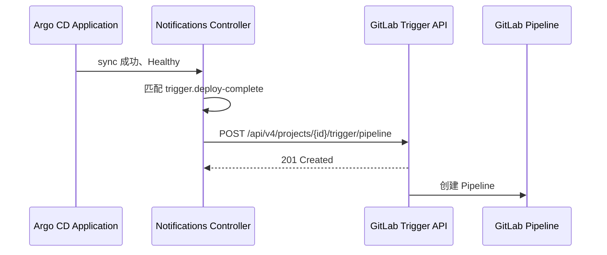

# Argocd 触发 webhook gitlab

# Argo CD 部署完成后触发 GitLab Pipeline

本文说明如何使用 Argo CD Notifications，在指定 Application 同步成功且健康检查通过后，调用 GitLab Pipeline Trigger API。

> **适用范围**：Argo CD Notifications Controller、GitLab Pipeline Trigger API。示例中的项目 ID、服务名、域名和注解键名需要按实际环境替换。

## 1\. 调用关系


`201 Created` 只表示 GitLab 接受了创建请求，不代表后续 Pipeline、Smoke Test 或业务验收已经成功。应继续检查 Pipeline 状态和下游验证结果。

## 2\. 前置条件

确认以下条件后再修改配置：

1. Argo CD Notifications Controller 已安装并运行。

2. Argo CD 能够访问 GitLab API 地址，例如 [`https://git.example.com`](https://git.example.com)。

3. GitLab 项目 ID 正确，且 Trigger Token 具有触发该项目 Pipeline 的权限。

4. GitLab `.gitlab-ci.yml` 能识别下文发送的变量，例如 `UI_TRIGGER_KIND`、`UI_ENV` 和 `UI_DEPLOYMENT_ID`。

5. Application 的 metadata annotations 已包含模板中引用的字段；缺失字段可能导致请求参数为空。

只读检查示例：

```Bash
kubectl -n argocd get deploy argocd-notifications-controller
kubectl -n argocd get cm argocd-notifications-cm -o yaml
kubectl -n argocd get secret argocd-notifications-secret -o jsonpath='{.data}'
kubectl -n argocd get application scimaster-muse-service-cn -o yaml
```

不要在终端输出中展开 Secret 内容。需要确认 Secret 是否存在时，可只检查键名：

```Bash
kubectl -n argocd get secret argocd-notifications-secret \
  -o jsonpath='{range .data[*]}{end}' >/dev/null
kubectl -n argocd get secret argocd-notifications-secret \
  -o jsonpath='{.data.deploy-webhook-token}' | wc -c
```

## 3\. 配置通知服务、模板和触发器

生产环境建议通过 Git、Kustomize 或 Helm 管理 ConfigMap，而不是长期依赖 `kubectl edit`。临时验证可以使用 `kubectl edit`，但应将最终配置回写到声明式仓库，避免 Argo CD 或后续发布覆盖手工修改。

编辑 `argocd-notifications-cm`：

```Bash
kubectl -n argocd edit cm argocd-notifications-cm
```

在 `data` 中加入以下内容：

```YAML
service.webhook.deploy-complete: |
  url: https://git.example.com/api/v4/projects/1269/trigger/pipeline/token=$deploy-webhook-token
  headers:
    - name: Content-Type
      value: application/x-www-form-urlencoded

template.deploy-complete: |
  webhook:
    deploy-complete:
      method: POST
      body: >-
        ref=main&variables[UI_TRIGGER_KIND]=rollout_completed&variables[UI_ENV]={{index .app.metadata.annotations "qa.dp.tech/ui-env"}}&variables[UI_SERVICE]={{index .app.metadata.annotations "qa.dp.tech/ui-service"}}&variables[UI_DEPLOYMENT_ID]={{index .app.metadata.annotations "qa.dp.tech/ui-deployment-id"}}&variables[UI_SOURCE_PIPELINE_ID]={{index .app.metadata.annotations "qa.dp.tech/source-pipeline-id"}}&variables[UI_EXPECTED_IMAGE]={{if .app.status.summary.images}}{{last .app.status.summary.images}}{{end}}&variables[UI_K8S_NAMESPACE]={{.app.spec.destination.namespace}}&variables[UI_K8S_DEPLOYMENT]=scimaster-muse-service-cn-deployment&variables[UI_SOURCE_COMMIT_SHA]={{.app.status.operationState.syncResult.revision}}

trigger.deploy-complete: |
  - when: app.metadata.name == 'scimaster-muse-service-cn' and app.status.operationState.phase == 'Succeeded' and app.status.health.status == 'Healthy'
    oncePer: app.status.operationState.syncResult.revision
    send:
      - deploy-complete
```

### 配置说明

- `service.webhook.deploy-complete` 定义 GitLab API 地址和请求头。

- `token=$deploy-webhook-token` 使用 Notifications Secret 中的同名键。若当前 Argo CD 版本对 Secret 变量替换语法有差异，应以该版本官方文档和 Controller 日志为准。

- `ref=main` 是要运行 Pipeline 的分支或 Tag，应按仓库实际默认分支调整。

- `variables[...]` 会作为 GitLab CI/CD 变量传入 Pipeline。

- `oncePer` 使用同步结果 revision 去重，避免同一 Git revision 重复触发。若需要按部署实例去重，应评估改用 `UI_DEPLOYMENT_ID` 的影响。

- 条件同时要求同步阶段为 `Succeeded`、健康状态为 `Healthy`，降低半完成状态触发下游 Pipeline 的风险。

> **编码注意**：当前示例通过 `application/x-www-form-urlencoded` 发送参数。注解值、镜像名或 revision 如果可能包含 `&`、`=`、空格或其他特殊字符，应在模板中使用当前 Argo CD 版本支持的 URL 编码函数，或改用 JSON API 请求格式。不要把未经编码的用户输入直接拼接到请求体。

## 4\. 保存 Trigger Token

将 Token 写入 `argocd-notifications-secret` 的 `stringData`，让 Kubernetes 负责 Base64 编码。不要手工把 Base64 字符串贴入文档，也不要把真实值提交到 Git：

```Bash
kubectl -n argocd edit secret argocd-notifications-secret
```

示例结构如下，`REDACTED_TRIGGER_TOKEN` 仅为占位符：

```YAML
apiVersion: v1
kind: Secret
metadata:
  name: argocd-notifications-secret
  namespace: argocd
type: Opaque
stringData:
  deploy-webhook-token: REDACTED_TRIGGER_TOKEN
```

更适合自动化交付的方式是使用 ExternalSecret、SealedSecret 或其他 Secret 管理系统。不要把真实 Token 放在 Shell 历史、CI 日志或 `kubectl get secret -o yaml` 的输出中。

## 5\. 为 Application 订阅通知

在 Application 的 `metadata.annotations` 中加入订阅注解，并补齐模板所需的业务注解：

```YAML
metadata:
  annotations:
    notifications.argoproj.io/subscribe.deploy-complete.deploy-complete: ""
    qa.dp.tech/source-pipeline-id: "1234567"
    qa.dp.tech/ui-deployment-id: "dp:muse-api:123456:42"
    qa.dp.tech/ui-env: "dp"
    qa.dp.tech/ui-service: "muse-api"
```

修改前先确认 Application 的真实名称和 namespace：

```Bash
kubectl -n argocd get application scimaster-muse-service-cn \
  -o jsonpath='{.metadata.name}{"\n"}{.metadata.namespace}{"\n"}'
```

临时修改可以执行：

```Bash
kubectl -n argocd edit application scimaster-muse-service-cn
```

`creationTimestamp`、`generation`、`resourceVersion`、`uid` 和 `notified.notifications.argoproj.io` 属于集群运行时字段，不应复制到 Git 清单中。若 Application 由 Argo CD、ApplicationSet 或其他 GitOps 控制器管理，应修改源仓库中的声明文件。

## 6\. 验证顺序

按以下顺序验证，避免只看到 Argo CD 页面绿色就判定整个流程成功：

1. 检查 ConfigMap 和 Secret 键名是否存在，确认 Controller Pod 正常运行。

2. 对目标 Application 执行一次新的同步，使 `syncResult.revision` 发生变化。

3. 查看 Notifications Controller 日志，确认匹配到了 `deploy-complete`，且没有模板渲染或 HTTP 错误：

```Bash
kubectl -n argocd logs deploy/argocd-notifications-controller --since=15m \
  | rg -i 'deploy-complete|webhook|trigger|error|failed'
```

4. 在 GitLab 项目的 **CI/CD → Pipelines** 中确认新 Pipeline 已创建，并核对传入变量的值。

5. 检查 Pipeline 的实际 Job、镜像摘要、部署状态和 Smoke Test。`201 Created`、Argo CD `Healthy` 或 Pipeline 已创建都不能替代这些检查。

6. 将渲染结果输出到终端

```Shell
argocd admin notifications template notify   deploy-complete   <(kubectl -n argocd get application scimaster-muse-service-cn -o yaml)   --recipient deploy-complete   --namespace argocd
```

7. 触发并发送通知

```Shell
argocd admin notifications trigger run   deploy-complete   <(kubectl -n argocd get application scimaster-muse-service-cn -o yaml)   --namespace argocd
```

## 7\. 常见故障

|现象|重点检查|
|---|---|
|没有触发|Application 名称、订阅注解、触发条件、`oncePer` 是否已使用过相同 revision|
|模板渲染失败|注解键是否存在、字段路径是否正确、Argo CD Notifications 版本支持的模板语法|
|GitLab 返回 400/401/404|项目 ID、Token、`ref`、请求 Content\-Type、API 地址和网络连通性|
|GitLab 返回 201 但没有预期 Job|`.gitlab-ci.yml` 的 `rules`、变量名、分支保护策略和 Pipeline 来源条件|
|变量值被截断或参数错位|URL 编码、`&`/`=` 特殊字符、换行和请求体格式|
|重复触发|`oncePer` 选择不合适、revision 变化方式与实际部署 ID 不一致|

## 8\. 回滚与变更管理

1. 先从 GitOps 仓库恢复上一版 ConfigMap 和 Application 清单。

2. 若仅需停止触发，可移除 Application 的 `notifications.argoproj.io/subscribe.deploy-complete.deploy-complete` 注解。

3. 若 Token 泄露，立即在 GitLab 撤销并重新生成，同时更新 Argo CD Secret。

4. 检查是否已有重复 Pipeline，并按项目流程处理已创建的下游任务。

修改完成后建议执行：

```Bash
git diff --check
```

并对 YAML/Markdown 做静态检查。静态检查只能验证格式，不能证明目标集群已加载配置或 GitLab Pipeline 已端到端完成。

