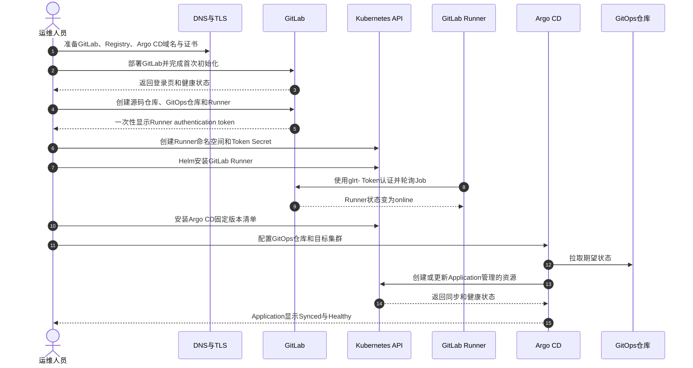
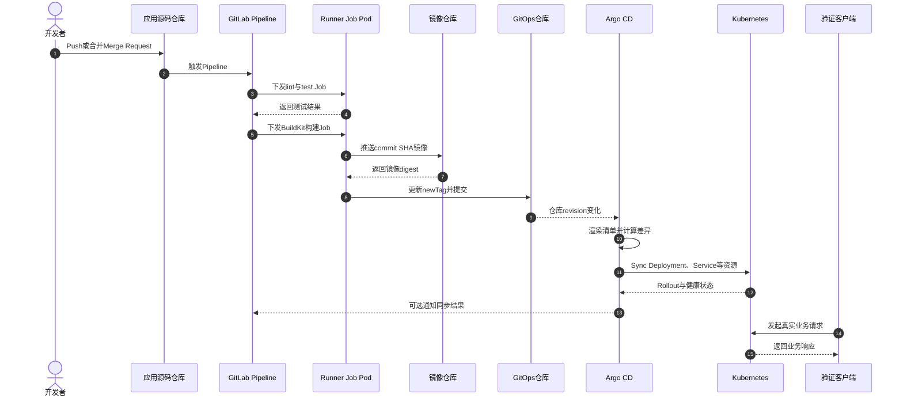
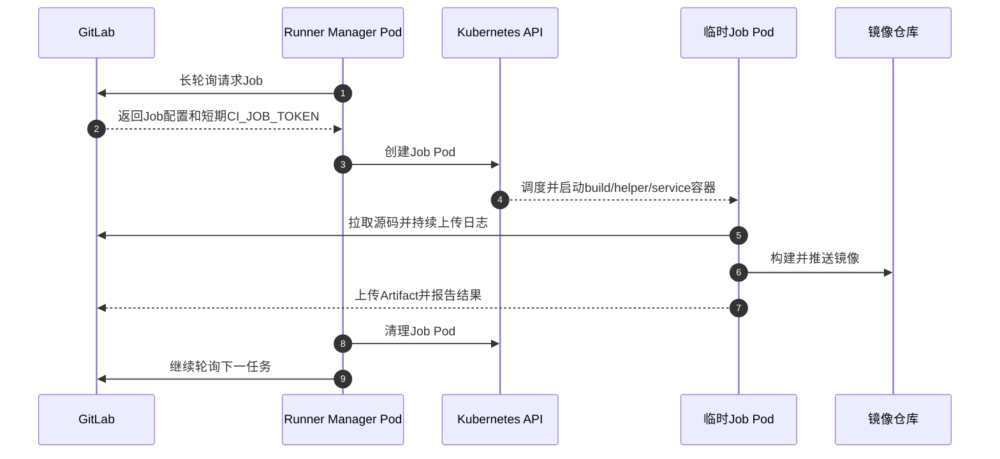
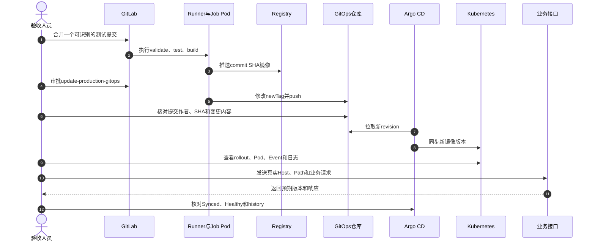
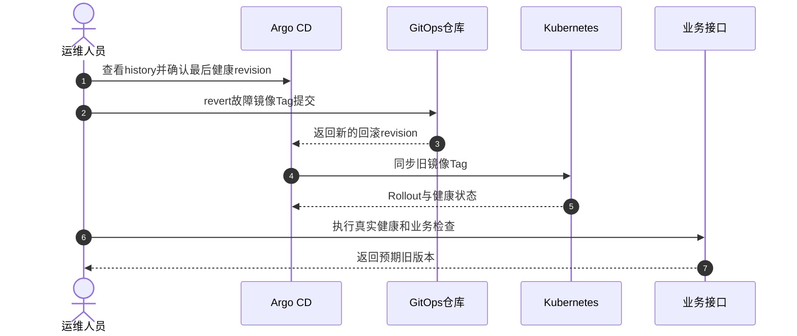

# GitLab、GitLab Runner 与 Argo CD 的 GitOps 完整部署流程

> 文档核对日期：2026-09-01  
> 适用范围：自建 GitLab、Kubernetes Executor 类型的 GitLab Runner、使用 Argo CD 发布 Kubernetes 应用。  
> 推荐拓扑：GitLab 使用 Docker Compose 部署在独立 Linux 主机；Runner 和 Argo CD 部署在 Kubernetes；应用源码仓库与 GitOps 配置仓库分离。  
> 验证边界：本文给出可复制的模板和静态检查方法，但没有连接你的 GitLab、镜像仓库或 Kubernetes 集群执行部署。版本、域名、证书、存储类、网络策略和权限必须在目标环境确认。

## 1. 先看结论

这套系统应按以下顺序部署：

1. 规划域名、TLS、存储、网络和版本，先保证 Kubernetes 能访问 GitLab 与镜像仓库。
2. 部署 GitLab，完成首次登录、创建源码仓库和 GitOps 仓库。
3. 在 GitLab 页面创建 Runner，取得 `glrt-` 开头的 Runner authentication token。
4. 用官方 Helm Chart 把 GitLab Runner 部署到 Kubernetes；每个 CI Job 由 Runner 创建独立 Job Pod。
5. 部署 Argo CD，接入 GitOps 仓库和目标集群，创建 `AppProject` 与 `Application`。
6. CI 负责测试、构建镜像、推送镜像并修改 GitOps 仓库；Argo CD 只监听 GitOps 仓库并同步 Kubernetes。
7. 验收不能停在 Pod `Running`：必须完成一次真实提交，验证 Pipeline、镜像、GitOps 提交、Argo CD 同步、工作负载健康和业务请求。

不要让 CI 直接执行 `kubectl apply` 到生产集群。推荐把集群凭据只交给 Argo CD，把 Git 作为发布记录和回滚入口。

## 2. 目标架构

| 组件 | 推荐位置 | 主要职责 | 不负责什么 |
|---|---|---|---|
| GitLab | 独立 Linux 主机或受控虚拟机 | Git 仓库、Merge Request、Pipeline 调度、制品元数据 | 不执行 CI Job，不直接维护 Kubernetes 实际状态 |
| GitLab Runner | Kubernetes 的 `gitlab-runner` 命名空间 | 领取 Job，为每个 Job 创建临时 Pod | 不保存应用期望状态，不充当持续部署控制器 |
| 镜像仓库 | GitLab Container Registry、Harbor 或云镜像仓库 | 保存不可变镜像 | 不保存 Kubernetes 发布策略 |
| GitOps 仓库 | GitLab 独立项目 | 保存 Kubernetes YAML、Helm values 或 Kustomize overlays | 不保存明文密码、Token、私钥 |
| Argo CD | Kubernetes 的 `argocd` 命名空间 | 比较 Git 与集群、同步资源、检查健康状态 | 不编译代码，不构建镜像 |
| 目标集群 | Kubernetes | 运行业务工作负载 | 不应接受普通 CI Job 的长期管理员凭据 |

### 2.1 部署顺序时序图



### 2.2 日常发布时序图



## 3. 部署前规划

### 3.1 需要先确定的参数

把下面表格复制到变更单，所有占位符都确认后再执行。

| 参数 | 示例 | 必须确认的内容 |
|---|---|---|
| `GITLAB_HOST` | `gitlab.example.com` | DNS、TLS、客户端与集群能否解析和访问 |
| `GITLAB_SSH_PORT` | `8022` | 是否与宿主机 SSH 端口冲突 |
| `REGISTRY_HOST` | `registry.example.com` | 使用 GitLab Registry、Harbor 还是云仓库 |
| `ARGOCD_HOST` | `argocd.example.com` | IngressClass、负载均衡器、TLS 终止位置 |
| 源码项目 | `platform/demo-api` | 默认分支、保护分支、Runner tag |
| GitOps 项目 | `platform/demo-api-gitops` | CI_JOB_TOKEN 或 Project Access Token 的写权限 |
| 目标集群 | `prod-cluster` | Kubernetes 版本、context、网络、准入策略 |
| 业务命名空间 | `demo-prod` | ResourceQuota、LimitRange、NetworkPolicy |
| GitLab 镜像版本 | `<GITLAB_VERSION>-ce.0` | 必须固定完整版本，不长期使用 `latest` |
| Runner Chart 版本 | `<RUNNER_CHART_VERSION>` | Chart 版本与 Runner App 版本不是同一个编号 |
| Argo CD 版本 | `v<X.Y.Z>` | 测试后固定，升级前阅读对应升级说明 |

### 3.2 最小资源基线

以下只是起点，不是容量承诺。

| 工作负载 | 学习或小规模起点 | 生产关注点 |
|---|---|---|
| GitLab Omnibus | 4 CPU、8 GiB 内存、SSD 100 GiB | 仓库、LFS、Artifact、Registry、备份增长量和恢复时间 |
| Runner Manager | 200m CPU、256 MiB 内存起 | 真正资源主要由并发 Job Pod 消耗 |
| 单个 Job Pod | 按项目设置 request/limit | 构建峰值、临时磁盘、缓存、节点池和并发数 |
| Argo CD 非 HA | 适合学习和验证 | 生产优先 HA，并按仓库和应用数量调优 |
| Argo CD HA | 至少 3 个可调度节点更稳妥 | Pod 反亲和、Redis、repo-server、controller 分片 |

### 3.3 网络访问矩阵

| 来源 | 目标 | 典型端口 | 用途 |
|---|---|---|---|
| 用户/开发机 | GitLab | `443`、可选 `8022` | Web、Git HTTPS、Git SSH |
| Runner Manager | GitLab | `443` | 轮询 Job、上传日志和 Artifact |
| Runner Job Pod | GitLab/Registry | `443` | 拉源码、推镜像、更新 GitOps 仓库 |
| Argo CD repo-server | GitLab | `443` 或 Git SSH 端口 | 拉取 GitOps 仓库 |
| Kubernetes 节点 | Registry | `443` | kubelet/容器运行时拉取镜像 |
| 用户/CLI | Argo CD | `443` | Web UI、API、gRPC 或 gRPC-Web |
| Argo CD controller | 目标 Kubernetes API | 通常 `6443` | 查询和同步资源 |

不要只在运维机上执行 `curl`。Runner Pod、Argo CD Pod、Kubernetes 节点可能处于不同网络。

## 4. 阶段零：只读预检

### 4.1 GitLab 宿主机

```bash
hostnamectl
docker version
docker compose version
df -hT
free -h
ss -lntp
getent hosts gitlab.example.com
```

确认宿主机的 `80`、`443` 和计划中的 Git SSH 端口未被其他服务占用。若前置反向代理已占用 `80/443`，应为 GitLab 规划内网监听端口，不能直接套用本文端口映射。

### 4.2 Kubernetes

```bash
kubectl version
kubectl config current-context
kubectl auth can-i create namespace
kubectl get nodes -o wide
kubectl get storageclass
kubectl get ingressclass
kubectl get validatingwebhookconfigurations,mutatingwebhookconfigurations
kubectl get resourcequota,limitrange --all-namespaces
```

### 4.3 从集群验证 GitLab 与 Registry 网络

以下 Pod 只用于短时诊断，结束后自动删除：

```bash
kubectl run network-check \
  --image=curlimages/curl:8.15.0 \
  --restart=Never \
  --rm -it \
  -- sh
```

进入 Pod 后执行：

```bash
getent hosts gitlab.example.com
curl -fsSIL https://gitlab.example.com/users/sign_in
curl -fsSIL https://registry.example.com/v2/
```

Registry `/v2/` 返回 `200` 或带认证要求的 `401` 都说明 HTTP 服务可达；DNS 失败、TLS 错误或连接超时需要先解决。

## 5. 阶段一：部署 GitLab CE

本节采用单机 Omnibus 容器，适合学习、小中型团队或非 HA 场景。大规模或高可用 GitLab 应使用官方参考架构，不应把单容器 Compose 描述为 HA。

更完整的备份、升级和故障处理见：[用 Docker Compose 部署 GitLab CE](gitlab-docker-compose-guide.md)。

### 5.1 创建持久化目录

```bash
sudo install -d -m 0750 /srv/gitlab/config
sudo install -d -m 0750 /srv/gitlab/logs
sudo install -d -m 0750 /srv/gitlab/data
cd /srv/gitlab
```

### 5.2 准备 TLS 证书

下面的 Compose 示例让 GitLab 内置 Nginx 终止 TLS，并使用独立的 Registry 域名。提前准备包含完整中间证书链的 `.crt` 和对应私钥 `.key`：

```bash
sudo install -d -m 0700 /srv/gitlab/config/ssl
sudo install -m 0600 <GITLAB_FULLCHAIN_FILE> \
  /srv/gitlab/config/ssl/gitlab.example.com.crt
sudo install -m 0600 <GITLAB_PRIVATE_KEY_FILE> \
  /srv/gitlab/config/ssl/gitlab.example.com.key
sudo install -m 0600 <REGISTRY_FULLCHAIN_FILE> \
  /srv/gitlab/config/ssl/registry.example.com.crt
sudo install -m 0600 <REGISTRY_PRIVATE_KEY_FILE> \
  /srv/gitlab/config/ssl/registry.example.com.key
```

如果一个通配符证书同时覆盖两个域名，可以使用同一证书材料，但目标文件名仍应与各自域名匹配。私钥不得提交到 Git，也不得放进本文或交接文档。

如果 TLS 在外部负载均衡器或反向代理终止，不要照抄这一节；应按实际的前后端协议、转发端口和请求头配置 GitLab与 Registry。

### 5.3 编写 `docker-compose.yml`

```yaml
services:
  gitlab:
    image: gitlab/gitlab-ce:<GITLAB_VERSION>-ce.0
    container_name: gitlab
    restart: always
    hostname: gitlab.example.com
    environment:
      GITLAB_OMNIBUS_CONFIG: |
        external_url 'https://gitlab.example.com'
        registry_external_url 'https://registry.example.com'
        gitlab_rails['time_zone'] = 'Asia/Shanghai'
        gitlab_rails['gitlab_shell_ssh_port'] = 8022
    ports:
      - '80:80'
      - '443:443'
      - '8022:22'
    volumes:
      - '/srv/gitlab/config:/etc/gitlab'
      - '/srv/gitlab/logs:/var/log/gitlab'
      - '/srv/gitlab/data:/var/opt/gitlab'
    shm_size: '256m'
    logging:
      driver: json-file
      options:
        max-size: '100m'
        max-file: '5'
```

说明：

- 把 `<GITLAB_VERSION>` 替换为已测试的完整版本号；生产环境不要使用 `latest`。
- `external_url` 必须与用户真实访问地址一致。
- `registry_external_url` 会启用 GitLab 内置 Container Registry；它的 TLS、DNS和入口也必须单独验证。
- 如果 TLS 在外部负载均衡器或反向代理终止，需要按实际转发协议配置 GitLab，不能只把 `https` 改成 `http`。
- 自签名 CA 必须同时被开发机、Runner、Argo CD 和 Kubernetes 节点信任；跳过 TLS 校验只适合临时排障。
- GitLab 镜像不自带 MTA；需要邮件通知时应接入单独的 SMTP/MTA。

### 5.4 静态检查并启动

```bash
docker compose config
docker compose pull
docker compose up -d
docker compose ps
docker compose logs -f --tail=200 gitlab
```

首次初始化通常需要数分钟。容器 `Up` 只说明容器进程存在，不等于 GitLab 已就绪。

### 5.5 获取初始密码并立即修改

```bash
docker exec gitlab grep 'Password:' /etc/gitlab/initial_root_password
```

用 `root` 登录后立即修改密码。不要把初始密码文件、截图或命令输出提交到 Git。

### 5.6 GitLab 与 Registry 验收

```bash
curl -fsSIL https://gitlab.example.com/users/sign_in
curl -fsSIL https://registry.example.com/v2/
ssh -T -p 8022 git@gitlab.example.com
docker exec gitlab gitlab-ctl status
docker exec gitlab gitlab-rake gitlab:check SANITIZE=true
```

Registry `/v2/` 返回 `200` 或带认证要求的 `401` 表示 HTTP 服务可达。`ssh -T` 在尚未上传 SSH 公钥时失败是预期现象；它主要用于确认 DNS、端口和服务响应。完整验收还要创建测试项目并完成一次 clone、push、pull，以及一次镜像 login、push、pull。

### 5.7 创建两个仓库

建议至少创建：

```text
platform/demo-api
platform/demo-api-gitops
```

- `demo-api`：应用源代码、测试、Dockerfile、`.gitlab-ci.yml`。
- `demo-api-gitops`：Kustomize/Helm/Kubernetes 声明，只保存期望状态。

生产 GitOps 仓库建议启用保护分支、审批规则和 CODEOWNERS。是否允许 CI 直接推默认分支，应按组织变更流程决定；更严格的方式是由 CI 创建 Merge Request，再由人工审批合并。

### 5.8 确认项目已启用 Container Registry

进入源码项目的 `Deploy -> Container Registry`，确认页面显示类似下面的镜像地址：

```text
registry.example.com/platform/demo-api
```

提交 Pipeline 前，还要在一个受控环境完成真实认证测试：

```bash
docker login registry.example.com
docker pull alpine:3.22
docker tag alpine:3.22 registry.example.com/platform/demo-api:registry-smoke-test
docker push registry.example.com/platform/demo-api:registry-smoke-test
docker pull registry.example.com/platform/demo-api:registry-smoke-test
```

测试 Tag 验收后可按项目的镜像保留策略清理。若使用 Harbor 或云镜像仓库，后续 Pipeline 不能依赖 `$CI_REGISTRY_*` 默认变量，应改为受保护的外部 Registry 变量，并把拉取凭据配置到目标 Kubernetes ServiceAccount 或 `imagePullSecrets`。

## 6. 阶段二：部署 GitLab Runner

### 6.1 为什么用 Kubernetes Executor

Runner Manager 自身只负责与 GitLab 通信。收到 Job 后，它调用 Kubernetes API 创建临时 Pod；Job 完成后 Pod 被删除。这样比在共享 Shell Runner 上执行多个项目更容易隔离，也便于通过资源请求、节点选择器、污点容忍和并发数控制成本。



### 6.2 在 GitLab 创建 Runner

项目 Runner 路径通常为：

```text
项目 -> Settings -> CI/CD -> Runners -> Create project runner
```

建议配置：

- Tag：`k8s-build`。
- 关闭 `Run untagged jobs`，要求 Job 显式选择 Runner。
- 生产项目启用 `Protected`，只运行保护分支或保护标签的 Job。
- 创建后复制一次性显示的 Runner authentication token，通常以 `glrt-` 开头。

旧的 registration token 工作流已不推荐。新部署不要继续使用 `runnerRegistrationToken`；GitLab 17.0 及以后可能直接禁用旧注册接口并返回 `410 Gone`。

### 6.3 创建 Token Secret

不要把 Token 写进 `values.yaml` 或 Git。下面命令交互式读取 Token，不在文档中保留明文：

```bash
kubectl create namespace gitlab-runner
read -rsp 'Runner authentication token: ' RUNNER_AUTH_TOKEN
echo
printf '%s' "$RUNNER_AUTH_TOKEN" | \
  kubectl -n gitlab-runner create secret generic gitlab-runner-auth \
    --from-file=runner-token=/dev/stdin \
    --from-literal=runner-registration-token=
unset RUNNER_AUTH_TOKEN
```

确认 Secret 结构时只看键名，不导出内容：

```bash
kubectl -n gitlab-runner describe secret gitlab-runner-auth
```

### 6.4 编写 `runner-values.yaml`

```yaml
gitlabUrl: https://gitlab.example.com

concurrent: 4
checkInterval: 10
terminationGracePeriodSeconds: 3600
unregisterRunners: true

rbac:
  create: true

serviceAccount:
  create: true

runners:
  secret: gitlab-runner-auth
  config: |
    [[runners]]
      [runners.kubernetes]
        namespace = "{{.Release.Namespace}}"
        image = "alpine:3.22"
        privileged = false
        poll_timeout = 600
        cpu_request = "250m"
        cpu_limit = "2"
        memory_request = "256Mi"
        memory_limit = "4Gi"
        helper_cpu_request = "100m"
        helper_memory_request = "128Mi"
        service_cpu_request = "100m"
        service_memory_request = "128Mi"

resources:
  requests:
    cpu: 100m
    memory: 128Mi
  limits:
    cpu: 500m
    memory: 512Mi
```

说明：

- `runners.secret` 指向前一步创建的 Secret。
- `rbac.create: true` 让 Chart 创建 Runner 创建 Job Pod 所需的 RBAC；不要手工绑定 `cluster-admin`。
- `privileged = false` 是默认安全基线。Docker-in-Docker 需要 privileged，但会扩大风险；本文后面的构建示例使用 BuildKit rootless。
- CPU、内存、并发数只是示例，应根据节点容量、ResourceQuota 和构建峰值调整。
- 若 GitLab 使用私有 CA，应创建 CA Secret 并配置 `certsSecretName`，而不是设置 `tls_verify = false`。

### 6.5 固定 Chart 版本并安装

```bash
helm repo add gitlab https://charts.gitlab.io
helm repo update gitlab
helm search repo gitlab/gitlab-runner --versions | head -20

export RUNNER_CHART_VERSION='<RUNNER_CHART_VERSION>'
helm upgrade --install gitlab-runner gitlab/gitlab-runner \
  --namespace gitlab-runner \
  --version "$RUNNER_CHART_VERSION" \
  --values runner-values.yaml \
  --wait \
  --timeout 10m
unset RUNNER_CHART_VERSION
```

### 6.6 Runner 验收

```bash
helm -n gitlab-runner list
kubectl -n gitlab-runner get deployment,pod,serviceaccount,role,rolebinding
kubectl -n gitlab-runner logs deployment/gitlab-runner --tail=200
kubectl -n gitlab-runner get events --sort-by=.lastTimestamp
```

在源码仓库提交最小 Pipeline：

```yaml
stages:
  - verify

runner-smoke-test:
  stage: verify
  image: alpine:3.22
  tags:
    - k8s-build
  script:
    - uname -a
    - id
    - cat /etc/os-release
```

验收证据应同时包括：

- GitLab 页面 Runner 为 `online`。
- Pipeline Job 被 `k8s-build` Runner 领取。
- Job 执行期间出现临时 Pod。
- Job 日志、退出码和 Artifact 能正常回传。
- Job 结束后临时 Pod 按配置清理。

## 7. 阶段三：部署 Argo CD

更完整的 Ingress、TLS、SSO、RBAC、ApplicationSet 和多集群说明见：[Argo CD 部署与使用详解](Argo-CD-部署与使用详解.md)。

### 7.1 选择安装模式

| 模式 | 清单 | 使用场景 |
|---|---|---|
| 非 HA 多租户 | `manifests/install.yaml` | 学习、测试、小规模非关键环境 |
| HA 多租户 | `manifests/ha/install.yaml` | 生产环境优先评估 |
| Namespace 权限 | `namespace-install.yaml` | 不允许 Argo CD 使用集群级权限的场景 |
| Core | `core-install.yaml` | 无 Web UI/API 的轻量管理员模式 |

### 7.2 安装固定版本

非 HA 示例：

```bash
kubectl create namespace argocd
export ARGOCD_VERSION='v<X.Y.Z>'
kubectl apply -n argocd \
  --server-side \
  --force-conflicts \
  -f "https://raw.githubusercontent.com/argoproj/argo-cd/${ARGOCD_VERSION}/manifests/install.yaml"
unset ARGOCD_VERSION
```

生产 HA 只替换清单路径：

```text
manifests/ha/install.yaml
```

官方清单包含集群级权限。执行前应下载到受控仓库审查，确认镜像、ClusterRole、ClusterRoleBinding、CRD 和目标命名空间，再进入生产变更。

### 7.3 等待核心组件就绪

```bash
kubectl -n argocd get deployment,statefulset,pod -o wide
kubectl -n argocd wait \
  --for=condition=Available \
  deployment/argocd-server \
  --timeout=10m
kubectl -n argocd get events --sort-by=.lastTimestamp
```

### 7.4 临时访问和修改初始密码

```bash
kubectl -n argocd port-forward svc/argocd-server 8080:443
```

另开终端：

```bash
argocd admin initial-password -n argocd
argocd login localhost:8080 --insecure
argocd account update-password
```

`--insecure` 在这里仅用于本机 port-forward 与默认自签名证书。生产域名应使用可信 TLS，不能把该参数写进长期脚本。

### 7.5 生产入口

生产环境通常通过 Ingress 或 LoadBalancer 暴露 `argocd-server`。需要明确：

- TLS 在 Ingress 终止，还是透传到 `argocd-server`。
- CLI 原生 gRPC 是否能通过代理；若代理只适配 HTTP/1.1，可使用 `argocd login <host> --grpc-web`。
- `IngressClass`、证书 Secret、DNS、WAF 和负载均衡器健康检查是否匹配。

Web UI 能登录不代表 CLI 的 gRPC 一定可用，两者都要测试。

## 8. 阶段四：初始化 GitOps 仓库

### 8.1 推荐目录结构

```text
demo-api-gitops/
├── apps/
│   └── demo-api/
│       ├── base/
│       │   ├── deployment.yaml
│       │   ├── service.yaml
│       │   └── kustomization.yaml
│       └── overlays/
│           ├── staging/
│           │   └── kustomization.yaml
│           └── production/
│               └── kustomization.yaml
└── argocd/
    ├── project.yaml
    └── demo-api-production.yaml
```

### 8.2 Base Deployment

```yaml
apiVersion: apps/v1
kind: Deployment
metadata:
  name: demo-api
spec:
  replicas: 2
  selector:
    matchLabels:
      app: demo-api
  template:
    metadata:
      labels:
        app: demo-api
    spec:
      containers:
        - name: demo-api
          image: registry.example.com/platform/demo-api:bootstrap
          ports:
            - name: http
              containerPort: 8080
          readinessProbe:
            httpGet:
              path: /ready
              port: http
            initialDelaySeconds: 5
            periodSeconds: 5
          livenessProbe:
            httpGet:
              path: /health
              port: http
            initialDelaySeconds: 15
            periodSeconds: 10
          resources:
            requests:
              cpu: 100m
              memory: 128Mi
            limits:
              cpu: '1'
              memory: 512Mi
```

### 8.3 Base Service

```yaml
apiVersion: v1
kind: Service
metadata:
  name: demo-api
spec:
  selector:
    app: demo-api
  ports:
    - name: http
      port: 80
      targetPort: http
```

### 8.4 Base `kustomization.yaml`

```yaml
apiVersion: kustomize.config.k8s.io/v1beta1
kind: Kustomization
resources:
  - deployment.yaml
  - service.yaml
```

### 8.5 Production overlay

```yaml
apiVersion: kustomize.config.k8s.io/v1beta1
kind: Kustomization
namespace: demo-prod
resources:
  - ../../base
images:
  - name: registry.example.com/platform/demo-api
    newName: registry.example.com/platform/demo-api
    newTag: bootstrap
patches:
  - target:
      kind: Deployment
      name: demo-api
    patch: |-
      - op: replace
        path: /spec/replicas
        value: 3
```

### 8.6 本地渲染检查

```bash
kubectl kustomize apps/demo-api/overlays/production >/tmp/demo-api-rendered.yaml
kubectl apply --dry-run=client -f /tmp/demo-api-rendered.yaml
```

客户端 dry-run 只验证本地解析，不验证目标集群 CRD、准入控制、RBAC、配额和运行时行为。上线前还应执行服务端 dry-run 或 `kubectl diff`。

## 9. 阶段五：Argo CD 接入仓库并创建 Application

### 9.1 接入私有仓库

推荐为 Argo CD 创建只读 Deploy Token 或专用 SSH Deploy Key。不要使用个人管理员 Token。

HTTPS 示例：

```bash
read -rsp 'GitOps repository token: ' GITOPS_READ_TOKEN
echo
argocd repo add https://gitlab.example.com/platform/demo-api-gitops.git \
  --username argocd-readonly \
  --password "$GITOPS_READ_TOKEN"
unset GITOPS_READ_TOKEN
argocd repo list
```

若使用 SSH，应先核对 GitLab SSH 主机公钥指纹，再维护 `argocd-ssh-known-hosts-cm`。不要长期使用跳过主机校验的参数。

### 9.2 创建 AppProject

```yaml
apiVersion: argoproj.io/v1alpha1
kind: AppProject
metadata:
  name: demo
  namespace: argocd
spec:
  description: Demo applications
  sourceRepos:
    - https://gitlab.example.com/platform/demo-api-gitops.git
  destinations:
    - server: https://kubernetes.default.svc
      namespace: demo-prod
  clusterResourceWhitelist:
    - group: ''
      kind: Namespace
  namespaceResourceWhitelist:
    - group: '*'
      kind: '*'
```

`namespaceResourceWhitelist: '*/*'` 便于演示，但生产应根据应用实际资源收紧。是否允许 Application 创建 Namespace 也要由平台权限模型决定。

### 9.3 创建 Application

```yaml
apiVersion: argoproj.io/v1alpha1
kind: Application
metadata:
  name: demo-api-production
  namespace: argocd
  finalizers:
    - resources-finalizer.argocd.argoproj.io
spec:
  project: demo
  source:
    repoURL: https://gitlab.example.com/platform/demo-api-gitops.git
    targetRevision: main
    path: apps/demo-api/overlays/production
  destination:
    server: https://kubernetes.default.svc
    namespace: demo-prod
  syncPolicy:
    automated:
      prune: true
      selfHeal: true
    syncOptions:
      - CreateNamespace=true
      - PruneLast=true
```

风险说明：

- `prune: true` 会删除 Git 中已经移除且由 Application 管理的资源。
- `selfHeal: true` 会覆盖绕过 Git 的集群内改动。
- finalizer 可能在删除 Application 时级联删除业务资源。
- Namespace、PVC、数据库等有状态资源应使用更谨慎的删除和保留策略。

应用并验证：

```bash
kubectl apply -f argocd/project.yaml
kubectl apply -f argocd/demo-api-production.yaml

argocd app get demo-api-production
argocd app diff demo-api-production
argocd app sync demo-api-production
argocd app wait demo-api-production --sync --health --timeout 600
```

## 10. 阶段六：配置 CI 构建镜像并更新 GitOps 仓库

### 10.1 GitOps 写入认证的两种方式

| 方式 | 适用条件 | 优点 | 注意事项 |
|---|---|---|---|
| `CI_JOB_TOKEN` 跨项目 push | GitLab 19.1+ 且目标项目开启对应权限 | 短期 Token，无需保存长期凭据 | 目标 GitOps 项目需启用 push、跨项目 push 和 allowlist |
| Project Access Token | 需要兼容旧版 GitLab | 行为直观 | 必须设置到期时间、`write_repository`、Masked、Protected，并定期轮换 |

推荐优先使用 `CI_JOB_TOKEN`。在 GitOps 目标项目的 `Settings -> CI/CD -> Job token permissions` 中：

1. 把源码项目加入 allowlist。
2. 开启 `Allow Git push requests to the repository`。
3. GitLab 19.1+ 开启 `Allow cross-project Git push requests from allowlisted projects`。
4. 若使用 fine-grained permissions，授予 `admin_repositories` 所需权限。

触发 Pipeline 的用户还必须对 GitOps 项目至少有 Developer 权限。使用 Job Token push 不会在目标项目触发新的 Pipeline。

### 10.2 完整 `.gitlab-ci.yml` 示例

下面使用 BuildKit rootless 构建镜像，避免给 Runner 开启全局 privileged。镜像版本使用不可变的 `$CI_COMMIT_SHA`，不把 `latest` 当作发布依据。

示例默认使用前文启用的 GitLab Container Registry，因此依赖 `$CI_REGISTRY`、`$CI_REGISTRY_IMAGE`、`$CI_REGISTRY_USER` 和 `$CI_REGISTRY_PASSWORD` 预定义变量。

```yaml
stages:
  - validate
  - test
  - build
  - update-gitops

default:
  tags:
    - k8s-build

variables:
  IMAGE_TAG: "$CI_COMMIT_SHA"
  GITOPS_REPO: "platform/demo-api-gitops"
  GITOPS_OVERLAY: "apps/demo-api/overlays/production/kustomization.yaml"

validate-ci:
  stage: validate
  image: alpine:3.22
  script:
    - test -f Dockerfile
    - test -n "$CI_COMMIT_SHA"

unit-test:
  stage: test
  image: alpine:3.22
  script:
    - echo '请替换为项目真实测试命令'
    - test -f Dockerfile

build-image:
  stage: build
  image:
    name: moby/buildkit:rootless
    entrypoint: [""]
  variables:
    BUILDKITD_FLAGS: "--oci-worker-no-process-sandbox"
  before_script:
    - mkdir -p ~/.docker
    - >-
      echo "{\"auths\":{\"$CI_REGISTRY\":{\"username\":\"$CI_REGISTRY_USER\",\"password\":\"$CI_REGISTRY_PASSWORD\"}}}"
      > ~/.docker/config.json
  script:
    - >-
      buildctl-daemonless.sh build
      --frontend dockerfile.v0
      --local context=.
      --local dockerfile=.
      --output type=image,name=$CI_REGISTRY_IMAGE:$IMAGE_TAG,push=true
  rules:
    - if: '$CI_COMMIT_BRANCH == $CI_DEFAULT_BRANCH'

update-production-gitops:
  stage: update-gitops
  image: alpine:3.22
  needs:
    - build-image
  before_script:
    - apk add --no-cache git yq
    - git config --global user.name "gitlab-ci"
    - git config --global user.email "gitlab-ci@$CI_SERVER_HOST"
  script:
    - >-
      git clone
      "https://gitlab-ci-token:${CI_JOB_TOKEN}@${CI_SERVER_HOST}/${GITOPS_REPO}.git"
      gitops
    - cd gitops
    - >-
      yq -i
      '(.images[] | select(.name == strenv(CI_REGISTRY_IMAGE)).newTag) = strenv(IMAGE_TAG)'
      "$GITOPS_OVERLAY"
    - git add "$GITOPS_OVERLAY"
    - git diff --cached --quiet && exit 0
    - git commit -m "deploy demo-api ${CI_COMMIT_SHORT_SHA}"
    - git push origin HEAD:main
  environment:
    name: production
  rules:
    - if: '$CI_COMMIT_BRANCH == $CI_DEFAULT_BRANCH'
      when: manual
```

需要按项目替换：

- `unit-test` 的真实测试命令。
- GitOps 项目路径、默认分支和 overlay 路径。
- `IMAGE_TAG` 和镜像命名规则。
- 生产 Job 的审批规则；示例使用 `when: manual`，不等于已经满足组织审批要求。
- BuildKit rootless 在部分自建 Kubernetes 安全策略下可能被 AppArmor 或 seccomp 阻止，应使用最小化的本地安全配置，不要直接全局设为 Unconfined。

如果目标 GitLab 不支持跨项目 Job Token push，可把 clone 凭据换成受保护、脱敏的 `GITOPS_PUSH_TOKEN`，并设置短有效期和最小 `write_repository` 权限。

## 11. 首次端到端验收

### 11.1 验收时序图



### 11.2 分层验证命令

GitLab：

```bash
curl -fsSIL https://gitlab.example.com/users/sign_in
git ls-remote https://gitlab.example.com/platform/demo-api.git
```

Runner：

```bash
kubectl -n gitlab-runner get pods
kubectl -n gitlab-runner logs deployment/gitlab-runner --since=30m
kubectl -n gitlab-runner get events --sort-by=.lastTimestamp
```

Registry：

```bash
curl -fsSIL https://registry.example.com/v2/
```

GitOps 与 Argo CD：

```bash
git log -1 --oneline
argocd app get demo-api-production
argocd app history demo-api-production
argocd app resources demo-api-production
```

Kubernetes：

```bash
kubectl -n demo-prod get deployment,pod,service -o wide
kubectl -n demo-prod rollout status deployment/demo-api --timeout=5m
kubectl -n demo-prod get events --sort-by=.lastTimestamp
kubectl -n demo-prod logs deployment/demo-api --tail=200
kubectl -n demo-prod get endpointslice -l kubernetes.io/service-name=demo-api
```

真实请求：

```bash
curl -fsS -H 'Host: demo.example.com' https://<ENTRY_ADDRESS>/health
curl -fsS -H 'Host: demo.example.com' https://<ENTRY_ADDRESS>/version
```

只有完整走通“提交 -> Job -> 镜像 -> GitOps 提交 -> Argo CD Sync -> Rollout -> 真实请求”，才能称为端到端验收通过。

### 11.3 验收记录表

| 检查点 | 预期结果 | 实际证据 | 状态 |
|---|---|---|---|
| GitLab Web/Git | 登录、clone、push 正常 | URL、Commit SHA | 待验证 |
| Runner | online 且领取指定 Tag Job | Runner ID、Job ID | 待验证 |
| Test | 真实测试通过 | Pipeline/Job URL | 待验证 |
| Image | SHA Tag 和 digest 存在 | 完整镜像引用 | 待验证 |
| GitOps | 只变更预期字段 | GitOps Commit SHA | 待验证 |
| Argo CD | `Synced`、`Healthy` | Revision、Sync history | 待验证 |
| Kubernetes | Rollout 完成，无异常 Event | Deployment revision | 待验证 |
| 业务 | Host/SNI/Path 请求正确 | 状态码与响应版本 | 待验证 |

## 12. 回滚流程

GitOps 的首选回滚方式是恢复 GitOps 仓库中的上一已知健康镜像 Tag，再由 Argo CD 正常同步。这样 Git 与集群不会长期分叉。



建议命令：

```bash
argocd app history demo-api-production
git revert <BAD_GITOPS_COMMIT_SHA>
git push origin main
argocd app wait demo-api-production --sync --health --timeout 600
kubectl -n demo-prod rollout status deployment/demo-api --timeout=5m
```

`argocd app rollback` 可用于紧急恢复，但随后必须让 GitOps 仓库与集群状态重新一致，否则自动同步可能再次部署故障版本。

## 13. 常见故障定位

### 13.1 Runner 一直 offline

按顺序检查：

```bash
kubectl -n gitlab-runner get pods
kubectl -n gitlab-runner logs deployment/gitlab-runner --tail=300
kubectl -n gitlab-runner describe secret gitlab-runner-auth
kubectl -n gitlab-runner get events --sort-by=.lastTimestamp
```

常见原因：

- 使用了旧 `runnerRegistrationToken`，而 GitLab 已禁用旧注册流程。
- `runner-token` 末尾带换行，导致认证 Header 非法。
- Runner Pod 无法解析或访问 GitLab。
- GitLab 使用私有 CA，但 Runner 没有挂载信任链。
- Chart 版本与 `values.yaml` 字段不兼容。

### 13.2 Job 一直 Pending

```bash
kubectl -n gitlab-runner get pods
kubectl -n gitlab-runner describe pod <JOB_POD>
kubectl get nodes
kubectl -n gitlab-runner get resourcequota,limitrange
```

重点看：资源不足、节点选择器、污点、PVC、镜像拉取、ResourceQuota 和准入策略。

### 13.3 BuildKit rootless 权限错误

可能出现 `operation not permitted` 或 mount 相关错误。先确认目标节点的 seccomp、AppArmor、Pod Security 和用户命名空间能力。不要为了让构建通过，直接给所有 Job 开启 privileged 或全局关闭 seccomp/AppArmor。

### 13.4 Argo CD Repository 连接失败

```bash
argocd repo list
kubectl -n argocd logs deployment/argocd-repo-server --since=30m
kubectl -n argocd get configmap argocd-ssh-known-hosts-cm
```

检查 URL、DNS、TLS CA、SSH known_hosts、Deploy Token 权限和代理配置。不要输出 Repository Secret 全文。

### 13.5 Application 为 OutOfSync 或 Degraded

```bash
argocd app get demo-api-production --show-operation
argocd app diff demo-api-production
argocd app resources demo-api-production
kubectl -n demo-prod get events --sort-by=.lastTimestamp
```

- `OutOfSync`：Git 与集群有差异，不一定表示 Pod 故障。
- `Degraded`：资源健康检查失败，应查看 Deployment、Pod、Event 和应用日志。
- `Synced` 不等于业务可用，仍需验证 Service、EndpointSlice、Ingress/Gateway 和真实请求。

### 13.6 镜像拉取失败

```bash
kubectl -n demo-prod describe pod <POD_NAME>
kubectl -n demo-prod get secret
kubectl get serviceaccount -n demo-prod -o yaml
```

常见原因是镜像地址或 Tag 错、节点无法访问 Registry、私有 CA 未信任、`imagePullSecrets` 未绑定、Token 权限不足或镜像架构不匹配。

## 14. 安全与生产检查清单

### GitLab

- 固定版本，按官方升级路径逐级升级，不跨过必要中间版本。
- 备份应用数据、配置和 Secrets，并定期执行恢复演练。
- 对外只开放必要端口，启用可信 TLS、MFA、审计和保护分支。
- 限制 Artifact、Package、LFS 和 Registry 保留时间，配置磁盘告警。

### Runner

- 使用 Runner authentication token，不在 Git 中保存 Token。
- 按信任边界拆分 Runner；不让不可信项目使用生产 Runner。
- 默认关闭 untagged 和 privileged，明确 ResourceQuota、并发数与节点池。
- 不挂载宿主机 Docker Socket；这等价于向 Job 暴露宿主机高权限能力。
- Token Secret 使用 External Secrets、Vault 或受控 Secret 流程轮换。

### Argo CD

- 使用 AppProject 限制允许的仓库、集群、命名空间和资源类型。
- 仓库凭据只读；生产写权限留在受控 CI 或审批流程。
- 开启 SSO、最小 RBAC 和审计，完成管理员初始密码迁移。
- 对 `prune`、finalizer、Namespace、PVC 和有状态资源设置保护策略。
- 监控 controller、repo-server、Redis、应用同步失败和证书到期。

### GitOps 与 CI

- 镜像使用 Commit SHA 或 digest，不依赖可变 `latest`。
- 生产发布使用保护环境、人工审批或 Merge Request 审批。
- Git 中不保存 Kubernetes Secret 明文；使用 External Secrets、Sealed Secrets 或企业密钥系统。
- 不把 `set -x` 用在包含 Token、密码或完整认证 URL 的脚本中。
- 记录 Source Commit、Image digest、GitOps Commit、Argo CD revision 和业务验收结果。

## 15. 升级和维护顺序

### GitLab

```bash
docker exec gitlab gitlab-rake gitlab:backup:create
docker compose pull
docker compose up -d
docker exec gitlab gitlab-ctl status
docker exec gitlab gitlab-rake gitlab:check SANITIZE=true
```

执行前必须查看目标版本升级路径和数据库迁移要求。上面只是命令骨架，不是跨版本升级授权。

### GitLab Runner

1. 在 GitLab 暂停 Runner。
2. 等待现有 Job 完成。
3. 检查 Chart 与 App Version 映射。
4. 执行 `helm upgrade`。
5. 运行 smoke-test Pipeline 后恢复接单。

```bash
helm search repo gitlab/gitlab-runner --versions | head -20
helm -n gitlab-runner get values gitlab-runner
helm -n gitlab-runner history gitlab-runner
```

### Argo CD

1. 阅读当前版本到目标版本之间每个升级说明。
2. 备份声明式配置、Application、AppProject 和仓库/集群接入方式。
3. 测试 CRD 和完整 manifests 变化。
4. 维护窗口内应用完整目标版本清单，不只修改镜像 Tag。
5. 验证 repo、cluster、Application、SSO、CLI 和真实同步。

## 16. 文档内外的验证边界

| 层级 | 本文能做什么 | 仍需现场做什么 |
|---|---|---|
| Markdown/Mermaid | 检查围栏、结构和时序图语法特征 | 用实际 Markdown 渲染器确认显示效果 |
| YAML | 做通用 YAML 解析 | GitLab CI Lint、Helm render、Kubernetes server-side dry-run |
| 命令 | 检查命令结构和变量一致性 | 在目标版本、权限和网络下执行 |
| 服务 | 给出健康与日志检查点 | 验证真实 GitLab、Runner、Argo CD 和 Registry |
| 发布 | 给出端到端步骤 | 完成真实提交、镜像、同步、请求和回滚演练 |

## 17. 相关笔记

- [用 Docker Compose 部署 GitLab CE](gitlab-docker-compose-guide.md)
- [Argo CD 部署与使用详解](Argo-CD-部署与使用详解.md)
- [GitLab CI/CD YAML 详细语法与使用方法](GitLab%20CICD%20YAML详细语法与使用方法.md)
- [Docker 镜像构建流程](Docker镜像构建流程.md)
- [Helm 3 从入门到生产实践](../容器编排/Helm-3-从入门到生产实践.md)
- [Kubernetes Ingress 部署与使用详解](../容器编排/Kubernetes-Ingress-部署与使用详解.md)
- [GitLab CI + Argo CD Deploy Recorder 示例](gitlab-ci-argocd/README.md)

## 18. 官方参考

- [GitLab：Install GitLab in a Docker container](https://docs.gitlab.com/install/docker/installation/)
- [GitLab：Container Registry administration](https://docs.gitlab.com/administration/packages/container_registry/)
- [GitLab：GitLab Runner Helm chart](https://docs.gitlab.com/runner/install/kubernetes/)
- [GitLab：Configure the Runner Helm chart](https://docs.gitlab.com/runner/install/kubernetes_helm_chart_configuration/)
- [GitLab：Migrating to the new runner registration workflow](https://docs.gitlab.com/ci/runners/new_creation_workflow/)
- [GitLab：CI/CD job token](https://docs.gitlab.com/ci/jobs/ci_job_token/)
- [GitLab：Build Docker images with BuildKit](https://docs.gitlab.com/ci/docker/using_buildkit/)
- [Argo CD：Installation](https://argo-cd.readthedocs.io/en/stable/operator-manual/installation/)
- [Argo CD：Getting Started](https://argo-cd.readthedocs.io/en/stable/getting_started/)
