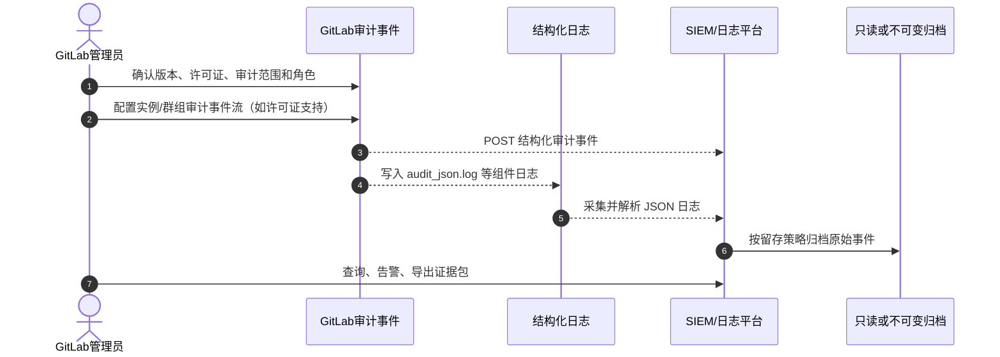

# GitLab 审计日志详细配置与运维指南

更新时间：2026-09-02
适用对象：GitLab Self-Managed 管理员、安全/合规人员、平台运维人员
验证边界：本文根据当前 GitLab 官方文档整理；命令只给出检查和取证示例，未在任何实际 GitLab 实例执行。

## 1. 先说结论

GitLab 所谓“开详细日志审计”不是打开一个统一的 debug 开关，而是按下面三层建设：

1. **审计事件（Audit Events）**：记录用户对实例、Group、Project 和账号的敏感操作。GitLab 会按产品能力写入审计事件，不能通过把普通日志级别改成 `DEBUG` 来补齐缺失事件。
2. **GitLab 结构化组件日志**：`audit_json.log`、`api_json.log`、`production_json.log`、NGINX、GitLab Shell、Gitaly、Registry 等，用于把“谁做了什么”与请求、Git 操作、错误和组件处理过程关联起来。
3. **外部集中采集和不可变留存**：Premium/Ultimate 可用 UI/API 查询和导出；Ultimate 的实例级审计事件流可实时发送到 HTTP、AWS S3 或 Google Cloud Logging，再由 SIEM/日志平台检索、告警和归档。

推荐的落地顺序是：



不能把以下结果当成“审计已完成”：

- `gitlab-ctl status` 全部为 `run`；这只能说明进程状态正常。
- HTTP 访问日志有 `200`；这只能证明请求被处理，不能证明操作事件已落库或已送达 SIEM。
- 能看到 `production_json.log`；这是 Rails 请求日志，不等于完整审计事件。
- GitLab 页面能导出一份 CSV；还需要验证查询窗口、事件数量、外部送达、留存和告警。

## 2. 先确认范围、版本和许可证

### 2.1 三种“详细”要分别定义

| 目标 | 应启用/采集的内容 | 主要用途 |
|---|---|---|
| 权限和配置变更 | Audit Events、`audit_json.log` | 追踪成员、角色、分支保护、变量、Webhook、Runner 和设置变化 |
| 访问和请求取证 | `production_json.log`、`api_json.log`、NGINX、`auth_json.log` | 关联 URL、HTTP 方法、来源 IP、用户、状态码、`correlation_id` |
| Git 仓库操作 | Audit Events、GitLab Shell、Gitaly、NGINX | 追踪 push、pull、clone 的协议、项目和执行结果 |
| CI/CD 和发布 | Pipeline/Job/Deployment 事件、Runner、Registry、Argo CD/Kubernetes 日志 | 证明构建、镜像 digest、部署目标和实际执行结果 |
| 合规和长期取证 | 审计事件流、SIEM、WORM/Object Lock 或等效不可变归档 | 实时告警、防删除、定期审计和事件调查 |

### 2.2 许可证能力边界

具体事件类型会随 GitLab 版本增加或调整，正式上线前以目标实例的版本文档和 **Audit event types** 页面为准。

| 能力 | Free | Premium | Ultimate |
|---|---|---|---|
| 登录成功记录/用户 Authentication log | 有限支持 | 有 | 有 |
| Project/Group 审计事件页面 | 有限 | 更完整 | 更完整 |
| 实例审计事件页面和实例 API | 不作为完整能力使用 | 支持（Self-Managed 管理员） | 支持 |
| `audit_json.log` | 有，事件种类较少 | 有，事件种类更多 | 有 |
| 实例/群组外部审计事件流 | 不提供完整的高级流式能力 | 通常不满足实例级实时外发 | Ultimate 支持，需管理员/Group Owner |

这里的“有”表示产品会记录该范围内已实现的事件，并不代表所有页面访问、所有 API 调用或所有 Git 操作都自动成为数据库审计事件。不能用套餐名称推断某个具体 `event_type` 一定存在。

### 2.3 变更前只读预检

先记录以下信息，后续验收必须使用同一批值：GitLab 版本/Edition、安装方式、实例 URL、时区、许可证、管理员账号、目标 SIEM URL、网络出口和留存策略。

Omnibus/Linux package：

```bash
sudo gitlab-rake gitlab:env:info
sudo gitlab-ctl status
```

Docker Compose：

```bash
docker ps --format 'table {{.Names}}\t{{.Image}}\t{{.Status}}'
docker inspect <gitlab-container> --format '{{json .Mounts}}' | jq
```

Helm：

```bash
kubectl -n <gitlab-namespace> get pods -o wide
kubectl -n <gitlab-namespace> get deploy,sts
helm -n <gitlab-namespace> list
```

说明：容器挂载、Helm values 和环境信息可能包含域名、集成地址或配置细节，不要把完整输出直接上传到工单或公开位置；只保留版本、组件、日志路径、配置键名和必要的布尔值。确需核对 Helm 日志设置时，只读取明确的日志相关 key，不要导出全部 values。

## 3. GitLab 内置审计事件：查看和导出

### 3.1 实例级页面

管理员在 GitLab UI 中进入：

`Admin` → `Monitoring` → `Audit events`

可按执行人、Group、Project 和日期范围筛选。实例审计事件页面适合人工调查和抽样核对；CSV 导出最多 100000 条，导出的是当前筛选视图，超出上限的记录会被截断。

### 3.2 Group/Project 页面

- Group：进入目标 Group → `Secure` → `Audit events`。
- Project：进入目标 Project → `Secure` → `Audit events`。
- 用户登录记录：头像 → `Edit profile` → `Access` → `Authentication log`。

查看他人事件所需角色与范围不同：Group 通常需要 Owner，Project 通常需要 Maintainer 或更高角色；审计专用角色和具体版本的权限矩阵要以实例为准。

### 3.3 页面能力边界

审计页面的文本检索能力有限，通常只能按执行人和日期范围过滤，不能对 `details` 做任意全文搜索；实例、Group 和 Project API 查询的时间窗口也有限制。需要跨月检索、全文检索、关联告警时，应把事件流送到外部系统，而不是反复扩大页面导出范围。

## 4. Audit Events API：查询、分页和证据保存

### 4.1 实例级查询

实例 API 需要 Administrator 认证，单次查询时间范围最多 30 天。访问令牌应通过密钥管理系统注入，不要写入脚本、Shell 历史、Git 仓库或文档。

```bash
GITLAB_URL='https://gitlab.example.com'

curl --fail --silent --show-error \
  --header "PRIVATE-TOKEN: ${GITLAB_AUDIT_TOKEN}" \
  --get "${GITLAB_URL}/api/v4/audit_events" \
  --data-urlencode 'created_after=2026-09-01T00:00:00Z' \
  --data-urlencode 'created_before=2026-09-02T00:00:00Z' \
  --data-urlencode 'entity_type=Project' \
  --data-urlencode 'per_page=100' \
  | jq -c '.[] | {id, event_type, entity_type, entity_id, author_id, created_at, details}'
```

`entity_type` 可按实例 API 支持的值使用，例如 `User`、`Group`、`Project` 或 `Gitlab::Audit::InstanceScope`。实例响应通常包含 `id`、`author_id`、`entity_*`、`details` 和 `created_at` 等字段。

### 4.2 Group 和 Project 查询

```bash
# Group，:id 可以是数字 ID 或 URL 编码后的路径
curl --fail --silent --show-error \
  --header "PRIVATE-TOKEN: ${GITLAB_AUDIT_TOKEN}" \
  --get "${GITLAB_URL}/api/v4/groups/<group-id-or-encoded-path>/audit_events" \
  --data-urlencode 'created_after=2026-09-01T00:00:00Z' \
  --data-urlencode 'created_before=2026-09-02T00:00:00Z' \
  | jq

# Project，:id 可以是数字 ID 或 URL 编码后的路径
curl --fail --silent --show-error \
  --header "PRIVATE-TOKEN: ${GITLAB_AUDIT_TOKEN}" \
  --get "${GITLAB_URL}/api/v4/projects/<project-id-or-encoded-path>/audit_events" \
  --data-urlencode 'created_after=2026-09-01T00:00:00Z' \
  --data-urlencode 'created_before=2026-09-02T00:00:00Z' \
  | jq
```

连续翻页应使用 GitLab 当前版本支持的 keyset pagination；不要在长期采集程序中依赖已弃用的 offset pagination。采集程序必须保存：请求窗口、HTTP 状态、响应数量、最小/最大 `created_at`、最后一个事件 `id`、分页游标、采集时间和错误信息。

### 4.3 证据文件处理

```bash
umask 077
mkdir -p ./evidence/<case-id>

curl --fail --silent --show-error \
  --header "PRIVATE-TOKEN: ${GITLAB_AUDIT_TOKEN}" \
  --get "${GITLAB_URL}/api/v4/audit_events" \
  --data-urlencode 'created_after=2026-09-01T00:00:00Z' \
  --data-urlencode 'created_before=2026-09-02T00:00:00Z' \
  > ./evidence/<case-id>/gitlab-audit-events.json

shasum -a 256 ./evidence/<case-id>/gitlab-audit-events.json \
  > ./evidence/<case-id>/SHA256SUMS
```

以上示例仅适合受控取证目录。响应里的 `details` 可能包含用户名、IP、项目路径、集成信息或业务内容；共享前应按组织隐私和敏感信息规则脱敏，并保留原始文件访问审计。

## 5. Ultimate：配置实例级外部审计事件流

### 5.1 适用范围和协议

实例级审计事件流适用于 GitLab Self-Managed/Dedicated 的 Ultimate。管理员可以配置整实例的结构化 JSON 外发目标，支持 HTTP endpoint，以及文档所列的 AWS S3、Google Cloud Logging 目标。

GitLab 通过 HTTP `POST` 发送事件；同一个事件可能向同一目标发送多次，接收端必须使用 payload 中的 `id` 去重。外发内容可能包含敏感信息，因此只能指向受信任的 HTTPS endpoint 或受控云存储。

### 5.2 HTTP 目标配置流程

1. 准备接收服务：HTTPS URL、证书链、超时和重试处理、限流、事件落盘/转发、接收日志和健康检查。
2. 准备认证：使用自定义 HTTP Header 或 GitLab 事件流验证 Token；Token 不写入代码和文档。
3. GitLab UI：`Admin` → `Monitoring` → `Audit events` → `Streams`。
4. 选择 `Add streaming destination` → `HTTP endpoint`。
5. 填写目标名称和 URL；需要时添加自定义 Header，单个目标最多 20 个。
6. 保存后记录目标状态、事件过滤器、验证 Token 的存放位置和变更审批号。
7. 如果接收端按 JSON 解析，请把 `Content-Type` 从默认的 `application/x-www-form-urlencoded` 调整为 `application/json`（按目标版本 UI/GraphQL 能力操作）。
8. 默认不设置过滤器时，目标接收该范围的全部审计事件；若设置过滤器，必须把允许的 `event_type` 和命名空间记录进配置基线。

### 5.3 接收端验真和幂等

每条流式事件带有 `X-Gitlab-Event-Streaming-Token` Header。接收端应：

- 与受控配置中的验证 Token 做常量时间比较；
- 校验 HTTPS、来源网络和请求大小；
- 以 `id` 建立幂等键，重复事件不重复告警或入库；
- 原样保存事件，同时解析 `event_type`、`author_*`、`entity_*`、`target_*`、`ip_address`、`created_at` 和 `details`；
- 返回明确的 2xx/4xx/5xx，并记录 GitLab 侧请求时间、响应状态和失败原因；
- 不把 Token、完整 Header、Cookie 或认证信息写入普通业务日志。

### 5.4 Group 级外部流

如果只需某个组织的事件，可在顶级 Group 的 `Secure` → `Audit events` → `Streams` 中添加目标。Group Owner 才能配置；事件覆盖该 Group、子 Group 和项目。实例级与 Group 级目标可以并存，必须提前约定是否会重复接收并在 SIEM 中去重。

### 5.5 S3/Google Cloud Logging 的选择

S3 或 Google Cloud Logging 适合不希望暴露 HTTP 接收端、已有云侧集中留存的场景。上线前应完成：云 API/服务账号权限、专用 bucket 或 log sink、加密、网络出口、对象生命周期、不可变/保留策略和访问审计。云端密钥只放在 GitLab 受保护的配置或专用密钥管理系统中，不把 JSON key、Secret Access Key 或私钥贴入工单和笔记。

### 5.6 暂停与恢复

临时故障或维护时，在目标流的 `Active` 选项中取消勾选并保存；这会停止该目标接收，但保留配置，其他目标不受影响。恢复时重新勾选并保存。暂停期间必须记录开始/结束时间、原因、是否有补采窗口以及审计风险接受人。

## 6. 文件日志：不需要“打开”，但需要正确采集

`audit_json.log` 是 GitLab 结构化审计日志之一。它在支持的安装中由 GitLab 产生，不需要把 Rails 日志级别改为 `DEBUG` 才会出现。事件类型与套餐、版本有关。

### 6.1 关键日志和用途

| 日志 | 重点 | Omnibus/Linux package 路径 | Helm 观察方式 |
|---|---|---|---|
| `audit_json.log` | 设置、成员、权限等审计事件 | `/var/log/gitlab/gitlab-rails/audit_json.log` | Webservice/Sidekiq，`subcomponent="audit_json"` |
| `production_json.log` | Rails 页面请求、用户、IP、状态、性能、`correlation_id` | `/var/log/gitlab/gitlab-rails/production_json.log` | Webservice，`subcomponent="production_json"` |
| `api_json.log` | GitLab API 请求和已过滤的参数 | `/var/log/gitlab/gitlab-rails/api_json.log` | Webservice，`subcomponent="api_json"` |
| `application_json.log` | 用户创建、项目删除等应用事件 | `/var/log/gitlab/gitlab-rails/application_json.log` | Webservice/Sidekiq，`subcomponent="application_json"` |
| `auth_json.log` | 受保护路径滥用、限流和可用的用户信息 | `/var/log/gitlab/gitlab-rails/auth_json.log` | Webservice/Sidekiq，`subcomponent="auth_json"` |
| GitLab Shell | SSH Git 命令、项目路径、用户 | `/var/log/gitlab/gitlab-shell/gitlab-shell.log` | Shell 组件 stdout/容器日志 |
| Gitaly | 仓库 RPC、Hook、后端处理 | `/var/log/gitlab/gitaly/current` | Gitaly 组件日志 |
| NGINX access/error | 入口请求和反向代理错误 | `/var/log/gitlab/nginx/gitlab_access.log` 等 | Ingress/NGINX 容器日志 |
| Registry | 镜像仓库访问和错误 | `/var/log/gitlab/registry/current` | Registry 组件日志 |

`production_json.log` 和 `api_json.log` 的 `params` 经过 GitLab 的敏感参数过滤，但采集端仍应把日志当作敏感数据处理。使用 `correlation_id` 将请求、Sidekiq、Gitaly 和错误日志关联起来；不要只按时间戳拼接记录。

### 6.2 Omnibus 读取和验证

```bash
# 确认文件存在与权限（只读）
sudo ls -l /var/log/gitlab/gitlab-rails/audit_json.log
sudo stat /var/log/gitlab/gitlab-rails/audit_json.log

# 观察审计事件；只在受控终端执行
sudo tail -F /var/log/gitlab/gitlab-rails/audit_json.log

# 解析最近可读的 JSON 行，忽略坏行并输出有限字段
sudo tail -n 2000 /var/log/gitlab/gitlab-rails/audit_json.log \
  | jq -R -c 'fromjson? | {time, event_type, author_id, author_name, entity_type, entity_id, target_type, target_id, ip_address, change, details}'

# 按 correlation_id 到请求日志取证（替换为实际 ID）
sudo rg '<correlation-id>' /var/log/gitlab/gitlab-rails \
  /var/log/gitlab/gitlab-shell /var/log/gitlab/gitaly
```

### 6.3 Docker Compose

Docker 安装不会改变 GitLab 内部日志名称；重点是确认 `/var/log/gitlab` 是否持久化到宿主机。若未持久化，容器重建可能丢失本地日志，必须先修正持久化设计，再谈长期审计。

```bash
docker exec <gitlab-container> test -r /var/log/gitlab/gitlab-rails/audit_json.log
docker exec <gitlab-container> tail -n 200 /var/log/gitlab/gitlab-rails/audit_json.log \
  | jq -R -c 'fromjson? | {time, event_type, author_id, entity_type, target_type, ip_address}'

# 检查挂载，不导出全部环境变量
docker inspect <gitlab-container> --format '{{range .Mounts}}{{println .Source "->" .Destination}}{{end}}'
```

### 6.4 Helm chart

Helm 安装的组件通常把日志输出到 stdout；审计日志可在 Webservice 和 Sidekiq Pod 中按 `subcomponent` 过滤。实际 label、容器名和 namespace 要以现场资源为准。

```bash
kubectl -n <gitlab-namespace> logs <webservice-pod> -c webservice \
  | jq -c 'select(.subcomponent == "audit_json")'

kubectl -n <gitlab-namespace> logs <sidekiq-pod> -c sidekiq \
  | jq -c 'select(.subcomponent == "audit_json")'

# 仅检查 Pod 中可用的 app 标签，不假设固定 selector
kubectl -n <gitlab-namespace> get pods \
  -o jsonpath='{range .items[*]}{.metadata.name}{"\t"}{.metadata.labels.app}{"\n"}{end}'
```

日志采集器应保存 Pod、namespace、container、node、`subcomponent` 和原始 JSON，避免只保留渲染后的 message 造成证据字段丢失。

## 7. 集中采集、字段规范和告警

### 7.1 建议的统一字段

至少统一以下字段，字段不存在时记录“源事件未提供”，不要用空字符串掩盖采集缺失：

| 字段 | 用途 |
|---|---|
| `id` | 审计事件幂等去重 |
| `event_type` | 事件分类和过滤 |
| `author_id`、`author_name` | 操作主体 |
| `entity_type`、`entity_id`、`entity_path` | 受影响的实例/Group/Project/User |
| `target_type`、`target_id`、`target_details` | 具体被修改对象 |
| `ip_address` / `remote_ip` | 来源地址 |
| `created_at` / `time` | 源事件时间 |
| `correlation_id` | 跨组件关联 |
| `details`、`change`、`from`、`to` | 变更前后和扩展信息 |
| `collector`、`ingested_at`、`source_file` | 采集证据 |

时间建议统一存 UTC，同时保留源字段；GitLab UI 可能显示本地时区，API 默认以 UTC 返回，CSV 以 UTC 导出。

### 7.2 最小告警集合

告警名称应结合实际事件类型，不要直接把下面的中文描述当作固定 `event_type`：

- 实例管理员、Group Owner、Project Maintainer 变化；
- 成员提升为 Owner/Maintainer、保护分支/标签规则削弱；
- CI/CD Variable、Deploy Token、Runner Token、Webhook、OAuth 应用变化；
- Runner 注册、删除、暂停、Tag/执行器变化；
- 生产项目直接 push、强制推送、保护分支删除；
- 审计流目标被创建、修改、停用或删除；
- 同一事件短时间内大量重复、外部接收端连续 4xx/5xx、事件延迟超过阈值；
- GitLab、SIEM、归档系统时间不同步或采集游标中断。

告警必须带原始事件 ID、操作者、项目路径、来源 IP、事件时间、采集时间、关联 `correlation_id` 和调查链接；不要只发送一条没有上下文的“权限变更”文字。

## 8. 留存、安全和权限

### 8.1 留存分层

由安全、内审、法务和数据保护要求确定在线和归档期限，不能直接套用“90 天/1 年/7 年”。建议分三层：

GitLab 官方审计事件页面说明审计事件没有设定固定的产品保留期限、可持续提供查询；这不等于数据库备份、外部日志流和不可变归档可以省略，也不代表普通组件日志不会因轮转而丢失。

1. GitLab 本地审计事件：用于近线查询，确认数据库备份和升级迁移策略。
2. SIEM/日志平台：用于检索、告警和事件调查，设置源日志、解析后日志和告警记录的不同保留期。
3. 不可变归档：保存原始事件、采集元数据、哈希清单、导出审批和处置记录；使用 WORM/Object Lock 或组织认可的等效控制。

### 8.2 权限分离

- GitLab 管理员负责配置，审计人员负责查看和导出，日志平台管理员不能单独删除原始归档。
- 外部接收端只开放必要网络和写入权限；查询、删除、生命周期策略使用不同身份。
- 令牌、云密钥、验证 Token、Cookie、完整认证 Header 不进入 GitLab CI 日志、普通工单和 Markdown。
- 采集器、SIEM 和归档系统都要记录自身的登录、查询、导出、删除和策略变更。
- 生产环境尽量使用 HTTPS、可靠时间同步、磁盘加密和静态/传输加密。

### 8.3 日志轮转和磁盘容量

GitLab 日志可能由 `logrotate`、`svlogd/runit` 或组件自身管理。审计要求上线前要确认：轮转周期、压缩文件路径、采集器是否能读取轮转文件、磁盘告警阈值、清理策略和备份恢复。不要为了“详细”无限制放大日志级别；高流量的请求和 Git 日志可能迅速消耗磁盘并影响 GitLab。

## 9. 上线验证流程

### 9.1 验证前准备

为测试动作建立临时 Project/Group 和测试账号，记录开始时间、操作者、来源 IP、GitLab URL、版本、事件流目标和 SIEM 接收窗口。测试动作不得在生产项目直接修改权限或删除资源。

### 9.2 生成一组可识别事件

在测试范围内依次完成并记录：

1. 添加/移除一个测试成员或调整其角色；
2. 修改并恢复一个非生产项目设置；
3. 创建/关闭一个测试 Merge Request 或 Tag；
4. 执行一次 API 查询和一次已授权 Git clone/fetch；
5. 触发一个测试 Pipeline/Job（如果审计范围包含 CI/CD）；
6. 对外部流目标做一次接收端验证，确认 Header、JSON、HTTP 状态和去重。

### 9.3 分层验收

| 验收层 | 通过条件 |
|---|---|
| UI | 实例/Group/Project 页面在正确时间窗口看到测试事件 |
| API | API 返回测试事件，字段完整，权限和时间窗口符合预期 |
| 本地文件 | `audit_json.log` 能找到事件；请求日志有对应 `correlation_id` |
| 外部流 | SIEM/接收端收到事件，验证 Header 通过，重复事件按 `id` 去重 |
| 可靠性 | 接收端短暂失败后有明确重试/失败记录，采集游标不会静默跳过 |
| 安全 | 令牌、Cookie、Secret 未出现在普通日志和证据共享包 |
| 归档 | 原始事件、采集元数据、哈希/版本信息可按 case ID 只读取回 |
| 告警 | 预设高风险事件产生告警，告警包含操作者、对象、IP、事件 ID |

验收不通过时，先区分“事件未生成”“事件未落库”“外部未送达”“解析丢字段”“查询权限不足”“时间窗口错误”，不要直接扩大日志级别或重启 GitLab。

## 10. 常见误区和排查顺序

### 10.1 页面没有 Audit events 菜单

可能原因：版本/许可证不支持、当前账号不是管理员/Owner、目标是 Group/Project 页面而不是实例页面，或导航名称随版本变化。先确认 Edition、版本、许可证和账号角色，再查官方事件能力表。

### 10. `audit_json.log` 没有某个操作

这不一定是采集故障。该操作可能没有实现为数据库审计事件、只属于流式事件、只存在于 `api_json.log`/NGINX/组件日志，或者当前套餐不包含。对照 **Audit event types** 的 `scope`、`saved to database` 和 `streamed` 属性；不要把“日志文件存在”当成所有操作都被记录。

### 10. UI 有事件，但 SIEM 没有

按顺序检查：目标是否 Active、过滤器是否排除了事件、GitLab 到接收端的 DNS/TLS/网络、接收端 HTTP 状态、验证 Header、Content-Type、重试和 SIEM 解析规则。使用事件 `id` 和 `created_at` 对账，不能只看接收端“请求数”。

### 10. SIEM 里事件重复

GitLab 允许同一个事件向同一目标发送多次；接收端必须以事件 `id` 做幂等去重，并保留重复计数用于监控传输质量。

### 10. 只采集 `production_json.log`

这会遗漏审计事件细节、SSH Git 操作、Gitaly 后端和 Registry 访问。至少同时采集 `audit_json.log`、`api_json.log`、NGINX、GitLab Shell；按发布场景再关联 Runner、Registry、Argo CD 和 Kubernetes 审计。

## 11. 生产上线检查清单

- [ ] 已确认 GitLab Edition、版本、许可证和安装方式。
- [ ] 已定义审计范围、操作者角色、留存期限、数据位置和隐私边界。
- [ ] 已确认实例/Group/Project 页面和 API 的权限。
- [ ] 已确认本地日志路径、轮转、磁盘容量、备份和采集器读取权限。
- [ ] 已配置或明确不配置实例级/Group 级外部事件流，并记录审批号。
- [ ] HTTPS、验证 Token、最大请求大小、超时和重试策略已验证。
- [ ] SIEM 使用 `id` 去重，并保留原始 JSON 和采集元数据。
- [ ] 已对齐 UTC/时区和时间同步。
- [ ] 已完成测试 Project/Group 的事件生成、UI、API、文件、流式和归档验收。
- [ ] 已建立高风险事件告警、采集失败告警、延迟告警和磁盘容量告警。
- [ ] 已演练导出、只读取证、权限撤销、Token 轮换和接收端故障恢复。
- [ ] 已明确事件流暂停、补采、应急变更和审计系统故障时的发布策略。

## 12. 官方参考

- [GitLab Audit events](https://docs.gitlab.com/user/compliance/audit_events/)
- [Audit events administration](https://docs.gitlab.com/administration/compliance/audit_event_reports/)
- [Audit events API](https://docs.gitlab.com/api/audit_events/)
- [Audit event types](https://docs.gitlab.com/user/compliance/audit_event_types/)
- [Audit event schema and examples](https://docs.gitlab.com/user/compliance/audit_event_schema/)
- [Audit event streaming for instances](https://docs.gitlab.com/administration/compliance/audit_event_streaming/)
- [Audit event streaming for top-level groups](https://docs.gitlab.com/user/compliance/audit_event_streaming/)
- [GitLab log system](https://docs.gitlab.com/administration/logs/)

## 13. 文档验证边界

本文已做 Markdown 结构和命令占位符检查；未在真实 GitLab、SIEM、S3、Google Cloud Logging 或 Kubernetes 集群执行。目标实例的版本、套餐、导航、事件类型、日志路径挂载、网络策略和留存配置仍需现场验证。
