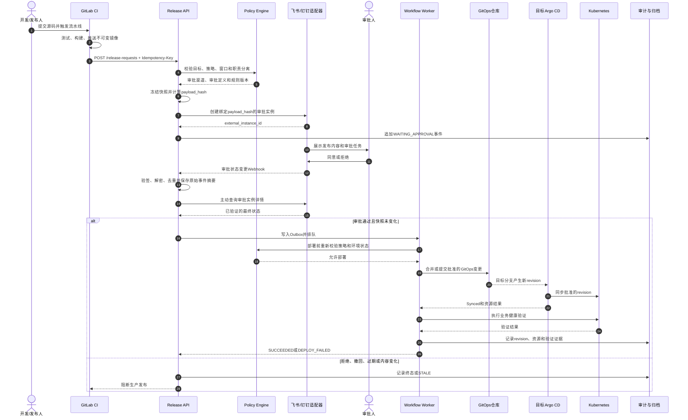
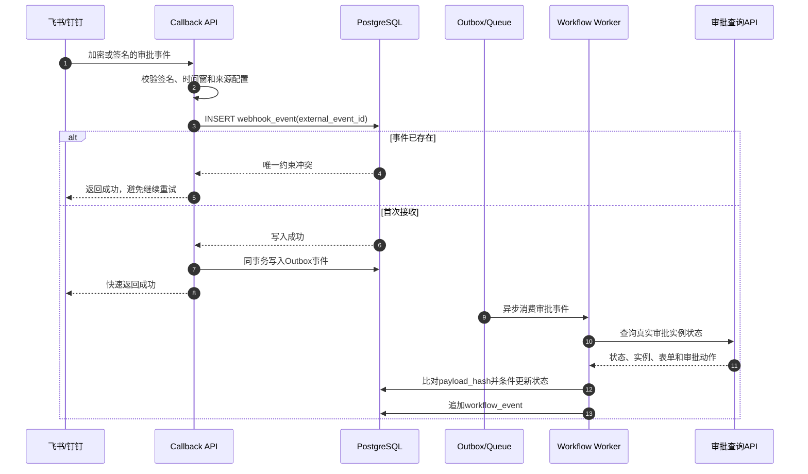
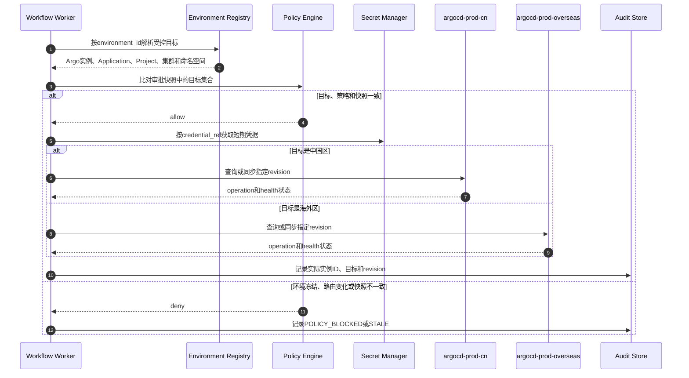

# 发布编排与审计服务设计：飞书、钉钉审批与多 Argo CD

> 文档定位：在现有 Deploy Recorder 基础上，设计一个统一记录发布流程、接入飞书/钉钉审批、审批通过后才允许 Argo CD 部署，并支持多个 Argo CD 控制面的后端服务。
>
> 当前状态：架构与接口设计，尚未实现、部署或连接真实飞书、钉钉、GitLab、Argo CD 和 Kubernetes 环境。

## 1. 结论

建议把现有 Deploy Recorder 从“事后记录器”升级为“发布编排与审计服务”，本文简称 Release Orchestrator。

它不直接替代 GitLab CI、飞书、钉钉或 Argo CD，而是负责五件事：

1. 接收 CI、门户或自动化系统提交的发布申请。
2. 对发布内容、目标环境和审批策略生成不可变快照。
3. 调用飞书或钉钉发起审批，并可靠接收审批结果。
4. 审批通过且再次校验成功后，推进 GitOps 变更或触发指定 Argo CD 同步。
5. 把申请、校验、审批、部署、健康检查、回滚和人工操作记录为可查询的审计时间线。

推荐的生产发布方式是：

```text
CI 生成不可变镜像和待发布变更
  -> Release Orchestrator 创建发布单并发起审批
  -> 审批通过
  -> Release Orchestrator 合并或提交受保护的 GitOps 变更
  -> 目标 Argo CD 自动同步
  -> Release Orchestrator 采集同步与健康结果
```

不要让待审批变更提前进入 Argo CD 自动同步所监控的生产分支，否则审批还未通过，Argo CD 就可能已经部署。

## 2. 设计目标与边界

### 2.1 必须实现

- 对外提供统一 REST API，记录每一步输入、输出、操作者、时间和结果。
- 支持飞书审批、钉钉审批，并允许后续增加企业微信或内部 OA。
- 审批未通过、已撤回、已过期或无法确认时，生产部署必须阻断。
- 支持注册多个 Argo CD 实例，并按环境、区域、安全域和应用精确路由。
- 一个发布单可以包含一个或多个目标，但审批必须明确覆盖完整目标集合。
- 支持发布、取消、失败重试、超时、回滚和应急发布。
- 全流程可按发布单、源码 Commit、Pipeline、镜像 digest、GitOps Commit、审批实例和 Argo CD revision 查询。
- Webhook 重放、消息重复、服务重启和短暂网络故障不能造成重复部署。

### 2.2 明确不做

- 不负责构建业务镜像，构建仍由 GitLab Runner 完成。
- 不把飞书或钉钉仅当作聊天机器人按钮；正式审批使用各自的原生审批实例。
- 不允许请求方在发布 API 中传入任意 Argo CD URL、Token 或 Kubernetes 凭据。
- 不在数据库明文保存飞书 App Secret、钉钉 App Secret、Argo CD Token、Git 凭据和 kubeconfig。
- 不用普通数据库审计表冒充不可变归档；正式审计仍需独立 Object Lock/WORM 或等价能力。

## 3. 不可绕过的发布规则

这几条应写成服务端约束，而不是依赖调用方自觉：

1. `APPROVED` 是部署的必要条件，不是充分条件。
2. 审批结果只能推进审批状态，Webhook 处理线程不得直接部署。
3. 部署前必须重新检查发布内容哈希、目标环境状态、策略版本、维护窗口和凭据可用性。
4. 审批绑定的发布内容发生变化时，原审批自动失效，必须重新发起。
5. 目标 Argo CD 和 Application 必须来自服务端环境注册表，不能来自用户提交的 URL。
6. 同一 `environment + application` 同一时间只允许一个活动部署。
7. 失败重试必须复用同一个发布单和幂等键，不能偷偷创建一条新流程。
8. 回滚也是发布动作，需要独立策略；不能因为名称是“回滚”就自动绕过审批。

## 4. 总体架构

```text
GitLab CI / 发布门户 / 自动化系统
                  |
                  v
        API Gateway / OIDC / RBAC
                  |
                  v
   +----------------------------------+
   |       Release Orchestrator       |
   |                                  |
   | Release API     Policy Engine    |
   | Workflow Worker Approval Service |
   | GitOps Adapter  Argo CD Adapter  |
   | Audit Service   Reconciler       |
   +---+----------+----------+--------+
       |          |          |
       v          v          v
  PostgreSQL   Queue/Outbox  Secret Manager
       |
       +-------> Object Lock/WORM / SIEM

Approval Adapters                 Deployment Adapters
  +-- Feishu Approval               +-- GitLab GitOps MR/Commit
  +-- DingTalk Approval             +-- argocd-prod-cn
  +-- Future Provider               +-- argocd-prod-overseas
                                      +-- argocd-nonprod
```

### 4.1 组件职责

| 组件 | 职责 | 不应承担的职责 |
|---|---|---|
| Release API | 创建、查询、取消、重试和回滚发布单 | 直接调用 Argo CD 部署 |
| Policy Engine | 计算目标环境需要的审批人、人数、渠道、时间窗和风险规则 | 保存第三方凭据 |
| Approval Service | 创建审批、查询状态、规范化飞书/钉钉事件 | 根据一个未验真的回调直接部署 |
| Workflow Worker | 持久化推进状态，执行重试、超时和补偿 | 接受外部任意状态跳转 |
| GitOps Adapter | 创建 MR、合并或提交批准后的环境变更 | 向 Git 提交 Secret 明文 |
| Argo CD Adapter | 查询、同步、等待健康、收集 revision 和资源结果 | 自行决定发布目标 |
| Environment Registry | 保存环境到 Argo CD/Application 的受控映射 | 保存明文 Token |
| Reconciler | 主动查询审批和 Argo CD 状态，修复漏事件 | 覆盖真实状态或静默吞错 |
| Audit Service | 追加事件、生成证据包、归档和对账 | 允许普通发布账号修改历史记录 |

## 5. 核心领域模型

### 5.1 发布对象关系

```text
release_requests
  ├── release_targets
  │     └── deployment_runs
  │            └── argocd_sync_events
  ├── approval_instances
  │     └── approval_actions
  ├── workflow_events
  └── evidence_artifacts

environments
  ├── argocd_instances
  ├── approval_policies
  └── gitops_destinations
```

### 5.2 建议表结构

| 表 | 关键字段 | 说明 |
|---|---|---|
| `release_requests` | `id`、`project_id`、`source_sha`、`image_digest`、`payload_hash`、`status`、`policy_version` | 发布单主表 |
| `release_targets` | `release_id`、`environment_id`、`application_id`、`wave`、`target_hash` | 一个发布单的目标集合 |
| `approval_policies` | `environment_id`、`provider`、`definition_code`、`min_approvers`、`rules`、`version` | 环境审批策略 |
| `approval_instances` | `release_id`、`provider`、`external_instance_id`、`request_uuid`、`status` | 外部审批实例映射 |
| `approval_actions` | `instance_id`、`actor_id`、`action`、`occurred_at`、`raw_event_id` | 同意、拒绝、转交、撤回等动作 |
| `argocd_instances` | `id`、`name`、`base_url`、`credential_ref`、`ca_ref`、`status` | Argo CD 控制面注册表 |
| `environments` | `id`、`name`、`argocd_instance_id`、`cluster_server`、`namespace`、`risk_level`、`state` | 逻辑环境 |
| `applications` | `environment_id`、`argocd_project`、`argocd_app`、`gitops_repo`、`gitops_path` | 受控部署目标 |
| `deployment_runs` | `release_target_id`、`attempt`、`desired_revision`、`status`、`started_at`、`finished_at` | 每次部署尝试 |
| `workflow_events` | `event_id`、`release_id`、`event_type`、`payload_sha256`、`previous_hash`、`record_hash` | 只追加时间线 |
| `webhook_events` | `provider`、`external_event_id`、`signature_valid`、`processed_at` | 回调去重和验签证据 |
| `outbox_events` | `aggregate_id`、`event_type`、`status`、`next_attempt_at` | 事务消息和可靠重试 |
| `evidence_artifacts` | `release_id`、`object_key`、`version_id`、`sha256`、`retention_class` | 外部不可变归档索引 |

### 5.3 必要唯一约束

```text
UNIQUE(caller_id, idempotency_key)
UNIQUE(provider, external_instance_id)
UNIQUE(provider, external_event_id)
UNIQUE(release_id, environment_id, application_id)
UNIQUE(environment_id, argocd_app)
```

同一环境和应用的活动部署不能只依赖唯一索引，因为完成状态会释放锁。可以使用 PostgreSQL advisory lock，或维护带条件的唯一索引：只对活动状态生效。

## 6. 发布内容快照与审批绑定

### 6.1 快照字段

审批前把下列内容规范化为 canonical JSON，再计算 SHA-256：

```json
{
  "project_id": "demo-api",
  "source_commit": "0123456789abcdef0123456789abcdef01234567",
  "pipeline_id": "98765",
  "image": "registry.example.com/team/demo-api",
  "image_digest": "sha256:0123456789abcdef",
  "gitops_repository": "platform/gitops",
  "gitops_base_revision": "89abcdef0123456789abcdef0123456789abcdef",
  "manifest_patch_sha256": "sha256:abcdef0123456789",
  "targets": [
    {
      "environment_id": "prod-cn",
      "argocd_instance_id": "argocd-prod-cn",
      "application": "demo-api-prod",
      "namespace": "demo-api"
    }
  ],
  "strategy": "rolling",
  "policy_version": "prod-v3"
}
```

```text
payload_hash = SHA256(canonical_json(snapshot))
```

审批表单中至少展示：应用、镜像 digest、源码 Commit、GitOps diff 链接、目标环境、发布窗口、变更说明、风险等级、回滚版本和 `payload_hash` 短码。

### 6.2 为什么必须绑定目标集合

如果审批只写“demo-api 上线”，审批后把目标从测试改为生产、从一个集群改为十个集群，技术上仍可能被当成同一张审批单。正确做法是把排序后的完整目标集合写入快照。

新增、删除或修改任一目标都应产生新的 `payload_hash`，原审批状态转为 `STALE`。

## 7. 发布状态机

| 状态 | 含义 | 允许的下一状态 |
|---|---|---|
| `DRAFT` | 发布单已创建，内容尚未冻结 | `VALIDATING`、`CANCELED` |
| `VALIDATING` | 校验镜像、GitOps diff、环境和策略 | `WAITING_APPROVAL`、`VALIDATION_FAILED` |
| `WAITING_APPROVAL` | 外部审批处理中 | `APPROVED`、`REJECTED`、`CANCELED`、`EXPIRED` |
| `APPROVED` | 审批通过，等待部署前复核 | `QUEUED`、`STALE`、`POLICY_BLOCKED` |
| `QUEUED` | 已进入发布队列 | `GITOPS_COMMITTING`、`ARGO_SYNCING`、`CANCELED` |
| `GITOPS_COMMITTING` | 合并或提交生产 GitOps 变更 | `ARGO_SYNCING`、`DEPLOY_FAILED` |
| `ARGO_SYNCING` | 目标 Argo CD 正在同步 | `HEALTH_CHECKING`、`DEPLOY_FAILED` |
| `HEALTH_CHECKING` | 等待 Argo 和业务健康检查 | `SUCCEEDED`、`DEPLOY_FAILED`、`ROLLBACK_REQUIRED` |
| `SUCCEEDED` | 全部批准目标通过验收 | `ROLLBACK_WAITING_APPROVAL` |
| `DEPLOY_FAILED` | 发布失败 | `RETRY_PENDING`、`ROLLBACK_WAITING_APPROVAL` |
| `ROLLBACK_WAITING_APPROVAL` | 等待回滚审批或应急授权 | `ROLLING_BACK`、`CANCELED` |
| `ROLLING_BACK` | 正在恢复批准的历史 revision | `ROLLED_BACK`、`ROLLBACK_FAILED` |

状态跳转使用数据库事务和乐观锁：

```text
UPDATE release_requests
SET status = :next_status, version = version + 1
WHERE id = :release_id
  AND status = :expected_status
  AND version = :expected_version;
```

影响行数不是 1 时说明发生并发或非法跳转，必须停止处理并记录事件。

## 8. 多 Argo CD 环境模型

### 8.1 推荐的控制面划分

至少区分生产和非生产；跨地域、跨云或强隔离环境再拆分：

| Argo CD 实例 | 负责范围 | 示例环境 |
|---|---|---|
| `argocd-nonprod` | 开发、测试、预发布 | `dev`、`test`、`staging` |
| `argocd-prod-cn` | 中国区生产集群 | `prod-cn-a`、`prod-cn-b` |
| `argocd-prod-overseas` | 海外生产集群 | `prod-sg`、`prod-eu` |

环境与 Argo CD 控制面是多对一关系：一个 Argo CD 可以管理多个集群和环境，但每个逻辑目标必须只有一个明确的执行控制面。

### 8.2 环境注册示例

```json
{
  "id": "prod-cn-a",
  "display_name": "中国区生产 A",
  "risk_level": "critical",
  "state": "ACTIVE",
  "argocd_instance_id": "argocd-prod-cn",
  "cluster_server": "https://kubernetes.default.svc",
  "argocd_project": "payments-prod",
  "argocd_application": "payment-api-prod-cn-a",
  "namespace": "payment",
  "gitops_repository": "platform/prod-gitops",
  "gitops_path": "apps/payment/overlays/prod-cn-a",
  "approval_policy_id": "prod-critical-v3",
  "credential_ref": "vault://release-orchestrator/argocd/prod-cn"
}
```

`base_url`、CA 和凭据引用由管理员注册。创建发布单时，调用方只传 `environment_id` 和应用标识。

### 8.3 环境状态

| 状态 | 行为 |
|---|---|
| `ACTIVE` | 可以按策略发布 |
| `FROZEN` | 冻结发布，只有审批后的 break-glass 流程可继续 |
| `MAINTENANCE` | 仅允许维护窗口和指定变更类型 |
| `DEGRADED` | 控制面或集群异常，自动阻断新发布 |
| `DISABLED` | 不允许路由，历史记录仍保留 |

### 8.4 多目标与分批发布

一个发布单可包含多个 `release_targets`，按 `wave` 执行：

```text
wave 10: prod-cn-a
wave 20: prod-cn-b
wave 30: prod-sg
```

每个 wave 完成 Argo `Synced + Healthy` 和业务验证后才进入下一 wave。任一目标失败时默认停止后续目标，是否自动回滚已经成功的目标由策略决定。

审批必须覆盖全部 wave。不能先审批一个环境，再在执行阶段追加其他环境。

## 9. 飞书审批适配器

飞书适配器实现统一接口：

```text
create_approval(snapshot) -> external_instance_id
get_approval(external_instance_id) -> normalized_status
cancel_approval(external_instance_id)
verify_and_parse_event(headers, body) -> normalized_event
```

### 9.1 接口映射

- 创建原生审批实例：`POST /open-apis/approval/v4/instances`。
- 使用审批定义的 `approval_code` 和规范化表单字段。
- 把发布单 ID 或随机请求 ID 写入飞书 `uuid`，用于幂等和关联。
- 保存返回的 `instance_code`，不把审批标题或人员显示名当作唯一标识。
- 对指定审批定义调用订阅接口，并在开发者后台订阅 `approval_instance` 事件。
- 将飞书 `APPROVED`、`REJECTED`、`CANCELED` 等状态映射为内部状态。

飞书回调到达后仍要使用服务端凭据查询一次实例详情，确认：

- `approval_code` 与配置相同；
- `instance_code` 与发布单绑定；
- `uuid` 与创建请求一致；
- 最终状态确实为通过；
- 表单中的 `payload_hash` 与发布单当前快照一致。

回调验签、解密和挑战响应优先使用飞书官方 SDK；不要只解析 JSON 中的 `status`。

## 10. 钉钉审批适配器

钉钉适配器使用相同的内部接口，外部标识通常为：

- 审批模板 `processCode`；
- 审批实例 `processInstanceId`；
- 审批实例变更事件，例如 `bpms_instance_change`。

钉钉新版服务端 API 常见路径为 `POST /v1.0/workflow/processInstances`，旧版接口为 `POST /topapi/processinstance/create`。两套接口的 Token、请求头、字段和 SDK 不同，实施时必须以目标企业应用后台展示的 API Explorer 和官方文档为准，不能混用示例。

适配器需要完成：

1. 通过 `processCode` 创建审批实例。
2. 保存 `processInstanceId` 与内部发布单的唯一映射。
3. 验证钉钉事件签名、时间戳、随机数和解密结果。
4. 对 `bpms_instance_change` 事件按事件 ID 或稳定字段组合去重。
5. 收到同意事件后主动查询实例详情，再映射为内部 `APPROVED`。
6. 记录审批人 ID、操作时间和结果，不只保存姓名。

如果目标租户只能使用旧版 OA 审批接口，应把差异封装在 `DingTalkApprovalAdapterV1`，不要在工作流中散落版本判断。

## 11. 审批与部署完整时序



## 12. Webhook 安全与可靠处理



必须同时具备：

- 签名或加密校验；
- 时间戳窗口，降低旧消息重放风险；
- 外部事件 ID 唯一约束；
- 回调落库与 Outbox 同事务；
- 主动查询外部审批详情；
- 定时 Reconciler，对账长期停留在 `WAITING_APPROVAL` 的流程。

审批平台回调失败时，Reconciler 仍可恢复状态；审批查询 API 暂时不可用时保持等待或重试，不能推测为已通过。

## 13. 多 Argo CD 路由与失败保护



为防止 SSRF，`base_url` 只能由平台管理员注册并通过域名/IP allowlist 校验。运行时不得根据发布请求访问任意 URL。

每个 Argo CD 实例还应具备：

- 独立 `credential_ref`，不共用全局管理员 Token；
- 独立 CA 信任配置，禁止长期使用跳过 TLS 校验；
- AppProject 级 `get/sync` 最小权限；
- 连接健康、延迟、错误率和熔断状态；
- 明确的应用所有权，避免两个 Argo CD 同时管理同一资源。

Argo CD 官方也建议：如果只是更新 Application 或 AppProject，优先提交到 Git 并让 Argo CD 调谐；只有必须主动同步或查询状态时才使用受限项目 Token。

## 14. 部署执行模式

### 14.1 模式 A：批准后合并 GitOps 变更，推荐

1. CI 创建 GitOps MR 或把 patch 保存在发布单证据中。
2. 生产 Argo CD 只监控受保护的环境分支。
3. 审批通过后，服务使用受限 GitLab 身份合并 MR 或提交精确 patch。
4. Argo CD 自动同步；服务只查询和等待结果。

优点是 Git 仍是唯一事实源，所有变更和回滚都能用 Commit 关联。需要确保人不能绕过保护分支直接提交。

### 14.2 模式 B：批准后调用 Argo CD Sync

适用于生产关闭自动同步或必须精确控制时间窗的场景：

1. GitOps 目标 revision 已存在，但不会自动同步。
2. 审批通过后，服务调用目标 Argo CD 同步明确 revision。
3. Token 只允许目标 AppProject 中指定 Application 的 `get` 和 `sync`。

风险是有 Argo CD `sync` 权限的其他账号可能绕过审批。必须收紧 RBAC、审计 Argo CD 操作，并避免给 CI 普通 Job 同样权限。

### 14.3 不推荐模式

- CI Job 直接持有所有生产 Argo CD 管理员 Token。
- 审批回调收到 `APPROVED` 后在 HTTP 请求线程执行 `argocd app sync`。
- 只验证镜像 Tag，不验证 digest 和 GitOps revision。
- 用飞书/钉钉群里的“同意”文本消息代替原生审批状态。

## 15. REST API 草案

### 15.1 发布接口

| 方法 | 路径 | 用途 |
|---|---|---|
| `POST` | `/api/v1/release-requests` | 创建发布单，必须带 `Idempotency-Key` |
| `POST` | `/api/v1/release-requests/{id}/validate` | 执行预检并冻结快照 |
| `POST` | `/api/v1/release-requests/{id}/submit-approval` | 按策略发起飞书或钉钉审批 |
| `GET` | `/api/v1/release-requests/{id}` | 查询当前状态和版本 |
| `GET` | `/api/v1/release-requests/{id}/timeline` | 查询完整事件时间线 |
| `POST` | `/api/v1/release-requests/{id}/cancel` | 取消尚未执行的发布 |
| `POST` | `/api/v1/release-requests/{id}/retry` | 重试可恢复失败步骤 |
| `POST` | `/api/v1/release-requests/{id}/rollback` | 创建关联原发布单的回滚申请 |
| `GET` | `/api/v1/release-requests/{id}/evidence` | 获取证据清单或受控导出链接 |

创建示例：

```http
POST /api/v1/release-requests HTTP/1.1
Authorization: Bearer <short-lived-oidc-token>
Idempotency-Key: gitlab-42-98765-prod
Content-Type: application/json
```

```json
{
  "project_id": "demo-api",
  "source_commit": "0123456789abcdef0123456789abcdef01234567",
  "pipeline_id": "98765",
  "image": "registry.example.com/team/demo-api",
  "image_digest": "sha256:0123456789abcdef",
  "change_ticket": "CHG-20260901-001",
  "gitops_change": {
    "repository": "platform/prod-gitops",
    "base_revision": "89abcdef0123456789abcdef0123456789abcdef",
    "merge_request_url": "https://gitlab.example.com/platform/prod-gitops/-/merge_requests/123"
  },
  "targets": [
    {
      "environment_id": "prod-cn-a",
      "application": "demo-api",
      "wave": 10
    },
    {
      "environment_id": "prod-cn-b",
      "application": "demo-api",
      "wave": 20
    }
  ],
  "strategy": "rolling",
  "reason": "修复订单重复提交问题",
  "rollback_revision": "76543210abcdef"
}
```

服务返回 `202 Accepted`，表示流程已受理，不表示审批或部署成功：

```json
{
  "release_id": "rel_01K4EXAMPLE",
  "status": "VALIDATING",
  "version": 1,
  "links": {
    "self": "/api/v1/release-requests/rel_01K4EXAMPLE",
    "timeline": "/api/v1/release-requests/rel_01K4EXAMPLE/timeline"
  }
}
```

### 15.2 管理接口

| 方法 | 路径 | 权限 |
|---|---|---|
| `POST` | `/api/v1/admin/argocd-instances` | 平台管理员 |
| `PATCH` | `/api/v1/admin/argocd-instances/{id}` | 平台管理员，需审计 |
| `POST` | `/api/v1/admin/environments` | 平台管理员 |
| `PATCH` | `/api/v1/admin/environments/{id}/state` | 平台管理员或应急角色 |
| `POST` | `/api/v1/admin/approval-policies` | 安全/发布管理员 |
| `GET` | `/api/v1/admin/reconciliation/status` | 运维只读 |

环境路由、审批策略、凭据引用和冻结状态的变更本身也应审批并写入审计系统。

### 15.3 回调接口

```text
POST /api/v1/callbacks/feishu/approval
POST /api/v1/callbacks/dingtalk/approval
POST /api/v1/callbacks/argocd/{instance_id}
POST /api/v1/callbacks/gitlab
```

这些接口使用各平台的签名或专用认证，不使用面向 CI 的通用 `X-API-Key`。

## 16. 权限设计

| 角色 | 允许 | 禁止 |
|---|---|---|
| 发布申请人 | 创建发布单、查看自己项目的状态 | 审批自己的生产发布、修改环境路由 |
| 审批人 | 在飞书/钉钉审批、查看批准内容 | 修改发布快照、直接同步 Argo CD |
| 工作流服务账号 | 按已批准目标执行 GitOps/Argo 操作 | 管理审批策略、读取无关项目 |
| 平台管理员 | 注册环境和 Argo CD 实例 | 无审批修改历史审计记录 |
| 审计人员 | 只读查询、受控导出和校验 | 部署、审批、删除记录 |
| break-glass 角色 | 在限定时间和目标内执行应急流程 | 长期持有全局管理员权限 |

生产环境应检查申请人与审批人是否相同、审批人数是否满足、审批组是否有效。飞书/钉钉返回的显示名仅用于展示，授权判断使用稳定用户 ID 和组织身份映射。

## 17. 审计事件规范

每次状态变化都写 `workflow_events`，至少包含：

```json
{
  "event_id": "evt_01K4EXAMPLE",
  "event_type": "release.approval.approved",
  "schema_version": 1,
  "release_id": "rel_01K4EXAMPLE",
  "actor": {
    "type": "user",
    "id": "ou_example",
    "provider": "feishu"
  },
  "source": "feishu_approval",
  "source_event_id": "external-event-id",
  "occurred_at": "2026-09-01T11:20:00Z",
  "ingested_at": "2026-09-01T11:20:02Z",
  "payload_hash": "sha256:release-payload-hash",
  "details": {
    "approval_instance_id": "external-instance-id",
    "policy_version": "prod-v3"
  }
}
```

禁止写入事件详情的内容包括：Token、密码、私钥、Cookie、完整认证头、Secret 数据、未脱敏的完整环境变量和审批平台 App Secret。

建议的证据关系：

```text
change_ticket
  -> release_id
  -> source_commit / pipeline_id
  -> image_digest
  -> payload_hash / approval_instance_id / approver_ids
  -> gitops_commit
  -> argocd_instance_id / application / revision / operation_id
  -> kubernetes auditID / health evidence
  -> archive object version / sha256
```

## 18. 高可用、重试与对账

### 18.1 推荐基础组件

- FastAPI 保留为 API 层，与现有 Recorder 代码演进路径一致。
- PostgreSQL 保存状态、事件、幂等键和 Outbox。
- 独立 Worker 执行外部调用，第一版可用 Redis Streams、RabbitMQ 或 PostgreSQL 队列。
- 审批可能等待数小时或数天，流程增多后可引入 Temporal 等持久化工作流引擎。
- 对象存储保存原始证据和每日清单；正式审计启用不可变保留策略。
- Vault、KMS 或 External Secrets 管理第三方凭据，数据库只保存引用。

### 18.2 重试原则

| 操作 | 是否自动重试 | 幂等条件 |
|---|---|---|
| 创建发布单 | 是 | `caller_id + Idempotency-Key` |
| 创建审批实例 | 是 | 飞书 `uuid` 或内部请求 ID；钉钉保存创建请求关联键 |
| 处理审批回调 | 是 | `provider + external_event_id` |
| 合并 GitOps MR | 谨慎重试 | 固定 MR、固定 HEAD SHA、固定 payload hash |
| Argo CD Sync | 是 | 固定 Application 和 revision，查询现有 operation 后再决定 |
| 业务健康检查 | 是 | 只读验证，不重复产生业务写入 |
| 回滚 | 谨慎重试 | 固定目标 revision 和 rollback release ID |

网络超时不代表外部操作失败。任何有副作用的调用超时后，应先查询远端状态再重试。

### 18.3 Reconciler

周期任务负责：

- 查询长时间处于 `WAITING_APPROVAL` 的审批实例；
- 查询 `ARGO_SYNCING` 的 Application operation 和 health；
- 对账 GitOps Commit 是否与批准的 patch 一致；
- 查找 Outbox 积压、死信和重复事件；
- 检查 Argo CD 实例证书、连接和 Token 到期时间；
- 生成每日发布单、审批单、GitOps Commit 和 Argo revision 数量对账报告。

## 19. 故障时的安全行为

| 故障 | 默认行为 |
|---|---|
| 飞书/钉钉不可用 | 保持等待，不推测通过；根据制度允许切换预配置渠道 |
| 回调丢失 | Reconciler 主动查询审批状态 |
| 审批通过后内容变化 | 状态转 `STALE`，重新审批 |
| Argo CD 实例不可达 | 阻断该目标并停止后续 wave |
| GitOps 分支 HEAD 变化 | 不自动覆盖，重新计算 diff 并要求重新审批 |
| 审计数据库不可用 | 生产默认 fail-closed；应急流程需单独授权 |
| 对象归档暂时不可用 | 按制度阻断，或记录受控待归档状态并限时补偿 |
| Worker 重启 | 从数据库状态和 Outbox 恢复，不重复创建部署 |

## 20. 从现有 Deploy Recorder 演进

现有 `04-deploy-recorder.py` 已有 `projects`、`pipelines`、`builds`、`deployments`、`argocd_syncs` 和 `audit_logs`，可以保留为历史数据基础，但不能直接作为新控制面的数据库模型。

已确认的差距：

| 现状 | 风险 | 改造 |
|---|---|---|
| `POST /deployments` 可直接创建部署记录 | 没有审批门禁 | 改为创建 `release_request`，部署只能由 Worker 生成 |
| 所有接口共用静态 `X-API-Key` | 无细粒度身份和权限 | 使用 OIDC/JWT、服务账号和独立 Webhook 验签 |
| Argo Webhook 匹配最近一条 pending 记录 | 多环境并发时可能关联错误 | 使用 `release_id + target_id + revision + operation_id` |
| Webhook 未见事件唯一约束 | 重试会重复写入 | 增加 `webhook_events` 和唯一约束 |
| `audit_logs` 可普通写入 | 可能伪造或修改历史 | 只追加事件、哈希链和外部不可变归档 |
| `projects.argocd_app` 只有一个应用名 | 无法表达多 Argo CD、多环境 | 引入实例、环境、应用和目标表 |
| 回滚接口只记录状态 | 可能没有真实回滚 | 回滚变成独立发布流程并验证 Argo/业务结果 |

建议新建 `/api/v1/release-requests`，旧 `/deployments` 先标记 deprecated，只允许只读查询历史；不要在同一接口上同时兼容“直接部署”和“审批部署”两种语义。

## 21. 分阶段实施

### 第一阶段：最小可用版本

- FastAPI + PostgreSQL 状态机 + Outbox Worker。
- 先支持飞书审批和多个 Argo CD 实例。
- 只支持“审批后合并 GitOps MR”模式。
- 完成发布单、目标、审批、事件、部署和证据查询 API。
- 在测试环境完成通过、拒绝、撤回、超时、重复回调和服务重启演练。

### 第二阶段：生产能力

- 增加钉钉适配器和审批渠道策略。
- 支持多目标 wave、暂停、继续和按策略回滚。
- 接入 OIDC/RBAC、Vault/KMS、SIEM 和 Object Lock/WORM。
- 增加主动对账、死信处理、SLO、告警和管理界面。

### 第三阶段：规模化

- 评估 Temporal 等持久化工作流引擎。
- 支持跨地域控制面、灾备切换和容量隔离。
- 增加策略即代码、变更风险评分、发布窗口和证据包签名。
- 对接更多审批系统，但保持统一内部状态和事件模型。

## 22. 验收清单

### 功能

- [ ] 飞书审批通过后，只有批准的目标和 revision 被部署。
- [ ] 钉钉审批拒绝、撤回和超时都不会触发部署。
- [ ] 一个发布单可按 wave 部署到不同 Argo CD 实例。
- [ ] 修改镜像 digest、GitOps diff 或目标集合会使审批失效。
- [ ] 同一应用和环境不能并发执行两个生产发布。
- [ ] 回滚产生新的发布单、审批记录和真实同步结果。

### 安全

- [ ] 伪造回调、过期回调和重复回调不能推进部署。
- [ ] 调用方不能通过 API 指定任意 Argo CD URL。
- [ ] 每个 Argo CD 凭据只有目标 AppProject 的最小权限。
- [ ] 日志、数据库和证据包不含 Token、密码、私钥和 Secret 值。
- [ ] 普通发布人不能审批自己的高风险生产发布。

### 可靠性与审计

- [ ] 服务在等待审批、GitOps 提交和 Argo 同步时重启，流程能够恢复。
- [ ] 丢失审批 Webhook 后，Reconciler 能查询并恢复正确状态。
- [ ] 输入 `release_id` 或工单号可导出完整证据关系。
- [ ] 每日发布、审批、GitOps Commit 和 Argo revision 对账一致。
- [ ] 不可变归档可以校验对象版本和 SHA-256。

## 23. 需要在实施前确认

- 目标 GitLab、Argo CD、飞书和钉钉应用版本及许可证。
- 生产环境采用模式 A 还是模式 B；优先模式 A。
- 飞书 `approval_code`、钉钉 `processCode` 和正式审批字段。
- 审批人规则：固定组、直属负责人、应用 Owner、双人审批或会签。
- 是否允许一个发布单覆盖多个环境，以及生产 wave 的停止和回滚规则。
- 审计留存期、不可变要求、导出审批和数据跨境限制。
- 审计或审批平台不可用时是否 fail-closed，以及 break-glass 的授权和补录要求。

## 24. 官方参考

- [飞书：创建审批实例](https://open.feishu.cn/document/server-docs/approval-v4/instance/create)
- [飞书：订阅审批事件](https://open.feishu.cn/document/server-docs/approval-v4/approval/subscribe)
- [飞书开放平台](https://open.feishu.cn/)
- [钉钉：发起审批实例](https://open.dingtalk.com/document/orgapp-server/initiate-approval)
- [钉钉：配置事件订阅](https://open.dingtalk.com/document/orgapp-server/configure-event-subcription)
- [Argo CD：Projects 与项目级角色](https://argo-cd.readthedocs.io/en/stable/user-guide/projects/)
- [Argo CD：CI/CD Pipeline Authentication](https://argo-cd.readthedocs.io/en/latest/operator-manual/user-management/)
- [Argo CD：argocd app sync](https://argo-cd.readthedocs.io/en/stable/user-guide/commands/argocd_app_sync/)

## 25. 文档验证边界

本文完成的是服务架构、数据模型、接口、状态机和安全边界设计。Mermaid、JSON 和 Markdown 可以做静态检查，但以下内容仍未验证：

- 未在真实租户创建飞书或钉钉审批实例。
- 未验证目标企业的审批定义、字段 ID、事件订阅、权限和回调网络。
- 未连接真实 Argo CD API，也未验证项目 Token、TLS、Application 和目标集群映射。
- 未运行数据库迁移、并发测试、故障恢复、压测、渗透测试和正式审计取证。
- 钉钉新旧审批 API 的可用范围必须以目标应用后台和当前官方 API Explorer 为准。
