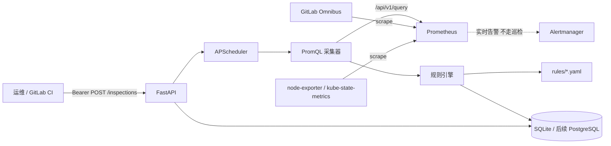

# 自动巡检方案：FastAPI + Prometheus（GitLab 运维语境）

## 1. 文档概述

### 解决什么问题

仓库里已经有两套「看一眼现在健不健康」的只读服务：

- [`python/fastapi-prometheus-status/`](../python/fastapi-prometheus-status/)：FastAPI 调 Prometheus `/api/v1/query`，判断 Kubernetes 节点、Service Endpoint，以及 Node Exporter 的负载 / 内存 / 磁盘。
- [`python/status-api/`](../python/status-api/)：标准库 HTTP 服务，直接读主机 `/proc`、Kubernetes API 和 TCP/HTTP 探针，**还没接 Prometheus**。

同时，[`监控/服务器与中间件巡检指标.md`](../监控/服务器与中间件巡检指标.md) 定义了单机巡检该看什么；[`监控/175.27.144.105-K3s监控流程与方案.md`](../监控/175.27.144.105-K3s监控流程与方案.md) 记录了现网 `kube-prometheus-stack`（Prometheus `v3.5.0`，Namespace `monitoring`，Alertmanager receiver 仍是 `null`）。GitLab 侧则是 Omnibus / Docker Compose 自建实例，[`gitlab-docker-compose-guide.md`](../CI-CD/gitlab-docker-compose-guide.md) 里甚至出现过 `prometheus_monitoring['enable'] = false` 这种省内存选项。

缺的是一层**周期性、可复盘、可触发、可存历史**的自动巡检：不是再做一个实时告警引擎，而是把「交班时要看的那一页」自动化。

### 适合哪些读者

- 已经在维护本仓库 GitLab / Kubernetes / Prometheus 笔记的运维或平台工程师
- 准备在 `fastapi-prometheus-status` 上加调度、规则和结果存储的开发

### 阅读后能获得什么

- 分清自动巡检和 Alertmanager 实时告警的边界
- 得到一份可落地的模块划分、规则 YAML、PromQL、API 和分阶段计划
- 知道该扩哪个现有工程，而不是另起一套无关系统

### 先讲结论

1. **在 `python/fastapi-prometheus-status/` 上扩展，不要新建第三个状态服务。** 现有 `PrometheusClient`、环境变量、状态枚举和阈值已经能当 MVP 骨架。
2. **巡检 = 周期快照 + 历史记录；告警 = 秒到分钟级 firing。** 175.27.144.105 上 Alertmanager 还没有有效通知出口，巡检可以先补「定时摘要」，但不能代替把 Alertmanager receiver 配通。
3. **规则用 Git 里的 YAML 声明，运行时只读 Prometheus。** 阈值、窗口、静默都写在规则文件里；缺指标记 `unknown`，不能当成健康。
4. **MVP 用进程内 APScheduler + SQLite。** 多副本或 Celery 放到增强阶段，否则同一套 cron 会打爆 Prometheus。

交互式架构图：[`diagrams/inspection-fastapi-prometheus.html`](diagrams/inspection-fastapi-prometheus.html)。一次任务的时序图：[`diagrams/inspection-job.html`](diagrams/inspection-job.html)。

### 1.1 目标

自动巡检在本方案中是：**按计划或手动触发，从 Prometheus 拉取一组声明式规则，产出带时间戳的健康快照，并保存以便回看。** 覆盖这些检查类型：

| 类型 | 回答的问题 | 本仓库已有依据 |
| --- | --- | --- |
| 周期性健康检查 | 节点 Ready、Service 有无 Endpoint、GitLab 关键进程是否还在被采集 | `fastapi-prometheus-status` 的 `node_checks` / `service_checks` |
| 指标阈值 | CPU 负载、内存 available、磁盘 / inode 是否越线 | [`服务器与中间件巡检指标.md`](../监控/服务器与中间件巡检指标.md) 第 3 节；现有 `80%/90%` 环境变量 |
| 容量 | 节点磁盘、PVC 可用比例 | Helm 监控文档里的 `kubelet_volume_stats_*` |
| 依赖可达 | `up`、Service Endpoint、后续 Blackbox `probe_success` | 现网 12 个 target 曾全部 `up`；status-api 已有 HTTP/TCP 探针 |
| SLO / 窗口聚合 | 最近 1h 的 5xx 比例、P99 | Helm 文档 checkout SLO 示例；**【需要确认】** 业务指标是否已暴露 |
| 证书 | TLS 最早到期时间 | kube-prometheus-stack **默认不带** Blackbox；**【需要确认】** 是否单独装过 |

### 1.2 非目标

- **不替代 Alertmanager。** PrometheusRule 的 `pending` / `firing` / 分组 / 抑制 / 恢复通知仍归现有监控栈。巡检不要以 30s 间隔复刻 [`Kubernetes-Helm-Prometheus-Grafana-Alertmanager完整部署与告警方案.md`](../监控/Kubernetes-Helm-Prometheus-Grafana-Alertmanager完整部署与告警方案.md) 第 10 节那组规则。
- **不替代真实业务请求。** 现有 README 已写明：Prometheus 最近一次抓取 ≠ Pod 日志、EndpointSlice、GitLab 页面真能打开。
- **不做写操作。** 不重启、不清理磁盘、不改 GitLab `gitlab.rb`、不改 Prometheus 抓取配置。
- **MVP 不接 Kubernetes API、不读 `/proc`。** 那是 `status-api` 的职责；巡检服务只以 Prometheus 为数据源。主机容器视角的限制见 status-api README 第 10 节。
- **不把 GitLab Omnibus 自带的 PostgreSQL / Redis 当巡检库。** 结果库必须独立，避免把生产 GitLab 数据卷和巡检历史绑在一起。

---

## 2. 前置条件

### 环境要求

| 角色 | 要求 |
| --- | --- |
| 运行巡检服务的进程 | 能访问 Prometheus HTTP API；Python 3.10+ |
| Prometheus | 已采集 kube-state-metrics、node-exporter；GitLab 指标见下表【需要确认】 |
| 调用方 | 能带 Bearer Token 调 FastAPI；GitLab CI 定时流水线或人工 `curl` 均可 |

### 软件及版本（按仓库已有记录推断）

| 组件 | 已记录版本 / 约定 | 说明 |
| --- | --- | --- |
| Prometheus | 现网 `v3.5.0`（175.27.144.105） | 集群内默认 `http://prometheus.monitoring.svc:9090` |
| kube-state-metrics | `v2.16.0` | 提供 `kube_node_*`、`kube_endpoint_*` |
| node-exporter | `v1.9.1` | 提供 `node_load1`、`node_memory_*`、`node_filesystem_*` |
| FastAPI / httpx / uvicorn | `fastapi>=0.115,<1`、`httpx>=0.27,<1`、`uvicorn[standard]>=0.30,<1` | 见 `python/fastapi-prometheus-status/requirements.txt` |
| GitLab | Omnibus CE Docker 镜像 | **【需要确认】** 具体版本、`external_url`、是否关闭了内置 Prometheus |
| 巡检结果库 | MVP 建议 SQLite | **【需要确认】** 是否已有独立 PostgreSQL 可复用 |

现有客户端超时默认 **5 秒**，Bearer Token 只走环境变量 `PROMETHEUS_TOKEN`，禁止写入仓库或日志。这条约束继续沿用。

### 必备基础知识

- 会写 PromQL instant query，知道 `vector` 和 `matrix` 的差别
- 读过 `fastapi-prometheus-status` 的 `PrometheusClient.query()` 和 `aggregate()`
- 了解 Alertmanager 负责通知、Prometheus 负责算规则

### 动手前必须确认

下面几项会直接改变规则文件和部署位置，写代码前先填：

| 项目 | 为什么必须先确认 | 现状 |
| --- | --- | --- |
| Prometheus 从哪里访问 | 集群内用 Service DNS；集群外要 Ingress / 端口转发 | 配置默认 `http://prometheus.monitoring.svc:9090` |
| GitLab 指标从哪套 Prometheus 来 | Omnibus 内置一份；K3s 上可能是另一份 | **【需要确认】** `prometheus_monitoring` 是否仍关闭 |
| 巡检进程跑在哪 | 决定能否解析 `*.svc`、能否用 SQLite 单副本 | **【需要确认】** |
| 通知渠道 | 现网 Alertmanager receiver = `null` | **【需要确认】** 飞书 / 钉钉 Webhook 是否已有 |
| 业务 SLO 指标名 | Helm 文档里的 `http_requests_total` 只是示例 | **【需要确认】** GitLab 或业务是否已暴露 |

---

## 3. 核心概念

### 3.1 自动巡检是什么

**自动巡检**是按 cron 或手动触发，对一组规则做一次「现在看起来怎样」的只读取样，并把每次取样存下来。它要回答的是交班问题：过去 N 小时磁盘有没有摸过 80%、GitLab Sidekiq 是否在积压、监控 target 是否掉过。

**实时告警**是 Prometheus 持续评估 `PrometheusRule`，状态进入 `firing` 后交给 Alertmanager 分组、抑制、静默并通知。它要回答的是值班问题：刚刚节点 NotReady 了，立刻叫人。

两者读同一份时序数据，但节奏、产物和失败语义不同：

```text
Prometheus 时序
    ├─ 持续评估 PrometheusRule ──▶ Alertmanager ──▶ 即时通知
    └─ 巡检服务按小时 / 天 query ──▶ InspectionJob + CheckResult ──▶ 摘要 / 回看
```

现网缺口正好说明为什么要拆开：Alertmanager 现在算得出告警，但 receiver 是 `null`，没人会收到。巡检即使只把结果写进 SQLite 并提供 `GET /api/v1/inspections/latest`，交班也有东西可看；但这不能当成「告警已经通了」。

### 3.2 状态枚举

继续用两套现有服务已经对齐的四个值，不要再发明 `ok` / `fail` / `warn`：

| 值 | 含义 | 典型来源 |
| --- | --- | --- |
| `healthy` | 已查到数据，且未越预警线 | 磁盘 70% 以下 |
| `degraded` | 越预警线，或出现 `unknown` 子项 | 磁盘 80%、查询部分失败 |
| `unhealthy` | 越紧急线，或核心对象不可用 | 节点 NotReady、磁盘 90%、Service 无 Endpoint |
| `unknown` | 没查到 series、超时、鉴权失败 | 现有代码的 `NO_NODE_METRICS` / `PROMETHEUS_QUERY_FAILED` |

聚合规则与 `fastapi-prometheus-status.app.main.aggregate` 保持一致：出现任意 `unhealthy` → 任务 `unhealthy`；否则出现 `degraded` 或 `unknown` → `degraded`；全 `healthy` 才是 `healthy`。

### 3.3 Instant query 与 range query

**Instant query**（`GET /api/v1/query`）问的是「此刻这个表达式的值」，返回 `vector`。现有 `PrometheusClient` 只实现了这一种，并拒绝非 `vector` 结果。

**Range query**（`GET /api/v1/query_range`）问的是「从 `start` 到 `end`、步长 `step` 的曲线」，返回 `matrix`。巡检用来算窗口：`max_over_time`、`increase`、SLO。

经验规则：

- 看当前状态（Ready、`up`、此刻磁盘%）→ instant
- 看「持续了多久 / 窗口内有没有越线」→ 把窗口写进 PromQL（`max_over_time(expr[15m])`）再 instant，往往比自己扫一遍 matrix 更省事
- 只有要画图或自己算分位、而 recording rule 又不存在时，才用 `query_range`

### 3.4 规则是数据，不是代码

现有 `node_checks()` / `host_checks()` 把 PromQL 和阈值写死在 Python 里。巡检要把它们抽成 YAML：改阈值走 Git，不发版改函数。Python 只保留比较算子、聚合和存储。

---

## 4. 总体架构

### 4.1 一张图看完

主路径：运维或 CI → FastAPI → 调度器 → 采集器 → Prometheus → 规则引擎 → 结果仓储。

旁边两条必须画出来的边界：

- GitLab Omnibus、node-exporter、kube-state-metrics **只被 Prometheus 抓取**，巡检服务不直接 scrape。
- Alertmanager 继续接 Prometheus 的实时告警；巡检的飞书 / 钉钉通知是可选旁路。

见 [`diagrams/inspection-fastapi-prometheus.html`](diagrams/inspection-fastapi-prometheus.html)。下面是同一张图的静态摘要：



一次任务的请求链见 [`diagrams/inspection-job.html`](diagrams/inspection-job.html)：先写 `InspectionJob` 再返回 `202`，PromQL 在后台跑完后写入 `CheckResult`。

### 4.2 核心模块

| 模块 | 建议文件 | 职责 | 不负责 |
| --- | --- | --- | --- |
| API | `app/main.py`（扩展现有路由） | 鉴权、触发、查询结果、规则只读/CRUD | 自己拼 PromQL |
| 调度器 | `app/scheduler.py` | 按 cron 调用「跑一轮规则」；与手动触发走同一入口 | 自己做阈值判断 |
| 采集器 | `app/prometheus.py`（扩展） | `query` / `query_range`、超时、Bearer、多数据源 | 解释业务含义 |
| 规则引擎 | `app/engine.py` | 加载 YAML、比较算子、严重级别、静默、聚合 | 发 HTTP、写磁盘以外的副作用 |
| 结果仓储 | `app/store.py` | `InspectionJob` / `CheckResult` 持久化 | 当时序库用 |
| 规则加载 | `app/rules_loader.py` | 读 `rules/*.yaml`，校验 schema | 热更新远程配置中心（增强阶段） |
| 通知（可选） | `app/notify.py` | 任务结束后发失败摘要 | 分组、抑制、静默（那是 Alertmanager） |
| 配置 | `app/config.py`（扩展） | Prometheus URL、超时、Token、库路径、时区 | 把规则阈值再配置一遍 |

建议新增的关键类型：

| 类型 | 职责 |
| --- | --- |
| `PrometheusClient` | 已有；补 `query_range()`，按 `datasource` 选 base URL |
| `DatasourceRegistry` | `name → url / token / timeout` |
| `Rule` | 内存中的一条声明式规则 |
| `RuleEngine.evaluate(rule, samples)` | 返回一条 `CheckResult` |
| `InspectionStore` | `create_job` / `save_results` / `latest` |
| `Scheduler` | 注册 cron，调用 `run_inspection(job_id)` |

### 4.3 建议目录结构

在现有工程上长，而不是平行再开一个包：

```text
python/fastapi-prometheus-status/
├── app/
│   ├── main.py              # 现有 /healthz /api/v1/status，新增巡检路由
│   ├── prometheus.py        # query + query_range
│   ├── config.py            # 现有阈值仍可作为规则缺省
│   ├── engine.py            # 新增
│   ├── models.py            # InspectionJob / CheckResult / Rule
│   ├── store.py             # 新增
│   ├── scheduler.py         # 新增
│   ├── rules_loader.py      # 新增
│   └── notify.py            # 增强阶段
├── rules/
│   ├── host.yaml            # 从现有 host_checks 抽
│   ├── kubernetes.yaml      # 从现有 node/service_checks 抽
│   └── gitlab.yaml          # 指标核对后再启用
├── tests/
└── README.md
```

设计文档留在本目录（`Gitlab/`），代码仍在父仓库的 `python/` 下。这与根 [`README.md`](../README.md) 把 GitLab 笔记放 `CI-CD/`、把该示例放 `python/fastapi-prometheus-status/` 的分类一致。

### 4.4 调度选型

| 方案 | 适用 | 优点 | 限制 |
| --- | --- | --- | --- |
| **进程内 APScheduler**（MVP） | 单副本 Deployment / 一台运维机 | 和 FastAPI 同进程，实现短 | 多副本会重复跑；进程重启可能漏一次 |
| **GitLab CI 定时流水线** `curl -X POST` | 已有自建 GitLab，想把触发也纳入审计 | 不占应用进程；流水线日志可留存 | 依赖 Runner 闲时；要处理 Token |
| 独立 cron / systemd timer | 服务跑在 VM | 运维面熟悉 | 和 CI 二选一，不要三个触发源并行 |
| Redis + 队列 | 规则很多、要限流 | 可并发控制 | MVP 过重 |

推荐组合：**APScheduler 做默认小时级巡检 + 保留手动 `POST /inspections`。** GitLab CI schedule 作为外部触发备份，两者都调用同一个 `run_inspection()`。不要再加一层队列，除非规则数明显超过 Prometheus 5 秒超时预算。

---

## 5. 实现步骤

每一步写清：做什么 / 为什么 / 预期结果。

### 步骤 1：先核对 Prometheus 里真有这些 series

**做什么：** 用现有 README 里的验证命令，对目标 Prometheus 跑 instant query。

```bash
# 【需要确认】把 PROMETHEUS_URL 换成实际可访问地址
curl -G "$PROMETHEUS_URL/api/v1/query" \
  --data-urlencode 'query=kube_node_status_condition{condition="Ready",status="true"}'
curl -G "$PROMETHEUS_URL/api/v1/query" \
  --data-urlencode 'query=node_load1'
curl -G "$PROMETHEUS_URL/api/v1/query" \
  --data-urlencode 'query=up'
```

**为什么：** 现有代码已经约定「没有数据 ≠ 健康」。规则文件不能建立在假设的指标名上。175.27.144.105 上次检查 12 个 target 为 `up`，但 Prometheus **没有 PVC**，重建后历史 range query 可能是空的。

**预期结果：** 每条规则对应的 query 能返回 `status=success` 且 `result` 非空；空结果的规则先标 `enabled: false`。

### 步骤 2：扩展 `PrometheusClient`，不要重写

**做什么：** 在 `app/prometheus.py` 保留现有 `query()`，增加 `query_range()`；按数据源复用 `httpx.AsyncClient` 超时和 Bearer 头。

```python
# 示意：只展示 query_range 与现有 query 的差别，不是完整可运行服务
async def query_range(self, promql: str, start: float, end: float, step: str) -> list[dict]:
    headers = {"Authorization": f"Bearer {self.token}"} if self.token else {}
    async with httpx.AsyncClient(timeout=self.timeout) as client:
        response = await client.get(
            f"{self.base_url}/api/v1/query_range",
            params={"query": promql, "start": start, "end": end, "step": step},
            headers=headers,
        )
        response.raise_for_status()
        payload = response.json()
    if payload.get("status") != "success":
        raise PrometheusError(str(payload.get("error", "query_range failed")))
    data = payload.get("data", {})
    if data.get("resultType") != "matrix":
        raise PrometheusError(f"expected matrix, got {data.get('resultType')!r}")
    return data.get("result", [])
```

**为什么：** 现有客户端已经处理了 HTTP 错误、`status != success`、错误的 `resultType`。巡检只要在同一套失败语义上加 range。

**预期结果：** instant 继续给 `/api/v1/status` 用；巡检规则通过 `query: instant | range` 字段选择接口。

### 步骤 3：把硬编码检查变成 YAML 规则

**做什么：** 把 `host_checks` / `node_checks` / `service_checks` 各变成 `rules/*.yaml` 里的一条或多条规则。阈值默认值继续读现有环境变量，规则文件可以覆盖。

**为什么：** 巡检规则会膨胀；改磁盘挂载点、GitLab job 名、Namespace 不该改 Python。

**预期结果：** 关闭 Python 里的硬编码 PromQL 后，`GET /api/v1/status` 与 `POST /inspections` 读同一份规则，结果口径一致。

### 步骤 4：加上 Job 存储和调度

**做什么：** SQLite 表存 `InspectionJob` / `CheckResult`；APScheduler 注册 `0 * * * *`（**【需要确认】** 实际周期）。手动触发和定时触发都先 `create_job` 再跑引擎。

**为什么：** 没有历史就不是巡检，只是又一次即时 `/status`。先落库是为了进程崩溃后仍能看到「这次开始了但没跑完」。

**预期结果：** `GET /api/v1/inspections/latest` 能看到最近一次任务的每条规则、取值、状态和 PromQL（可对排障开放，对外部调用方按需脱敏）。

### 步骤 5：接到现有 GitLab / 监控环境

**做什么：**

1. 若巡检跑在 K3s `monitoring` Namespace：`PROMETHEUS_URL=http://prometheus.monitoring.svc:9090`，单副本。
2. 若跑在 GitLab 那台 Docker 宿主机：**【需要确认】** 如何打到集群 Prometheus（Ingress / SSH 隧道 / 把 GitLab exporter 抓进同一套 Prometheus）。
3. GitLab CI 增加 nightly `curl -X POST`，Token 放 CI Variable，不要写进 `.gitlab-ci.yml`。

**为什么：** 仓库同时存在「K3s 监控栈」和「Omnibus GitLab」两套东西，巡检服务必须明确自己连哪一个 Prometheus，或在规则里写 `datasource`。

**预期结果：** 一次任务能同时给出 host / kubernetes /（启用后的）gitlab 三组 `CheckResult`，并在文档里写清每条规则对应哪套数据源。

---

## 6. 巡检规则模型

### 6.1 声明格式

规则文件用 YAML（和现有 `PrometheusRule`、GitLab CI 习惯一致）。JSON 仅作为 API 的读写投影。

```yaml
# rules/host.yaml
apiVersion: inspection.hermes/v1
kind: InspectionRuleGroup
metadata:
  name: host
  datasource: k3s                 # 对应配置里的 PROMETHEUS_URL
spec:
  interval: "1h"                  # 可被全局 cron 覆盖
  rules:
    - id: host.memory.usage
      summary: 节点内存使用率
      query:
        type: instant
        promql: |
          100 * (1 - node_memory_MemAvailable_bytes / node_memory_MemTotal_bytes)
      compare:
        op: ">="                  # >, >=, <, <=, ==, !=
        warn: 80                  # 与 MEMORY_WARN_PERCENT 对齐
        critical: 90
      severity:
        warn: degraded
        critical: unhealthy
      for_window: 5m              # 可选：改写成 max_over_time(expr[5m])
      labels:
        team: platform
        surface: host
      silence:
        # 计划内维护；也可用 API 写入独立 Silence 表
        until: null
        comment: ""
      enabled: true
      missing_as: unknown         # 禁止写成 healthy
```

字段含义：

| 字段 | 含义 |
| --- | --- |
| `id` | 稳定主键，结果表和静默都用它，不靠文件名 |
| `query.type` | `instant` 或 `range` |
| `query.promql` | 完整 PromQL；label 选择写在表达式里，不在引擎里拼接未转义字符串 |
| `compare.op` | 用返回值与 `warn` / `critical` 比较。现有 `level()` 等价于 `>=` |
| `for_window` | 引擎把它包成 `max_over_time((promql)[window])`，避免调用方自己写错 |
| `silence` | 规则级静默；命中则结果记 `skipped`，任务仍算完成 |
| `missing_as` | 默认 `unknown` |

静默还有一条对象级路径（增强阶段）：`Silence(matchers, starts_at, ends_at, comment)`，匹配 `rule_id` / `instance` / `namespace`。语义对齐 Alertmanager silence，但**只影响巡检结果，不影响真实告警**。

### 6.2 比较与多 series

一条 PromQL 常返回多个 series（每节点一条）。引擎必须**按 series 拆成多条 `CheckResult`**，用 `metric` 标签（`instance` / `node` / `mountpoint`）区分。这与现有 `host_checks` 对每个 `instance` 生成 `memory:{instance}` 的行为一致。

磁盘还要过滤挂载点：现有 `DISK_MOUNTPOINTS=/`。规则里写成：

```yaml
promql: |
  100 * (1 - node_filesystem_avail_bytes{mountpoint="/",fstype!~"tmpfs|overlay"}
          / node_filesystem_size_bytes{mountpoint="/",fstype!~"tmpfs|overlay"})
```

不要在引擎里用 Python 再滤一遍未声明的 label，以免和 PromQL 选择器不一致。

---

## 7. Prometheus 集成细节

### 7.1 调用约定

| 项 | MVP 约定 | 依据 |
| --- | --- | --- |
| Instant | `GET {base}/api/v1/query?query=` | 现有 `PrometheusClient.query` |
| Range | `GET {base}/api/v1/query_range?query=&start=&end=&step=` | 本方案新增 |
| 超时 | 默认 5s，规则多时按数据源可调到 10s | `PROMETHEUS_TIMEOUT_SECONDS` |
| 鉴权 | 可选 `Authorization: Bearer $PROMETHEUS_TOKEN` | 现有实现；空则不加头 |
| 并发 | 同一次 Job 内 `asyncio.gather`，**上限 4～8** | 现有 `/status` 已 gather 三组查询；规则变多后必须加信号量 |
| 时间 | 结果里的 `observed_at` 用 UTC `Z`，展示层转 `Asia/Shanghai` | 现有 `observed_at()`；GitLab Omnibus 时区已是上海 |

失败一律变成该条 `CheckResult.status=unknown` 且 `reason=PROMETHEUS_QUERY_FAILED`，任务继续跑其余规则。不要因为一条 PromQL 超时让整次巡检 500。

### 7.2 多数据源

```dotenv
# 扩展后的 .env 示意，不要提交真实 Token
PROMETHEUS_URL=http://prometheus.monitoring.svc:9090
PROMETHEUS_TOKEN=
PROMETHEUS_TIMEOUT_SECONDS=5

# 可选第二数据源：GitLab Omnibus 内置 Prometheus
# 【需要确认】地址、端口、是否启用
PROMETHEUS_GITLAB_URL=http://127.0.0.1:9090
PROMETHEUS_GITLAB_TOKEN=
```

规则用 `metadata.datasource: k3s | gitlab` 选择。引擎禁止接受请求参数里的任意 URL，沿用 status-api 的约束：探针 / 数据源只能来自服务端配置。

### 7.3 Label 选择

- Kubernetes：优先 `namespace`、`node`、`service`。现有 `service_selector()` 已对用户输入做 `re.escape`，规则 YAML 里的选择器由人审查，不要再从 query string 拼 raw selector。
- 主机：`instance`、`mountpoint`、`device`。
- GitLab：**【需要确认】** 实际 job 名（`gitlab-rails` / `gitlab-exporter` / `gitaly` 等随版本变化）。
- 现网业务接入时，ServiceMonitor 必须带 `release: kps`，否则当前 Prometheus 根本看不见。

### 7.4 结合仓库的示例 PromQL

下列前两块来自已有代码或已有 Helm 规则，可直接进 MVP。GitLab 块必须先在目标实例验证。

**主机（对齐巡检指标文档 + 现有 host_checks）**

```promql
# 每核 1 分钟负载。现有代码是 node_load1 / CPU 核数，再和 1.0 / 2.0 比
node_load1 / count by (instance) (node_cpu_seconds_total{mode="idle"})

# 内存使用率（1 - available/total）。预警 80，紧急 90
100 * (1 - node_memory_MemAvailable_bytes / node_memory_MemTotal_bytes)

# 根盘使用率。务必带 mountpoint，文档写过「磁盘 80%」不够定位
100 * (1 - node_filesystem_avail_bytes{mountpoint="/"}
        / node_filesystem_size_bytes{mountpoint="/"})

# inode（巡检清单第 2 节必查，现有 FastAPI 服务还没做）
100 * (1 - node_filesystem_files_free{mountpoint="/"}
        / node_filesystem_files{mountpoint="/"})
```

**Kubernetes（对齐现有 node/service_checks 与 Helm 自定义规则）**

```promql
kube_node_status_condition{condition="Ready",status="true"}
kube_node_spec_unschedulable
kube_endpoint_address_available
kube_node_status_condition{condition="Ready",status="true"} == 0
kubelet_volume_stats_available_bytes / kubelet_volume_stats_capacity_bytes < 0.15
max_over_time(kube_pod_container_status_waiting_reason{reason="CrashLoopBackOff"}[5m]) >= 1
100 * (count by (job) (up == 0) / count by (job) (up)) > 10
```

**GitLab / 基础设施（先验证再启用）**

```promql
# 采集目标是否还在。job 名【需要确认】
up{job=~"gitlab.*|gitaly|gitlab-exporter"}

# Omnibus 内置 nginx / workhorse 请求错误率思路；指标名【需要确认】
sum(rate(gitlab_workhorse_http_requests_total{code=~"5.."}[15m]))
  / sum(rate(gitlab_workhorse_http_requests_total[15m]))

# Sidekiq 队列积压。指标名【需要确认】
sidekiq_queue_size

# 证书：需要 Blackbox。kube-prometheus-stack 默认未装
probe_ssl_earliest_cert_expiry{instance="https://gitlab.example.com"} - time()
```

GitLab Omnibus 若按 compose 指南关掉了 `prometheus_monitoring`，上述 series 不会存在。这时应二选一，不要假装规则在工作：

1. 重新打开 GitLab 内置 Prometheus / gitlab-exporter，并把它加进 K3s Prometheus 的 scrape（或巡检多数据源直连）；
2. 只用 node-exporter 巡检 GitLab **宿主机** 的 CPU / 内存 / 磁盘 / 监听端口对应的 `up`，页面可用性另走 status-api 的 HTTP 探针。

---

## 8. FastAPI 接口草案

鉴权对齐 `status-api`：`/healthz` 无 Token；其余接口 `Authorization: Bearer $INSPECTION_API_TOKEN`。Token 为空时受保护接口返回 401。不要复用 Prometheus Token。

现有路由保留，避免已经在用 `/api/v1/status` 的调用方断掉。

| 方法 | 路径 | 作用 |
| --- | --- | --- |
| `GET` | `/healthz` | 进程存活，不查 Prometheus |
| `GET` | `/api/v1/status` | 现有即时快照（规则化后与巡检同源） |
| `GET` | `/api/v1/kubernetes/nodes` | 保留 |
| `GET` | `/api/v1/kubernetes/services` | 保留 |
| `GET` | `/api/v1/host` | 保留 |
| `POST` | `/api/v1/inspections` | 触发一轮巡检，返回 `202` + `job_id` |
| `GET` | `/api/v1/inspections` | 最近 N 次任务列表 |
| `GET` | `/api/v1/inspections/latest` | 最近一次完成的任务 + 全部 CheckResult |
| `GET` | `/api/v1/inspections/{job_id}` | 指定任务 |
| `GET` | `/api/v1/rules` | 当前生效规则（只读，MVP） |
| `POST` | `/api/v1/rules` | 增强阶段：写入前仍建议落 Git |
| `PUT` | `/api/v1/rules/{id}` | 增强阶段 |
| `DELETE` | `/api/v1/rules/{id}` | 增强阶段，仅禁用，不物理删历史结果 |
| `GET` | `/api/v1/silences` | 增强阶段 |
| `POST` | `/api/v1/silences` | 增强阶段 |

`POST /api/v1/inspections` 请求体：

```json
{
  "group": "host",
  "rule_ids": ["host.memory.usage"],
  "reason": "manual-handoff"
}
```

`group` / `rule_ids` 都可空，空表示跑全部 `enabled: true` 且未静默的规则。不要接收 `promql` 字段，避免把接口变成开放 PromQL 代理。

`GET /api/v1/inspections/latest` 响应骨架：

```json
{
  "schema_version": "v1",
  "job": {
    "id": "01J...",
    "status": "degraded",
    "trigger": "schedule",
    "started_at": "2026-09-16T02:00:00Z",
    "finished_at": "2026-09-16T02:00:04Z",
    "prometheus_url": "http://prometheus.monitoring.svc:9090"
  },
  "results": [
    {
      "rule_id": "host.memory.usage",
      "status": "healthy",
      "value": 41.2,
      "labels": {"instance": "10.0.0.8:9100"},
      "observed_at": "2026-09-16T02:00:03Z"
    }
  ]
}
```

`prometheus_url` 只回数据源名字或已配置的 base URL，禁止回 Token。

---

## 9. 数据模型

三张核心表足够 MVP。ID 建议 ULID / UUID，便于和日志关联。

### InspectionJob

一次触发（定时或手动）一行。

| 字段 | 类型 | 说明 |
| --- | --- | --- |
| `id` | str | 主键 |
| `trigger` | `schedule` / `manual` / `ci` | 谁发起的 |
| `status` | `running` / `healthy` / `degraded` / `unhealthy` / `failed` | `failed` 表示引擎自身崩溃，不是业务 unhealthy |
| `group` | str \| null | 可选范围 |
| `started_at` | datetime | UTC |
| `finished_at` | datetime \| null | 未完成则为空 |
| `rule_count` | int | 计划执行的规则数 |
| `error` | str \| null | 仅任务级错误 |

### CheckResult

一条规则 × 一个 series 一行。

| 字段 | 类型 | 说明 |
| --- | --- | --- |
| `id` | str | 主键 |
| `job_id` | str | 外键 |
| `rule_id` | str | 对应 YAML `id` |
| `status` | `healthy` / `degraded` / `unhealthy` / `unknown` / `skipped` | `skipped` = 静默 |
| `value` | float \| null | 比较用的标量；range 规则存聚合后的值 |
| `warn` / `critical` | float \| null | 当时生效的阈值，避免以后改规则无法复盘 |
| `labels` | JSON | Prometheus metric labels |
| `reason` | str \| null | 如 `PROMETHEUS_QUERY_FAILED`、`NO_NODE_METRICS` |
| `observed_at` | datetime | 取样时间 |
| `datasource` | str | `k3s` / `gitlab` |

### Rule

MVP 以 YAML 为源，启动时加载到内存；表结构留给增强阶段的 CRUD。

| 字段 | 类型 | 说明 |
| --- | --- | --- |
| `id` | str | 与 YAML 相同 |
| `group` | str | `host` / `kubernetes` / `gitlab` |
| `promql` | str | 原文 |
| `query_type` | `instant` / `range` | |
| `op` | str | 比较算子 |
| `warn` / `critical` | float | |
| `enabled` | bool | |
| `datasource` | str | |
| `checksum` | str | 文件哈希，结果可追溯到哪一版规则 |

关系：`Rule` 1 → N `CheckResult`；`InspectionJob` 1 → N `CheckResult`。不要把 PromQL 原文只存在结果里却不记 checksum，否则 Git 回滚后无法解释旧报告。

---

## 10. 运行与部署

### 10.1 进程模型

```text
uvicorn app.main:app --host 0.0.0.0 --port 8080
        ├─ FastAPI 路由
        └─ 同一进程里的 APScheduler
              └─ 每小时 run_inspection()
SQLite 文件：/var/lib/inspection/inspection.db   【需要确认】挂载路径
```

约束：

- **单副本。** SQLite + 进程内调度在多副本下会双写、双打 Prometheus。
- 现有启动方式不变：`python -m app` 或 `uvicorn app.main:app`，`.env` 由 `python-dotenv` 读取，环境变量优先。
- 健康检查用 `/healthz`，不要用 `/api/v1/status`（后者会打 Prometheus）。

### 10.2 配置项

在现有 `.env.example` 上追加，不删旧键：

| 变量 | 默认 | 说明 |
| --- | --- | --- |
| 现有 `PROMETHEUS_*` / `K8S_*` / `DISK_*` / `LOAD_*` / `MEMORY_*` | 见现文件 | 继续作为规则缺省 |
| `INSPECTION_API_TOKEN` | 空 | 巡检 API Bearer；空则写接口 401 |
| `INSPECTION_CRON` | `0 * * * *` | **【需要确认】** |
| `INSPECTION_DB_URL` | `sqlite+aiosqlite:///./inspection.db` | |
| `INSPECTION_RULES_DIR` | `./rules` | |
| `INSPECTION_MAX_CONCURRENCY` | `4` | 同时进行的 PromQL 数 |
| `INSPECTION_TZ` | `Asia/Shanghai` | 仅影响 cron 解释；存储仍用 UTC |
| `NOTIFY_WEBHOOK_URL` | 空 | 增强阶段；空则只落库 |

### 10.3 和现有环境怎么对接

| 环境 | 怎么接 | 注意 |
| --- | --- | --- |
| 175.27.144.105 K3s `monitoring` | 巡检 Deployment 放同一 Namespace，Service 指 Prometheus `:9090` | Prometheus 无 PVC，range 回看出窗后可能空；单节点宕机时巡检和被监控对象一起死，外部存活探测仍要另做 |
| GitLab Omnibus Compose | 规则 `datasource: gitlab` 指向内置 `:9090`，或先把 exporter 抓进 K3s Prometheus | 若 `prometheus_monitoring['enable']=false`，先恢复可观测性再写 GitLab 规则 |
| GitLab CI | `schedule` 流水线 `curl -H "Authorization: Bearer $INSPECTION_API_TOKEN" -X POST .../inspections` | Runner 要能访问巡检 API；Token 放 CI Variable |
| HTTPS 入口 | 若要把 API 暴露给浏览器或多机，按本目录 [`mkcert-本机HTTPS与多端信任部署指南.md`](mkcert-本机HTTPS与多端信任部署指南.md) 做内网证书 | 生产对不认识的调用方不要用 mkcert |

GitOps 发布若走 Argo CD，巡检 Deployment 的 `ServiceMonitor` 必须带 `release: kps`，否则现网 Prometheus 不会抓巡检服务自己的 `/metrics`（服务自监控是增强项，不是 MVP）。

---

## 11. 完整示例：一次 host + kubernetes 小时巡检

下面这一组可以直接作为 MVP 的 `rules/kubernetes.yaml` + `rules/host.yaml` 合并样例。阈值来自现有环境和巡检指标文档，不是拍脑袋。

```yaml
apiVersion: inspection.hermes/v1
kind: InspectionRuleGroup
metadata:
  name: platform-mvp
  datasource: k3s
spec:
  rules:
    - id: k8s.node.ready
      summary: 节点 Ready
      query:
        type: instant
        promql: 'kube_node_status_condition{condition="Ready",status="true"}'
      compare: { op: "==", warn: 1, critical: 1 }
      # 值不等于 1 即为 unhealthy。引擎对 == 且 critical=1 按「必须等于」处理
      severity: { warn: unhealthy, critical: unhealthy }
      missing_as: unknown

    - id: k8s.service.endpoints
      summary: Service 可用 Endpoint
      query:
        type: instant
        promql: kube_endpoint_address_available
      compare: { op: ">", warn: 0, critical: 0 }
      severity: { warn: unhealthy, critical: unhealthy }

    - id: host.load.per_cpu
      summary: 每核 1 分钟负载
      query:
        type: instant
        promql: |
          node_load1 / count by (instance) (node_cpu_seconds_total{mode="idle"})
      compare: { op: ">=", warn: 1.0, critical: 2.0 }

    - id: host.memory.usage
      summary: 内存使用率
      query:
        type: instant
        promql: |
          100 * (1 - node_memory_MemAvailable_bytes / node_memory_MemTotal_bytes)
      compare: { op: ">=", warn: 80, critical: 90 }

    - id: host.disk.root
      summary: 根盘使用率
      query:
        type: instant
        promql: |
          100 * (1 - node_filesystem_avail_bytes{mountpoint="/"}
                  / node_filesystem_size_bytes{mountpoint="/"})
      compare: { op: ">=", warn: 80, critical: 90 }

    - id: mon.targets.down
      summary: 采集目标掉线比例
      query:
        type: instant
        promql: |
          100 * (count by (job) (up == 0) / count by (job) (up))
      compare: { op: ">", warn: 0, critical: 10 }
```

触发与回看：

```bash
export INSPECTION_API_TOKEN='local-dev-token-123456'
curl -sS -X POST \
  -H "Authorization: Bearer $INSPECTION_API_TOKEN" \
  -H 'Content-Type: application/json' \
  -d '{"reason":"manual-handoff"}' \
  http://127.0.0.1:8080/api/v1/inspections

curl -sS -H "Authorization: Bearer $INSPECTION_API_TOKEN" \
  http://127.0.0.1:8080/api/v1/inspections/latest
```

预期：返回 `job.status` 为四态之一；每条规则都有 `value` 或 `reason`；Prometheus 超时的那条是 `unknown`，不会把整次任务吞掉。

---

## 12. 分阶段落地

### MVP（先能交班）

1. 扩展 `PrometheusClient`（超时、Token、错误语义不动）。
2. 落地 `rules/host.yaml` + `rules/kubernetes.yaml`，覆盖现有三个检查函数。
3. SQLite + `POST/GET /inspections*` + `/healthz`。
4. 单进程 APScheduler，默认每小时一次。
5. 保留旧 `/api/v1/status`，改为读同一份规则。
6. 不接通知、不做规则 CRUD、不写 GitLab 规则。

验收：在能访问 Prometheus 的环境跑通步骤 1 的 curl，再 `POST /inspections`，库里有 Job 和 Result；人为停掉 Prometheus 后再次巡检，结果为 `unknown` / 任务 `degraded`，而不是假 healthy。

### 增强

1. `query_range` / `for_window`；inode、PVC、CrashLoop 规则。
2. 多数据源；GitLab 规则在指标核对后启用。
3. Silence API；飞书 / 钉钉失败摘要（现网 Alertmanager 仍建议同时配 receiver）。
4. 规则只读 API；写接口若做，也要能导出回 YAML。
5. 并发信号量、慢查询日志（只记 rule_id 和耗时，不记 Token）。

### 完善

1. PostgreSQL、多副本 API（调度改为外部 CI/cron，避免双跑）。
2. Blackbox 证书与外部存活探测（解决单节点监控和业务一起挂的问题）。
3. 与 PrometheusRule 对照表：同一条件只在一边不在两边各算一遍。
4. 巡检服务自己的 `/metrics` + `ServiceMonitor`（`release: kps`）。
5. OpenAPI、JWT/OIDC（status-api 已把静态 Token 列为生产限制）。

---

## 13. 常见问题与排查

**现象：任务全是 `unknown`，reason=`NO_*_METRICS`。**  
可能原因：连错 Prometheus、ServiceMonitor 没有 `release: kps`、GitLab 内置监控被关掉、kube-state-metrics 版本标签不同（现有 README 已提醒 `kube_endpoint_address_available`）。  
解决：先在 Prometheus UI 跑同一条 PromQL；空 series 就禁用规则，不要改 `missing_as: healthy`。

**现象：巡检把 Prometheus 打慢，Grafana 也超时。**  
可能原因：`asyncio.gather` 无上限、用了高基数 `query_range`、和 Alertmanager 规则评估撞在一起。  
解决：把 `INSPECTION_MAX_CONCURRENCY` 降到 4；窗口计算优先 `max_over_time` instant；错峰到整点后的第 5 分钟；超贵的聚合做成 Prometheus recording rule，巡检只读 recording 结果。

**现象：磁盘告警对不上现场。**  
可能原因：PromQL 没限制 `mountpoint` / `fstype`，把 overlay、tmpfs 算进来。  
解决：按巡检指标文档写成「`/` 使用率 80%」，并与 `DISK_MOUNTPOINTS` 对齐。

**现象：两份通知，一份巡检一份 Alertmanager。**  
可能原因：同一 PromQL 两边都配了，且都接了飞书。  
解决：实时继续只走 Alertmanager；巡检通知只发「任务级摘要」或只在没有 Alertmanager 出口时启用。

**现象：多副本 Deployment 后每小时出现两次 Job。**  
可能原因：每副本各跑一个 APScheduler。  
解决：副本数改回 1，或把 cron 挪到 GitLab CI / 外部 timer。

---

## 14. 注意事项与最佳实践

- **Prometheus 负载：** 现网是单副本、无 PVC 的 Prometheus。巡检是额外查询客户端，规则要从「交班真正看的指标」长，而不是把 35 组默认 `PrometheusRule` 翻译一遍。
- **误报：** 缺数据、标签变更、维护窗口是三大来源。强制 `unknown`、规则级静默、结果里固化当时阈值。
- **规则膨胀：** 新规则必须带 `id`、`summary`、`datasource` 和「在 Prometheus 验证过」的记录；评审看 PromQL 基数，不看条数 KPI。
- **安全：** Token 不进 Git、不进访问日志（status-api 已关掉 Authorization 日志）。接口不接受调用方传入 PromQL 或任意探测 URL。
- **和 9.11 报告的关系：** 巡检指标文档写过 node20 磁盘 80% 必须补挂载点、inode、增长目录。自动巡检能覆盖挂载点和 inode；增长目录仍要人看，不要假装 PromQL 能代替 `du`。

---

## 15. 总结

自动巡检在本仓库里的落点很具体：把已经能工作的 FastAPI + Prometheus 只读查询，升级成「定时跑、规则可声明、结果可回看」的交班工具。它读的是同一套 kube-state-metrics / node-exporter /（确认后的）GitLab 指标，写的是独立的 Job/Result，不抢 Alertmanager 的实时职责。

下一步建议按这个顺序做，而不是先写完整业务代码：

1. 填写第 2 节表格：Prometheus 访问地址、GitLab 监控是否开启、进程跑在哪、通知渠道。
2. 在目标 Prometheus 里逐条验证第 7.4 节 MVP PromQL。
3. 按第 4.3 节在 `python/fastapi-prometheus-status/` 里加 `engine` / `store` / `scheduler` 和 `rules/*.yaml`。
4. 用第 11 节的 `POST /inspections` 做第一次人工交班，再打开小时 cron。
5. Alertmanager receiver 仍然要单独配通；巡检摘要补的是回看，不是值班呼叫。
