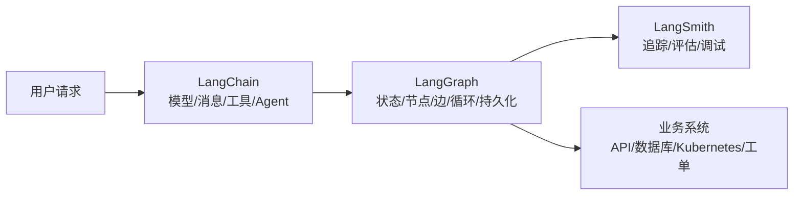
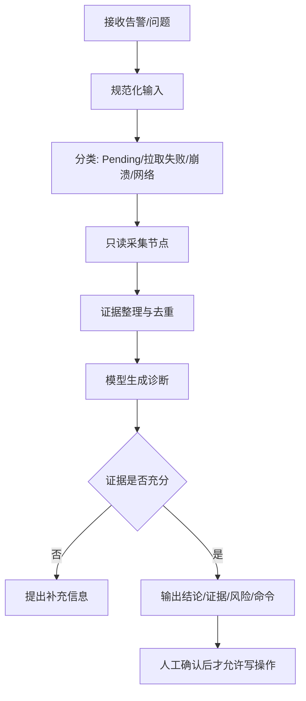

# LangChain 与 LangGraph 从入门到实战学习指南

> 适用对象：会一点 Python，希望把大语言模型接入业务、运维、知识库或自动化流程的开发者。
>
> 文档基线：LangChain v1、LangGraph v1、Python 3.10+（2026-09-07 核对官方文档）。示例以 Python 为主；模型供应商、模型名称、向量数据库和部署方式需要按实际环境替换。
>
> 学习目标：先能独立调用模型和工具，再能用 LangGraph 把多步骤流程做成可观测、可恢复、可人工介入的应用。

## 1. 先记住三句话

1. **LangChain 是应用层框架**：提供模型、消息、工具、结构化输出、Agent、检索等常用抽象和集成。
2. **LangGraph 是编排运行时**：把状态、节点、边和循环组合起来，适合需要分支、重试、持久化、流式输出或人工审批的流程。
3. **LangChain v1 的 `create_agent` 底层使用 LangGraph**：可以先用高层 Agent 快速验证，再在需要精确控制时下沉到 `StateGraph`。LangGraph v1 已将旧的 `langgraph.prebuilt.create_react_agent` 标记为弃用，新的学习代码不要再把它作为主入口。

可以把两者理解成下面的关系：



## 2. 什么时候用哪个

| 需求 | 适合的起点 | 原因 |
|---|---|---|
| 一次模型调用、提示词模板、结构化 JSON | LangChain Model/Runnable | 代码少，便于测试 |
| 模型自主选择若干工具完成任务 | LangChain `create_agent` | 已提供模型-工具循环 |
| 固定的“分类 → 查询 → 生成”流程 | LangGraph `StateGraph` | 节点和顺序明确，结果容易验收 |
| 需要循环、条件分支、失败重试 | LangGraph | 路由和状态转移可显式表达 |
| 长时间运行、断点恢复、人工审批 | LangGraph + checkpointer + interrupt | 运行状态可以按 thread 保存 |
| 想查看每次模型调用、工具参数、耗时 | LangSmith | 追踪和评估独立于业务代码 |

不要一开始就把所有逻辑写成 Agent。固定流程优先用普通函数或图；只有决策不确定、工具选择需要模型参与时，才使用 Agent。

## 3. 前置知识和环境准备

### 3.1 建议先掌握

- Python 函数、装饰器、类型注解、异常处理、虚拟环境。
- HTTP API、JSON、环境变量和基本日志。
- LLM 的消息角色：`system`、`user`、`assistant`、`tool`。
- 基本的检索、向量和数据库概念（学习 RAG 时需要）。
- 如果用于运维场景，还要理解权限、超时、幂等、审计和回滚。

### 3.2 创建独立项目

```bash
mkdir langchain-langgraph-lab
cd langchain-langgraph-lab

python3.10 -m venv .venv
source .venv/bin/activate
python -m pip install -U pip
python -m pip install -U \
  "langchain>=1.0,<2" \
  "langgraph>=1.0,<2" \
  langchain-openai \
  langchain-text-splitters \
  python-dotenv
```

LangChain 和 LangGraph 的核心包不等于模型供应商包。使用 OpenAI 需要 `langchain-openai`；使用 Anthropic、Google 等供应商时，应安装对应的 `langchain-anthropic`、`langchain-google-genai` 等独立包。

### 3.3 环境变量

```bash
cat > .env.example <<'EOF'
OPENAI_API_KEY=replace-me
OPENAI_MODEL=replace-with-a-model-available-in-your-account
LANGCHAIN_TRACING_V2=false
LANGCHAIN_API_KEY=replace-me-if-using-langsmith
LANGCHAIN_PROJECT=langchain-langgraph-lab
EOF

cp .env.example .env
```

安全边界：

- `.env` 不要提交到 Git，不要写入笔记、日志或交接文档。
- 生产环境从 Secret、密钥管理系统或工作负载身份读取凭据。
- 模型调用会发送输入内容；涉及工单、日志、客户信息时，先做脱敏和数据分级。
- 模型返回的工具参数不是可信输入，工具内部仍要做权限校验、参数校验和审计。

## 4. LangChain 核心概念

### 4.1 Model、Message、Prompt

Model 接受消息并返回消息。不要把模型当成普通字符串函数；消息类型、工具调用和结构化输出都属于接口的一部分。

```python
# 01_model.py
import os

from dotenv import load_dotenv
from langchain_openai import ChatOpenAI

load_dotenv()

model = ChatOpenAI(
    model=os.environ["OPENAI_MODEL"],
    temperature=0,
    timeout=30,
    max_retries=2,
)

response = model.invoke([
    ("system", "你是一个严谨的技术助理。"),
    ("user", "用三句话解释什么是 Kubernetes Service。"),
])

print(response.content)
```

固定提示词建议使用 `ChatPromptTemplate`，把变量和模板分开：

```python
from langchain_core.output_parsers import StrOutputParser
from langchain_core.prompts import ChatPromptTemplate

prompt = ChatPromptTemplate.from_messages([
    ("system", "你是 {role}，回答必须引用输入中的事实。"),
    ("human", "问题：{question}"),
])

chain = prompt | model | StrOutputParser()
answer = chain.invoke({
    "role": "Kubernetes 运维工程师",
    "question": "Pod 一直 Pending 时先检查什么？",
})
print(answer)
```

`|` 是 Runnable 组合。每一段都有输入和输出，适合单元测试和替换；复杂流程不要把一整段逻辑塞进一个超长 Prompt。

### 4.2 Tool：让模型调用真实能力

工具是有明确输入、输出和副作用边界的 Python 函数。函数 docstring 会帮助模型理解工具用途，但不能代替参数校验和权限控制。

```python
from langchain.tools import tool


@tool
def calculate_error_rate(errors: int, total: int) -> float:
    """Calculate an error rate as a decimal between 0 and 1."""
    if total <= 0:
        raise ValueError("total must be greater than zero")
    if errors < 0 or errors > total:
        raise ValueError("errors must be between 0 and total")
    return errors / total
```

工具设计建议：

- 输入字段少而明确，优先用 `int`、`float`、`Literal`、Pydantic schema。
- 读操作和写操作分开命名，例如 `get_deployment` 与 `restart_deployment`。
- 写操作必须有幂等键、超时、权限校验和审计记录。
- 返回稳定、短小、可解析的结果，不要把整段日志无上限塞回上下文。
- 对外部系统失败返回可判断的错误信息，必要时在工具内重试，而不是让模型无限重试。

### 4.3 Agent：模型-工具循环

LangChain v1 推荐使用 `create_agent`：

```python
# 02_agent.py
import os

from dotenv import load_dotenv
from langchain.agents import create_agent
from langchain_openai import ChatOpenAI

from tools import calculate_error_rate

load_dotenv()
model = ChatOpenAI(model=os.environ["OPENAI_MODEL"], temperature=0)

agent = create_agent(
    model=model,
    tools=[calculate_error_rate],
    system_prompt="你是 SRE 助理。计算问题必须调用工具，不要心算后伪造工具结果。",
    name="sre_assistant",
)

result = agent.invoke({
    "messages": [{
        "role": "user",
        "content": "今天有 3 个错误请求，总请求数是 120，计算错误率。",
    }]
})

for message in result["messages"]:
    print(type(message).__name__, message.content)
```

Agent 的典型循环是：

```text
用户消息 → 模型判断 → 需要工具？
                    ├─ 否：返回最终答案
                    └─ 是：调用工具 → 工具结果回到模型 → 再判断
```

必须设置停止条件：最大迭代次数、总超时、单工具超时和预算上限。不要因为“模型通常会停”就省略这些限制。

### 4.4 结构化输出

需要进入数据库、工单或前端的结果，不要只解析自然语言。可以使用 Pydantic schema：

```python
from pydantic import BaseModel, Field


class IncidentSummary(BaseModel):
    severity: str = Field(description="P1/P2/P3/P4")
    service: str
    probable_cause: str
    next_actions: list[str]


structured_model = model.with_structured_output(IncidentSummary)
summary = structured_model.invoke(
    "支付 API 在 5 分钟内出现大量 502，请给出结构化摘要。"
)
print(summary.model_dump())
```

Agent 也可以直接指定 `response_format=IncidentSummary`，结果通常从 `result["structured_response"]` 读取。供应商支持原生结构化输出时优先使用；不支持时，LangChain 会使用工具调用策略，但仍要处理校验失败和缺字段情况。

## 5. LangGraph 核心概念

LangGraph 的核心只有三类东西：

| 概念 | 作用 | 设计问题 |
|---|---|---|
| State | 所有节点共享的当前状态 | 哪些数据必须跨步骤保留？ |
| Node | 读取状态并返回状态更新的函数 | 这个步骤做一个明确动作了吗？ |
| Edge | 决定下一个节点 | 是固定流转还是条件路由？ |

节点应该返回“状态更新”，不要原地修改传入的状态。图必须 `compile()` 后才能 `invoke()` 或 `stream()`。

### 5.1 最小图

```python
# 03_graph_minimal.py
from langgraph.graph import END, START, StateGraph
from typing_extensions import TypedDict


class State(TypedDict):
    question: str
    answer: str


def answer_node(state: State) -> dict:
    return {"answer": f"收到问题：{state['question']}"}


builder = StateGraph(State)
builder.add_node("answer", answer_node)
builder.add_edge(START, "answer")
builder.add_edge("answer", END)
graph = builder.compile()

print(graph.invoke({"question": "什么是 LangGraph？", "answer": ""}))
```

### 5.2 消息状态和条件边

处理对话时，可以直接使用内置的 `MessagesState`。下面的例子先分类，再走不同分支：

```python
from langgraph.graph import END, START, MessagesState, StateGraph


class TicketState(MessagesState):
    category: str
    answer: str


def classify(state: TicketState) -> dict:
    text = state["messages"][-1].content
    category = "ops" if "Pod" in text or "服务" in text else "general"
    return {"category": category}


def ops_answer(state: TicketState) -> dict:
    return {"answer": "请先检查 Pod 事件、容器日志和 Service EndpointSlice。"}


def general_answer(state: TicketState) -> dict:
    return {"answer": "这是一个通用问题，请补充更多上下文。"}


def route(state: TicketState) -> str:
    return state["category"]


builder = StateGraph(TicketState)
builder.add_node("classify", classify)
builder.add_node("ops", ops_answer)
builder.add_node("general", general_answer)
builder.add_edge(START, "classify")
builder.add_conditional_edges(
    "classify",
    route,
    {"ops": "ops", "general": "general"},
)
builder.add_edge("ops", END)
builder.add_edge("general", END)
graph = builder.compile()
```

真实项目中，`classify` 可以调用模型，但路由值最好限制在 `Literal["ops", "general"]`，不要让模型自由生成节点名。

### 5.3 Reducer：如何合并状态更新

默认情况下，同一个 key 的新值会覆盖旧值。需要追加列表时，显式声明 reducer：

```python
from operator import add
from typing import Annotated
from typing_extensions import TypedDict


class State(TypedDict):
    notes: Annotated[list[str], add]


def step_a(state: State):
    return {"notes": ["step-a completed"]}


def step_b(state: State):
    return {"notes": ["step-b completed"]}
```

常见错误是忘记 reducer，导致并行节点互相覆盖；另一个错误是对大对象无界追加，最终造成上下文超限或数据库膨胀。

### 5.4 用图实现 Agent 循环

需要控制模型调用和工具执行时，可以直接使用 `ToolNode`：

```python
from langchain_openai import ChatOpenAI
from langchain.tools import tool
from langgraph.graph import END, START, MessagesState, StateGraph
from langgraph.prebuilt import ToolNode, tools_condition


@tool
def multiply(a: int, b: int) -> int:
    """Multiply two integers."""
    return a * b


model_with_tools = ChatOpenAI(model=os.environ["OPENAI_MODEL"], temperature=0).bind_tools([multiply])


def call_model(state: MessagesState):
    response = model_with_tools.invoke(state["messages"])
    return {"messages": [response]}


builder = StateGraph(MessagesState)
builder.add_node("call_model", call_model)
builder.add_node("tools", ToolNode([multiply]))
builder.add_edge(START, "call_model")
builder.add_conditional_edges("call_model", tools_condition)
builder.add_edge("tools", "call_model")
agent_graph = builder.compile()

result = agent_graph.invoke({
    "messages": [{"role": "user", "content": "计算 6 乘以 7。"}]
})
```

这个例子展示了 Agent 的本质：模型节点决定是否发出 tool call，`ToolNode` 执行工具，工具结果再回到模型节点。它比 `create_agent` 更底层，但可以插入审批、重试、分支和自定义状态。

## 6. 持久化、记忆和人工介入

### 6.1 Checkpointer 与 thread

LangGraph 的短期记忆属于 thread 状态。编译时传入 checkpointer 后，每一步可以保存 checkpoint：

```python
from langgraph.checkpoint.memory import InMemorySaver

checkpointer = InMemorySaver()
graph = builder.compile(checkpointer=checkpointer)
config = {"configurable": {"thread_id": "ticket-1001"}}

graph.invoke(
    {"messages": [{"role": "user", "content": "记住我负责支付服务。"}]},
    config=config,
)

snapshot = graph.get_state(config)
print(snapshot.values)
```

`InMemorySaver` 适合学习和测试，不适合多副本生产服务。生产环境要按官方文档选择持久化后端，并规划 thread 生命周期、数据保留、加密、备份、清理和并发锁。

### 6.2 长期记忆与短期记忆

- **短期记忆**：一个对话或任务 thread 内的消息和中间状态。
- **长期记忆**：跨 thread 保存的用户偏好、业务知识或历史事实，通常通过 Store 或业务数据库实现。

不要把所有历史消息无限追加到短期状态。应使用摘要、裁剪、检索或外部存储，并保留数据来源和更新时间。

### 6.3 Human-in-the-loop

高风险动作（删除资源、扩容生产、发送邮件、执行 SQL）应在工具真正执行前暂停，等待人工确认：

```python
from langgraph.checkpoint.memory import InMemorySaver
from langgraph.types import Command, interrupt


def review_action(state):
    decision = interrupt({
        "kind": "approval",
        "action": state["action"],
        "message": "请确认是否执行该动作",
    })
    return {"approved": bool(decision.get("approved"))}


# 继续运行时使用同一个 thread_id：
# graph.invoke(Command(resume={"approved": True}), config=config)
```

暂停前要把待审批内容做成可审计摘要：目标资源、参数、发起人、原因、风险、预计影响、过期时间。恢复时再次检查权限和资源版本，不能只相信旧的审批结果。

## 7. 流式输出和可观测性

### 7.1 Graph 流式输出

```python
for update in graph.stream(
    {"messages": [{"role": "user", "content": "检查支付服务"}]},
    stream_mode="updates",
):
    print(update)
```

常见模式：

- `updates`：按节点输出状态更新，适合调试流程。
- `values`：输出每一步的完整状态，信息更全但体积更大。
- `messages`：适合逐 token 或消息级 UI 展示；具体事件格式以当前版本文档为准。

### 7.2 LangSmith

LangSmith 可以记录模型调用、工具调用、节点路径、输入输出、耗时和错误。建议在开发阶段开启 tracing，在测试中用固定数据集做回归评估，生产环境配置采样、脱敏和访问权限。

```bash
export LANGCHAIN_TRACING_V2=true
export LANGCHAIN_API_KEY=replace-me
export LANGCHAIN_PROJECT=langchain-langgraph-lab
```

追踪不是安全措施。日志中可能包含用户问题、工具参数和返回数据，仍然要按敏感数据策略脱敏。

## 8. RAG：把知识库接入 LangChain

RAG（Retrieval-Augmented Generation）通常分为：加载文档 → 切分 → 向量化 → 检索 → 把证据交给模型生成。先理解这条链，再考虑 Agent 是否需要自主决定检索工具。

### 8.1 最小检索示例

```python
from langchain_core.documents import Document
from langchain_core.vectorstores import InMemoryVectorStore
from langchain_openai import OpenAIEmbeddings
from langchain_text_splitters import RecursiveCharacterTextSplitter

documents = [
    Document(page_content="Pending 常见原因包括资源不足、节点选择器不匹配和 PVC 未绑定。"),
    Document(page_content="ImagePullBackOff 需要检查镜像名、仓库连通性和 imagePullSecrets。"),
]

splitter = RecursiveCharacterTextSplitter(chunk_size=300, chunk_overlap=50)
chunks = splitter.split_documents(documents)

embeddings = OpenAIEmbeddings(model="text-embedding-3-small")
vector_store = InMemoryVectorStore(embeddings)
vector_store.add_documents(chunks)
retriever = vector_store.as_retriever(search_kwargs={"k": 3})

question = "Pod 为什么会 Pending？"
hits = retriever.invoke(question)
context = "\n".join(doc.page_content for doc in hits)

answer = (prompt | model).invoke({
    "role": "Kubernetes 知识库助手",
    "question": f"只根据以下证据回答：\n{context}\n\n问题：{question}",
})
print(answer.content)
```

`InMemoryVectorStore` 只适合实验。生产环境要选择向量数据库或已有数据库扩展，并明确索引更新、删除、租户隔离、权限过滤、召回评估和版本回滚。

### 8.2 RAG 验收不能只看“回答像不像”

至少准备一组带标准答案和来源的测试问题，检查：

- 是否召回正确文档和正确版本。
- 回答中的关键结论是否能指向来源。
- 没有证据时是否明确说“不知道”而不是编造。
- 权限不同的用户是否得到不同的文档范围。
- 文档更新后，旧内容是否按策略失效。

## 9. 一个适合运维学习的实战项目

建议做“只读 Kubernetes 故障分析助手”，不要一开始就让它自动重启生产 Pod。

### 9.1 目标

输入 Namespace、Deployment 或告警摘要，系统完成：

1. 识别故障类型。
2. 读取只读诊断数据（Pod 状态、Events、日志摘要、Service/EndpointSlice）。
3. 生成带证据的判断、风险和下一步命令。
4. 对高风险动作只生成建议，不直接执行。

### 9.2 图设计



### 9.3 建议的状态

```python
class DiagnosisState(TypedDict):
    question: str
    namespace: str
    workload: str
    category: str
    evidence: list[dict]
    diagnosis: dict
    next_actions: list[str]
    approval_required: bool
```

### 9.4 节点边界

| 节点 | 输入 | 输出 | 不能做的事 |
|---|---|---|---|
| `normalize` | 用户问题 | 标准化资源名 | 不执行集群请求 |
| `classify` | 标准化问题 | 有限分类值 | 不生成任意节点名 |
| `collect` | 分类和资源 | 只读证据 | 不删除、重启、扩容 |
| `diagnose` | 证据 | 结构化判断 | 不把猜测写成事实 |
| `review` | 判断和风险 | 审批状态 | 不绕过人工审批 |
| `render` | 全部状态 | 中文报告和命令 | 不暴露 Token、Cookie、Secret |

### 9.5 报告格式

```text
结论：

已确认事实：

基于证据的判断：

尚未验证的可能性：

建议的最小只读命令：

如果需要变更：
  - 变更对象：
  - 影响范围：
  - 回滚方式：
  - 需要谁确认：
```

这个项目能同时练习 LangChain 的工具、结构化输出和 LangGraph 的状态、分支、持久化与人工审批，也符合运维场景的安全边界。

## 10. 测试、可靠性和生产边界

### 10.1 分层测试

| 层级 | 测试内容 | 是否需要真实模型 |
|---|---|---|
| 单元测试 | 工具参数校验、路由函数、状态 reducer | 否 |
| 图测试 | 给定输入时节点顺序和最终状态 | 否，可用 mock model |
| 契约测试 | 结构化输出 schema、工具返回格式 | 可选 |
| 回归评估 | 真实问题、事实正确率、引用覆盖率 | 通常需要 |
| 集成测试 | Kubernetes/数据库/工单 API | 测试环境需要 |
| 灾备测试 | checkpoint 恢复、重复执行、超时 | 需要持久化后端 |

### 10.2 必须设置的限制

- 模型请求超时和最大重试次数。
- 图最大步数或 `recursion_limit`，防止循环失控。
- 工具级超时、并发限制、速率限制和预算上限。
- 外部写操作的 RBAC、审批、幂等和审计。
- 输入长度、检索文档数量和消息历史上限。
- 敏感数据脱敏、日志保留和访问控制。

### 10.3 不要把这些现象当成成功

- HTTP 200 不等于模型回答正确。
- Agent 返回最终消息不等于工具动作已成功落地。
- 图 `invoke()` 完成不等于外部系统状态已改变。
- 检索命中不等于证据相关，更不等于答案有引用。
- LangSmith 有 trace 不等于已经完成业务验收。

验收必须沿实际请求、工具执行、外部系统响应、状态落点和审计记录逐层确认。

## 11. 常见错误与排查

### 11.1 `ModuleNotFoundError`

检查虚拟环境和包归属：

```bash
which python
python -m pip show langchain langgraph langchain-openai
python -c 'import langchain, langgraph; print(langchain.__version__, langgraph.__version__)'
```

不要只安装 `langchain` 就假设所有供应商、向量库和文档加载器都已安装。

### 11.2 API Key 或模型错误

- 确认 `.env` 已通过 `load_dotenv()` 加载。
- 确认模型名称在当前供应商账户可用。
- 确认 Base URL、区域和组织配置。
- 不要把完整错误中的 Token 复制进工单或笔记。

### 11.3 Agent 无限循环或工具反复调用

检查：

- 工具结果是否足够明确，模型是否知道何时停止。
- 是否给 Agent 设置最大迭代次数和总超时。
- 工具失败是否被当作“继续重试”的普通文本。
- 图的条件边是否存在回到自身的路径。
- 是否应该把 Agent 改成固定的 LangGraph 流程。

### 11.4 LangGraph 状态丢失

- 是否给同一会话使用了稳定的 `thread_id`。
- 是否在 `compile(checkpointer=...)` 时传入 checkpointer。
- 是否误用了新的 thread_id，或在多副本间使用了进程内 `InMemorySaver`。
- 节点是否返回更新而不是原地修改状态。
- 列表是否需要 `Annotated[..., reducer]`。

### 11.5 旧教程 API 不兼容

看到 `langgraph.prebuilt.create_react_agent`、旧的 `langchain.chains` 或过时导入时，先查对应版本迁移文档。当前主线是 LangChain v1 的 `create_agent` 和 LangGraph v1 的 Graph API；不要只为让旧示例运行而锁死一套无法维护的旧依赖。

## 12. 六周学习路线

### 第 1 周：模型与消息

- 完成模型单次调用、PromptTemplate、Runnable 管道。
- 练习温度、超时、重试、token 预算和错误处理。
- 写 10 个固定输入的回归测试。

### 第 2 周：工具与 Agent

- 用 `@tool` 写计算器、文档查询和只读 API 工具。
- 用 `create_agent` 完成一个问答 Agent。
- 为工具增加 schema、权限和错误返回。

### 第 3 周：结构化输出与 RAG

- 用 Pydantic 输出告警分类和故障摘要。
- 完成文档切分、向量检索、证据引用。
- 建立 20 条带标准答案的问题集。

### 第 4 周：LangGraph 基础

- 手写 `StateGraph`、节点、固定边和条件边。
- 理解 reducer、循环、最大步数和流式输出。
- 把第 2 周 Agent 改造成可观测的图。

### 第 5 周：持久化与人工审批

- 使用 `InMemorySaver` 理解 thread 和 checkpoint。
- 实现一次人工确认后继续执行的流程。
- 再换成持久化数据库后端做恢复测试。

### 第 6 周：运维实战与评估

- 完成只读 Kubernetes 故障分析助手。
- 接入 LangSmith 或其他追踪系统。
- 做错误注入：API 超时、工具异常、模型格式错误、进程重启。
- 输出一份包含准确率、延迟、成本、失败率和安全边界的验收报告。

## 13. 练习题和完成标准

### 基础题

1. 写一个 `@tool`，把 Celsius 转成 Fahrenheit，并拒绝非数字输入。
2. 写一个结构化输出模型，提取告警级别、服务名和时间窗口。
3. 写一个两节点图：`normalize → render`。

完成标准：代码可重复运行，异常有明确错误，不依赖手工复制模型输出。

### 进阶题

1. 实现 `classify → collect → diagnose` 三节点图。
2. 对 `collect` 增加超时和重试；重试超过上限后进入 `fallback` 节点。
3. 为图增加 `thread_id`，验证进程重启后能恢复状态。
4. 对写操作增加 `interrupt`，验证未审批时不会调用写工具。

完成标准：能画出节点路径，能展示一次成功、一次工具失败和一次人工拒绝的 trace。

### 项目题

输入一条脱敏的 Kubernetes 告警，输出带“事实、判断、未验证可能性、最小命令集、风险”的中文诊断报告。

完成标准：

- 只读工具没有写权限。
- 关键结论都能定位到证据。
- 没有证据时明确标注未知。
- 工具失败不会导致模型伪造成功。
- 可用固定测试集回归，且结果和成本可度量。

## 14. 速查表

| 任务 | 入口 |
|---|---|
| 单次模型调用 | `model.invoke(messages)` |
| Prompt + 模型 | `prompt \| model \| parser` |
| 定义工具 | `@tool` |
| 高层 Agent | `create_agent(model, tools=[...])` |
| 结构化输出 | `model.with_structured_output(Schema)` 或 Agent `response_format` |
| 定义图 | `StateGraph(State)` |
| 节点 | `builder.add_node(name, fn)` |
| 固定边 | `builder.add_edge(source, target)` |
| 条件边 | `builder.add_conditional_edges(...)` |
| 编译 | `graph = builder.compile(...)` |
| 执行 | `graph.invoke(input, config=config)` |
| 流式 | `graph.stream(input, stream_mode="updates")` |
| 记忆 | `compile(checkpointer=...)` + `thread_id` |
| 人工介入 | `interrupt(...)` + `Command(resume=...)` |
| 工具节点 | `ToolNode(tools)` |

## 15. 官方资料

- [LangChain 安装](https://docs.langchain.com/oss/python/langchain/install)
- [LangChain v1 更新说明](https://docs.langchain.com/oss/python/releases/langchain-v1)
- [LangChain Agents](https://docs.langchain.com/oss/python/langchain/agents)
- [LangChain Tools](https://docs.langchain.com/oss/python/langchain/tools)
- [LangChain Structured Output](https://docs.langchain.com/oss/python/langchain/structured-output)
- [LangGraph 概览](https://docs.langchain.com/oss/python/langgraph/overview)
- [LangGraph Graph API](https://docs.langchain.com/oss/python/langgraph/graph-api)
- [LangGraph Graph API 使用指南](https://docs.langchain.com/oss/python/langgraph/use-graph-api)
- [LangGraph 持久化](https://docs.langchain.com/oss/python/langgraph/persistence)
- [LangGraph Interrupts / 人工介入](https://docs.langchain.com/oss/python/langgraph/interrupts)
- [LangGraph Streaming](https://docs.langchain.com/oss/python/langgraph/streaming)
- [LangGraph Thinking in LangGraph](https://docs.langchain.com/oss/python/langgraph/thinking-in-langgraph)
- [LangGraph v1 更新说明](https://docs.langchain.com/oss/python/releases/langgraph-v1)

> 版本提醒：官方 API、供应商模型名、集成包和云端部署能力会变化。升级依赖后，先阅读对应版本的 release notes 和 migration guide，再运行项目测试；本笔记中的示例是学习骨架，不代表任何具体生产环境已经验证。
