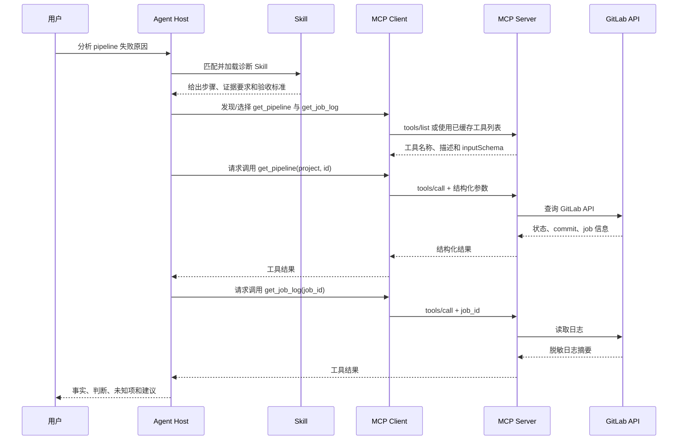

# Skill、Tool 与 MCP：概念关系、使用方法和适用场景

## 1. 先给结论

在 AI Agent 系统里，可以用三句话区分三个概念：

- **Skill** 负责说明“遇到什么任务、按什么步骤完成、如何判断结果合格”。它是可复用的工作流说明和知识资源。
- **Tool** 负责真正执行一个动作，例如查询接口、读取文件、运行命令、创建工单或发送请求。它是模型可以调用的能力接口。
- **MCP（Model Context Protocol）** 负责规定“模型客户端如何发现并调用外部能力”。它是连接 AI 与外部工具、数据和提示模板的协议，不是某一个具体工具。

三者的关系可以写成：

```text
用户目标
   ↓
Skill：选择流程、规定步骤和验收标准
   ↓
Tool：执行查询、计算或变更动作
   ↓
MCP：在客户端与外部 MCP Server 之间发现并传输工具调用
   ↓
外部系统：Git、数据库、Kubernetes、工单、文件或业务 API
```

MCP 是 Tool 的一种标准化提供方式；Tool 不一定通过 MCP 提供。Skill 可以使用 Tool，也可以只依靠内置知识、脚本、模板和参考文件完成，不一定需要 MCP。

## 2. 为什么要把它们分开

如果把三个词混为一谈，通常会出现三类问题：

1. 把一份操作规范写成“工具”，结果模型知道步骤，却没有权限或接口执行。
2. 把一个 API 接口写成“Skill”，结果缺少触发条件、调用顺序、异常处理和验收标准。
3. 把 MCP 当成某个产品或某个服务器，忽略了 MCP Server 内部仍然要实现认证、授权、参数校验、限流和业务逻辑。

分层后，问题更容易定位：

| 层次 | 核心问题 | 典型产物 | 失败时优先检查 |
|---|---|---|---|
| Skill | 应该怎么做 | `SKILL.md`、模板、参考资料、脚本 | 触发条件、步骤、边界、验收标准 |
| Tool | 能执行什么 | 函数、命令、HTTP 操作、查询接口 | 名称、描述、参数 Schema、权限、返回值 |
| MCP | 怎样连接与发现 | MCP Client、MCP Server、传输层 | 握手、工具列表、会话、认证、传输错误 |
| 外部系统 | 实际状态是什么 | GitLab、数据库、Kubernetes、文件系统 | 服务状态、业务权限、数据新鲜度、审计记录 |

## 3. Skill 是什么

Skill 是面向模型的**可复用工作流包**。它通常包含一个 `SKILL.md`，也可以带脚本、模板、参考文档和示例资源。Skill 的重点不是提供一个 API，而是把经验固化为可重复执行的流程。

一个合格的 Skill 至少应该说明：

- 什么用户目标或关键词会触发它；
- 需要哪些前置条件和权限；
- 工作步骤和调用顺序；
- 哪些动作是只读，哪些动作会修改外部系统；
- 失败、超时、空结果和权限不足时怎么处理；
- 怎样验证结果，哪些状态仍然属于“尚未验证”；
- 最终输出需要包含哪些字段、证据和风险。

### 3.1 Skill 的最小结构

```text
my-skill/
├── SKILL.md              # 必需：触发条件、步骤、边界和输出要求
├── references/           # 可选：规范、字段说明、排障资料
├── scripts/              # 可选：可重复运行的辅助脚本
├── templates/            # 可选：报告、工单或配置模板
└── examples/             # 可选：输入、输出和反例
```

`SKILL.md` 可以采用下面的骨架：

```markdown
---
name: kubernetes-readonly-diagnosis
description: 诊断 Kubernetes 工作负载异常，只读采集状态、事件和日志，并输出证据链
---

# 何时使用
- 用户要求分析 Pod Pending、CrashLoopBackOff 或 Service 不通

# 前置条件
- 已确认当前 kubeconfig/context
- 只允许读取 Namespace、Pod、Event、Service 和日志

# 工作步骤
1. 确认集群、Namespace 和目标对象
2. 读取对象状态和最近事件
3. 读取容器日志和相关 Service/EndpointSlice
4. 区分已确认事实、判断和未验证可能性

# 验收标准
- 每个结论都有命令输出或工具返回值支持
- 没有把 Pod Running 当作业务请求成功
- 没有执行写操作
```

### 3.2 Skill 如何生效

客户端通常先读取 Skill 的元数据，例如名称和描述；当用户请求与描述匹配，或者用户显式调用该 Skill 时，客户端再加载完整说明。具体命令和目录由宿主产品决定，不能把某一客户端的 `/skill`、`$skill` 或目录约定当成通用标准。

Skill 的触发描述应该写成用户目标和触发条件，而不是堆砌产品名。例如：

```yaml
# 好的描述
name: gitlab-pipeline-diagnosis
description: 分析 GitLab CI 流水线失败，关联 commit、job、Runner 日志和镜像构建阶段

# 不够好的描述
description: GitLab 工具
```

官方 OpenAI 插件文档把 Skill 定义为包含指令和资源的文件夹，并说明它可以独立工作，也可以指导模型组合 MCP 工具完成完整工作流。[OpenAI Skills 文档](https://developers.openai.com/plugins/concepts/skills)

## 4. Tool 是什么

Tool 是模型可以请求宿主程序执行的**单个能力接口**。它通常由以下信息组成：

- `name`：稳定、唯一、可读的名称；
- `description`：说明用途、输入含义、限制和副作用；
- `inputSchema`：参数类型、必填字段、枚举值和约束；
- 执行器：真正调用函数、命令、HTTP API 或数据库；
- 返回结果：结构化数据、错误码、日志或资源引用；
- 安全策略：是否只读、是否需要确认、允许访问的范围。

可以把 Tool 理解为一个带有清晰契约的函数：

```python
# 伪代码：工具的契约，不代表某个具体 SDK
get_pipeline_status(
    project: str,
    pipeline_id: int,
) -> {
    "status": "success | failed | running | unknown",
    "commit": "...",
    "jobs": [...],
}
```

模型并不是直接“拥有”这个函数。更准确的过程是：模型产生一个结构化工具调用请求，宿主程序验证参数并执行，执行结果再返回给模型，由模型继续解释或决定下一步。

### 4.1 Tool 的常见类型

| 类型 | 例子 | 特点 |
|---|---|---|
| 内置工具 | Web 搜索、代码解释器、文件读取、图像处理 | 由宿主产品提供，调用方式由产品决定 |
| 本地自定义工具 | Python 函数、Shell 包装器、内部 SDK | 适合本机或内网系统，需要自行控制权限 |
| HTTP/API 工具 | `GET /pipelines/{id}`、Prometheus 查询 | 易于复用，必须处理认证、超时和版本 |
| MCP Tool | MCP Server 暴露的 `search_issues`、`get_pods` | 遵循 MCP 的发现和调用协议，可被多个客户端复用 |
| 人工审批工具 | 提交发布、删除资源、发送通知 | 工具本身应明确高风险副作用和审批边界 |

### 4.2 Tool 描述为什么重要

模型主要依据工具名称、描述和参数 Schema 选择工具。工具定义不清会造成误调用：

```json
{
  "name": "get_pipeline_logs",
  "description": "只读获取指定项目和流水线的 job 日志摘要；不重试流水线、不修改变量、不触发部署",
  "inputSchema": {
    "type": "object",
    "properties": {
      "project": {"type": "string", "description": "项目路径，例如 group/app"},
      "pipeline_id": {"type": "integer", "minimum": 1},
      "job_name": {"type": "string"}
    },
    "required": ["project", "pipeline_id"]
  }
}
```

描述里应直接写清楚：数据范围、时间范围、是否有副作用、空结果含义、失败重试规则和敏感字段处理方式。不要把 Token、Cookie、私钥或完整认证头放进描述、示例或日志。

## 5. MCP 是什么

MCP 是一种开放协议，用于让 AI 应用以统一方式连接外部数据、工具和提示模板。它解决的是“客户端怎样发现服务端能力、怎样传递调用参数和结果”的互操作问题。

MCP 通常包含三个角色：

| 角色 | 职责 | 类比 |
|---|---|---|
| MCP Host | 承载模型和用户会话的应用，例如 Agent 客户端 | 电脑主机 |
| MCP Client | Host 内部的协议客户端，连接一个 MCP Server | 外设控制器 |
| MCP Server | 暴露工具、资源和提示模板，连接真实系统 | 外设或服务适配器 |

一个 Host 可以连接多个 MCP Server；一个 MCP Server 也可以被不同的 Host 使用。MCP Server 内部可以调用 REST API、数据库驱动、kubectl、Git 命令或其他 SDK，MCP 只规定外部协议边界，不规定内部实现语言。

### 5.1 MCP Server 可提供什么

| 能力 | 作用 | 例子 |
|---|---|---|
| Tools | 执行动作或查询 | `list_issues`、`query_prometheus`、`create_ticket` |
| Resources | 提供可读取的数据或文档 | `docs://runbook/network`、配置快照、报告文件 |
| Prompts | 提供可复用的提示模板 | 代码审查、事故复盘、周报模板 |

实际产品可能只支持其中一部分能力；使用前应看目标 Host 和 Server 的兼容说明。

### 5.2 传输方式

常见连接方式包括：

- **stdio**：客户端启动 MCP Server 子进程，通过标准输入输出通信，适合本机工具和开发环境；
- **Streamable HTTP**：通过 HTTP 连接远程 Server，适合共享服务和部署在服务器上的集成；
- **HTTP/SSE**：一些客户端或旧实现仍支持的 HTTP 流式方式，是否可用取决于具体实现。

不要只因为某个示例使用 `npx`、`uvx` 或某个配置字段，就推断所有客户端都支持相同命令。配置名、认证方式和审批界面由 Host 决定。

## 6. 三者的关系

### 6.1 一句话关系

```text
Skill = 工作流说明
Tool = 可执行动作
MCP = 连接和发现外部 Tool 的协议
```

### 6.2 组合关系

```text
┌──────────────────────────────┐
│ Plugin / 集成包（可选）       │
│                              │
│  Skill：步骤、规则、模板       │
│       ↓ 指导如何组合能力       │
│  MCP Server：协议服务          │
│       ├── Tool：查询/动作      │
│       ├── Resource：资料       │
│       └── Prompt：模板         │
└──────────────────────────────┘
                 ↓
      Host 中的模型和 MCP Client
                 ↓
          外部系统和实时数据
```

官方插件架构把 Plugin 视为可安装的打包层：它可以包含 Skill、MCP Server，也可以只包含其中之一；Skill 负责工作流，MCP Server 负责连接工具和外部系统。[Plugin architecture](https://developers.openai.com/plugins/concepts/plugins)

### 6.3 它们不是同义词

| 说法 | 是否准确 | 原因 |
|---|---|---|
| “MCP 就是 Tool” | 不准确 | MCP 是协议；Tool 是协议中的一种能力对象 |
| “Skill 就是 Prompt” | 不完整 | Skill 还可以包含脚本、模板、参考资料和验收规则 |
| “有了 MCP 就不需要 Skill” | 不准确 | MCP 只提供能力，不自动决定正确的工作流 |
| “所有 Tool 都是 MCP Tool” | 不准确 | 内置工具、函数调用和本地命令可以不经过 MCP |
| “Plugin 就是 MCP Server” | 不准确 | Plugin 是打包和分发层，可以同时包含 Skill、MCP Server 和其他资源 |

## 7. 一次调用到底发生了什么

下面用“分析 GitLab 流水线失败”说明完整过程：



关键点是：Skill 决定先查什么、后查什么和怎样下结论；Tool 执行每一个具体动作；MCP 让 Host 能以统一协议发现和调用这些动作。

## 8. 具体怎么使用

### 8.1 只使用 Skill：固定流程、无需实时外部数据

适用于写作规范、代码检查清单、报告模板、故障分析方法等场景。

```text
用户：按照团队模板写一份 Kubernetes 事故复盘

Skill 提供：
1. 复盘章节顺序
2. 事实/判断/未知的分栏规则
3. 时间线和证据字段
4. 脱敏要求
5. 输出 Markdown 模板

不需要 MCP Tool：因为用户已提供数据，或任务只需要规则和模板。
```

### 8.2 使用普通 Tool：本地函数或宿主内置能力

适用于本地文件、代码解析、计算、已有 SDK 或受控命令。

```python
# 伪代码：宿主注册一个只读工具
@tool(
    name="read_markdown_file",
    description="只读读取指定工作区内的 Markdown 文件，不访问工作区之外的路径"
)
def read_markdown_file(path: str) -> str:
    validate_workspace_path(path)
    return Path(path).read_text(encoding="utf-8")
```

使用时通常是：

```text
1. Host 把工具名称、描述和 Schema 提供给模型
2. 模型生成结构化调用参数
3. Host 校验路径和权限
4. 执行函数并捕获异常
5. 把结果或错误返回给模型
6. 模型根据结果继续回答
```

### 8.3 使用 MCP：连接外部系统

适用于多个客户端共用一套集成、工具需要独立部署、外部数据实时变化，或需要把认证和业务适配集中在一个 Server 中。

通用配置思路如下，字段仅作示意，实际配置以目标 Host 文档为准：

```json
{
  "mcpServers": {
    "gitlab": {
      "transport": "stdio",
      "command": "python",
      "args": ["/opt/mcp-servers/gitlab_server.py"],
      "env": {
        "GITLAB_BASE_URL": "https://gitlab.example.com"
      }
    }
  }
}
```

远程 Server 的概念配置可能类似：

```json
{
  "mcpServers": {
    "prometheus": {
      "transport": "streamable-http",
      "url": "https://mcp.example.com/prometheus/mcp"
    }
  }
}
```

典型使用步骤：

1. 明确 MCP Server 的用途、数据范围、认证方式和副作用。
2. 在 Host 中配置 Server 连接；敏感凭据使用 Secret、环境变量或宿主的凭据管理，不写进文档和聊天内容。
3. 启动或连接 Server，确认握手和工具列表成功。
4. 查看工具描述和参数 Schema，确认是否只读、是否需要人工批准。
5. 用最小查询验证返回值、超时、空结果和错误映射。
6. 再让 Skill 编排多步流程，并保留调用证据和最终验收结果。

### 8.4 在 Codex 这类 Agent 宿主中的实际使用

在实际宿主里，用户通常不需要手写每一次 Tool 调用。典型过程是：

```text
1. 安装或启用 Skill、Plugin 或 MCP Server
2. 宿主读取 Skill 元数据，并把可用 Tool 注册到当前会话
3. 用户描述目标，例如“只读分析最近一次流水线失败原因”
4. 模型匹配 Skill，按 Skill 规定的顺序选择 Tool
5. 宿主执行 Tool；高风险动作可能暂停并要求审批
6. 模型根据结果继续调用、停止或输出未知项
```

当前 Codex 环境中的具体 Skill 名称、可调用 Tool 名称、插件安装方式和审批界面由宿主配置决定。不要把本机显示的某个工具名、某个插件目录或某个显式调用前缀复制到另一种 Agent 中；迁移时应重新确认 Skill 入口、Tool Schema、MCP Server 连接和权限策略。

如果只是想让模型遵循一套本地流程，可以只安装 Skill；如果需要访问 GitLab、数据库或 Kubernetes 的实时数据，再启用相应 Tool 或 MCP Server；如果需要把两者打包给团队复用，再使用 Plugin 作为分发边界。

### 8.5 使用 OpenAI Responses API 的 MCP Tool

如果是自己开发基于 Responses API 的 Agent，可以把远程 MCP Server 声明到 `tools` 中。官方文档说明，API 会尝试获取远程 Server 的工具列表，并在成功后返回 `mcp_list_tools`；后续模型可以产生 MCP 工具调用，应用再处理结果和审批策略。[MCP servers in the OpenAI API](https://developers.openai.com/api/docs/guides/tools-connectors-mcp)

概念性示例：

```python
from openai import OpenAI

client = OpenAI()

response = client.responses.create(
    model="<目标模型>",
    input="只读查询项目 app 最近一次流水线状态，并说明失败 job",
    tools=[{
        "type": "mcp",
        "server_label": "gitlab",
        "server_url": "https://mcp.example.com/gitlab/mcp",
        "require_approval": "always",
    }],
)

print(response.output)
```

这是 API 形态的示例，不代表 Codex 桌面应用或其他 Agent 使用相同配置字段。生产使用前需要确认模型兼容性、远程 Server 传输方式、认证和审批策略。

## 9. 什么时候用 Skill、Tool 或 MCP

### 9.1 决策表

| 需求 | 优先选择 | 原因 |
|---|---|---|
| 固定写作格式、检查清单、排障步骤 | Skill | 重点是流程和输出规范 |
| 读取当前文件、计算、解析代码 | 内置 Tool/本地 Tool | 不需要独立外部服务 |
| 查询一个已有 HTTP API | API Tool 或 MCP Tool | 取决于是否需要跨客户端复用和统一发现 |
| 多个 Agent 共用 GitLab/数据库连接 | MCP Server + Tools | 集中维护适配、认证和权限 |
| 只读 Kubernetes 诊断 | Skill + 只读 Tools/MCP | Skill 管理证据顺序，Tool 读取实时状态 |
| 发布、删除、发通知等高风险动作 | Skill + 带审批的 Tool | 工作流和工具都要显式控制副作用 |
| 需要返回文档、配置或报告资源 | MCP Resource，必要时配合 Skill | Resource 负责数据，Skill 负责解释和使用顺序 |
| 只需要一个简单函数且没有复用需求 | 普通 Tool | 引入 MCP Server 可能增加部署复杂度 |

### 9.2 按场景举例

**场景 A：GitLab CI 故障诊断**

- Skill：规定先确认 commit 和 pipeline，再定位 job、Runner、镜像构建阶段，最后关联日志。
- Tools：`get_pipeline`、`get_job`、`get_job_log`、`get_commit`。
- MCP：当 GitLab 集成需要被多个 Agent、IDE 或 ChatGPT/Codex 共用时，用 MCP Server 提供这些 Tool。
- 验收：不能因为页面显示“failed”就断言根因，必须有对应 job 日志或 API 错误证据。

**场景 B：Prometheus/Kubernetes 状态检查**

- Skill：定义指标缺失时返回 `unknown`，区分节点状态、Endpoint、Pod 状态和业务 HTTP 请求。
- Tools：PromQL 查询、Kubernetes 只读 API、日志读取。
- MCP：把 Prometheus 和 Kubernetes 连接封装为受控 Server，限制 Namespace 和查询范围。
- 验收：`Healthy`、`Running` 或单次 HTTP 200 不能替代完整业务验证。

**场景 C：写周报或巡检报告**

- Skill：定义章节、表格、证据和未知项格式。
- Tool：读取已生成的 JSON/Markdown 报告，或查询指定时间范围的数据。
- MCP：只有当数据源在远程服务、需要统一权限或多个客户端共用时才引入。

**场景 D：发布生产变更**

- Skill：定义变更前检查、审批、执行、观察、回滚和验收。
- Tool：`render_manifest`、`get_deployment_status`、`start_pipeline`、`rollback`。
- MCP：可用于统一连接 GitLab、Argo CD、Kubernetes，但不应因此跳过宿主审批。
- 安全：把读操作和写操作拆开；写操作使用最小权限、明确目标和人工确认。

## 10. 安全与运维边界

### 10.1 最小权限

- MCP Server 使用专用身份，不复用个人管理员凭据。
- 只读诊断使用只读 Token、只读 RBAC 和限定 Namespace。
- 写操作拆成单独 Tool，名称中明确 `create`、`update`、`delete`、`deploy` 等副作用。
- Tool 参数限制项目、环境、Namespace、时间范围和资源类型。
- 不允许模型通过“自由 Shell”绕过 Tool 的参数校验和审计边界。

### 10.2 凭据与敏感数据

- Token、Cookie、私钥、数据库密码和完整认证头不写入 Skill、提示词、示例或日志。
- MCP Server 只读取它真正需要的凭据；凭据放在 Secret、环境变量或宿主凭据存储中。
- 返回结果在进入模型上下文前做脱敏、截断和字段过滤。
- 生产日志保留请求 ID、工具名、目标范围、耗时、结果状态和错误类型，不记录完整密钥。

### 10.3 结果可信度

Tool 返回成功只说明调用完成，不等于业务状态正常。应分别记录：

1. 请求是否发出；
2. 外部系统是否返回；
3. 返回数据是否为空、过期或部分失败；
4. 业务对象状态是否符合预期；
5. 端到端请求是否通过；
6. 是否完成回滚或恢复验证。

Skill 应要求模型把输出分成“已确认事实、基于证据的判断、尚未验证的可能性和建议方案”。

### 10.4 可靠性

MCP Server 和 Tool 需要有：

- 连接和请求超时；
- 有界重试，避免对写操作盲目重试；
- 幂等键或去重策略；
- 明确的空结果和部分结果语义；
- 结构化错误码；
- 调用耗时和失败率指标；
- Server 重启、版本升级和兼容性检查。

## 11. 常见误区与排障顺序

### 误区 1：工具列表里看到了 Tool，就认为系统能正常使用

工具发现成功只证明 Schema 能被读取。还需要验证认证、权限、网络、参数和外部系统状态。

排查顺序：

```text
连接/握手 → 工具列表 → 参数 Schema → 最小只读调用 → 空结果/错误映射 → 业务验收
```

### 误区 2：Skill 写得很详细，就不需要真实数据

Skill 只能规定流程，不能制造实时状态。没有 Tool 返回值时，应明确标记为“未采集”或“尚未验证”。

### 误区 3：MCP Server 返回 HTTP 200，就认为任务成功

HTTP 层成功可能对应业务错误、空数据或部分失败。应读取结构化结果、业务状态和审计记录。

### 误区 4：把所有动作都暴露成一个万能 Tool

例如提供 `run_command(command: string)` 会绕过参数约束，扩大权限和审计范围。应拆成具体、有限、可审计的工具，如 `get_pod_status`、`get_pod_logs`、`restart_deployment`，并给写操作单独审批。

### 误区 5：把 MCP 配置示例当成跨产品标准

Host 可能使用不同的字段、认证和批准界面。文档中应标注“示意配置”，并以目标 Host、MCP SDK 和 Server 版本为准。

## 12. 设计一个可落地的 Skill + Tool + MCP 方案

以“只读 Kubernetes 故障分析”为例，可以按以下步骤设计：

### 第一步：定义用户目标

```text
输入：Namespace、工作负载名称、异常现象、时间范围
输出：证据链、根因判断、未知项、下一步建议
```

### 第二步：写 Skill 的流程和边界

规定先读 Deployment/Pod，再读 Event、日志、Service 和 EndpointSlice；禁止修改资源；缺少指标时返回 `unknown`；每个结论必须关联工具结果。

### 第三步：拆分 Tool

```text
get_workload_status(namespace, name)
list_pods(namespace, selector)
list_events(namespace, involved_object)
get_pod_logs(namespace, pod, container, since_seconds)
get_service_endpoints(namespace, service)
```

每个 Tool 都限制资源范围、参数类型和返回字段。

### 第四步：决定是否使用 MCP

- 只有一个本地脚本、一个 Host 使用：普通本地 Tool 可能更简单。
- 多个客户端要共用 Kubernetes 访问和权限策略：使用 MCP Server。
- 集群凭据必须留在内网：让 MCP Server 在受控网络中运行，Host 只访问 MCP 入口。

### 第五步：做分层验证

```text
Skill 静态检查：结构、触发条件、步骤和输出要求
Tool 单元检查：Schema、参数拒绝、错误映射和脱敏
MCP 集成检查：握手、tools/list、tools/call、超时和重连
业务验收：真实对象、真实日志、真实业务请求和回滚演练
```

## 13. 最小检查清单

### Skill

- [ ] 名称和描述能准确触发目标任务
- [ ] 步骤顺序清晰，前置条件完整
- [ ] 读操作和写操作边界明确
- [ ] 错误、空结果、超时和未知项有处理方式
- [ ] 输出格式和验收标准可检查
- [ ] 示例没有真实凭据

### Tool

- [ ] 名称唯一且使用动词表达动作
- [ ] 描述准确说明用途、范围和副作用
- [ ] 输入 Schema 包含类型、必填字段和约束
- [ ] 返回值结构稳定，错误可区分
- [ ] 有超时、限流、重试和幂等策略
- [ ] 参数和结果都做权限控制与脱敏

### MCP

- [ ] Host、Client、Server 角色和边界已确认
- [ ] 传输方式和版本兼容性已确认
- [ ] 握手、工具发现和最小调用已验证
- [ ] 认证、授权、网络出口和 Secret 管理明确
- [ ] Server 日志、调用审计和指标已接入
- [ ] 写操作有人工审批或其他等价控制

## 14. 学习和落地顺序

建议按下面顺序学习和实施：

1. 先用普通函数理解 Tool 的输入、执行和返回值。
2. 再写一个只包含流程和验收规则的 Skill。
3. 把一个只读 HTTP API 封装为 Tool，补齐 Schema、错误和超时。
4. 再把多个 Tool 放进 MCP Server，验证 `tools/list` 和 `tools/call`。
5. 用 Skill 编排多个 MCP Tool，记录证据链和失败分支。
6. 最后再增加写操作、审批、审计、限流和多租户隔离。

不要一开始就把所有系统都接入 MCP。先选择一个只读、范围明确、容易验证的场景，例如查询 GitLab 流水线、读取 Prometheus 指标或查看 Kubernetes Pod 状态。

## 15. 参考资料与版本边界

- [OpenAI Plugins：Skills](https://developers.openai.com/plugins/concepts/skills)：Skill 的结构、触发方式以及与 MCP Server 的分工。
- [OpenAI Plugins：Plugin architecture](https://developers.openai.com/plugins/concepts/plugins)：Plugin、Skill、MCP Server 和可选 UI 的组合方式。
- [OpenAI API：MCP servers](https://developers.openai.com/api/docs/guides/tools-connectors-mcp)：Responses API 中远程 MCP Server 的工具发现和调用流程。
- [OpenAI Plugins：Quickstart](https://developers.openai.com/plugins/quickstart)：通过插件连接 MCP Server 的示例流程。

本文解释的是通用分层和当前公开文档中的概念。具体 Host、Agent 框架或 IDE 可能使用不同的配置文件、命令、审批界面和工具命名；落地前应以目标产品、MCP SDK 和 Server 版本的文档为准。
