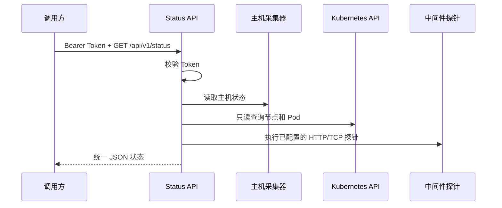

# Go Status API

一个通过 HTTP 接口暴露服务器、Kubernetes、Pod 和中间件状态的只读服务。调用方只需要访问 Status API，不需要直接访问主机、Kubernetes API 或中间件。

当前版本使用 Go 标准库，适合本地开发和功能验证。

## 1. 工作方式



## 2. 环境要求

- Go 1.24 或兼容版本；
- Linux 主机可以读取 `/proc` 时，才能获得负载和内存信息；
- 如果访问 Kubernetes，需要配置 Kubernetes API 地址和只读凭据；
- 中间件探针不需要额外 Go 依赖。

## 3. 本地启动

```bash
cd "/Users/lijiaxuan/Documents/hermes/运维笔记/go/status-api"
```

设置 Token。`change-me` 只是示例值，可以替换成任意随机字符串：

```bash
export STATUS_API_TOKEN='local-dev-token-123456'
```

也可以把所有配置放到工程目录的 `.env` 文件中。先复制示例文件：

```bash
cp .env.example .env
```

然后编辑 `.env`：

```dotenv
STATUS_API_PORT=8080
STATUS_API_TOKEN=replace-with-a-random-token
KUBERNETES_API_URL=https://kubernetes.default.svc
STATUS_SERVICES=order-api|http|http://order-api.prod.svc:8080/health
STATUS_MIDDLEWARES=redis-prod|redis|redis.prod.svc:6379
```

程序启动时会自动读取 `.env`。也可以通过 `STATUS_API_ENV_FILE=/path/to/prod.env` 指定其他文件。已经在 Shell 中导出的同名变量优先于文件值。`.env` 应限制为仅运行用户可读，例如 `chmod 600 .env`。

启动服务：

```bash
go run .
```

如果本机 Go 默认缓存目录没有写权限，使用临时缓存目录：

```bash
GOCACHE=/tmp/status-api-gocache go run .
```

`GOCACHE` 只影响 Go 编译缓存，不是 Status API 的配置。

服务默认监听 `http://127.0.0.1:8080`。

## 4. 调用接口

### 4.1 健康检查

不需要 Token：

```bash
curl -sS http://127.0.0.1:8080/healthz
```

### 4.2 汇总状态

```bash
curl -sS \
  -H "Authorization: Bearer $STATUS_API_TOKEN" \
  http://127.0.0.1:8080/api/v1/status | jq
```

### 4.3 分模块查询

```text
GET /api/v1/host
GET /api/v1/k8s
GET /api/v1/k8s/pods
GET /api/v1/middlewares
```

Pod 可以按 Namespace 过滤：

```bash
curl -sS \
  -H "Authorization: Bearer $STATUS_API_TOKEN" \
  'http://127.0.0.1:8080/api/v1/k8s/pods?namespace=prod' | jq
```

状态值为 `healthy`、`degraded`、`unhealthy`、`unknown`。汇总接口包含 `schema_version`、`request_id`、`observed_at`、`data` 和 `errors` 字段。

## 5. 环境变量

| 变量 | 默认值 | 说明 |
|---|---|---|
| `STATUS_API_PORT` | `8080` | HTTP 监听端口 |
| `STATUS_API_TOKEN` | 空 | Bearer Token；为空时受保护接口返回 401 |
| `KUBERNETES_API_URL` | `https://kubernetes.default.svc` | Kubernetes API 地址 |
| `STATUS_API_ENV_FILE` | `.env` | 自定义环境变量文件路径 |
| `STATUS_SERVICES` | 空 | 业务服务健康探针，格式为 `name|type|target` |
| `STATUS_MIDDLEWARES` | 空 | `name|type|target` 逗号分隔 |

中间件配置示例：

```bash
export STATUS_MIDDLEWARES='redis-prod|redis|redis.default.svc:6379,nacos|http|http://nacos.default.svc:8848/nacos/actuator/health'
GOCACHE=/tmp/status-api-gocache go run .
```

支持的探针类型：`http`、`https`、`tcp`、`redis`、`mysql`、`kafka`。其中 Redis、MySQL、Kafka 当前执行 TCP 连通性检查，不执行协议级认证或查询。

业务服务和中间件分开配置，对应接口分别为 `/api/v1/services` 和 `/api/v1/middlewares`，汇总接口 `/api/v1/status` 会同时返回两类结果。

## 6. Kubernetes 权限

服务只需要只读权限。建议允许 `get/list/watch` 访问以下资源：`nodes`、`namespaces`、`pods`、`services`、`endpoints`、`endpointslices`、`deployments`、`replicasets`、`statefulsets`、`daemonsets`。

默认不需要 `secrets`、`pods/exec`、`pods/attach`、`pods/log` 以及 `create/update/patch/delete` 权限。

服务在集群内运行时会尝试读取 ServiceAccount Token 和 CA 文件。真实集群中的 RBAC 尚未在本地验证。

## 7. 安全边界

- 生产环境必须使用 HTTPS 或在 API Gateway 后面提供 HTTPS；
- Token 不要提交到 Git、README 或日志；
- 不返回 Secret、环境变量、日志和完整敏感 Annotation；
- 中间件目标只能来自服务端配置，不能由请求参数传入任意地址；
- 当前 Token 是单一静态 Token，生产环境应替换为 Secret 管理或 JWT/OIDC。

## 8. 测试

```bash
GOCACHE=/tmp/status-api-gocache go test ./...
GOCACHE=/tmp/status-api-gocache go vet ./...
```

当前测试覆盖 Token 鉴权、健康检查和 Pod 状态汇总。尚未在真实 Kubernetes 集群、中间件和节点环境执行端到端验证。

## 9. 当前限制

- 主机采集器直接读取当前进程所在环境的 `/proc`；部署在 Kubernetes Pod 内时是容器视角，不等于节点视角；
- 尚未接入 Node Exporter/Prometheus、缓存、历史数据、JWT/OIDC、多集群和 OpenAPI；
- 当前接口执行实时采集，尚未实现采集快照缓存和大规模集群分页。
