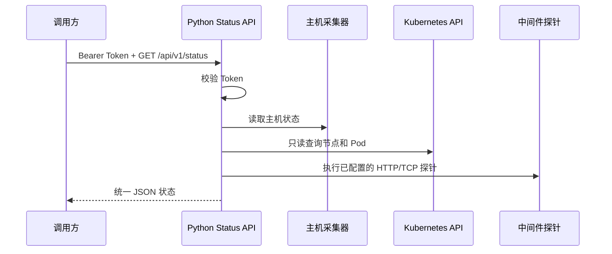

# Python Status API

一个通过 HTTP 接口暴露服务器、Kubernetes、Pod 和中间件状态的只读服务。Python 版与 [`go/status-api`](../../go/status-api/) 保持相同的接口路径和基本返回结构。

当前实现只使用 Python 标准库，不需要安装 FastAPI、Flask、psutil 等第三方包。

## 1. 工作方式



## 2. 环境要求

- Python 3.10 或兼容版本；
- Linux 主机可以读取 `/proc` 时，才能获得负载和内存信息；
- 如果访问 Kubernetes，需要 Kubernetes API 地址和只读凭据；
- 不需要执行 `pip install`。

## 3. 本地启动

```bash
cd python/status-api
```

设置 Token。`change-me` 只是示例值，可以替换成任意随机字符串：

```bash
export STATUS_API_TOKEN='local-dev-token-123456'
```

也可以把所有配置放到工程目录的 `.env` 文件中：

```bash
cp .env.example .env
```

`.env` 示例：

```dotenv
STATUS_API_HOST=0.0.0.0
STATUS_API_PORT=8080
STATUS_API_TOKEN=replace-with-a-random-token
KUBERNETES_API_URL=https://kubernetes.default.svc
KUBERNETES_API_TOKEN=replace-with-a-read-only-token
KUBERNETES_CA_FILE=/path/to/ca.crt
STATUS_SERVICES=order-api|http|http://order-api.prod.svc:8080/health
STATUS_MIDDLEWARES=redis-prod|redis|redis.prod.svc:6379
```

程序启动时会自动读取 `.env`。也可以通过 `STATUS_API_ENV_FILE=/path/to/prod.env` 指定其他文件。已经在 Shell 中导出的同名变量优先于文件值。`.env` 应限制为仅运行用户可读，例如 `chmod 600 .env`。

启动服务：

```bash
python3 -m status_api
```

服务默认监听 `http://127.0.0.1:8080`。

## 4. 部署位置和认证方式

Status API 有以下几种运行方式：

| 场景 | Kubernetes 地址 | 认证方式 | 是否适合生产 |
|---|---|---|---|
| 集群内运行 | `https://kubernetes.default.svc` | Pod 的 ServiceAccount Token 和 CA | 适合 |
| VM/物理机外部长期运行 | 集群 API Server 地址 | 独立只读 Token + CA 文件 | 适合 |
| VM/物理机临时验证 | `http://127.0.0.1:8001` | `kubectl proxy` 代为认证 | 不适合 |
| 直接使用 `~/.kube/config` | kubeconfig 中的地址 | 当前版本未实现 | 暂不支持 |

### 4.1 集群内运行

Status API 作为 Pod 部署在 Kubernetes 集群内时，通常不需要手动创建 Token。Kubernetes 会将 ServiceAccount Token 和 CA 挂载到：

```text
/var/run/secrets/kubernetes.io/serviceaccount/token
/var/run/secrets/kubernetes.io/serviceaccount/ca.crt
```

仍然必须为该 ServiceAccount 绑定只读 RBAC。此模式下不需要设置 `KUBERNETES_API_TOKEN`，默认地址 `kubernetes.default.svc` 即可使用。

注意：API Pod 内直接读取 `/proc` 得到的是容器视角的 CPU、内存和磁盘数据，不等于 Kubernetes 节点数据。节点级数据应通过 Node Exporter/Prometheus 或独立 Host Collector 提供。

### 4.2 VM 或物理机外部长期运行

Status API 运行在 Kubernetes 集群外时，需要同时满足：

1. 运行机器可以解析并访问 Kubernetes API Server 地址；
2. 使用具有 `get/list/watch` 权限的只读 Token；
3. 使用与 API Server 证书匹配的 CA 文件。

`.env` 示例：

```dotenv
KUBERNETES_API_URL=https://kubernetes.example.internal:6443
KUBERNETES_API_TOKEN=replace-with-a-read-only-token
KUBERNETES_CA_FILE=/etc/status-api/ca.crt
```

当前版本不会读取 `~/.kube/config`，也不会自动使用 `kubectl` 当前上下文。不要把管理员 Token 直接配置给 Status API；应创建独立的只读 ServiceAccount，并定期轮换 Token。

#### 具体操作步骤

1. 确认 `kubectl` 能访问目标集群，并记录 API Server 地址：

   ```bash
   kubectl cluster-info
   kubectl get nodes
   ```

   也可以只读取当前 kubeconfig 上下文中的 API 地址（不会输出 Token）：

   ```bash
   kubectl config view --minify \
     -o jsonpath='{.clusters[0].cluster.server}'
   echo
   ```

   例如输出 `https://kubernetes.example.internal:6443`，就将它填写到 `KUBERNETES_API_URL`。不要把 `https://kubernetes.default.svc` 填到集群外运行的 VM 配置中，那个地址通常只在集群内部可解析。

2. 创建专用 Namespace、ServiceAccount 和只读 RBAC。下面的 YAML 只授予 `get/list/watch`：

   ```bash
   kubectl apply -f - <<'EOF'
   apiVersion: v1
   kind: Namespace
   metadata:
     name: status-api
   ---
   apiVersion: v1
   kind: ServiceAccount
   metadata:
     name: status-api-reader
     namespace: status-api
   ---
   apiVersion: rbac.authorization.k8s.io/v1
   kind: ClusterRole
   metadata:
     name: status-api-reader
   rules:
     - apiGroups: [""]
       resources: ["nodes", "namespaces", "pods", "services", "endpoints"]
       verbs: ["get", "list", "watch"]
     - apiGroups: ["discovery.k8s.io"]
       resources: ["endpointslices"]
       verbs: ["get", "list", "watch"]
     - apiGroups: ["apps"]
       resources: ["deployments", "replicasets", "statefulsets", "daemonsets"]
       verbs: ["get", "list", "watch"]
   ---
   apiVersion: rbac.authorization.k8s.io/v1
   kind: ClusterRoleBinding
   metadata:
     name: status-api-reader
   roleRef:
     apiGroup: rbac.authorization.k8s.io
     kind: ClusterRole
     name: status-api-reader
   subjects:
     - kind: ServiceAccount
       name: status-api-reader
       namespace: status-api
   EOF
   ```

3. 验证权限：

   ```bash
   kubectl auth can-i --as=system:serviceaccount:status-api:status-api-reader get nodes
   kubectl auth can-i --as=system:serviceaccount:status-api:status-api-reader list pods --all-namespaces
   kubectl auth can-i --as=system:serviceaccount:status-api:status-api-reader delete pods
   ```

   前两条应返回 `yes`，最后一条应返回 `no`。

4. 生成短期 Kubernetes Token：

   ```bash
   kubectl -n status-api create token status-api-reader --duration=24h
   ```

   终端输出的整行内容就是 `KUBERNETES_API_TOKEN`，不要把它发到聊天中。

5. 准备 CA 文件。如果 kubeconfig 中包含 `certificate-authority-data`：

   ```bash
   kubectl config view --raw --minify \
     -o jsonpath='{.clusters[0].cluster.certificate-authority-data}' \
     | base64 -d > /tmp/status-api-ca.crt
   chmod 644 /tmp/status-api-ca.crt
   ```

6. 创建 `.env`，填写实际 API 地址、Token 和 CA 路径：

   ```dotenv
   STATUS_API_HOST=0.0.0.0
   STATUS_API_PORT=8080
   STATUS_API_TOKEN=用于调用Status API的Token
   KUBERNETES_API_URL=https://kubernetes.example.internal:6443
   KUBERNETES_API_TOKEN=第4步生成的Kubernetes只读Token
   KUBERNETES_CA_FILE=/tmp/status-api-ca.crt
   ```

   ```bash
   chmod 600 .env
   ```

7. 验证 Kubernetes API：

   ```bash
   curl --silent --show-error --fail \
     --cacert /tmp/status-api-ca.crt \
     -H "Authorization: Bearer $KUBERNETES_API_TOKEN" \
     "$KUBERNETES_API_URL/version"
   ```

8. 启动并调用 Python 版：

   ```bash
   python3 -m status_api
   ```

   另开终端调用：

   ```bash
   curl -sS -H "Authorization: Bearer <STATUS_API_TOKEN的值>" \
     http://127.0.0.1:8080/api/v1/k8s/pods | python3 -m json.tool
   ```

### 4.3 使用 `kubectl proxy` 临时验证

如果只是验证 API 是否能读取集群数据，可以在一个终端运行：

```bash
kubectl proxy --address=127.0.0.1 --port=8001
```

然后在 `.env` 中设置：

```dotenv
KUBERNETES_API_URL=http://127.0.0.1:8001
```

此时不需要填写 `KUBERNETES_API_TOKEN` 和 `KUBERNETES_CA_FILE`。`kubectl proxy` 必须保持运行，并且只建议用于临时测试，不建议作为长期服务认证方式。

完整临时验证流程：

```bash
# 终端 1：保持运行
kubectl proxy --address=127.0.0.1 --port=8001

# 终端 2：在 Status API 工程目录执行
cat > .env <<'EOF'
STATUS_API_HOST=0.0.0.0
STATUS_API_PORT=8080
STATUS_API_TOKEN=local-dev-token
KUBERNETES_API_URL=http://127.0.0.1:8001
EOF
chmod 600 .env
python3 -m status_api
```

另开终端调用：

```bash
curl -sS -H 'Authorization: Bearer local-dev-token' \
  http://127.0.0.1:8080/api/v1/k8s/pods | python3 -m json.tool
```

## 5. 调用接口

### 5.1 健康检查

不需要 Token：

```bash
curl -sS http://127.0.0.1:8080/healthz
```

### 5.2 汇总状态

```bash
curl -sS \
  -H "Authorization: Bearer $STATUS_API_TOKEN" \
  http://127.0.0.1:8080/api/v1/status | python3 -m json.tool
```

### 5.3 分模块查询

```text
GET /api/v1/host
GET /api/v1/k8s
GET /api/v1/k8s/pods
GET /api/v1/services
GET /api/v1/middlewares
```

Pod 可以按 Namespace 过滤：

```bash
curl -sS \
  -H "Authorization: Bearer $STATUS_API_TOKEN" \
  'http://127.0.0.1:8080/api/v1/k8s/pods?namespace=prod' | python3 -m json.tool
```

状态值为 `healthy`、`degraded`、`unhealthy`、`unknown`。汇总接口包含 `schema_version`、`request_id`、`observed_at`、`data` 和 `errors` 字段。

## 6. 环境变量

| 变量 | 默认值 | 说明 |
|---|---|---|
| `STATUS_API_HOST` | `0.0.0.0` | HTTP 监听地址 |
| `STATUS_API_PORT` | `8080` | HTTP 监听端口 |
| `STATUS_API_TOKEN` | 空 | Bearer Token；为空时受保护接口返回 401 |
| `STATUS_API_ENV_FILE` | `.env` | 自定义环境变量文件路径 |
| `KUBERNETES_API_URL` | `https://kubernetes.default.svc` | Kubernetes API 地址 |
| `KUBERNETES_API_TOKEN` | 空 | 集群外访问 Kubernetes 时使用的只读 Token |
| `KUBERNETES_CA_FILE` | 集群内 CA | Kubernetes API 的 CA 文件路径 |
| `STATUS_SERVICES` | 空 | 业务服务健康探针，格式为 `name|type|target` |
| `STATUS_MIDDLEWARES` | 空 | `name|type|target` 逗号分隔 |

中间件配置示例：

```bash
export STATUS_MIDDLEWARES='redis-prod|redis|redis.default.svc:6379,nacos|http|http://nacos.default.svc:8848/nacos/actuator/health'
python3 -m status_api
```

支持的探针类型：`http`、`https`、`tcp`、`redis`、`mysql`、`kafka`。其中 Redis、MySQL、Kafka 当前执行 TCP 连通性检查。

业务服务和中间件分开配置，对应接口分别为 `/api/v1/services` 和 `/api/v1/middlewares`，汇总接口 `/api/v1/status` 会同时返回两类结果。

## 7. Kubernetes 权限

服务只需要只读权限，建议允许 `get/list/watch` 访问节点、Namespace、Pod、Service、EndpointSlice 和常见 Workload 资源。默认不需要读取 Secret、Pod 日志，也不需要 `exec`、`attach`、创建、修改和删除权限。

集群内运行时，程序会尝试读取：

```text
/var/run/secrets/kubernetes.io/serviceaccount/token
/var/run/secrets/kubernetes.io/serviceaccount/ca.crt
```

真实集群中的 ServiceAccount 和 RBAC 尚未在本地验证。

如果服务运行在 Kubernetes 集群外，需要在 `.env` 中填写实际 API 地址，并提供只读 Token：

```dotenv
KUBERNETES_API_URL=https://apiserver.cluster.local:6443
KUBERNETES_API_TOKEN=不要把真实值提交到 Git
KUBERNETES_CA_FILE=/etc/kubernetes/pki/ca.crt
```

当前服务不会自动读取 `~/.kube/config`；如果 `kubectl` 使用的是客户端证书，还需要后续增加客户端证书配置。

## 8. 安全边界

- 生产环境使用 HTTPS 或放在 API Gateway 后面；
- Token 不要提交到 Git、README 或日志；
- 不返回 Secret、环境变量、日志和敏感 Annotation；
- 中间件目标只能来自服务端配置，不能由请求参数传入任意地址；
- 当前使用静态 Token，生产环境应使用 Secret 管理或 JWT/OIDC。

## 9. 测试

```bash
cd python/status-api
PYTHONPATH=. python3 -m unittest discover -s tests -v
python3 -m compileall -q status_api
```

当前测试覆盖 Pod 状态汇总和总体状态聚合。尚未在真实 Kubernetes 集群、中间件和节点环境执行端到端验证。

## 10. 当前限制

- 主机采集器直接读取当前进程所在环境的 `/proc`；部署在 Kubernetes Pod 内时是容器视角，不等于节点视角；
- 尚未接入 Node Exporter/Prometheus、缓存、历史数据、JWT/OIDC、多集群和 OpenAPI；
- 当前接口执行实时采集，尚未实现采集快照缓存和大规模集群分页；
- 如果后续需要高并发和自动生成 OpenAPI，可增加 FastAPI/Uvicorn 适配层，但不应改变现有接口契约。
