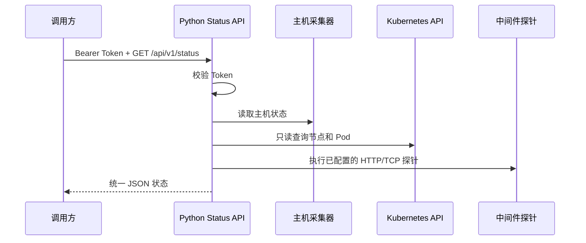

# Python Status API

一个通过 HTTP 接口暴露服务器、Kubernetes、Pod 和中间件状态的只读服务。Python 版与 [`go/status-api`](../../go/status-api/) 保持相同的接口路径和基本返回结构。

当前实现只使用 Python 标准库，不需要安装 FastAPI、Flask、psutil 等第三方包。

## 1. 工作方式



## 2. 环境要求

- Python 3.10 或兼容版本；
- Linux 主机可以读取 `/proc` 时，才能获得负载和内存信息；
- 如果访问 Kubernetes，需要 Kubernetes API 地址和只读凭据；
- 不需要执行 `pip install`。

## 3. 本地启动

```bash
cd "/Users/lijiaxuan/Documents/hermes/运维笔记/python/status-api"
```

设置 Token。`change-me` 只是示例值，可以替换成任意随机字符串：

```bash
export STATUS_API_TOKEN='local-dev-token-123456'
```

也可以把所有配置放到工程目录的 `.env` 文件中：

```bash
cp .env.example .env
```

`.env` 示例：

```dotenv
STATUS_API_HOST=0.0.0.0
STATUS_API_PORT=8080
STATUS_API_TOKEN=replace-with-a-random-token
KUBERNETES_API_URL=https://kubernetes.default.svc
STATUS_SERVICES=order-api|http|http://order-api.prod.svc:8080/health
STATUS_MIDDLEWARES=redis-prod|redis|redis.prod.svc:6379
```

程序启动时会自动读取 `.env`。也可以通过 `STATUS_API_ENV_FILE=/path/to/prod.env` 指定其他文件。已经在 Shell 中导出的同名变量优先于文件值。`.env` 应限制为仅运行用户可读，例如 `chmod 600 .env`。

启动服务：

```bash
python3 -m status_api
```

服务默认监听 `http://127.0.0.1:8080`。

## 4. 调用接口

### 4.1 健康检查

不需要 Token：

```bash
curl -sS http://127.0.0.1:8080/healthz
```

### 4.2 汇总状态

```bash
curl -sS \
  -H "Authorization: Bearer $STATUS_API_TOKEN" \
  http://127.0.0.1:8080/api/v1/status | python3 -m json.tool
```

### 4.3 分模块查询

```text
GET /api/v1/host
GET /api/v1/k8s
GET /api/v1/k8s/pods
GET /api/v1/middlewares
```

Pod 可以按 Namespace 过滤：

```bash
curl -sS \
  -H "Authorization: Bearer $STATUS_API_TOKEN" \
  'http://127.0.0.1:8080/api/v1/k8s/pods?namespace=prod' | python3 -m json.tool
```

状态值为 `healthy`、`degraded`、`unhealthy`、`unknown`。汇总接口包含 `schema_version`、`request_id`、`observed_at`、`data` 和 `errors` 字段。

## 5. 环境变量

| 变量 | 默认值 | 说明 |
|---|---|---|
| `STATUS_API_HOST` | `0.0.0.0` | HTTP 监听地址 |
| `STATUS_API_PORT` | `8080` | HTTP 监听端口 |
| `STATUS_API_TOKEN` | 空 | Bearer Token；为空时受保护接口返回 401 |
| `STATUS_API_ENV_FILE` | `.env` | 自定义环境变量文件路径 |
| `KUBERNETES_API_URL` | `https://kubernetes.default.svc` | Kubernetes API 地址 |
| `STATUS_SERVICES` | 空 | 业务服务健康探针，格式为 `name|type|target` |
| `STATUS_MIDDLEWARES` | 空 | `name|type|target` 逗号分隔 |

中间件配置示例：

```bash
export STATUS_MIDDLEWARES='redis-prod|redis|redis.default.svc:6379,nacos|http|http://nacos.default.svc:8848/nacos/actuator/health'
python3 -m status_api
```

支持的探针类型：`http`、`https`、`tcp`、`redis`、`mysql`、`kafka`。其中 Redis、MySQL、Kafka 当前执行 TCP 连通性检查。

业务服务和中间件分开配置，对应接口分别为 `/api/v1/services` 和 `/api/v1/middlewares`，汇总接口 `/api/v1/status` 会同时返回两类结果。

## 6. Kubernetes 权限

服务只需要只读权限，建议允许 `get/list/watch` 访问节点、Namespace、Pod、Service、EndpointSlice 和常见 Workload 资源。默认不需要读取 Secret、Pod 日志，也不需要 `exec`、`attach`、创建、修改和删除权限。

集群内运行时，程序会尝试读取：

```text
/var/run/secrets/kubernetes.io/serviceaccount/token
/var/run/secrets/kubernetes.io/serviceaccount/ca.crt
```

真实集群中的 ServiceAccount 和 RBAC 尚未在本地验证。

## 7. 安全边界

- 生产环境使用 HTTPS 或放在 API Gateway 后面；
- Token 不要提交到 Git、README 或日志；
- 不返回 Secret、环境变量、日志和敏感 Annotation；
- 中间件目标只能来自服务端配置，不能由请求参数传入任意地址；
- 当前使用静态 Token，生产环境应使用 Secret 管理或 JWT/OIDC。

## 8. 测试

```bash
cd "/Users/lijiaxuan/Documents/hermes/运维笔记/python/status-api"
PYTHONPATH=. python3 -m unittest discover -s tests -v
python3 -m compileall -q status_api
```

当前测试覆盖 Pod 状态汇总和总体状态聚合。尚未在真实 Kubernetes 集群、中间件和节点环境执行端到端验证。

## 9. 当前限制

- 主机采集器直接读取当前进程所在环境的 `/proc`；部署在 Kubernetes Pod 内时是容器视角，不等于节点视角；
- 尚未接入 Node Exporter/Prometheus、缓存、历史数据、JWT/OIDC、多集群和 OpenAPI；
- 当前接口执行实时采集，尚未实现采集快照缓存和大规模集群分页；
- 如果后续需要高并发和自动生成 OpenAPI，可增加 FastAPI/Uvicorn 适配层，但不应改变现有接口契约。
