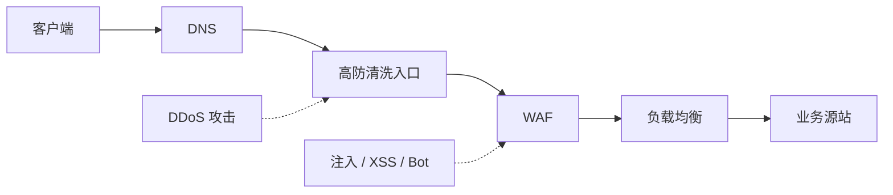

# 高防与 WAF 技术说明

## 1. 文档概述

### 解决什么问题

本指南说明**高防（Anti-DDoS）和 WAF（Web Application Firewall）分别是什么、防护什么攻击、如何工作、二者有何区别与协作关系，以及如何选型与落地**。目标是让你能用正确的层次理解「流量打垮」和「业务被钻空」两类问题，避免把高防当万能盾、或把 WAF 当成抗大流量设备。

### 适合哪些读者

- 有基础网络与 HTTP 概念的运维、SRE、后端开发
- 需要为网站 / API 选型安全防护、对接云厂商高防或 WAF 的工程师
- 需要向业务方解释「为什么既要高防又要 WAF」的技术同学

### 阅读后能获得什么

- 分清 DDoS 与 Web 应用层攻击的差异，以及各自对应的防护手段
- 理解高防清洗、流量牵引、黑洞等核心机制
- 理解 WAF 的检测方式（规则、语义、Bot、速率限制）与常见误区
- 掌握「高防在前、WAF 在后」的典型链路与源站保护要点
- 能按场景做选型判断，并按常见现象做初步排查

### 版本与范围说明

- 本文讲**通用机制与工程实践**，不绑定某一云厂商控制台菜单；阿里云「高防 IP」、腾讯云「高防」、AWS Shield、Cloudflare、自建清洗等产品形态不同，原理相近
- 攻击手法与防护能力持续演进；具体规格（清洗带宽、QPS、规则库版本）以厂商当前文档为准，文中涉及数字处标为 **【需要确认】**
- **不替代**：等保/合规条款解读、厂商 SLA 合同条款、具体产品开通向导

---

## 2. 前置条件

### 必备基础知识

- 知道客户端、DNS、负载均衡、源站（Origin）大致如何串起来
- 了解 HTTP/HTTPS 基本概念（请求方法、路径、参数、Cookie、状态码）
- 知道「带宽打满」「机器 CPU/连接数打满」「业务被刷接口」是不同故障形态

### 动手前建议确认

- **【需要确认】** 业务入口是域名还是裸 IP；是否已用 CDN / 负载均衡
- **【需要确认】** 源站公网 IP 是否已暴露在历史 DNS、邮件头、第三方扫描结果中
- **【需要确认】** 主要风险是「被打挂」（可用性）还是「被钻业务空子」（注入、越权、撞库）
- **【需要确认】** 是否必须保留真实客户端 IP（需 `X-Forwarded-For` / Proxy Protocol 等透传约定）

> **核心结论先记住：**  
> **高防**主要解决「把你打瘫」的**流量与资源耗尽**问题；  
> **WAF**主要解决「钻进应用逻辑」的**Web 攻击与恶意请求**问题。  
> 二者防护层不同，不能互相替代；线上常见做法是**串联使用**。

---

## 3. 核心概念

### 3.1 攻击分层：先分清「打瘫」和「钻空」

| 类型 | 典型目标 | 常见手段（示例） | 优先防护 |
|------|----------|------------------|----------|
| 网络/传输层大流量 | 占满带宽、打爆防火墙会话、耗尽链路 | UDP/SYN Flood、反射放大（DNS/NTP/Memcached 等） | **高防** |
| 应用层资源耗尽 | 打满连接、线程、上游 DB | HTTP Flood、慢速攻击、高并发合法外观请求 | **高防 + WAF/限流**（视产品能力） |
| Web 应用漏洞利用 | 窃取数据、篡改、拿权限 | SQL 注入、XSS、命令注入、路径穿越、反序列化 | **WAF**（仍需修代码） |
| 业务滥用 | 撞库、刷券、爬虫、接口滥用 | 自动化脚本、凭证填充、低频探测 | **WAF / Bot / 业务风控** |

一句话：带宽被灌满时，再精密的 WAF 规则也帮不上忙；反过来，几 KB 的注入包也不会触发高防的「清洗阈值」。

### 3.2 高防（Anti-DDoS）是什么

**高防**（行业口语，对应 Anti-DDoS / DDoS Protection）是一套面向 **DDoS（Distributed Denial of Service，分布式拒绝服务）** 的防护能力：在攻击流量到达业务源站之前，通过更大清洗能力、专线/任播入口、黑白名单与策略，把恶意流量滤掉或丢弃，让正常用户流量尽量到达源站。

#### 防护目标

- **可用性**：业务不因外部流量攻击而不可达或严重抖动
- **带宽与会话保护**：避免机房上联、云主机带宽、四层连接表被打满
- **隐藏与隔离**：多数产品以「高防 IP / 防护域名」作为对外入口，源站只接受来自高防回源的流量

#### 常见工作机制

1. **入口替换**  
   做什么：DNS 把业务域名指向高防 IP（或 CNAME 到防护域名），而不是直接指向源站。  
   为什么：让攻击先打到高防清洗集群，而不是你的几台 ECS。  
   预期结果：公网看到的是高防入口；源站 IP 不再作为对外主入口。

2. **流量牵引与清洗**  
   做什么：异常流量进入清洗中心，按特征（协议异常、放大反射特征、速率、黑名单等）过滤。  
   为什么：清洗中心具备远高于单机房的带宽与专用硬件/集群能力。  
   预期结果：清洗后的「干净流量」再回源到真实业务。

3. **黑洞 / 限速（最后手段）**  
   做什么：攻击远超套餐清洗能力时，可能对目标 IP 做黑洞（丢弃发往该 IP 的流量）或严格限速。  
   为什么：保护上游网络与其他租户，避免整段链路雪崩。  
   预期结果：攻击期间业务可能短暂不可用——这是容量与策略边界，不是「高防失灵」的同义词。具体阈值与策略 **【需要确认】** 厂商套餐与合同。

4. **近源/云清洗、本地清洗等形态**  
   云厂商高防、CDN 边缘、运营商清洗、本地 Anti-DDoS 设备等实现路径不同，判断标准仍是：**攻击流量是否在到达脆弱源站前被吸收或过滤**。

#### 高防不擅长什么

- 不能替代漏洞修复：注入、越权、弱口令不在其核心职责
- 不保证识别「看起来合法」的精细业务刷单（那是风控 / WAF Bot）
- 若**源站 IP 泄露**且可被直连，攻击者可绕过入口直接打源站——高防形同虚设

### 3.3 WAF 是什么

**WAF（Web Application Firewall，Web 应用防火墙）** 部署在客户端与 Web 应用之间，解析 **HTTP/HTTPS**（及常见 WebSocket 等）流量，按规则与策略拦截、放行或观察可疑请求，用于缓解 **OWASP 类威胁、恶意扫描、部分 CC/Bot、接口滥用**。

#### 防护目标

- **应用层安全**：降低 SQL 注入、XSS、命令注入、恶意上传、已知漏洞利用等风险
- **访问治理**：IP/地域/UA 控制、URI 级限速、人机识别、Bot 管理
- **合规与审计**：留存攻击日志、配合等保/安全检查中的应用防护要求（具体条款 **【需要确认】**）

#### 常见检测与处置方式

| 方式 | 说明 | 特点 |
|------|------|------|
| 签名 / 规则库 | 匹配已知攻击特征（如典型注入 payload） | 见效快；需持续更新；易误报/漏报 |
| 语义 / 解析检测 | 理解参数结构、SQL/JS 语义后再判断 | 对变体更好；配置与性能成本更高 |
| 异常 / 基线 | 偏离正常流量画像时告警或拦截 | 适合补充；冷启动与调参成本高 |
| 速率限制 / CC 防护 | 按 IP、会话、URI、Cookie 等限速 | 对「打应用层」有效；阈值需贴业务 |
| Bot 管理 | JS 挑战、行为分析、指纹、信誉库 | 对付爬虫与自动化；影响真实用户体验时需灰度 |
| 正向模型（白名单） | 只允许符合 API 契约的请求 | 安全性高；适合稳定 API，变更成本高 |

处置动作通常包括：阻断、挑战（验证码/JS）、限速、脱敏、仅记录（观察模式）、重定向等。

#### WAF 部署形态（概念）

- **云 WAF / SaaS**：改 DNS 或 CNAME 接入，证书在云上终止或透传（视产品）
- **反向代理型**：Nginx / OpenResty / Envoy 等前置模块
- **旁路镜像**：只检测不阻断（适合观察，防护力弱）
- **主机/容器插件**：贴近应用，但运维与覆盖面需单独设计

#### WAF 不擅长什么

- **扛不过 Tb 级大流量 DDoS**：WAF 自身也可能先被打瘫，需要前置高防或 CDN/边缘吸收
- **不能替代安全开发**：业务逻辑漏洞（如越权改价）往往靠规则拦不住，要修代码与鉴权
- **加密与私有协议**：无法解密的流量、非 HTTP 协议，WAF 基本看不见
- **误杀风险**：严格规则可能导致正常业务 403——上线应用「观察模式 → 调优 → 拦截」节奏

### 3.4 高防 vs WAF：对照表

| 维度 | 高防（Anti-DDoS） | WAF |
|------|-------------------|-----|
| 主要矛盾 | 可用性被流量打垮 | 应用被恶意请求利用或滥用 |
| 主要工作层 | L3/L4 为主，部分产品覆盖 L7 洪水 | L7（HTTP/HTTPS）为主 |
| 典型能力 | 清洗、牵引、黑洞、大带宽入口 | 注入/XSS 防护、Bot、限速、访问控制 |
| 对业务语义理解 | 弱（多为流量与协议特征） | 强（URL、参数、Header、Body） |
| 证书与解密 | 四层转发可不解密；七层防护时常需证书 | 深度检测通常需要 TLS 终止或密钥协作 |
| 绕过风险 | 源站 IP 暴露被直连 | 备用域名/IP 未接入、规则过松 |
| 能否互相替代 | 否 | 否 |

### 3.5 二者如何协作（推荐心智模型）

典型链路（概念）：

```text
用户 / 攻击者
    → DNS 指向防护入口
    → 高防（吸收/清洗大流量 DDoS）
    → WAF（解析 HTTP，拦应用攻击与部分 CC）
    → 负载均衡 / Ingress
    → 业务源站
```

也可以是「CDN/边缘（含部分 DDoS + WAF）→ 源站」，产品打包方式因厂商而异，分层职责不变：

1. **先保证进得来的流量总量可控**（高防 / 边缘带宽）
2. **再保证进来的请求内容可控**（WAF / 网关策略）
3. **源站只信任回源网段**，并隐藏真实 IP



---

## 4. 典型架构与选型建议

### 4.1 什么时候需要高防

优先考虑上高防（或具备同等清洗能力的 CDN/边缘防护）的场景：

- 业务对**可用性**敏感（交易、游戏、直播、政务公开入口等）
- 历史上发生过或行业常见 **带宽型 / 连接型 DDoS**
- 源站带宽小、机房清洗能力弱，无法硬抗
- 已有「裸奔公网 IP」且容易被扫到的入口

可暂缓或用轻量方案的场景：

- 纯内网服务、无公网入口
- 极低价值、可接受短时不可用、且无合规强制要求的实验环境

### 4.2 什么时候需要 WAF

优先考虑上 WAF 的场景：

- 对外提供网站、H5、开放 API、管理后台
- 堆栈含常见中间件/框架，需要缓解 0-day 与扫描噪声的时间窗
- 需要统一的 **URI 限速、地域封禁、Bot 治理** 入口
- 安全检查、等保或客户合同要求应用层防护 **【需要确认】**

WAF 不能替代的配套：

- 代码审计、依赖升级、最小权限、密钥管理
- API 鉴权、业务风控（刷单、羊毛党）
- 基线加固（关闭危险接口、管理面不暴露公网）

### 4.3 组合选型速查

| 业务画像 | 建议 |
|----------|------|
| 静态站 + CDN | CDN 边缘防护 + 按需 WAF；注意源站防直连 |
| 中小型 API / 官网 | 云 WAF + 基础 DDoS（或 CDN）；攻击面大再加独立高防 |
| 高价值、易被盯上的业务 | **独立高防 + WAF**，源站白名单回源，严格隐藏源 IP |
| 已有 API 网关 | 网关负责鉴权/限流；WAF 补应用攻击特征；高防仍在最外层抗流量 |

### 4.4 落地关键步骤（通用）

下面以「域名业务接入高防 + WAF」为例，步骤可按厂商产品合并（有的套餐一体接入）。

#### 步骤 1：盘点入口与源站

- **做什么**：列出所有对外域名、备用域名、历史 A 记录、管理后台、回调 IP。
- **为什么**：漏掉的入口 = 攻击绕行通道。
- **预期结果**：得到「必须接入防护」的域名清单与真实源站地址。

#### 步骤 2：接入高防入口并切换 DNS

- **做什么**：开通高防实例，配置转发/回源，将业务域名解析切到高防。
- **为什么**：让公网流量先经清洗。
- **预期结果**：`dig` 看到新入口；业务经高防可访问。切换时注意 TTL 与灰度 **【需要确认】**。

#### 步骤 3：接入 WAF 并先观察

- **做什么**：在高防之后（或厂商一体链路中）开启 WAF，模式设为观察/告警。
- **为什么**：避免一上来全拦截导致业务大面积 403。
- **预期结果**：能看到命中日志，尚未误伤生产主路径。

#### 步骤 4：调优规则后转拦截

- **做什么**：根据日志加白名单（支付回调、UA 特殊客户端、大 Body 上传等），再分域名/分路径开启拦截。
- **为什么**：规则库是通用的，业务是特殊的。
- **预期结果**：明确攻击被拦，核心业务误报可控。

#### 步骤 5：锁死源站

- **做什么**：安全组/防火墙仅允许高防（及必要运维出口）回源；清理历史解析与泄露。
- **为什么**：防止攻击者直连源站 IP 绕过整套防护。
- **预期结果**：公网直连源站业务端口失败或无业务响应。

#### 步骤 6：监控与演练

- **做什么**：监控清洗带宽、拦截量、4xx/5xx、回源成功率；定期做切换与回滚演练。
- **为什么**：攻击时才第一次改 DNS，失败率极高。
- **预期结果**：有告警、有值班手册、有回滚路径。

---

## 5. 完整示例（概念级）

### 场景

电商站点 `www.example.com`：

1. 攻击者发动大流量 UDP 反射，试图灌满机房带宽  
2. 同时用脚本对 `/api/login` 做撞库，并对搜索接口尝试 SQL 注入  

### 分层拦截示意

```text
[攻击流量 + 正常用户]
        |
        v
   ┌─────────────┐
   │  高防入口    │  ← UDP/SYN 等大流量在此清洗/丢弃
   └──────┬──────┘
          | 干净的 HTTP(S)
          v
   ┌─────────────┐
   │    WAF      │  ← 注入特征拦截；登录接口限速 / Bot 挑战
   └──────┬──────┘
          | 合法业务请求
          v
   ┌─────────────┐
   │  业务源站    │  ← 仅接受回源网段
   └─────────────┘
```

### 运维侧最小验证清单

```bash
# 1) 对外解析是否已指向防护入口（不要指向源站公网 IP）
dig +short www.example.com A

# 2) 从公网直连源站业务端口应失败或非业务响应（需在授权环境测试）
# 【需要确认】源站 IP、端口、是否允许探测
# nc -vz <源站IP> 443

# 3) 正常业务抽检：首页、登录、支付回调、文件上传
curl -I https://www.example.com/

# 4) 攻击演练仅可在授权窗口、对测试域名进行——禁止对未授权目标做压力/攻击测试
```

### 配置层面的「应该有」清单（与具体产品无关）

- 高防：转发协议/端口、回源地址、健康检查、可选近源防护阈值  
- WAF：防护域名、证书、检测模式（观察/拦截）、自定义白名单、CC 阈值  
- 源站：安全组白名单、关闭多余端口、管理面走 VPN/堡垒机  

具体字段名因厂商而异，以控制台为准 **【需要确认】**。

---

## 6. 常见问题与排查

### 6.1 开了高防仍被打挂

| 可能原因 | 处理方向 |
|----------|----------|
| 源站 IP 泄露被直连 | 立刻改源站 IP 或加固白名单；清理历史 DNS/邮件/第三方泄露 |
| 清洗能力低于攻击峰值 | 升级套餐、启用运营商协同、临时降级非核心业务 |
| 只防了四层，应用层慢速/CC 打满源站 | 叠加 WAF/网关限流、扩容、缓存静态资源 |
| DNS 未切干净（旧解析仍指向源站） | 查所有权威记录与低 TTL 缓存；子域/备用域一并接入 |

### 6.2 WAF 误杀导致业务 403/405

| 可能原因 | 处理方向 |
|----------|----------|
| 规则过严命中业务参数 | 对该 URI/参数加白或调整规则；先观察模式复盘 |
| 未放行支付/短信/合作方回调 IP | 配置来源 IP 白名单或签名校验优先于特征拦截 |
| Body 过大、编码特殊、JSON 嵌套深 | 调整检测限制或改为关键字段检测 |
| 管理 API / 内部工具 UA 异常 | 拆域名：管理域单独策略或仅内网 |

### 6.3 接入后延迟升高或证书报错

- **TLS 在高防/WAF 终止**：证书链是否完整、是否到期、SNI 是否匹配  
- **回源 HTTPS**：源站证书是否被中间件信任；是否误开强制 HTTPS 环路  
- **多跳代理**：排查是否重复加解密；评估是否可用 TCP 转发减轻延迟（会牺牲部分七层能力）

### 6.4 拿不到真实客户端 IP

- 确认高防/WAF 是否写入 `X-Forwarded-For` / `X-Real-IP` / Proxy Protocol  
- 应用与日志只信任**防护节点网段**追加的头，防止客户端伪造  
- 具体头字段与信任跳数 **【需要确认】** 当前链路产品文档

### 6.5 「WAF 能当高防用吗？」

短期：部分云 WAF/CDN 带一定 DDoS 防护额度，对小攻击够用。  
结论：额度与清洗带宽通常远小于独立高防；高价值业务不要赌「WAF 套餐里的赠送抗 D」。具体额度 **【需要确认】**。

---

## 7. 注意事项与最佳实践

1. **隐藏源站是第一纪律**  
   高防/WAF 再强，源站公网 IP 可被直连就等于后门。历史解析、邮件头、移动端写死 IP、第三方监控探测都要清。

2. **先观察，再拦截**  
   WAF 上线默认观察 → 调白名单 → 分路径拦截，比「第一天全开阻断」更安全。

3. **限流阈值贴业务**  
   验证码、秒杀、行情推送、健康检查、合作方回调的 QPS 画像不同，一刀切会误伤。

4. **防护与修复并行**  
   WAF 是缓解与争取时间；漏洞要修，依赖要升，管理面要收口。

5. **证书与密钥轮换纳入变更**  
   中间件持有证书时，续期失败 = 全站 HTTPS 故障；变更窗口与回滚要写进 runbook。

6. **日志要能关联**  
   高防事件（清洗开始/结束）、WAF 拦截日志、应用访问日志用同一 `request-id` 或时间对齐，攻击复盘才快。

7. **合规与跨境**  
   日志出境、镜像部署、国密/合规套件要求因行业与地域而异 **【需要确认】**。

8. **禁止未授权攻防测试**  
   对生产或他人资产做压力/攻击演练可能违法或违反云厂商 ToS；只用自有测试域名与书面授权窗口。

---

## 8. 总结

- **高防**：抗 **DDoS / 大流量与资源耗尽**，核心是清洗能力、入口替换与源站隔离。  
- **WAF**：抗 **Web 应用攻击与部分 L7 滥用**，核心是 HTTP 可见性、规则/语义检测与访问治理。  
- **关系**：分层互补；常见架构是 **高防 → WAF → 业务**，并严格防止源站绕过。  
- **落地顺序**：盘点入口 → 接入并切 DNS → WAF 观察调优 → 锁源站 → 监控演练。  

### 下一步建议

1. 列一张表：域名、当前解析、源站 IP、是否已防直连、是否已接 WAF。  
2. 按业务风险决定「仅 CDN/WAF」还是「独立高防 + WAF」。  
3. 选定具体云产品后，对照其文档补齐：清洗峰值、QPS、证书方式、回源头、价格与 SLA（文中标 **【需要确认】** 的项）。  
4. 若需要，可在本目录继续补一篇「某某云高防/WAF 控制台实操」对接文档。
