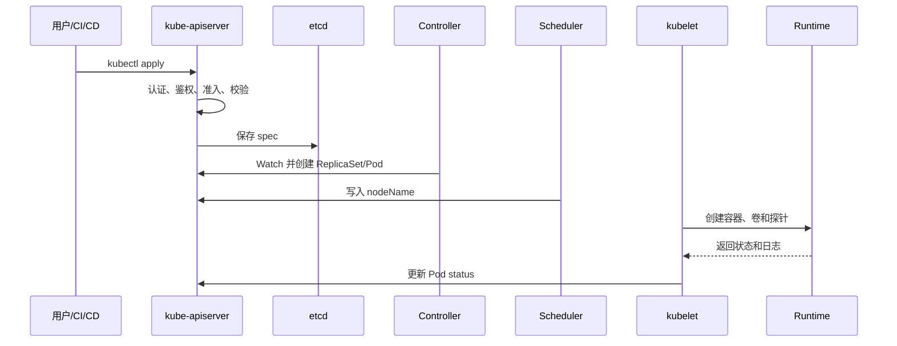

# Kubernetes 从入门到生产实践：组件、资源与常用操作指南

> 适用范围：Kubernetes、K3s、托管 Kubernetes 的通用概念与 kubectl 操作。  
> 版本边界：apiVersion、默认组件和扩展能力会随版本、发行版、CNI、CSI、云厂商实现变化；执行变更前先确认集群版本、上下文、命名空间和权限。

## 1. 先说结论：为什么用 Kubernetes

Kubernetes 是一个通过 API 管理容器化应用的平台。用户把“应用应该是什么状态”写成对象的 spec，控制器持续比较实际状态并修正；status 反映当前结果。它主要解决：

- 应用崩溃后的自动重启，以及节点故障后的重新调度；
- 无状态、有状态、节点级、一次性和定时工作负载的统一管理；
- 通过 Service 和 DNS 提供稳定访问入口，避免依赖 Pod IP；
- 配置、凭据、持久化数据与镜像解耦；
- 声明式发布、滚动更新、回滚、探针、资源限制和权限控制。

Kubernetes 不等于数据库、镜像仓库、CI/CD、日志平台、监控系统或备份系统。生产设计必须把这些边界单独验证。

## 2. 集群和控制循环

### 2.1 组件分工（按日常接触频率）

| 层次 | 组件 | 作用 | 常见使用方式 |
|---|---|---|---|
| 控制平面 | kube-apiserver | Kubernetes HTTP API；鉴权、准入、字段校验和对象读写入口 | kubectl 或客户端库 |
| 控制平面 | etcd | 持久化保存 API 对象和集群状态 | 备份、恢复和健康检查 |
| 控制平面 | kube-scheduler | 为未绑定节点的 Pod 选择节点 | nodeSelector、affinity、taint |
| 控制平面 | kube-controller-manager | 运行 Deployment、Node、Job 等控制器 | 修改对象 spec |
| 控制平面 | cloud-controller-manager | 对接云节点、路由、LB、卷；可选 | 由云平台或发行版维护 |
| 节点 | kubelet | 让本节点 Pod 达到期望状态 | Pod、节点配置和日志 |
| 节点 | Container Runtime | 实际创建和运行容器，如 containerd、CRI-O | 节点维护 |
| 节点 | kube-proxy | 为 Service 维护转发规则；可由 CNI 替代 | Service 排障 |
| 扩展 | CNI | Pod 网络、Service 网络、NetworkPolicy | 按插件文档维护 |
| 扩展 | CoreDNS | Service/Pod 集群 DNS | Service 名称访问 |
| 扩展 | CSI | 对接云盘、NFS、Ceph 等存储 | StorageClass/PVC |
| 扩展 | Ingress/Gateway Controller | 外部流量路由到 Service | Ingress/Gateway API |

官方边界见 [Kubernetes Components](https://kubernetes.io/docs/concepts/overview/components/)。不同发行版可能用静态 Pod、systemd 或托管服务实现组件，不能只凭进程名判断部署方式。

### 2.2 一次发布如何生效



kubectl apply 返回成功只代表 API 请求被接受，不代表镜像已拉取、Pod 已 Ready、Service 有端点或外部请求成功。

## 3. 使用前准备：连接、权限和 Namespace

### 3.1 确认当前连接

```bash
kubectl version --client
kubectl config get-contexts
kubectl config current-context
kubectl cluster-info
kubectl get nodes -o wide
kubectl auth can-i get pods -A
kubectl api-resources | sed -n '1,80p'
```

生产写操作前再次确认 current-context。不要共享管理员 kubeconfig；Token、Secret、证书和 kubectl config view --raw 输出都应按凭据保护。

### 3.2 Namespace：名字、权限和配额边界

Namespace 用于隔离 namespaced 对象、权限和配额。Deployment、Service、Pod、ConfigMap、Secret 通常属于 Namespace；Node、PV、StorageClass、ClusterRole 属于集群范围。

```bash
kubectl get ns
kubectl create namespace demo
kubectl config set-context --current --namespace=demo
kubectl get pods -n demo
kubectl api-resources --namespaced=true
kubectl api-resources --namespaced=false
```

效果：同名 Deployment 可存在于不同 Namespace；Service 默认 DNS 为 service.namespace.svc.cluster.local。Namespace 不是强安全边界，过宽 RBAC、HostPath 和节点权限仍可能跨 Namespace 影响资源。生产环境不要长期把业务放在 default。

## 4. 每日最常用的 kubectl 操作

### 4.1 查看、描述、事件

```bash
kubectl get pods -n <namespace> -o wide
kubectl get deploy,rs,svc,ingress -n <namespace>
kubectl get all -n <namespace>
kubectl get pod <pod> -n <namespace> -o yaml
kubectl describe pod <pod> -n <namespace>
kubectl get events -n <namespace> --sort-by='.lastTimestamp'
```

get 适合列表，describe 适合调度/挂载/探针/事件，-o yaml 适合确认 API Server 中的实际对象。不要只看 Pod 是 Running，还要看 READY、容器状态、探针和业务请求。

### 4.2 声明式发布和验证

```bash
kubectl apply --dry-run=server -f manifests/
kubectl diff -f manifests/
kubectl apply -f manifests/
kubectl rollout status deployment/<name> -n <namespace> --timeout=5m
```

apply 适合重复执行和 GitOps；dry-run=server 让 API Server 执行字段校验和准入检查。失败时按 rollout、describe、Events、日志和真实请求顺序排查。

### 4.3 日志、进入容器、调试

```bash
kubectl logs deployment/<name> -n <namespace> --all-containers --tail=200
kubectl logs pod/<pod> -n <namespace> -c <container> --previous
kubectl logs -f pod/<pod> -n <namespace>
kubectl exec -it pod/<pod> -n <namespace> -c <container> -- sh
kubectl cp <namespace>/<pod>:/path/in/container ./local-file -c <container>
kubectl debug node/<node> -it --image=busybox:1.36
```

previous 查看上一轮容器日志；exec 只适合临时诊断，手工修改不会成为可追溯发布；无 Shell 的镜像用临时调试容器或专用诊断镜像。

### 4.4 更新、扩缩容、回滚

```bash
kubectl set image deployment/<name> <container>=<registry>/<image>:<tag> -n <namespace>
kubectl scale deployment/<name> --replicas=3 -n <namespace>
kubectl rollout history deployment/<name> -n <namespace>
kubectl rollout undo deployment/<name> -n <namespace>
kubectl rollout restart deployment/<name> -n <namespace>
```

Deployment 会创建新的 ReplicaSet 并逐步替换旧 Pod。回滚只恢复 Kubernetes 对象版本，不自动恢复数据库、外部配置或镜像仓库的旧标签。

## 5. 工作负载资源：从最常用到较少用

### 5.1 Pod：最小调度与运行单元

Pod 把协作容器、网络命名空间、Volume 和生命周期放在一起。应用一般由控制器创建，不直接长期维护裸 Pod。

```yaml
apiVersion: v1
kind: Pod
metadata:
  name: nginx-demo
  namespace: demo
  labels: {app.kubernetes.io/name: nginx}
spec:
  containers:
    - name: nginx
      image: nginx:1.27
      ports: [{name: http, containerPort: 80}]
      resources:
        requests: {cpu: 100m, memory: 128Mi}
        limits: {cpu: 500m, memory: 256Mi}
      readinessProbe: {httpGet: {path: /, port: http}}
```

验证：

```bash
kubectl get pod nginx-demo -n demo -o wide
kubectl describe pod nginx-demo -n demo
kubectl wait --for=condition=Ready pod/nginx-demo -n demo --timeout=120s
```

没有 requests 更难稳定调度；没有 readinessProbe 时 Service 可能把流量发给未准备好的容器；livenessProbe 过严会造成重启风暴。详见 [K8s-Pod生命周期详解.md](K8s-Pod生命周期详解.md)。

### 5.2 Deployment：无状态服务默认选择

管理可替换、可水平扩展的无状态 Pod，提供滚动更新和回滚。

```yaml
apiVersion: apps/v1
kind: Deployment
metadata: {name: web, namespace: demo}
spec:
  replicas: 3
  strategy: {type: RollingUpdate, rollingUpdate: {maxUnavailable: 1, maxSurge: 1}}
  selector: {matchLabels: {app.kubernetes.io/name: web}}
  template:
    metadata: {labels: {app.kubernetes.io/name: web}}
    spec:
      containers:
        - name: web
          image: nginx:1.27
          ports: [{name: http, containerPort: 80}]
          resources:
            requests: {cpu: 100m, memory: 128Mi}
            limits: {cpu: 500m, memory: 256Mi}
          readinessProbe: {httpGet: {path: /, port: http}}
          livenessProbe: {httpGet: {path: /, port: http}}
```

效果：Deployment → ReplicaSet → Pod；修改 Pod template 会生成新 ReplicaSet。selector 必须与模板标签匹配且创建后不可随意改。不要使用 latest 作为生产版本标识。

```bash
kubectl get deploy,rs,pod -n demo -l app.kubernetes.io/name=web
kubectl rollout status deploy/web -n demo
kubectl describe deploy/web -n demo
```

### 5.3 ReplicaSet：副本控制器

ReplicaSet 保证标签匹配的 Pod 副本数，通常由 Deployment 自动管理。排障时查看它能确认 Deployment 是否生成了正确模板：

```bash
kubectl get rs -n <namespace>
kubectl describe rs <name> -n <namespace>
```

### 5.4 Service：稳定访问入口

Pod IP 会变化，Service 提供稳定虚拟 IP、DNS 和后端选择。

| 类型 | 访问范围 | 常见用途 |
|---|---|---|
| ClusterIP | 集群内部 | 默认微服务访问 |
| NodePort | 节点 IP 加端口 | 裸机或临时测试 |
| LoadBalancer | 云或 MetalLB 外部 LB | 对外暴露服务 |
| Headless | 直接返回 Pod 地址 | StatefulSet、自发现 |

```yaml
apiVersion: v1
kind: Service
metadata: {name: web, namespace: demo}
spec:
  selector: {app.kubernetes.io/name: web}
  ports: [{name: http, port: 80, targetPort: http}]
  type: ClusterIP
```

```bash
kubectl get svc web -n demo -o wide
kubectl get endpointslice -n demo -l kubernetes.io/service-name=web
kubectl run curl --rm -it --restart=Never --image=curlimages/curl:8.10.1 -- \
  curl -sS -i http://web.demo.svc.cluster.local/
```

Service 存在不等于后端可用：先看 selector、Pod Ready 和 EndpointSlice。targetPort 的数字或名称必须与容器实际监听一致。

### 5.5 ConfigMap 和 Secret

ConfigMap 存放非敏感配置，可通过环境变量或文件注入；修改它不一定触发 Deployment 滚动更新，必要时使用 checksum 注解或显式 restart。

```yaml
apiVersion: v1
kind: ConfigMap
metadata: {name: web-config, namespace: demo}
data:
  APP_ENV: production
  app.yaml: |
    log_level: info
```

Secret 用于凭据、证书等敏感数据，但默认是 Base64 编码，不等于加密：

```bash
kubectl create secret generic db-credentials -n demo \
  --from-literal=username=app \
  --from-literal=password='<在安全终端输入>'
kubectl get secret db-credentials -n demo
```

生产环境需要 API Server 静态加密、最小 RBAC、审计、轮换和外部 Secret 管理；验证时不要输出 Secret 内容。

### 5.6 Job 和 CronJob

Job 适合迁移、批处理、初始化；CronJob 按计划创建 Job。

```yaml
apiVersion: batch/v1
kind: Job
metadata: {name: schema-migrate, namespace: demo}
spec:
  backoffLimit: 3
  ttlSecondsAfterFinished: 86400
  template:
    spec:
      restartPolicy: Never
      containers:
        - {name: migrate, image: "registry.example.com/app:2026.09.07", command: ["./app", "migrate"]}
```

```bash
kubectl get job,pod -n demo
kubectl wait --for=condition=complete job/schema-migrate -n demo --timeout=10m
kubectl logs job/schema-migrate -n demo
```

Job Complete 只代表进程退出成功；迁移必须可重入或有锁。CronJob 还要关注时区、并发策略和最近一次 Job。

### 5.7 StatefulSet

为需要稳定网络身份、序号或独立存储的 Pod 提供有序部署和扩缩容。

```yaml
apiVersion: apps/v1
kind: StatefulSet
metadata: {name: cache, namespace: demo}
spec:
  serviceName: cache-headless
  replicas: 3
  selector: {matchLabels: {app: cache}}
  template:
    metadata: {labels: {app: cache}}
    spec:
      containers: [{name: cache, image: "redis:7.4", ports: [{name: redis, containerPort: 6379}]}]
  volumeClaimTemplates:
    - metadata: {name: data}
      spec:
        accessModes: [ReadWriteOnce]
        resources: {requests: {storage: 10Gi}}
```

效果：Pod 名称通常为 cache-0、cache-1，每个副本绑定自己的 PVC。StatefulSet 不会自动保证数据库复制、一致性或灾难恢复。

### 5.8 DaemonSet

适用于节点级日志采集、监控 Agent、网络和存储插件。

```bash
kubectl get daemonset -A
kubectl rollout status daemonset/<name> -n <namespace>
kubectl describe daemonset/<name> -n <namespace>
```

新增符合条件的节点会创建 Pod；nodeSelector、亲和性和污点容忍会改变覆盖范围。

## 6. 网络资源

### 6.1 EndpointSlice

EndpointSlice 记录 Service 选中的 Pod 地址、端口和 Ready 状态，通常由控制器生成：

```bash
kubectl get endpointslice -n <namespace> \
  -l kubernetes.io/service-name=<service> -o yaml
```

排障顺序：Service selector → Pod labels → Pod Ready → EndpointSlice → CNI/kube-proxy → 应用监听端口。

### 6.2 Ingress、IngressClass 和 Gateway API

Ingress 是 HTTP(S) 路由规则，不是实际数据面；必须有工作的 Ingress Controller，ingressClassName 也要匹配。

```yaml
apiVersion: networking.k8s.io/v1
kind: Ingress
metadata: {name: web, namespace: demo}
spec:
  ingressClassName: <controller-class>
  rules:
    - host: web.example.com
      http:
        paths:
          - path: /
            pathType: Prefix
            backend: {service: {name: web, port: {name: http}}}
```

```bash
kubectl get ingress,ingressclass -n demo
kubectl describe ingress web -n demo
kubectl get svc,pod -n <controller-namespace>
curl -k -H 'Host: web.example.com' https://<入口地址>/
```

Ingress API 仍可用但功能冻结；新平台应评估 Gateway API。不同 Controller 的注解、TLS、真实客户端 IP、负载均衡和 CRD 不能直接互换。详见 [Kubernetes-Ingress-部署与使用详解.md](Kubernetes-Ingress-部署与使用详解.md)。

```bash
kubectl api-resources | rg 'gateway|httproute|grpcroute'
kubectl get gatewayclass,gateway,httproute -A
```

安装 CRD 不等于安装 Controller；Accepted/Programmed 状态仍需用真实请求验证。

### 6.3 NetworkPolicy

在支持 NetworkPolicy 的 CNI 中限制入站和出站，降低横向移动风险。

```yaml
apiVersion: networking.k8s.io/v1
kind: NetworkPolicy
metadata: {name: web-ingress, namespace: demo}
spec:
  podSelector: {matchLabels: {app.kubernetes.io/name: web}}
  policyTypes: [Ingress]
  ingress:
    - from:
        - namespaceSelector: {matchLabels: {kubernetes.io/metadata.name: gateway}}
      ports: [{protocol: TCP, port: 80}]
```

策略只在 CNI 实际实现时生效。默认拒绝后，DNS、监控、镜像拉取和数据库出站流量要逐项放行并用连接测试验证。

## 7. 存储：StorageClass、PV 和 PVC

| 对象 | 作用 |
|---|---|
| StorageClass | 动态供给卷的 provisioner、参数和回收策略 |
| PV | 已供给的实际存储卷抽象，集群级 |
| PVC | Namespace 内的容量和访问模式申请 |
| VolumeSnapshot | CSI 提供的卷快照能力 |

```yaml
apiVersion: v1
kind: PersistentVolumeClaim
metadata: {name: web-data, namespace: demo}
spec:
  storageClassName: <storage-class>
  accessModes: [ReadWriteOnce]
  resources: {requests: {storage: 20Gi}}
```

```bash
kubectl get storageclass
kubectl get pv,pvc -n demo
kubectl describe pvc web-data -n demo
```

Pending 表示未绑定或动态供给失败；Bound 只表示卷绑定，不表示数据可恢复。删除 PVC 是否删除底层数据取决于 PV reclaimPolicy。详见 [K8s-资源全览.md](K8s-资源全览.md) 与 [Velero-Kubernetes备份恢复与迁移指南.md](Velero-Kubernetes备份恢复与迁移指南.md)。

## 8. 权限和安全

### 8.1 ServiceAccount、Role 和 Binding

ServiceAccount 是 Pod 访问 API 的身份；Role 定义 Namespace 内权限；ClusterRole 定义集群级或可复用权限；RoleBinding/ClusterRoleBinding 把权限授予身份。

```yaml
apiVersion: rbac.authorization.k8s.io/v1
kind: Role
metadata: {name: pod-reader, namespace: demo}
rules:
  - apiGroups: [""]
    resources: ["pods"]
    verbs: ["get", "list", "watch"]
---
apiVersion: rbac.authorization.k8s.io/v1
kind: RoleBinding
metadata: {name: app-read-pods, namespace: demo}
subjects: [{kind: ServiceAccount, name: app, namespace: demo}]
roleRef: {kind: Role, name: pod-reader, apiGroup: rbac.authorization.k8s.io}
```

```bash
kubectl create serviceaccount app -n demo
kubectl auth can-i get pods -n demo --as=system:serviceaccount:demo:app
kubectl auth can-i '*' '*' -A --as=system:serviceaccount:demo:app
```

不需要访问 API 的工作负载设置 automountServiceAccountToken: false；不要给业务 Pod 绑定 cluster-admin。

### 8.2 Pod Security Admission 和 SecurityContext

Namespace 标签可以实施 privileged、baseline、restricted；SecurityContext 控制 UID、Capabilities、只读根文件系统、Seccomp 和权限提升。

```bash
kubectl label namespace demo pod-security.kubernetes.io/enforce=baseline
kubectl label namespace demo pod-security.kubernetes.io/audit=restricted
```

先用 warn/audit 观察，再逐步收紧。不要把 privileged、HostNetwork、HostPath 或 allowPrivilegeEscalation 当默认修复。

## 9. 资源治理、伸缩和调度

### 9.1 requests、limits 和 QoS

requests 是调度预留的最低资源；limits 是容器上限。内存超限可能 OOMKilled，CPU 超限通常被限流。

```bash
kubectl top pod -n <namespace>
kubectl top node
kubectl get pod <pod> -n <namespace> -o jsonpath='{.status.qosClass}{"\n"}'
```

kubectl top 依赖 Metrics Server 或兼容实现；没有指标不代表资源没有使用。

### 9.2 ResourceQuota、LimitRange、HPA、PDB

ResourceQuota 限制 Namespace 总资源和对象数；LimitRange 设置默认或最小/最大 requests/limits。

```yaml
apiVersion: v1
kind: ResourceQuota
metadata: {name: demo-quota, namespace: demo}
spec:
  hard:
    requests.cpu: "4"
    requests.memory: 8Gi
    limits.cpu: "8"
    limits.memory: 16Gi
    pods: "50"
```

HPA 根据 CPU、内存或自定义指标调整副本；它不负责增加节点。

```bash
kubectl autoscale deployment web -n demo --min=2 --max=10 --cpu-percent=70
kubectl get hpa -n demo
kubectl describe hpa web -n demo
```

PDB 在 drain 和升级等自愿中断期间保留最低可用副本，但不阻止节点宕机、OOM 或强制删除。过严 PDB 会阻塞 drain。

### 9.3 标签、亲和、污点和优先级

```bash
kubectl label node <node> workload=compute
kubectl taint nodes <node> workload=gpu:NoSchedule
kubectl taint nodes <node> workload=gpu:NoSchedule-
kubectl get pods -A -l app.kubernetes.io/name=web
kubectl get nodes --show-labels
```

nodeSelector 适合简单固定节点；affinity 和 topology spread 适合必须/偏好、跨区域和副本分散。NoSchedule 阻止新 Pod，PreferNoSchedule 是软约束，NoExecute 还会驱逐不容忍的已有 Pod。Toleration 只表示可以接受，不等于一定会调度到该节点。PriorityClass 影响抢占，必须限制创建高优先级对象的权限。

## 10. 可观测性和集群级资源

### 10.1 Events、指标、日志

```bash
kubectl get events -A --sort-by='.lastTimestamp'
kubectl top nodes
kubectl top pods -A --sort-by=cpu
kubectl get --raw /apis/metrics.k8s.io/v1beta1/nodes | head
```

常见事件有 FailedScheduling、FailedMount、ImagePullBackOff、Back-off 和探针失败。事件会被清理，不能替代长期日志和审计。Metrics Server 适合短期资源使用和 HPA，不等于完整监控；长期趋势通常需要 Prometheus、kube-state-metrics、node-exporter 等。

### 10.2 CRD 与 Operator

CRD 扩展 Kubernetes API；Operator/Controller 监听自定义资源并执行领域逻辑。

```bash
kubectl get crd
kubectl explain <resource> --api-version=<group>/<version>
kubectl get <custom-resource> -A
kubectl describe <custom-resource> <name> -n <namespace>
```

安装 CRD、Controller 和 Webhook 必须一起验证；删除 CRD 可能删除或隐藏自定义资源，先确认 finalizer、备份和回滚。

### 10.3 Node、Lease、APIService、Webhook 和 etcd

```bash
kubectl get nodes -o wide
kubectl describe node <node>
kubectl cordon <node>
kubectl drain <node> --ignore-daemonsets --delete-emptydir-data
kubectl uncordon <node>
kubectl get apiservice
kubectl get mutatingwebhookconfiguration,validatingwebhookconfiguration
kubectl get pods -n kube-system -l component=etcd
```

维护流程：确认容量和 PDB → cordon → drain → 节点维护 → 验证 kubelet、Runtime、CNI、CSI → uncordon。Lease 反映节点心跳；APIService 不可用可能影响 kubectl top；Webhook 故障可能阻塞 API 请求。etcd 保存 API 数据，不应直接修改 key。详见 [K8s-etcd详解.md](K8s-etcd详解.md)。

## 11. 一次完整发布与验收

```yaml
apiVersion: v1
kind: Namespace
metadata: {name: demo}
---
apiVersion: apps/v1
kind: Deployment
metadata: {name: web, namespace: demo}
spec:
  replicas: 2
  selector: {matchLabels: {app: web}}
  template:
    metadata: {labels: {app: web}}
    spec:
      containers:
        - name: web
          image: nginx:1.27
          ports: [{name: http, containerPort: 80}]
          resources:
            requests: {cpu: 100m, memory: 128Mi}
            limits: {cpu: 500m, memory: 256Mi}
          readinessProbe: {httpGet: {path: /, port: http}}
---
apiVersion: v1
kind: Service
metadata: {name: web, namespace: demo}
spec:
  selector: {app: web}
  ports: [{name: http, port: 80, targetPort: http}]
```

```bash
kubectl apply --dry-run=server -f demo.yaml
kubectl apply -f demo.yaml
kubectl rollout status deploy/web -n demo --timeout=3m
kubectl get pod,svc,endpointslice -n demo -o wide
kubectl run curl --rm -it --restart=Never --image=curlimages/curl:8.10.1 -- \
  curl -sS -i http://web.demo.svc.cluster.local/
```

验收必须同时包含：对象 status 正常；Pod Ready 且重启次数不持续增加；Service selector 正确且 EndpointSlice 有端点；真实 HTTP 请求返回预期状态码和 Content-Type；日志、Events、指标可定位问题；更新镜像可观察滚动发布并验证回滚。

## 12. 故障排查顺序

### Pod Pending

```bash
kubectl describe pod <pod> -n <namespace>
kubectl get nodes
kubectl get resourcequota,limitrange -n <namespace>
```

重点看资源不足、nodeSelector/affinity、污点无容忍、PVC 未绑定、准入拒绝和优先级抢占。

### ImagePullBackOff

```bash
kubectl describe pod <pod> -n <namespace>
kubectl get secret -n <namespace>
kubectl get events -n <namespace> --sort-by='.lastTimestamp'
```

重点看镜像名称、仓库网络、imagePullSecrets、节点 DNS、证书和 Runtime 日志。先保留事件证据，不要直接删除 Pod。

### CrashLoopBackOff

```bash
kubectl logs <pod> -n <namespace> --previous
kubectl describe pod <pod> -n <namespace>
```

重点看启动参数、ConfigMap/Secret、端口、权限、OOM、livenessProbe 和依赖服务。

### Service 无法访问

按顺序验证：selector → Pod labels → Pod Ready → EndpointSlice → targetPort → 应用监听 → DNS/CNI/NetworkPolicy → Ingress/LB。

```bash
kubectl get svc <service> -n <namespace> -o yaml
kubectl get endpointslice -n <namespace> -l kubernetes.io/service-name=<service>
kubectl exec -n <namespace> <debug-pod> -- getent hosts <service>
kubectl exec -n <namespace> <debug-pod> -- wget -S -O- http://<service>:<port>/healthz
```

Pod Ready 仍不等于端到端成功；继续验证响应体、Content-Type、认证、数据库写入、队列消费和入口日志。

## 13. 生产使用原则

1. 以 Git 中的 YAML/Helm/Kustomize 为事实源，避免只在集群内 edit；
2. 工作负载设置 requests，关键容器配置 limits、探针、优雅终止和安全上下文；
3. 采用最小 RBAC，业务 Pod 默认不挂载不需要的 API Token；
4. 为关键 Namespace 配置 ResourceQuota、LimitRange、NetworkPolicy 和审计；
5. 镜像使用不可变 tag 或 digest，建立漏洞扫描和签名校验；
6. 对 PV、数据库和 etcd 分别设计备份；Velero 资源备份完成不等于数据库一致性和节点恢复完成；
7. 为入口、CNI、CSI、DNS、Metrics Server、Ingress/Gateway Controller 记录版本、证书、升级和回滚方案；
8. 变更前 kubectl diff，变更后看 rollout、Events、日志、指标和真实请求；
9. 定期演练节点 drain、Pod 驱逐、备份恢复、证书轮换和控制面故障；
10. 将“已执行”“已验证”“建议命令”和“尚未验证”分开记录。

## 14. 常用命令速查

```bash
# 上下文和权限
kubectl config current-context
kubectl config use-context <context>
kubectl auth can-i <verb> <resource> -n <namespace>

# 集群和命名空间
kubectl get nodes -o wide
kubectl get ns
kubectl get apiservices

# 工作负载
kubectl get deploy,sts,ds,job,cronjob -A
kubectl rollout status deploy/<name> -n <namespace>
kubectl rollout undo deploy/<name> -n <namespace>

# 网络与存储
kubectl get svc,endpointslice,ingress -n <namespace>
kubectl get networkpolicy -A
kubectl get sc
kubectl get pv,pvc -A

# 配置与权限
kubectl get cm,secret,sa -n <namespace>
kubectl get role,rolebinding -n <namespace>
kubectl get clusterrole,clusterrolebinding

# 诊断
kubectl describe <resource> <name> -n <namespace>
kubectl logs <pod> -n <namespace> --previous
kubectl get events -A --sort-by='.lastTimestamp'
kubectl top node
kubectl top pod -A
```

## 15. 已有专题文档入口

- [K8s-定义.md](K8s-定义.md)：概念、声明式模型和集群组成。
- [K8s-组件详解.md](K8s-组件详解.md)：控制平面、节点组件、附加组件和 kubectl 命令。
- [K8s-资源全览.md](K8s-资源全览.md)：工作负载、网络、存储、RBAC、伸缩和调度资源。
- [K8s-Pod生命周期详解.md](K8s-Pod生命周期详解.md)：容器状态、探针、终止流程和 QoS。
- [k8s-常用操作手册.md](k8s-常用操作手册.md)：标签、亲和性、污点、Ingress 和命令参考。
- [Kubernetes-Ingress-部署与使用详解.md](Kubernetes-Ingress-部署与使用详解.md)：入口、TLS、DNS、Controller 和 Gateway API。
- [K8s-etcd详解.md](K8s-etcd详解.md)：etcd 操作、备份、恢复、碎片整理和告警。
- [Velero-Kubernetes备份恢复与迁移指南.md](Velero-Kubernetes备份恢复与迁移指南.md)：资源备份、卷数据、恢复和迁移边界。
- [Helm-3-从入门到生产实践.md](Helm-3-从入门到生产实践.md)：Chart、values、模板和发布管理。

## 16. 官方文档与版本核对入口

- [Kubernetes 文档首页](https://kubernetes.io/docs/home/)
- [Kubernetes Components](https://kubernetes.io/docs/concepts/overview/components/)
- [Objects in Kubernetes](https://kubernetes.io/docs/concepts/overview/working-with-objects/)
- [Namespaces](https://kubernetes.io/docs/concepts/overview/working-with-objects/namespaces/)
- [Access Clusters Using the Kubernetes API](https://kubernetes.io/docs/tasks/administer-cluster/access-cluster-api/)
- [Kubernetes API Reference](https://kubernetes.io/docs/reference/kubernetes-api/)
- [Gateway API](https://gateway-api.sigs.k8s.io/)

本文是通用操作指南，不代表任何具体集群已经部署或验证。实际落地前至少记录：Kubernetes 版本、发行版、CNI、CSI、入口 Controller、镜像仓库、存储后端、认证方式、目标 Namespace 和回滚方案。
