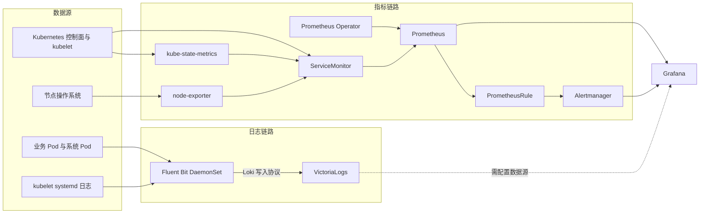

# 175.27.144.105 K3s 监控流程与方案

更新时间：2026-08-10 17:56 CST  
检查方式：以 `root` 通过 SSH 只读检查服务器及 Kubernetes 资源  
服务器目录：`/home/ubuntu/monitor`  
集群：单节点 K3s，节点名 `vm-16-13-ubuntu`

## 结论

这套监控由两条相互独立的链路组成：

- 指标链路：`kube-prometheus-stack`，负责 Kubernetes 和节点指标采集、规则计算、告警管理及 Grafana 展示。
- 日志链路：`Fluent Bit + VictoriaLogs`，负责采集容器日志和 kubelet 日志，并写入 VictoriaLogs。

2026-08-10 检查时，两条链路当前均能工作：Prometheus 的 12 个采集目标全部为 `up`；VictoriaLogs 健康，查询到约 2622 条日志；Fluent Bit 当前实例累计处理 2161 条记录，输出错误、重试和最终丢弃均为 0。

但它目前更接近“单机可用的基础监控”，还不是完整的生产级方案。主要缺口是：Alertmanager 没有实际通知接收端，Prometheus 与 Alertmanager 没有持久化存储，Grafana 和 VictoriaLogs 通过 NodePort 暴露，配置文件中存在明文弱口令，且目录中的日志存储配置与集群实际生效配置不一致。

## 目录结构与发布单元

`/home/ubuntu/monitor` 中的主要文件：

| 路径 | 作用 |
| --- | --- |
| `values.yaml` | `kube-prometheus-stack` 的自定义配置，主要替换镜像仓库并启用 Grafana 2Gi 持久化 |
| `kube-prometheus-stack/` | 解包后的 `kube-prometheus-stack` Chart，版本 `76.3.0` |
| `kube-prometheus-stack.tgz` | 指标监控 Chart 压缩包 |
| `log/fluent-bit-values.yaml` | Fluent Bit 输出到 VictoriaLogs 的配置 |
| `log/values.yaml` | VictoriaLogs 的自定义资源、Service 和存储配置 |
| `log/fluent-bit-0.57.9.tgz` | Fluent Bit Chart |
| `log/victoria-logs-single-0.13.9.tgz` | VictoriaLogs 单机版 Chart |
| `log/data/` | 计划供 VictoriaLogs 使用的宿主机目录，但当前实际工作负载未使用它 |

集群中实际存在 3 个 Helm release：

| Release | Namespace | 作用 | 当前状态 |
| --- | --- | --- | --- |
| `kps` | `monitoring` | Prometheus、Alertmanager、Grafana、Operator、exporter | `deployed` |
| `kps-log` | `monitoring` | VictoriaLogs 单机版 | `deployed` |
| `fluent-bit` | `monitoring` | 每节点日志采集 | `deployed`，当前 revision 9 |

说明：执行 `helm list -A` 时 Helm 报 Kubernetes API 资源发现错误，但 Kubernetes 中的 Helm release Secret 显示以上 release 均处于 `deployed`。这不影响当前 Pod 运行，但会影响后续使用 Helm 管理，升级前应先解决该兼容或客户端配置问题。

## 总体架构



## 指标监控流程

### 1. 指标来源

`kube-prometheus-stack` 默认创建一组 Kubernetes 监控对象，当前集群共有 13 个 `ServiceMonitor`、35 个 `PrometheusRule`，没有 `PodMonitor`。

主要指标来源包括：

- Kubernetes API Server、kubelet/cAdvisor、CoreDNS、etcd、scheduler、controller-manager、kube-proxy。
- `node-exporter`：采集节点 CPU、内存、磁盘、文件系统和网络指标。
- `kube-state-metrics`：把 Deployment、StatefulSet、DaemonSet、Pod、PVC 等 Kubernetes 对象状态转换成指标。
- Prometheus、Alertmanager 和 Operator 自身运行指标。

### 2. 服务发现与配置生成

Prometheus Operator 监听 `ServiceMonitor`、`PrometheusRule`、Prometheus 和 Alertmanager CRD。

当前 Prometheus 只选择带有 `release=kps` 标签的 `ServiceMonitor` 和 `PodMonitor`。Operator 根据这些对象生成 Prometheus 抓取配置和告警规则，并由 config-reloader 在配置变化时热加载。

这意味着以后接入业务应用监控时，业务的 `ServiceMonitor` 必须带 `release: kps`，否则不会被当前 Prometheus 发现。

### 3. 抓取、存储与查询

Prometheus 周期性拉取各目标的 `/metrics`。检查时 12 个 active target 全部为 `up`。

当前保留时间为 `10d`，但 Prometheus 没有 PVC，数据目录使用临时卷。Pod 被重新调度、重建或节点发生故障时，历史指标可能丢失。

Grafana 已通过自动 provisioning 接入：

- Prometheus：默认数据源，地址为集群内 Prometheus Service。
- Alertmanager：用于查看 Prometheus Alertmanager 告警。

Grafana 自身使用 2Gi `local-path` PVC，Dashboard、用户和手工配置可跨 Pod 重建保留。

### 4. 告警流程

Prometheus 根据 35 组默认 `PrometheusRule` 计算告警，覆盖节点、容器资源、Kubernetes 工作负载、存储、网络和监控组件自身。

触发后的理论流程是：

```text
指标异常 -> PrometheusRule 命中 -> Prometheus 产生告警
         -> Alertmanager 分组、抑制和去重 -> 通知接收端
```

当前 Alertmanager 的默认路由最终指向名为 `null` 的 receiver，没有配置飞书、邮件、短信或 Webhook。因此告警可以在 Prometheus、Alertmanager 或 Grafana 中看到，但不会主动通知运维人员。

Alertmanager 当前为单副本，也没有 PVC；重建后静默状态等运行数据可能丢失。

## 日志监控流程

### 1. 采集

Fluent Bit 以 DaemonSet 运行，每个节点一个实例。当前为单节点，因此只有一个 Pod。

它有两个输入：

- `tail`：读取 `/var/log/containers/*.log`，支持 Docker 和 CRI 多行日志格式。
- `systemd`：读取 `kubelet.service` 的 systemd journal。

容器日志经过 Kubernetes filter 处理：

- 根据日志文件和 Pod 信息补充 namespace、pod、container 等 Kubernetes 元数据。
- 合并应用输出的 JSON 日志。
- 允许 Pod annotation 控制 parser 和排除行为。

### 2. 传输

所有日志通过 Fluent Bit 的 Loki output 发送到：

```text
kps-log-victoria-logs-single-server.monitoring.svc.cluster.local:9428
/insert/loki/api/v1/push?_msg_field=log,MESSAGE,message
```

附加的索引标签包括：

- `job=fluentbit`
- `namespace`
- `pod`
- `container`

当前使用内存缓冲，`Mem_Buf_Limit` 为 5MB，没有启用磁盘缓冲。VictoriaLogs 短时不可用时 Fluent Bit 会重试；故障持续时间较长或缓冲耗尽时，存在日志丢失风险。

### 3. 存储与查询

VictoriaLogs 以单副本 StatefulSet 运行，实际使用 10Gi `local-path` PVC。Service 同时提供：

- 集群内端口：`9428`
- NodePort：`32263`

检查时健康接口返回 `OK`，LogSQL 查询返回约 2622 条记录，说明修正后的写入链路已经正常。

目录中的 `log/values.yaml` 写的是关闭 Chart PVC，并把宿主机 `/home/ubuntu/monitor/log/data` 挂载到 `/victorialogs`。但实际 StatefulSet 使用的是 10Gi PVC，没有挂载该 hostPath。这属于配置漂移：该文件可能未用于当前 release，或者 values 的字段未被 Chart 正确识别。下次升级前必须先用 `helm template` 验证渲染结果，避免误以为数据写在 `log/data/`。

### 4. 历史故障与当前状态

VictoriaLogs 日志显示，2026-08-10 08:25 UTC 左右曾收到大量 `/loki/api/v1/push` 请求并返回 `unsupported path`。这说明 Fluent Bit 早期配置缺少 `/insert` 前缀，日志当时未成功写入。

当前 ConfigMap 已使用正确的 `/insert/loki/api/v1/push`，Fluent Bit 在 08:40 UTC 左右重启后生效。检查当前实例得到：

- 已处理输出记录：2161。
- 输出错误：0。
- 重试：0。
- 最终放弃批次：0。
- 最近 45 分钟未发现新的 unsupported path 或输出错误。

Grafana 自动 provisioning 的 ConfigMap 中只发现 Prometheus 和 Alertmanager，没有发现 VictoriaLogs 数据源。VictoriaLogs 日志中存在查询请求，说明有人或某个组件进行过查询；是否已在 Grafana 中手工添加 VictoriaLogs 数据源，尚未验证。

## 当前组件与资源

| 组件 | 版本/镜像 | 副本与存储 | 暴露方式 |
| --- | --- | --- | --- |
| Prometheus | `v3.5.0` | 1 个 StatefulSet Pod；无 PVC；保留 10d | ClusterIP，9090 |
| Alertmanager | `v0.28.1` | 1 个 StatefulSet Pod；无 PVC | ClusterIP，9093 |
| Prometheus Operator | `v0.84.1` | 1 个 Deployment Pod | ClusterIP webhook，443 |
| Grafana | `12.1.0` | 1 个 Deployment Pod；2Gi local-path PVC | NodePort `30841`，HTTP |
| kube-state-metrics | `v2.16.0` | 1 个 Deployment Pod | ClusterIP，8080 |
| node-exporter | `v1.9.1` | DaemonSet，当前 1 个 Pod | ClusterIP，9100 |
| Fluent Bit | `5.0.9` | DaemonSet，当前 1 个 Pod；内存缓冲 | ClusterIP，2020 |
| VictoriaLogs | `v1.52.0` | 1 个 StatefulSet Pod；10Gi local-path PVC | NodePort `32263`，HTTP |

集群本身是单节点 K3s `v1.36.2+k3s1`。所有监控组件、数据和控制面都在同一台机器上，因此该方案能监控应用异常，但无法在整台服务器宕机时继续采集或发送告警。

## 风险与缺口

### 高优先级

1. **没有有效告警出口**：Alertmanager receiver 为 `null`，故障不会主动通知任何人。
2. **Grafana 凭据不安全**：`/home/ubuntu/monitor/values.yaml` 中存在明文、弱强度管理员密码。本文不记录具体值。应立即轮换，并改为 Kubernetes Secret 或外部密钥管理。
3. **VictoriaLogs 直接通过 NodePort 暴露**：服务本身未见认证和 TLS 配置。如果云安全组或主机防火墙放行 `32263`，日志查询及写入接口可能被未授权访问。
4. **Prometheus 数据不持久**：Pod 重建后 10 天保留策略没有实际保障，历史指标可能全部丢失。

### 中优先级

1. **Alertmanager 单副本且不持久化**：静默和通知状态不可靠。
2. **Fluent Bit 只有内存缓冲**：日志后端故障期间存在丢日志风险。
3. **配置漂移**：`log/values.yaml` 描述的 hostPath 与实际 PVC 不一致，无法仅凭目录文件可靠重建现状。
4. **日志数据源未纳入自动配置**：未发现 VictoriaLogs provisioning ConfigMap，手工配置难以重建和审计。
5. **NodePort 使用明文 HTTP**：Grafana 通过 `30841` 暴露，没有统一入口、TLS 和访问控制策略。
6. **单节点、local-path 存储**：节点或本地磁盘故障会同时影响监控与被监控对象。
7. **镜像来源不完全统一**：主组件使用国内镜像代理，但 sidecar、config-reloader、Fluent Bit 和 VictoriaLogs 仍直接依赖外部 registry，重新拉取时可能受网络影响。

## 建议的目标方案

### 阶段一：先保证安全和告警可达

1. 立即轮换 Grafana 管理员密码，从 `values.yaml` 删除明文密码，改用已存在的 Secret 或外部 Secret。
2. 将 Grafana 和 VictoriaLogs Service 改为 `ClusterIP`，统一通过 Traefik Ingress 暴露。
3. Ingress 配置 HTTPS；Grafana启用登录认证；VictoriaLogs 增加 Basic Auth、OAuth2 Proxy、IP 白名单或 VPN 访问限制。
4. 为 Alertmanager 增加飞书机器人、邮件或其他 Webhook receiver，并发送一条测试告警验证完整链路。
5. 从公网和服务器本机分别检查 `30841`、`32263` 是否可达，收紧云安全组和主机防火墙。

### 阶段二：补齐持久化和日志可靠性

1. 为 Prometheus 配置 PVC。单节点环境可从 20Gi～50Gi 起步，再根据每日增长量调整；保留期建议明确为 15～30 天。
2. 为 Alertmanager 配置 1Gi～2Gi PVC；如果继续单节点，至少保证 Pod 重建后静默信息不丢失。
3. 明确 VictoriaLogs 使用 PVC 还是固定 hostPath，只保留一种方式，并让实际 Helm values 与集群一致。
4. 根据日志增长量设置 VictoriaLogs 保留策略和磁盘水位告警，避免 10Gi PVC 被写满。
5. 给 Fluent Bit 启用 filesystem buffering，并把存储队列挂载到可控目录。
6. 把 VictoriaLogs 数据源写成 Grafana provisioning ConfigMap，不依赖页面手工配置。

### 阶段三：配置即代码和业务监控

1. 将三个 release 的 values、安装命令、Chart 版本和变更记录纳入 Git；敏感信息只保留 Secret 引用。
2. 升级前固定执行 `helm lint`、`helm template` 和 diff，确认 PVC、Service、Ingress 等关键资源不会被意外替换。
3. 为业务服务统一提供 `/metrics`，为每个应用创建带 `release: kps` 标签的 `ServiceMonitor`。
4. 增加业务告警：接口错误率、P95/P99 延迟、请求量、任务积压、数据库连接池、关键业务成功率。
5. 建立统一 Dashboard：集群总览、节点资源、工作负载、应用 SLI、日志检索、监控组件自监控。
6. 增加黑盒探测或外部探针。从另一台机器监测服务器公网入口，解决“服务器整体宕机时本机无法告警”的问题。

### 阶段四：需要更高可用性时

如果该环境承载生产业务，应考虑：

- 将 K3s 扩展为多节点，监控组件设置反亲和。
- 使用独立、可备份的存储，而不是单机 `local-path`。
- Prometheus 使用双副本配合 Thanos、Mimir 或 VictoriaMetrics 做长期存储和全局查询。
- Alertmanager 至少双副本组成集群。
- 将外部告警探针部署在另一台服务器或独立监控平台。

## 推荐的标准数据流

```text
业务与集群指标
  -> ServiceMonitor/PodMonitor
  -> Prometheus 拉取并存入持久卷
  -> PrometheusRule 计算
  -> Alertmanager 分组、去重、抑制
  -> 飞书/邮件/Webhook
  -> Grafana 查询展示

容器日志与 kubelet 日志
  -> Fluent Bit 采集、解析、补充 Kubernetes 标签
  -> 内存缓冲 + 磁盘缓冲
  -> VictoriaLogs 持久化与保留策略
  -> Grafana VictoriaLogs 数据源查询
```

## 建议的部署与变更流程

以下命令是根据目录结构整理的建议流程，执行前应先确认 Chart values 字段与当前版本匹配，不应直接在生产环境照抄升级。

```bash
cd /home/ubuntu/monitor

helm lint ./kube-prometheus-stack -f ./values.yaml
helm template kps ./kube-prometheus-stack \
  -n monitoring -f ./values.yaml > /tmp/kps-rendered.yaml

helm lint ./log/victoria-logs-single-0.13.9.tgz -f ./log/values.yaml
helm template kps-log ./log/victoria-logs-single-0.13.9.tgz \
  -n monitoring -f ./log/values.yaml > /tmp/kps-log-rendered.yaml

helm lint ./log/fluent-bit-0.57.9.tgz -f ./log/fluent-bit-values.yaml
helm template fluent-bit ./log/fluent-bit-0.57.9.tgz \
  -n monitoring -f ./log/fluent-bit-values.yaml > /tmp/fluent-bit-rendered.yaml
```

确认渲染结果、PVC、Service、Secret 引用和变更差异后，再执行对应的 `helm upgrade --install`。当前 `helm list` 存在 API 发现错误，必须先修复 Helm 管理问题，不能在该问题未解决时贸然升级。

## 验证清单

每次安装或升级后至少检查：

```bash
kubectl get pods -n monitoring -o wide
kubectl get svc,pvc -n monitoring
kubectl get prometheus,alertmanager,servicemonitor,prometheusrule -n monitoring

kubectl logs -n monitoring daemonset/fluent-bit --since=10m
kubectl logs -n monitoring statefulset/kps-log-victoria-logs-single-server --since=10m

curl -fsS http://127.0.0.1:32263/health
curl -fsSG http://127.0.0.1:32263/select/logsql/stats_query \
  --data-urlencode 'query=* | stats count() as records'
```

还应人工验证：

- Prometheus Targets 页面没有 `down`。
- Grafana 指标 Dashboard 有持续数据。
- Grafana 能按 namespace、pod、container 查询 VictoriaLogs。
- 人工触发测试告警后，Alertmanager 能向实际接收端发送并在恢复后通知。
- 重建 Prometheus、Alertmanager、Grafana、VictoriaLogs Pod 后，需要保留的数据仍然存在。
- 从未授权网络无法直接访问 Grafana 和 VictoriaLogs。

## 已确认事实与待确认项

已确认：

- 所有监控 Pod 在检查时为 `Running`。
- Prometheus Ready，12 个 active target 全部 `up`。
- VictoriaLogs 健康，当前已有日志记录。
- Fluent Bit 当前输出无错误、无重试、无放弃批次。
- Alertmanager 没有实际通知 receiver。
- Prometheus 和 Alertmanager 没有 PVC；Grafana 使用 2Gi PVC；VictoriaLogs 使用 10Gi PVC。
- Grafana 和 VictoriaLogs 使用 NodePort 暴露。
- 目录中的 Grafana 管理员密码以明文保存，本文未记录具体值。

尚未验证：

- 云安全组和主机防火墙是否允许公网访问 `30841`、`32263`。
- Grafana 页面中是否手工添加了 VictoriaLogs 数据源。
- VictoriaLogs 当前具体保留期限、日增长量和预计磁盘可用天数。
- 当前 `helm list` 报错的根因。
- 是否已有独立备份、恢复演练和外部存活探测。

