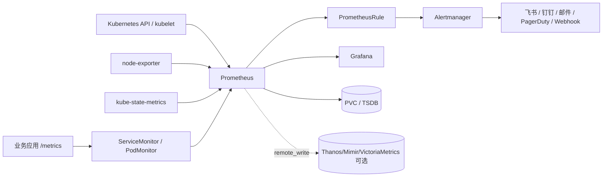

# Kubernetes Helm Prometheus + Grafana + Alertmanager 完整部署与告警方案

更新时间：2026-09-07
适用范围：通用 Kubernetes 集群，适用于测试、预生产和生产环境
部署方式：Helm + `prometheus-community/kube-prometheus-stack`
核心组件：Prometheus Operator、Prometheus、Alertmanager、Grafana、kube-state-metrics、node-exporter

> 本文是一份可执行的部署 Runbook。命令中的域名、StorageClass、镜像仓库、集群名、通知地址和资源值都必须按目标环境替换。文中没有连接或修改真实集群；“验证通过”只指命令或配置在静态层面成立，不能代替目标集群的实时验收。

## 1. 方案结论

推荐使用 `kube-prometheus-stack` 统一安装 Kubernetes 指标监控、规则和 Grafana。它适合大多数单集群场景，也能通过 `Prometheus`、`Alertmanager` 副本和外部长期存储扩展到更高可靠性。

| 能力 | 组件 | 负责内容 |
| --- | --- | --- |
| Kubernetes 对象状态 | kube-state-metrics | Deployment、Pod、Job、PVC、Node 等对象的期望状态与实际状态 |
| 节点指标 | node-exporter | CPU、内存、磁盘、文件系统、网络等 Linux 主机指标 |
| 容器和 kubelet 指标 | kubelet/cAdvisor | 容器 CPU、内存、重启、网络和运行时指标 |
| 指标采集与短期存储 | Prometheus | 通过 ServiceMonitor、PodMonitor 和 Kubernetes 服务发现拉取 `/metrics` |
| 规则计算 | Prometheus Operator + PrometheusRule | Recording Rule 和 Alerting Rule |
| 告警聚合通知 | Alertmanager | 分组、路由、抑制、静默、重复提醒和恢复通知 |
| 可视化 | Grafana | PromQL 查询、仪表盘、Explore、告警查看 |
| 应用监控 | 应用 `/metrics` + ServiceMonitor/PodMonitor | 请求量、错误率、延迟、业务成功率等 |
| 外部探测 | Blackbox Exporter（需单独安装） | HTTP、TCP、DNS、ICMP、TLS 证书探测 |
| 长期存储/跨集群 | Thanos、Mimir 或 VictoriaMetrics（可选） | 长期保留、全局查询、HA 副本去重 |

### 1.1 Chart 的边界

`kube-prometheus-stack` 不是所有 Prometheus 周边组件的集合：它不默认安装 Prometheus Adapter 和 Blackbox Exporter。需要 Kubernetes HPA 外部指标或 HTTP/TCP 探测时，应单独安装并配置对应组件。

Chart、镜像和 CRD 会持续更新，不在文档中硬编码“永远正确”的最新版本。部署前必须执行 `helm search repo ... --versions`，选定经过测试的 Chart 版本并写入发布记录。

### 1.2 推荐的生产数据流



### 1.3 告警责任边界

- Prometheus 判断某个 PromQL 条件是否满足，并维护 `pending`、`firing` 状态。
- Alertmanager 不重新计算 PromQL，只处理 Prometheus 发来的告警。
- Grafana 负责查询和展示；Grafana-managed alert 与 PrometheusRule 不要对同一条件重复计算，否则会产生重复通知。
- 采集组件健康、目标 `up`、规则计算失败和 Alertmanager 自身状态都必须纳入监控，否则“监控平台挂了”时可能没有任何业务告警。

## 2. 生产前提与容量规划

### 2.1 部署前必须确认

```bash
kubectl version
kubectl config current-context
kubectl auth can-i create -n monitoring prometheus.monitoring.coreos.com
kubectl get nodes -o wide
kubectl get storageclass
kubectl get ingressclass
helm version
```

记录以下信息：

| 项目 | 示例 | 未确认时的风险 |
| --- | --- | --- |
| Kubernetes 版本与发行版 | `v1.29.x`、RKE2、K3s、EKS | CRD、Webhook、API 指标和安全策略差异 |
| 当前 context | `prod-cluster` | 误装到错误集群 |
| CRI | containerd、CRI-O | kubelet/cAdvisor 指标和日志路径差异 |
| CNI | Calico、Cilium、云厂商 CNI | 网络策略与网络指标差异 |
| CSI/StorageClass | `csi-ceph-rbd` | PVC Pending、数据丢失或性能不足 |
| Ingress Controller | ingress-nginx、Traefik、Gateway API | Grafana/Alertmanager 入口配置不兼容 |
| 镜像仓库 | `registry.example.com` | 生产节点无法拉取公网镜像 |
| 通知通道 | SMTP、飞书/钉钉 Webhook、值班平台 | 告警触发但没人收到 |
| GitOps 归属 | Argo CD、Flux、Helm 手工 | 手工改动被回滚 |
| 保留周期与指标量 | 15 天、active series 数 | PVC 不足或 Prometheus 内存过高 |

### 2.2 初始资源建议

以下只是起点，不是正式配额。应根据 `prometheus_tsdb_head_series`、抓取耗时、查询延迟和磁盘增长调整。

| 组件 | 小型集群（起点） | 关键扩容信号 |
| --- | --- | --- |
| Prometheus | 2～4 CPU、4～8Gi 内存、100Gi PVC | Head series、WAL、规则评估延迟、查询超时 |
| Alertmanager | 100m～500m CPU、256Mi～1Gi、2Gi PVC | 通知失败、集群成员不一致、silence 数量 |
| Grafana | 500m～1 CPU、512Mi～2Gi、5～10Gi PVC | 查询慢、渲染超时、SQLite 锁等待 |
| kube-state-metrics | 100m～500m CPU、256Mi～1Gi | API 请求错误、内存增长 |
| node-exporter | 每节点 50m～200m CPU、64～256Mi | DaemonSet 不就绪、host mount 权限 |
| Operator | 100m～500m CPU、256～512Mi | CRD reconcile 错误、Webhook 错误 |

容量估算不能只看节点数。指标量受采集目标、label 基数、采集间隔、应用自定义标签和规则结果影响。高基数标签（request ID、用户 ID、完整 URL、Pod UID）会快速消耗内存和磁盘，生产中应在应用或 `metricRelabelings` 中限制。

## 3. 仓库与目录约定

建议把 Helm 参数、规则、通知模板和仪表盘放进 Git：

```text
monitoring/
├── README.md
├── values-prod.yaml
├── rules/
│   ├── kubernetes-alerts.yaml
│   └── application-alerts.yaml
├── alertmanager/
│   └── webhook-secret.example.yaml
├── dashboards/
│   └── <dashboard-configmap>.yaml
└── ingress/
    └── monitoring-ingress.yaml
```

敏感信息不能进入 Git：Grafana 管理员密码、SMTP 密码、飞书/钉钉签名、Webhook Token、OAuth Client Secret 和云厂商凭据应使用 Kubernetes Secret、External Secrets、Vault 或云密钥管理服务。

## 4. Helm Chart 预检与版本固定

### 4.1 添加仓库并查看版本

```bash
helm repo add prometheus-community https://prometheus-community.github.io/helm-charts
helm repo update
helm search repo prometheus-community/kube-prometheus-stack --versions | head -n 20
export KPS_CHART_VERSION='<经过测试的 chart 版本>'
helm show chart prometheus-community/kube-prometheus-stack --version "$KPS_CHART_VERSION"
helm show values prometheus-community/kube-prometheus-stack --version "$KPS_CHART_VERSION" > /tmp/kube-prometheus-stack-values.yaml
```

不要直接把 `latest` 作为生产镜像或 Chart 版本。Chart 版本、Prometheus Operator 版本、Prometheus/Alertmanager/Grafana 镜像版本和 Kubernetes 版本要在测试环境做兼容性验证。

### 4.2 集群现有 CRD 检查

```bash
kubectl get crd | grep monitoring.coreos.com || true
kubectl get prometheus,alertmanager,servicemonitor,podmonitor,prometheusrule -A 2>/dev/null || true
helm list -A | grep -E 'prometheus|grafana|monitoring' || true
```

若集群已有 Prometheus Operator 或同名 CRD，不要直接安装第二套 Operator。先确定由哪个 Helm Release/GitOps 应用管理，再决定复用、迁移或隔离。

## 5. 创建 Namespace 和敏感 Secret

### 5.1 Namespace

```bash
kubectl create namespace monitoring --dry-run=client -o yaml | kubectl apply -f -
kubectl label namespace monitoring pod-security.kubernetes.io/enforce=baseline --overwrite
kubectl label namespace monitoring pod-security.kubernetes.io/audit=restricted --overwrite
```

`restricted` 是否可用取决于 Chart 的 hostNetwork、hostPID、hostPath 和 exporter 安全配置。不要为了绕过拒绝而直接把整个 Namespace 改成 `privileged`；应先阅读 Pod 的具体拒绝原因。

### 5.2 Grafana 管理员 Secret

下面命令只在终端临时生成 Secret，不把密码写入文件。生产环境建议由密钥管理系统生成。

```bash
kubectl -n monitoring create secret generic grafana-admin \
  --from-literal=admin-user='admin' \
  --from-literal=admin-password='<change-me>' \
  --dry-run=client -o yaml | kubectl apply -f -
```

### 5.3 Alertmanager Webhook Secret

使用 `url_file` 时，Alertmanager 会从挂载的 Secret 文件读取地址；这样可以避免把 URL、签名或 Token 放入 values 文件。示例中的地址是占位符，不能直接发送通知。

```bash
kubectl -n monitoring create secret generic alertmanager-webhook \
  --from-literal=url='https://notify.example.invalid/webhook/<token>' \
  --dry-run=client -o yaml | kubectl apply -f -
```

如果通知平台需要自定义请求体、签名或加密，优先使用内部通知网关，由网关持有外部凭据；不要把凭据暴露给所有监控 Pod。

## 6. 生产版 values.yaml

以下配置覆盖单集群生产常见需求：持久化、15 天保留、默认规则、应用 ServiceMonitor/PodMonitor 可发现、Grafana 持久化、Alertmanager Webhook、资源限制和入口占位。请先根据目标 Chart 版本运行 `helm template`，确认字段仍存在。

保存为 `values-prod.yaml`：

```yaml
defaultRules:
  create: true
  rules:
    alertmanager: true
    etcd: true
    general: true
    k8s: true
    kubeApiserverAvailability: true
    kubeApiserverBurnrate: true
    kubeApiserverHistogram: true
    kubeApiserverSlos: true
    kubeControllerManager: true
    kubelet: true
    kubeProxy: true
    kubePrometheusGeneral: true
    kubePrometheusNodeRecording: true
    kubernetesApps: true
    kubernetesResources: true
    kubernetesStorage: true
    kubernetesSystem: true
    kubeScheduler: true
    kubeStateMetrics: true
    network: true
    node: true
    nodeExporterAlerting: true
    nodeExporterRecording: true
    prometheus: true
    prometheusOperator: true

prometheusOperator:
  enabled: true
  admissionWebhooks:
    enabled: true
  tls:
    enabled: true
  resources:
    requests:
      cpu: 100m
      memory: 256Mi
    limits:
      cpu: 500m
      memory: 512Mi

prometheus:
  enabled: true
  service:
    type: ClusterIP
  ingress:
    enabled: false
  prometheusSpec:
    replicas: 1
    retention: 15d
    retentionSize: 80GB
    scrapeInterval: 30s
    evaluationInterval: 30s
    scrapeTimeout: 10s
    walCompression: true
    externalLabels:
      cluster: prod-cluster
      environment: production
    # 单集群集中管理时允许发现所有 Namespace 的监控 CR；多租户环境应改为显式 label selector。
    serviceMonitorSelectorNilUsesHelmValues: false
    podMonitorSelectorNilUsesHelmValues: false
    ruleSelectorNilUsesHelmValues: false
    serviceMonitorNamespaceSelector: {}
    podMonitorNamespaceSelector: {}
    ruleNamespaceSelector: {}
    storageSpec:
      volumeClaimTemplate:
        spec:
          storageClassName: <storage-class>
          accessModes:
            - ReadWriteOnce
          resources:
            requests:
              storage: 100Gi
    resources:
      requests:
        cpu: 2
        memory: 4Gi
      limits:
        cpu: 4
        memory: 8Gi
    podAntiAffinity: "soft"
    securityContext:
      runAsNonRoot: true
      runAsUser: 65534
      fsGroup: 65534
    # 需要长期存储时在这里增加 remoteWrite；认证信息应通过 Secret 引用。
    # remoteWrite:
    #   - url: https://metrics.example.com/api/v1/write

alertmanager:
  enabled: true
  config:
    global:
      resolve_timeout: 5m
    route:
      receiver: default-webhook
      group_by: ["alertname", "cluster", "namespace", "severity"]
      group_wait: 30s
      group_interval: 5m
      repeat_interval: 4h
      routes:
        - receiver: critical-webhook
          matchers:
            - severity = critical
          repeat_interval: 1h
        - receiver: warning-webhook
          matchers:
            - severity = warning
          repeat_interval: 6h
    inhibit_rules:
      - source_matchers:
          - severity = critical
        target_matchers:
          - severity =~ warning|info
        equal: ["alertname", "cluster", "namespace"]
      - source_matchers:
          - alertname = KubeNodeNotReady
        target_matchers:
          - alertname =~ KubePod.*|KubeDeployment.*
        equal: ["cluster", "node"]
    receivers:
      - name: default-webhook
        webhook_configs:
          - url_file: /etc/alertmanager/secrets/alertmanager-webhook/url
            send_resolved: true
      - name: critical-webhook
        webhook_configs:
          - url_file: /etc/alertmanager/secrets/alertmanager-webhook/url
            send_resolved: true
      - name: warning-webhook
        webhook_configs:
          - url_file: /etc/alertmanager/secrets/alertmanager-webhook/url
            send_resolved: true
  alertmanagerSpec:
    replicas: 1
    retention: 120h
    secrets:
      - alertmanager-webhook
    resources:
      requests:
        cpu: 100m
        memory: 256Mi
      limits:
        cpu: 500m
        memory: 512Mi
    storage:
      volumeClaimTemplate:
        spec:
          storageClassName: <storage-class>
          accessModes:
            - ReadWriteOnce
          resources:
            requests:
              storage: 2Gi
    podAntiAffinity: "soft"

grafana:
  enabled: true
  admin:
    existingSecret: grafana-admin
    userKey: admin-user
    passwordKey: admin-password
  persistence:
    enabled: true
    type: pvc
    storageClassName: <storage-class>
    accessModes:
      - ReadWriteOnce
    size: 10Gi
  resources:
    requests:
      cpu: 500m
      memory: 512Mi
    limits:
      cpu: 1
      memory: 2Gi
  grafana.ini:
    server:
      root_url: https://grafana.example.com
    users:
      allow_sign_up: false
    auth.anonymous:
      enabled: false
    security:
      disable_gravatar: true
  sidecar:
    dashboards:
      enabled: true
      label: grafana_dashboard
      searchNamespace: ALL
    datasources:
      enabled: true
  ingress:
    enabled: false
    ingressClassName: nginx
    hosts:
      - grafana.example.com
    tls:
      - secretName: grafana-tls
        hosts:
          - grafana.example.com

kubeStateMetrics:
  enabled: true

prometheus-node-exporter:
  enabled: true
  resources:
    requests:
      cpu: 100m
      memory: 128Mi
    limits:
      cpu: 200m
      memory: 256Mi

prometheus-pushgateway:
  enabled: false
```

### 6.1 values 的关键风险

- `retentionSize` 和 PVC 容量必须同时规划；只设置保留天数不能保证磁盘不会被写满。
- `serviceMonitorSelectorNilUsesHelmValues: false` 会放宽发现范围。多租户集群应使用明确的 `matchLabels` 和 `ruleNamespaceSelector`，防止任意 Namespace 把高基数指标接入中心 Prometheus。
- `externalLabels.cluster` 必须稳定且唯一。HA 或多集群汇聚时不能依赖 Pod 名称识别来源。
- `podAntiAffinity` 只影响调度，不等同于跨可用区高可用；需要 `topologySpreadConstraints`、PDB 和多个可用区策略时应单独设计。
- Grafana 管理员 Secret 的 key 名称必须与 `userKey`、`passwordKey` 一致。
- `url_file` 只解决 Secret 读取，不会自动把飞书、钉钉、邮件协议转换成目标平台需要的签名格式；通常需要通知网关或平台原生 receiver。

## 7. 渲染、静态检查与 Helm 部署

### 7.1 渲染检查

```bash
helm lint prometheus-community/kube-prometheus-stack \
  --version "$KPS_CHART_VERSION" \
  -f values-prod.yaml

helm template kps prometheus-community/kube-prometheus-stack \
  --namespace monitoring \
  --version "$KPS_CHART_VERSION" \
  -f values-prod.yaml > /tmp/kps-rendered.yaml

rg -n 'image:|storageClassName:|retention|url_file|grafana|alertmanager|prometheusSpec' /tmp/kps-rendered.yaml | head -n 120

kubectl apply --dry-run=server -f /tmp/kps-rendered.yaml
```

`helm lint` 和 `kubectl apply --dry-run=server` 只证明模板和 API schema 基本可接受，不能证明 PVC 能绑定、镜像能拉取、Webhook 可访问、指标能采集或通知能送达。

### 7.2 安装

```bash
helm upgrade --install kps prometheus-community/kube-prometheus-stack \
  --namespace monitoring \
  --create-namespace \
  --version "$KPS_CHART_VERSION" \
  --values values-prod.yaml \
  --wait \
  --timeout 15m

helm status kps -n monitoring
helm history kps -n monitoring
```

如果集群无法访问公网，先将 Chart 和所有镜像同步到内部仓库，再在每个节点或运行时导入准确的镜像 `tag`/digest。只配置 Docker Hub mirror 不能覆盖 `quay.io`、`registry.k8s.io` 或其他镜像域名。

### 7.3 部署后检查

```bash
kubectl get pods -n monitoring -o wide
kubectl get pvc -n monitoring
kubectl get svc -n monitoring
kubectl get prometheus,alertmanager -n monitoring
kubectl get servicemonitor,podmonitor,prometheusrule -A

kubectl wait --for=condition=Ready pod \
  -l app.kubernetes.io/instance=kps \
  -n monitoring --timeout=15m

kubectl get events -n monitoring --sort-by=.lastTimestamp | tail -n 50
```

`Running` 不等于采集成功。继续完成 Prometheus Targets、查询返回、Grafana 数据源和真实告警通知验收。

## 8. 访问 Prometheus、Grafana 与 Alertmanager

### 8.1 临时端口转发

```bash
kubectl -n monitoring port-forward svc/kps-kube-prometheus-stack-prometheus 9090:9090
kubectl -n monitoring port-forward svc/kps-grafana 3000:80
kubectl -n monitoring port-forward svc/kps-kube-prometheus-stack-alertmanager 9093:9093
```

不同 Chart 版本的 Service 名称可能不同，应以 `kubectl get svc -n monitoring` 的实际结果为准。端口转发只适合临时诊断，不是生产入口。

### 8.2 Ingress 示例

如果使用 ingress-nginx，建议只暴露 Grafana，Prometheus 和 Alertmanager 通过 VPN、零信任网关或内部网络访问。TLS Secret 应由 cert-manager 或密钥管理流程创建。

```yaml
apiVersion: networking.k8s.io/v1
kind: Ingress
metadata:
  name: grafana
  namespace: monitoring
  annotations:
    cert-manager.io/cluster-issuer: letsencrypt-prod
spec:
  ingressClassName: nginx
  tls:
    - hosts:
        - grafana.example.com
      secretName: grafana-tls
  rules:
    - host: grafana.example.com
      http:
        paths:
          - path: /
            pathType: Prefix
            backend:
              service:
                name: kps-grafana
                port:
                  number: 80
```

如果同时暴露 Prometheus 或 Alertmanager，必须增加认证、IP 白名单、审计和最小权限；不要把默认管理员账号直接暴露到公网。

## 9. 应用指标接入

### 9.1 应用需要提供什么

业务应用至少应提供：

- `/metrics`，响应 `200`、`Content-Type: text/plain; version=0.0.4` 或兼容格式。
- 稳定、低基数的 `service`、`namespace`、`job`、`instance`、`method`、`route`、`status_code` 标签。
- Counter 使用 `_total` 后缀，Histogram 使用 `_bucket`、`_sum`、`_count`。
- 不要把完整 URL、用户 ID、订单号、Trace ID、异常堆栈放进 label。

### 9.2 ServiceMonitor 示例

应用 Service 必须有稳定的 selector；`ServiceMonitor.spec.selector` 选择的是 Service 标签，不是 Pod 标签。

```yaml
apiVersion: monitoring.coreos.com/v1
kind: ServiceMonitor
metadata:
  name: checkout
  namespace: checkout
  labels:
    team: platform
    release: kps
spec:
  namespaceSelector:
    matchNames:
      - checkout
  selector:
    matchLabels:
      app.kubernetes.io/name: checkout
  endpoints:
    - port: http
      path: /metrics
      interval: 30s
      scrapeTimeout: 10s
      scheme: http
      relabelings:
        - sourceLabels: [__meta_kubernetes_pod_node_name]
          targetLabel: node
```

### 9.3 PodMonitor 示例

没有稳定 Service 或需要直接抓 Pod 时使用 PodMonitor，但要谨慎控制 namespace 和 label，避免把临时调试 Pod 作为长期目标。

```yaml
apiVersion: monitoring.coreos.com/v1
kind: PodMonitor
metadata:
  name: worker
  namespace: worker
  labels:
    team: platform
    release: kps
spec:
  namespaceSelector:
    matchNames:
      - worker
  selector:
    matchLabels:
      app.kubernetes.io/name: worker
  podMetricsEndpoints:
    - port: metrics
      path: /metrics
      interval: 30s
```

### 9.4 接入验收

```bash
kubectl apply -f checkout-servicemonitor.yaml
kubectl get servicemonitor -n checkout checkout -o yaml

# 在 Prometheus UI 的 /targets 查看状态，也可以直接调用 API
kubectl -n monitoring port-forward svc/kps-kube-prometheus-stack-prometheus 9090:9090
curl -sS 'http://127.0.0.1:9090/api/v1/targets?state=active' | jq '.data.activeTargets[] | {scrapeUrl,health,lastError,labels}'
curl -sS --get 'http://127.0.0.1:9090/api/v1/query' \
  --data-urlencode 'query=up{namespace="checkout"}' | jq .
```

只看到 ServiceMonitor 对象、HTTP 200 或 Prometheus Pod Ready 都不能证明应用指标进入 TSDB。必须看到目标 `health=up`、目标指标查询有样本，并在 Grafana 中用同一查询返回非空结果。

## 10. PrometheusRule 告警规则

### 10.1 规则设计规范

每条生产告警至少包含：

- `severity`：`critical`、`warning` 或 `info`。
- `team`、`service`、`env`、`cluster`：用于路由和负责人识别。
- `summary`：一行说明异常对象。
- `description`：给出当前值、阈值和排查方向。
- `runbook_url`：指向本知识库或服务 Runbook。
- `for`：避免单次抖动触发；但不要用过长 `for` 掩盖真正的故障。

标签是路由维度，注释是人读信息。不要把动态数值、时间戳和完整日志写入 label。

### 10.2 Kubernetes 与平台告警示例

保存为 `rules/kubernetes-alerts.yaml`：

```yaml
apiVersion: monitoring.coreos.com/v1
kind: PrometheusRule
metadata:
  name: platform-custom-alerts
  namespace: monitoring
  labels:
    release: kps
    role: alert-rules
spec:
  groups:
    - name: kubernetes.workload
      interval: 30s
      rules:
        - alert: KubePodCrashLoopingCustom
          expr: |
            max_over_time(kube_pod_container_status_waiting_reason{reason="CrashLoopBackOff"}[5m]) >= 1
          for: 10m
          labels:
            severity: warning
            team: platform
            service: kubernetes
          annotations:
            summary: Pod 处于 CrashLoopBackOff
            description: 'Pod {{ $labels.namespace }}/{{ $labels.pod }} 的容器 {{ $labels.container }} 持续重启。'
            runbook_url: https://runbooks.example.com/kubernetes/crashloopbackoff

        - alert: KubeDeploymentReplicasMismatchCustom
          expr: |
            kube_deployment_spec_replicas{namespace!=""}
            != kube_deployment_status_replicas_available{namespace!=""}
          for: 15m
          labels:
            severity: warning
            team: platform
            service: kubernetes
          annotations:
            summary: Deployment 可用副本不足
            description: 'Deployment {{ $labels.namespace }}/{{ $labels.deployment }} 的期望副本与可用副本不一致。'
            runbook_url: https://runbooks.example.com/kubernetes/deployment

        - alert: KubeNodeNotReadyCustom
          expr: |
            kube_node_status_condition{condition="Ready",status="true"} == 0
          for: 10m
          labels:
            severity: critical
            team: platform
            service: kubernetes
          annotations:
            summary: Kubernetes 节点未就绪
            description: '节点 {{ $labels.node }} Ready 条件为 false。'
            runbook_url: https://runbooks.example.com/kubernetes/node-not-ready

        - alert: KubePersistentVolumeAlmostFullCustom
          expr: |
            kubelet_volume_stats_available_bytes
            / kubelet_volume_stats_capacity_bytes < 0.15
          for: 15m
          labels:
            severity: warning
            team: platform
            service: storage
          annotations:
            summary: PVC 可用空间不足
            description: 'PVC {{ $labels.namespace }}/{{ $labels.persistentvolumeclaim }} 可用空间低于 15%。'
            runbook_url: https://runbooks.example.com/kubernetes/pvc-capacity

        - alert: KubeContainerOOMKilledCustom
          expr: |
            increase(kube_pod_container_status_restarts_total[10m]) > 0
            and on(namespace, pod, container)
            kube_pod_container_status_last_terminated_reason{reason="OOMKilled"} == 1
          for: 5m
          labels:
            severity: warning
            team: platform
            service: kubernetes
          annotations:
            summary: 容器因 OOMKilled 重启
            description: '容器 {{ $labels.namespace }}/{{ $labels.pod }}/{{ $labels.container }} 最近 10 分钟发生 OOMKilled。'
            runbook_url: https://runbooks.example.com/kubernetes/oomkilled

    - name: monitoring.platform
      interval: 30s
      rules:
        - alert: PrometheusTargetDownCustom
          expr: |
            100 * (count by (job) (up == 0) / count by (job) (up)) > 10
          for: 10m
          labels:
            severity: critical
            team: platform
            service: monitoring
          annotations:
            summary: Prometheus 目标大量不可用
            description: '任务 {{ $labels.job }} 超过 10% 的目标 down。请检查 Targets、网络、证书和服务端口。'
            runbook_url: https://runbooks.example.com/monitoring/targets

        - alert: PrometheusRuleEvaluationFailingCustom
          expr: |
            increase(prometheus_rule_evaluation_failures_total[5m]) > 0
          for: 5m
          labels:
            severity: critical
            team: platform
            service: monitoring
          annotations:
            summary: Prometheus 规则评估失败
            description: 'Prometheus 在最近 5 分钟出现规则评估失败。请检查 Prometheus 日志、规则语法和查询超时。'
            runbook_url: https://runbooks.example.com/monitoring/rules

        - alert: PrometheusTSDBCompactionFailingCustom
          expr: |
            increase(prometheus_tsdb_compactions_failed_total[1h]) > 0
          for: 15m
          labels:
            severity: critical
            team: platform
            service: monitoring
          annotations:
            summary: Prometheus TSDB 压缩失败
            description: 'Prometheus 最近 1 小时发生 TSDB 压缩失败，需检查磁盘、文件系统和 WAL。'
            runbook_url: https://runbooks.example.com/monitoring/tsdb
```

`kube_pod_container_status_last_terminated_reason`、`kubelet_volume_stats_*` 和控制面指标是否存在，取决于 kube-state-metrics、kubelet 配置、权限和发行版。应用这些规则前先用 Prometheus 查询验证指标名和 label；不存在的指标会使告警变成“永不触发”，而不是证明系统健康。

### 10.3 业务 SLO 告警示例

业务指标名称和标签必须由应用团队确认。下面假设应用暴露：

- `http_requests_total{service,route,method,status_code}`
- `http_request_duration_seconds_bucket{service,route,le}`

```yaml
apiVersion: monitoring.coreos.com/v1
kind: PrometheusRule
metadata:
  name: checkout-slo-alerts
  namespace: monitoring
  labels:
    release: kps
spec:
  groups:
    - name: checkout.slo
      interval: 30s
      rules:
        - alert: CheckoutHigh5xxRate
          expr: |
            sum by (service, route) (rate(http_requests_total{service="checkout",status_code=~"5.."}[5m]))
            /
            sum by (service, route) (rate(http_requests_total{service="checkout"}[5m])) > 0.05
          for: 10m
          labels:
            severity: critical
            team: checkout
            service: checkout
          annotations:
            summary: Checkout 5xx 比例超过 5%
            description: '服务 {{ $labels.service }} 路由 {{ $labels.route }} 最近 5 分钟错误率超过 5%。'
            runbook_url: https://runbooks.example.com/checkout/5xx

        - alert: CheckoutHighP99Latency
          expr: |
            histogram_quantile(
              0.99,
              sum by (service, route, le) (
                rate(http_request_duration_seconds_bucket{service="checkout"}[5m])
              )
            ) > 1
          for: 10m
          labels:
            severity: warning
            team: checkout
            service: checkout
          annotations:
            summary: Checkout P99 延迟超过 1 秒
            description: '服务 {{ $labels.service }} 路由 {{ $labels.route }} 的 P99 延迟持续超过 1 秒。'
            runbook_url: https://runbooks.example.com/checkout/latency
```

没有经过应用团队确认的指标名和阈值只能作为模板，不能直接当成生产规则。

### 10.4 应用规则并检查

```bash
kubectl apply -f rules/kubernetes-alerts.yaml
kubectl apply -f rules/application-alerts.yaml

kubectl get prometheusrule -n monitoring
kubectl describe prometheusrule platform-custom-alerts -n monitoring

# 查看 Prometheus Operator 和规则加载相关日志
kubectl logs -n monitoring deploy/kps-kube-prometheus-stack-operator --since=10m | tail -n 100
kubectl logs -n monitoring statefulset/prometheus-kps-kube-prometheus-stack-prometheus --since=10m | tail -n 100
```

通过 Prometheus UI 的 `/rules` 或 API 检查规则是否加载；若 `PrometheusRule` 对象存在但 `/rules` 没有，优先检查 `ruleSelector`、namespace selector、label 和 Operator 日志。

## 11. Alertmanager 路由、抑制和通知验收

### 11.1 路由设计

建议按以下层次设计：

```text
severity=critical  -> 值班电话/即时消息 + 邮件，1 小时重复
severity=warning   -> 团队群 + 邮件，6 小时重复
severity=info      -> 低频汇总或只在 Grafana 展示
team/service       -> 分发到对应负责人
cluster/namespace  -> 分组，避免一条故障产生几十条消息
```

抑制规则只用于有明确因果关系的告警。例如节点 NotReady 时抑制该节点上的 Pod 级告警；不要把所有 warning 都用 critical 抑制，否则会丢失独立故障。

### 11.2 Alertmanager 状态检查

```bash
kubectl -n monitoring port-forward svc/kps-kube-prometheus-stack-alertmanager 9093:9093
curl -sS http://127.0.0.1:9093/-/ready
curl -sS http://127.0.0.1:9093/api/v2/status | jq '.cluster,.config'
curl -sS http://127.0.0.1:9093/api/v2/alerts | jq .
```

配置错误时，Alertmanager 可能保持旧配置并在日志中报错；不能只看 Helm upgrade 成功。检查：

```bash
kubectl logs -n monitoring statefulset/alertmanager-kps-kube-prometheus-stack-alertmanager --since=15m
kubectl get secret -n monitoring alertmanager-kps-kube-prometheus-stack-alertmanager -o jsonpath='{.data.alertmanager\.yaml}' | base64 -d
```

Secret 名称因 Chart 版本而异，以 `kubectl get secret -n monitoring | grep alertmanager` 为准；输出中的 URL、Token 和密码不要复制到工单或聊天。

### 11.3 从 pending 到恢复的真实验收

只读查看当前状态：

```bash
curl -sS --get http://127.0.0.1:9090/api/v1/query \
  --data-urlencode 'query=ALERTS{alertstate="firing"}' | jq .
```

在测试集群或隔离测试 Namespace 创建临时规则：

```bash
kubectl apply -f - <<'EOF'
apiVersion: monitoring.coreos.com/v1
kind: PrometheusRule
metadata:
  name: alertmanager-delivery-test
  namespace: monitoring
  labels:
    release: kps
spec:
  groups:
    - name: delivery-test
      rules:
        - alert: AlertmanagerDeliveryTest
          expr: vector(1)
          for: 30s
          labels:
            severity: warning
            team: platform
            service: monitoring
          annotations:
            summary: Alertmanager 通知链路测试
            description: 这是临时测试告警，验证后删除。
EOF
```

验收顺序：

1. `/rules` 能看到规则并进入 `pending`。
2. 超过 `for` 后进入 `firing`。
3. Prometheus `/api/v1/alerts` 能看到告警。
4. Alertmanager `/api/v2/alerts` 能看到告警。
5. 目标通知渠道收到 firing 消息。
6. 删除临时规则后，告警进入 resolved，收到恢复消息。
7. 记录告警到达时间、通知延迟、消息内容和恢复时间。

测试结束后删除临时规则：

```bash
kubectl delete prometheusrule alertmanager-delivery-test -n monitoring
```

如果只看到 Prometheus 告警而没有通知，沿着 `Prometheus -> Alertmanager Service -> Alertmanager route -> egress/DNS/TLS -> 通知平台` 逐段检查，不要直接修改阈值掩盖通知故障。

## 12. Grafana 配置、仪表盘与权限

### 12.1 Prometheus 数据源

Chart 通常会自动创建 Prometheus 数据源。进入 Grafana 后确认：

1. `Connections` → `Data sources` 中存在 Prometheus。
2. URL 使用集群内 Service，例如 `http://kps-kube-prometheus-stack-prometheus.monitoring.svc:9090`；实际名称以 Service 列表为准。
3. `Save & test` 返回成功。
4. Explore 执行 `up`、`count({__name__=~".+"})` 等查询有结果。

`Save & test` 成功只表示 Grafana 能访问数据源，不代表目标指标、规则和业务面板都正确。

### 12.2 推荐仪表盘

- 集群总览：节点数、Pod 状态、CPU/内存、API Server 和告警摘要。
- 节点详情：CPU、内存、Load、磁盘、inode、网络错误和文件描述符。
- Workload/Pod：Deployment 副本、重启、CPU/内存 requests/limits、容器状态。
- 存储：PVC 使用率、吞吐、IOPS、延迟、Volume 绑定状态。
- Prometheus 自监控：Head series、WAL、抓取耗时、规则评估、查询并发。
- Alertmanager：活跃告警、通知失败、静默和集群成员。

仓库中已有可复用的 Kubernetes 和 Node Exporter 仪表盘 JSON，但导入后仍需绑定当前 Prometheus 数据源，并按实际 label 修正变量。仪表盘静态导入成功不代表面板查询一定返回数据。

### 12.3 Grafana 权限

- 禁止匿名访问和自助注册。
- 管理员账号只用于初始化；日常使用 SSO/OIDC 或最小权限用户。
- 按团队建立 Folder/Team 权限，限制写入数据源和告警规则的权限。
- 生产 Grafana 使用 PVC；SQLite 不适合多副本并发写入，HA 场景使用外部 PostgreSQL/MySQL 并按 Grafana 官方兼容矩阵配置。
- 将 Dashboard JSON、数据源和 Folder 配置纳入 Git；不要只在 UI 手工修改后不留记录。

## 13. 高可用与长期存储

### 13.1 Prometheus HA

将 `prometheus.prometheusSpec.replicas` 改为 2，并配置反亲和与稳定的 `externalLabels`：

```yaml
prometheus:
  prometheusSpec:
    replicas: 2
    externalLabels:
      cluster: prod-cluster
      environment: production
      prometheus_replica_group: primary
    podAntiAffinity: hard
```

两个 Prometheus 副本会分别抓取并存储数据。通过普通 Service 查询不能自动去重；Grafana 可能看到重复 series。需要 Thanos Query、Mimir、VictoriaMetrics 等支持副本去重的查询/存储层，或明确接受双份数据。

### 13.2 Alertmanager HA

```yaml
alertmanager:
  alertmanagerSpec:
    replicas: 3
    podAntiAffinity: hard
```

Alertmanager 通过集群协议同步告警状态和静默，但通知去重、网络连通和外部 URL 仍需实测。多副本需要跨节点/可用区调度、PDB 和持久化规划。

### 13.3 长期存储

Prometheus 本地 TSDB 适合短期快速查询，不建议把几十个月的历史全部留在单 Pod PVC。长期数据可通过 `remoteWrite` 发送到 Thanos Receive、Grafana Mimir 或 VictoriaMetrics；查询端再配置对应数据源。

远程写入验收必须同时检查：

- Prometheus `prometheus_remote_storage_samples_pending` 是否持续增长。
- `prometheus_remote_storage_samples_failed_total` 是否增加。
- 后端查询能否返回当前新写入样本。
- 后端权限、TLS、网络和限流是否正确。

## 14. 安全与网络策略

### 14.1 最小权限

- Operator、Prometheus、kube-state-metrics 和 node-exporter 的 ClusterRole 由 Chart 管理，升级前审查权限变化。
- 应用 ServiceMonitor 只访问 `/metrics`，不要给监控 Pod 业务写权限。
- Webhook/SMTP Secret 单独创建并限制读取范围。
- Prometheus 和 Alertmanager 的管理 API 不应直接暴露公网。

### 14.2 NetworkPolicy 思路

至少允许：

- Prometheus -> kubelet、kube-state-metrics、node-exporter、应用 metrics Service。
- Grafana -> Prometheus、Alertmanager。
- Prometheus -> Alertmanager。
- Alertmanager -> 通知网关或 SMTP/DNS。
- Operator -> API Server、Webhook Service。

启用 NetworkPolicy 前先确认 CNI 实际支持和默认拒绝行为；一条过宽的 egress 或缺失 DNS 放行都会造成“Pod Running 但 Targets 全 down”。

## 15. 升级、回滚、备份和卸载

### 15.1 升级前

```bash
helm repo update
helm search repo prometheus-community/kube-prometheus-stack --versions | head -n 20
helm get values kps -n monitoring -a > /tmp/kps-values-current.yaml
helm get manifest kps -n monitoring > /tmp/kps-manifest-current.yaml
kubectl get crd -o yaml | grep -n 'monitoring.coreos.com' | head
```

升级前阅读 Chart `README` 和版本说明，重点检查 CRD、Prometheus Operator、Grafana 子 Chart、Alertmanager 配置字段、Webhook 和弃用字段。生产升级先在同版本 Kubernetes 的测试集群执行。

### 15.2 升级

```bash
helm upgrade kps prometheus-community/kube-prometheus-stack \
  --namespace monitoring \
  --version "$NEW_KPS_CHART_VERSION" \
  --values values-prod.yaml \
  --wait \
  --timeout 20m

helm status kps -n monitoring
kubectl get pods -n monitoring
kubectl get prometheus,alertmanager -n monitoring
```

### 15.3 回滚

```bash
helm history kps -n monitoring
helm rollback kps <REVISION> -n monitoring --wait --timeout 20m
kubectl get events -n monitoring --sort-by=.lastTimestamp | tail -n 80
```

回滚 Helm Release 不一定回滚 CRD schema 或已经迁移的存储格式。对 CRD 和 Operator 升级必须先阅读兼容矩阵；不要在生产直接删除 CRD 试图“重置”。

### 15.4 备份

至少备份：

- `values-prod.yaml`、PrometheusRule、ServiceMonitor、PodMonitor、Ingress 和 Secret 的元数据。
- Grafana Dashboard JSON、数据源和 Folder 配置。
- Prometheus/Alertmanager PVC 快照或远程长期存储数据。
- Alertmanager 静默、路由和通知模板。

Secret 备份必须使用加密的密钥管理系统，不能把明文 YAML 放到普通 Git 仓库。

### 15.5 卸载

```bash
helm uninstall kps -n monitoring
kubectl get pvc -n monitoring
kubectl get crd | grep monitoring.coreos.com
```

Helm 卸载是否保留 CRD 和 PVC 取决于 Chart 与资源回收策略。卸载前先确认是否还有其他 Prometheus Operator、ServiceMonitor、PrometheusRule 或长期存储依赖；不要直接删除 Namespace 作为第一步。

## 16. 离线或私有镜像仓库部署

### 16.1 需要盘点的镜像

```bash
helm template kps prometheus-community/kube-prometheus-stack \
  --namespace monitoring \
  --version "$KPS_CHART_VERSION" \
  -f values-prod.yaml > /tmp/kps-rendered.yaml

rg -o '([a-zA-Z0-9._-]+/)+[a-zA-Z0-9._-]+:[a-zA-Z0-9._-]+' /tmp/kps-rendered.yaml | sort -u
```

实际还要检查 initContainer、Webhook patch Job、Grafana sidecar、kube-state-metrics 和 node-exporter 的镜像。把每个镜像同步到内部 Registry 后，用 Chart 对应的 values 覆盖 `repository`、`tag` 和 `registry` 字段；不要只修改 Prometheus 主镜像。

### 16.2 节点导入与验证

以 containerd 为例，导入命令因发行版和权限不同而异：

```bash
crictl images | grep -E 'prometheus|grafana|alertmanager|node-exporter|kube-state-metrics'
kubectl describe pod -n monitoring <pod-name> | sed -n '/Events:/,$p'
```

`ImagePullBackOff` 要区分：镜像不存在、Registry 认证失败、DNS/网络超时、证书不信任和架构不匹配。不能只通过重启 Pod 解决。

## 17. 常见故障排查

### 17.1 Pod Pending

```bash
kubectl describe pod -n monitoring <pod-name>
kubectl get pvc -n monitoring
kubectl describe pvc -n monitoring <pvc-name>
kubectl get nodes --show-labels
```

重点看：StorageClass 不存在、容量不足、节点污点、亲和规则过严、资源 requests 超过集群余量。

### 17.2 Pod CrashLoopBackOff

```bash
kubectl logs -n monitoring <pod-name> --previous
kubectl logs -n monitoring <pod-name> --all-containers --since=30m
kubectl describe pod -n monitoring <pod-name>
```

优先按错误类型分流：配置解析错误、权限/文件系统、证书、端口冲突、OOMKilled、探针失败。

### 17.3 Prometheus Targets 全部 down

```bash
kubectl get servicemonitor,podmonitor -A
kubectl get svc,endpointslice -A | grep -E 'metrics|exporter|kps'
kubectl exec -n monitoring <prometheus-pod> -- wget -qO- http://<metrics-service>.<namespace>.svc:<port>/metrics | head
kubectl logs -n monitoring <prometheus-pod> --since=15m | grep -Ei 'scrape|timeout|tls|forbidden|context deadline'
```

排查顺序：发现 selector -> Service/EndpointSlice -> DNS -> NetworkPolicy -> TLS/认证 -> 应用 `/metrics` 响应。只有目标健康且查询有样本，才能认为采集恢复。

### 17.4 Grafana No data

```bash
kubectl get secret,configmap -n monitoring | grep -i grafana
kubectl logs -n monitoring deploy/kps-grafana --since=15m
curl -sS --get http://127.0.0.1:9090/api/v1/query \
  --data-urlencode 'query=up' | jq '.data.result | length'
```

确认时间范围、数据源 UID、PromQL 指标名、label 和 recording rule 是否存在。面板名称和 HTTP 200 不能证明查询语义正确。

### 17.5 告警未触发

```bash
curl -sS http://127.0.0.1:9090/api/v1/rules | jq '.data.groups[] | {name, rules}'
curl -sS --get http://127.0.0.1:9090/api/v1/query \
  --data-urlencode 'query=<告警表达式>' | jq .
kubectl get prometheusrule -A -o yaml
```

检查规则是否被 selector 选中、表达式当前是否返回样本、`for` 是否已满足、是否被静默或抑制。不存在的指标和 label 拼写错误是最常见原因。

### 17.6 告警 firing 但没人收到

```bash
curl -sS http://127.0.0.1:9093/api/v2/alerts | jq .
kubectl logs -n monitoring statefulset/alertmanager-kps-kube-prometheus-stack-alertmanager --since=30m | grep -Ei 'notify|error|webhook|smtp|tls'
kubectl exec -n monitoring <alertmanager-pod> -- sh -c 'test -r /etc/alertmanager/secrets/alertmanager-webhook/url && echo secret-readable'
```

检查 receiver 名称、matchers、通知 URL、Secret 挂载、DNS、egress、TLS、平台签名格式和 HTTP 响应码。不要在日志中打印完整 URL Token。

### 17.7 Operator/Webhook 错误

```bash
kubectl logs -n monitoring deploy/kps-kube-prometheus-stack-operator --since=30m
kubectl get validatingwebhookconfiguration,mutatingwebhookconfiguration | grep -i prometheus
kubectl get endpoints -n monitoring | grep -i operator
```

如果 API Server 无法访问 Webhook，PrometheusRule、ServiceMonitor 等对象可能无法创建或更新。检查 Service、EndpointSlice、证书、NetworkPolicy 和 API Server 到 Pod 的网络路径。

## 18. 验收清单

### 18.1 部署层

- [ ] Helm Chart 版本、镜像版本、Kubernetes 版本已记录。
- [ ] `helm lint` 和 `helm template` 通过。
- [ ] Prometheus、Alertmanager、Grafana、Operator、kube-state-metrics、node-exporter Pod Ready。
- [ ] Prometheus 和 Grafana PVC 已绑定，容量和 StorageClass 符合预期。
- [ ] 没有持续的 ImagePullBackOff、CrashLoopBackOff、OOMKilled 或 Webhook 错误。

### 18.2 采集层

- [ ] Prometheus `/targets` 的关键目标为 `up`。
- [ ] `up`、节点、Pod、PVC 和容器查询返回非空数据。
- [ ] 应用 ServiceMonitor/PodMonitor 被发现，业务 `/metrics` 可访问。
- [ ] 采集失败、抓取超时和规则评估失败指标没有持续增长。

### 18.3 展示层

- [ ] Grafana 数据源 Save & test 成功。
- [ ] 集群、节点、工作负载、存储和 Prometheus 自监控面板有真实数据。
- [ ] 仪表盘变量能切换实际 Namespace、Node、Pod 和 Service。
- [ ] Grafana 入口已启用 TLS、认证和最小权限。

### 18.4 告警层

- [ ] PrometheusRule 在 `/rules` 加载。
- [ ] 测试告警完成 `pending -> firing -> resolved`。
- [ ] Alertmanager API 能看到告警并按预期分组、路由、抑制。
- [ ] 通知渠道收到 firing 和 resolved 消息。
- [ ] 记录告警到达时间、接收时间、恢复时间和负责人。

### 18.5 运维层

- [ ] values、规则、仪表盘和路由已纳入 Git/GitOps。
- [ ] Secret 不在 Git、工单和聊天中泄露。
- [ ] 已制定 PVC、Grafana 数据库和长期存储备份策略。
- [ ] 已演练 Helm upgrade、rollback、节点故障和通知渠道故障。
- [ ] 已设置磁盘、WAL、active series、抓取失败和通知失败告警。

## 19. 最小命令集

```bash
# 版本与上下文
kubectl version
kubectl config current-context
helm version

# 仓库与版本
helm repo add prometheus-community https://prometheus-community.github.io/helm-charts
helm repo update
helm search repo prometheus-community/kube-prometheus-stack --versions | head

# 部署
kubectl create namespace monitoring --dry-run=client -o yaml | kubectl apply -f -
helm upgrade --install kps prometheus-community/kube-prometheus-stack \
  -n monitoring --create-namespace \
  --version "$KPS_CHART_VERSION" \
  -f values-prod.yaml --wait --timeout 15m

# 状态
helm status kps -n monitoring
kubectl get pods,pvc,svc -n monitoring
kubectl get prometheus,alertmanager -n monitoring
kubectl get servicemonitor,podmonitor,prometheusrule -A

# 临时访问
kubectl -n monitoring port-forward svc/kps-kube-prometheus-stack-prometheus 9090:9090
kubectl -n monitoring port-forward svc/kps-grafana 3000:80
kubectl -n monitoring port-forward svc/kps-kube-prometheus-stack-alertmanager 9093:9093

# Prometheus API
curl -sS http://127.0.0.1:9090/-/ready
curl -sS --get http://127.0.0.1:9090/api/v1/query --data-urlencode 'query=up' | jq .
curl -sS http://127.0.0.1:9090/api/v1/targets | jq .

# Alertmanager API
curl -sS http://127.0.0.1:9093/-/ready
curl -sS http://127.0.0.1:9093/api/v2/alerts | jq .
```

## 20. 官方参考与版本边界

- [prometheus-community/helm-charts：kube-prometheus-stack README](https://github.com/prometheus-community/helm-charts/tree/main/charts/kube-prometheus-stack)
- [kube-prometheus-stack values.yaml](https://github.com/prometheus-community/helm-charts/blob/main/charts/kube-prometheus-stack/values.yaml)
- [Prometheus Operator 文档](https://prometheus-operator.dev/docs/)
- [Prometheus 配置与告警规则](https://prometheus.io/docs/prometheus/latest/configuration/alerting_rules/)
- [Alertmanager 配置](https://prometheus.io/docs/alerting/latest/configuration/)
- [Grafana Kubernetes Monitoring](https://grafana.com/docs/grafana/latest/installation/helm/)

### 版本和验证声明

- 本文按 2026-09-07 可见的官方 Chart 结构编写，但没有在真实集群执行安装；目标环境落地前必须重新核对 Chart values、CRD、镜像仓库和 Kubernetes 版本兼容性。
- 文中的阈值是生产起点，不是通用标准。应结合历史基线、SLO、容量和业务高峰校准。
- 静态 YAML、Helm 渲染、Pod Ready、HTTP 200 和 Grafana 面板导入都不能单独证明端到端监控成功；必须完成真实目标采集、PromQL 非空查询和 firing/resolved 通知验收。
