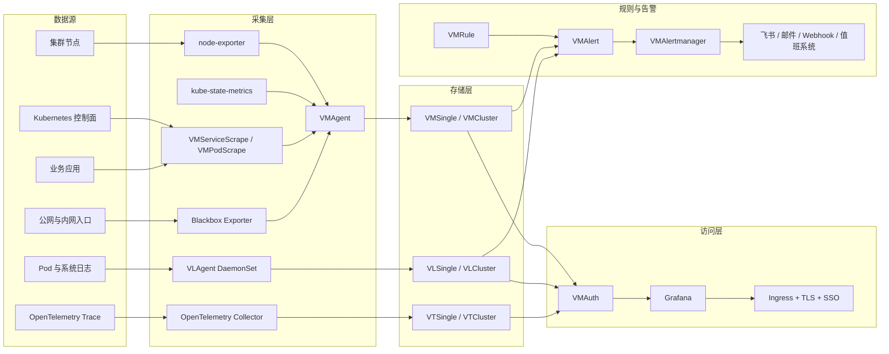

# Kubernetes + Helm Victoria 全栈生产级监控方案

更新时间：2026-08-10
适用范围：通用 Kubernetes 集群，不绑定具体云厂商、服务器或业务系统
部署方式：Helm + VictoriaMetrics Operator
目标：使用 VictoriaMetrics、VictoriaLogs 和 VictoriaTraces 建设统一的指标、日志、告警、探测和链路追踪体系

## 1. 方案结论

推荐以官方 `victoria-metrics-k8s-stack` 为核心，采用下面的组件组合：

| 能力 | 组件 | 作用 |
| --- | --- | --- |
| 指标采集 | VMAgent | 发现并抓取 Kubernetes、节点和业务指标，远程写入 VictoriaMetrics |
| 指标存储 | VMSingle / VMCluster | 保存和查询时序指标，支持 PromQL 和 MetricsQL |
| 规则计算 | VMAlert | 计算指标和日志告警规则，将告警发送给 Alertmanager |
| 告警管理 | VMAlertmanager | 分组、去重、抑制、静默和通知 |
| 日志采集 | VLAgent | DaemonSet 采集 Kubernetes Pod 日志，补充元数据并提供磁盘缓冲 |
| 日志存储 | VLSingle / VLCluster | 保存日志并通过 LogsQL 查询 |
| 链路追踪 | VTSingle / VTCluster | 可选，保存 OpenTelemetry Trace，通过 Jaeger 兼容接口查询 |
| 统一展示 | Grafana | 查询 VictoriaMetrics、VictoriaLogs、VictoriaTraces 和 Alertmanager |
| 集群状态 | kube-state-metrics | 提供 Kubernetes 对象状态指标 |
| 节点状态 | node-exporter | 提供节点 CPU、内存、磁盘和网络指标 |
| 外部探测 | Blackbox Exporter + VMProbe | HTTP、TCP、DNS、ICMP 和 TLS 证书探测 |
| 安全入口 | VMAuth + Ingress | 统一认证、租户路由、访问隔离和 TLS 入口 |

推荐分两档部署：

- **标准版**：VMSingle + VLSingle + VMAgent + VLAgent + VMAlert + 单副本 Alertmanager/Grafana。适合开发、测试和中小规模生产集群。
- **高可用版**：VMCluster + VLCluster + 多副本 VMAgent/VMAlert/Alertmanager + VMAuth + 多副本 Grafana。适合关键生产、多租户或数据量较大的集群。

VictoriaLogs 官方建议：单机版能通过增加 CPU、内存和磁盘满足需求时，优先使用 VLSingle；只有达到单节点垂直扩展上限或有明确高可用要求时，再使用 VLCluster。指标存储也建议先根据规模选择，避免小集群直接引入不必要的分布式复杂度。

## 2. 为什么采用 Victoria 方案

### 2.1 主要优势

- 指标、日志和 Trace 可以由同一个 Operator 和 K8s Stack Chart 统一管理。
- VMAgent 与 VLAgent 都是独立采集层，存储后端维护时可以缓冲并在恢复后补发。
- VictoriaMetrics 兼容 Prometheus 抓取协议、PromQL 和 remote write，业务改造成本较低。
- VictoriaMetrics Operator 可以把 `ServiceMonitor`、`PodMonitor`、`PrometheusRule`、`Probe` 转换成对应的 VictoriaMetrics CR。
- 支持原生 `VMServiceScrape`、`VMPodScrape`、`VMRule`、`VMProbe`、`VMAlertmanagerConfig`。
- `victoria-metrics-k8s-stack` 自带 Kubernetes Dashboard、采集配置和告警规则。
- 同时启用指标和日志时，Stack 可以通过内部 VMAuth 为 VMAlert 路由 MetricsQL 与 LogsQL 查询。
- 启用 VictoriaLogs 后，Stack 可以自动配置 Grafana 日志数据源。
- VictoriaTraces 使用 Jaeger 兼容查询接口，Grafana 不需要额外 Trace 数据源插件。

### 2.2 需要接受的成本

- VictoriaMetrics CRD 和 Operator 需要单独管理升级生命周期。
- LogsQL、MetricsQL、VMRule 等需要团队建立使用规范。
- VictoriaLogs Grafana 数据源需要安装 `victoriametrics-logs-datasource` 插件。
- 从 Prometheus Operator 迁移时，需要明确 CRD 转换、OwnerReference 和删除同步策略。
- 集群版包含多个组件，容量、反亲和、复制因子和存储规划要求更高。

## 3. 建设目标

### 3.1 必须具备

- Kubernetes 控制面、节点、工作负载、容器、存储和网络监控。
- 业务请求量、错误率、延迟、资源饱和度和核心业务成功率。
- 容器标准输出日志集中采集、脱敏、持久化和检索。
- 告警分级、聚合、抑制、恢复通知、负责人和处理手册。
- HTTP/TCP/DNS/TLS 证书有效期和关键入口探测。
- Grafana 统一展示指标、日志、Trace 和告警。
- Helm values、VMRule、Dashboard、数据源和探测配置全部进入 Git。
- 持久化、容量告警、备份、升级回滚和恢复演练。

### 3.2 可选增强

- OpenTelemetry 链路追踪。
- 多集群指标、日志和 Trace 汇总。
- VMAuth 多租户隔离。
- 基于 SLO 和错误预算的燃烧率告警。
- 告警值班系统、自动升级通知和工单联动。
- vmbackupmanager 自动备份和恢复编排。

## 4. 总体架构



## 5. 数据流程

### 5.1 指标流程

```text
Kubernetes / node-exporter / kube-state-metrics / 业务 /metrics
  -> VMServiceScrape、VMPodScrape、VMNodeScrape、VMProbe
  -> VMAgent 服务发现和抓取
  -> 本地持久队列
  -> VMSingle 或 VMCluster vminsert
  -> MetricsQL / PromQL 查询
  -> Grafana Dashboard
```

### 5.2 告警流程

```text
VMRule
  -> VMAlert 定期查询 VictoriaMetrics 或 VictoriaLogs
  -> 告警分组与状态计算
  -> VMAlertmanager 去重、抑制、静默和路由
  -> 飞书 / 邮件 / Webhook / 值班系统
  -> 告警恢复通知
```

### 5.3 日志流程

```text
Kubernetes Pod stdout/stderr
  -> VLAgent Kubernetes Collector
  -> CRI 解析、Pod 元数据补充、字段过滤和脱敏
  -> hostPath 持久检查点与磁盘缓冲
  -> VLSingle 或 VLCluster vlinsert
  -> LogsQL 查询
  -> Grafana Explore / Dashboard / VMAlert 日志告警
```

### 5.4 Trace 流程

```text
应用 OpenTelemetry SDK
  -> OTLP gRPC/HTTP
  -> OpenTelemetry Collector
  -> 采样、批处理、脱敏和资源属性补充
  -> VTSingle 或 VTCluster
  -> Jaeger 兼容查询接口
  -> Grafana
```

## 6. 部署档位

### 6.1 标准版

适用条件：

- 3～20 个节点。
- 指标 active series 少于约 100 万。
- 日志量低于约 100GB/天。
- 可以接受监控组件短时间维护窗口。
- 没有严格的监控平台多可用区要求。

建议组件：

| 组件 | 副本 | 初始资源建议 | 初始存储建议 |
| --- | ---: | --- | --- |
| VictoriaMetrics Operator | 1 | 200m～500m CPU，256～512Mi | 无 |
| VMAgent | 1～2 | 500m～2 CPU，512Mi～2Gi | 5～20Gi 队列 |
| VMSingle | 1 | 2～4 CPU，4～8Gi | 100～300Gi，保留 15～30 天 |
| VMAlert | 1 | 200m～1 CPU，256Mi～1Gi | 无 |
| VMAlertmanager | 1 | 100m～500m CPU，256～512Mi | 2～5Gi |
| VLSingle | 1 | 2～4 CPU，4～8Gi | 按日志增长量，建议 100Gi 起 |
| VLAgent | 每节点 1 个 | 100m～500m CPU，128～512Mi | 每节点 1～10Gi 缓冲 |
| Grafana | 1 | 500m～1 CPU，512Mi～1Gi | 5～10Gi |
| Blackbox Exporter | 1～2 | 100m～500m CPU，128～256Mi | 无 |
| VTSingle | 1，可选 | 1～2 CPU，2～4Gi | 20～100Gi，保留 3～7 天起 |

### 6.2 高可用版

适用条件：

- 关键生产或多租户平台。
- 监控中断会直接影响故障发现和应急处置。
- 单机存储容量、写入量或查询压力已经接近上限。
- 需要组件故障、节点故障时继续采集和查询。

建议组件：

| 组件 | 高可用设计 |
| --- | --- |
| Operator | 独立 Namespace，1～2 副本；Webhook 和 PDB 按版本能力配置 |
| VMAgent | 至少 2 副本；根据抓取分片策略避免无意重复抓取或明确接受双写 |
| VMCluster | `vminsert`、`vmselect` 至少 2 副本；`vmstorage` 至少 3 副本；复制因子按故障域设计 |
| VMAlert | 2 副本；使用相同 external labels，通知端进行去重或按官方 HA 方式配置 |
| VMAlertmanager | 3 副本组成集群，跨节点或跨可用区调度 |
| VLAgent | 每节点 DaemonSet，持久磁盘缓冲，可配置多目标写入 |
| VLCluster | `vlinsert`、`vlselect` 多副本；`vlstorage` 至少 3 副本；复制因子与存储故障域一致 |
| VMAuth | 至少 2 副本，统一代理指标、日志和 Trace 读写入口 |
| Grafana | 2 个及以上副本，使用外部 PostgreSQL，不使用共享 SQLite |
| VTCluster | 可选；insert、select 多副本，storage 至少 3 副本 |
| Ingress | 至少 2 副本，配置 TLS、SSO、限流和访问控制 |

高可用不是简单把所有 `replicaCount` 调成 2。必须同时处理：

- 数据复制因子。
- Pod 反亲和和 topology spread。
- StorageClass 故障域。
- VMAgent 重复抓取与重复写入。
- VMAlert 重复通知。
- Alertmanager 集群通信。
- VMAuth 路由和租户隔离。

## 7. Namespace 与 Helm release 规划

推荐拆成两个 Namespace：

| Namespace | 内容 |
| --- | --- |
| `vm-operator` | VictoriaMetrics Operator 和 CRD 生命周期相关组件 |
| `observability` | VMAgent、VMSingle/VMCluster、VMAlert、Alertmanager、VictoriaLogs、Grafana 等 |

推荐 release：

| Helm release | Chart | 说明 |
| --- | --- | --- |
| `vm-operator` | `vm/victoria-metrics-operator` | 独立安装 Operator，便于管理 CR 和 Namespace 删除顺序 |
| `vm-stack` | `vm/victoria-metrics-k8s-stack` | Kubernetes 指标、日志、Trace、规则、Dashboard 和 Victoria CR |
| `blackbox-exporter` | `prometheus-community/prometheus-blackbox-exporter` | 外部探测 |
| `otel-collector` | `open-telemetry/opentelemetry-collector` | 可选 OTLP 接收和处理 |

`victoria-metrics-k8s-stack` 默认可以把 Operator 作为依赖安装。生产环境建议将 Operator 单独部署，并在 Stack values 中关闭其 Operator 依赖。这样删除业务 Stack 或整个 `observability` Namespace 时，不会因为 Operator 先被删除导致受管 CR 清理顺序失控。

## 8. Git 仓库结构

```text
observability/
├── README.md
├── chart-versions.yaml
├── environments/
│   ├── dev/
│   │   ├── operator.values.yaml
│   │   ├── vm-stack.values.yaml
│   │   ├── blackbox.values.yaml
│   │   └── otel-collector.values.yaml
│   └── prod/
│       ├── operator.values.yaml
│       ├── vm-stack.values.yaml
│       ├── blackbox.values.yaml
│       └── otel-collector.values.yaml
├── manifests/
│   ├── vmservicescrapes/
│   ├── vmpodscrapes/
│   ├── vmprobes/
│   ├── vmrules/
│   ├── alertmanager/
│   ├── dashboards/
│   ├── ingress/
│   └── network-policies/
├── secrets.example/
└── scripts/
    ├── lint.sh
    ├── render.sh
    ├── diff.sh
    └── verify.sh
```

生产环境必须锁定 Chart 版本：

```yaml
# chart-versions.yaml
victoriaMetricsOperator: "<经过测试的版本>"
victoriaMetricsK8sStack: "<经过测试的版本>"
blackboxExporter: "<经过测试的版本>"
opentelemetryCollector: "<经过测试的版本>"
```

禁止在 Git 中保存：

- Grafana 管理员密码。
- Alertmanager Webhook、邮件密码和 Token。
- VMAuth 用户密码。
- 对象存储密钥。
- TLS 私钥。
- Kubernetes ServiceAccount Token。

## 9. Helm 仓库初始化

```bash
helm repo add vm https://victoriametrics.github.io/helm-charts/
helm repo add prometheus-community https://prometheus-community.github.io/helm-charts
helm repo add open-telemetry https://open-telemetry.github.io/opentelemetry-helm-charts
helm repo update

kubectl create namespace vm-operator
kubectl create namespace observability
```

正式环境中，Namespace、ResourceQuota、LimitRange、NetworkPolicy 和 Secret 引用也应纳入 GitOps，而不是长期依赖手工创建。

## 10. CRD 与 Operator 管理

### 10.1 Operator 独立安装

```bash
helm upgrade --install vm-operator vm/victoria-metrics-operator \
  --namespace vm-operator \
  --create-namespace \
  --version <locked-version> \
  -f environments/prod/operator.values.yaml \
  --atomic \
  --timeout 15m
```

Stack values 中关闭内置 Operator：

```yaml
victoria-metrics-operator:
  enabled: false
```

具体字段名必须以锁定 Chart 版本的 values 为准。

### 10.2 CRD 升级

Helm 默认不会自动升级已经存在的 CRD。升级 VictoriaMetrics K8s Stack 前必须执行：

```bash
helm show crds vm/victoria-metrics-k8s-stack \
  --version <target-version> \
  | kubectl diff -f -

helm show crds vm/victoria-metrics-k8s-stack \
  --version <target-version> \
  | kubectl apply -f - --server-side
```

执行前必须：

- 阅读目标 Chart 和 Operator 版本升级说明。
- 备份现有 CR 和 values。
- 在测试集群验证 CRD schema 变化。
- 检查废弃字段和转换行为。
- 确认 GitOps 控制器不会回滚 CRD。

## 11. 标准版 Stack values 基线

下面是结构示例，不是可直接照抄的最终 values。VictoriaMetrics Chart 更新较快，部署时必须基于锁定版本执行 `helm show values`、`helm lint` 和 `helm template`。

```yaml
nameOverride: vmks

victoria-metrics-operator:
  enabled: false

vmsingle:
  enabled: true
  spec:
    retentionPeriod: "30d"
    resources:
      requests:
        cpu: "2"
        memory: 4Gi
      limits:
        cpu: "4"
        memory: 8Gi
    storage:
      storageClassName: "<storage-class>"
      accessModes:
        - ReadWriteOnce
      resources:
        requests:
          storage: 300Gi

vmcluster:
  enabled: false

vmagent:
  enabled: true
  spec:
    scrapeInterval: 30s
    externalLabels:
      cluster: "<cluster-name>"
      environment: prod
    resources:
      requests:
        cpu: 500m
        memory: 512Mi
      limits:
        cpu: "2"
        memory: 2Gi

vmalert:
  enabled: true
  spec:
    evaluationInterval: 30s
    resources:
      requests:
        cpu: 200m
        memory: 256Mi
      limits:
        cpu: "1"
        memory: 1Gi

alertmanager:
  enabled: true
  spec:
    replicaCount: 1
    storage:
      volumeClaimTemplate:
        spec:
          storageClassName: "<storage-class>"
          accessModes:
            - ReadWriteOnce
          resources:
            requests:
              storage: 5Gi

vlsingle:
  enabled: true
  spec:
    retentionPeriod: "30d"
    resources:
      requests:
        cpu: "2"
        memory: 4Gi
      limits:
        cpu: "4"
        memory: 8Gi
    storage:
      storageClassName: "<storage-class>"
      accessModes:
        - ReadWriteOnce
      resources:
        requests:
          storage: 300Gi

vlcluster:
  enabled: false

vlagent:
  enabled: true
  spec:
    k8sCollector:
      enabled: true

vtsingle:
  enabled: false

vtcluster:
  enabled: false

grafana:
  enabled: true
  plugins:
    - victoriametrics-logs-datasource
  persistence:
    enabled: true
    storageClassName: "<storage-class>"
    size: 10Gi
  admin:
    existingSecret: grafana-admin
    userKey: admin-user
    passwordKey: admin-password
  service:
    type: ClusterIP
  ingress:
    enabled: true
    ingressClassName: "<ingress-class>"
    hosts:
      - grafana.example.com
    tls:
      - secretName: grafana-tls
        hosts:
          - grafana.example.com
```

需要重点核对：

- `retentionPeriod` 在目标组件和版本中的格式。
- `storage` 与 `volumeClaimTemplate` 的实际字段层级。
- VMAlertmanager 的副本和存储字段。
- VLAgent 磁盘缓冲目录及 hostPath 配置。
- Grafana 插件是否能从当前网络和镜像环境安装。
- 默认数据源是否自动指向正确的 VMSingle/VLSingle/VTSingle。

## 12. 高可用版设计

### 12.1 VMCluster

推荐起点：

- `vminsert`：2～3 副本。
- `vmselect`：2～3 副本。
- `vmstorage`：至少 3 副本。
- replication factor：根据允许丢失的 storage 节点数量设计。
- 每个 vmstorage 使用独立 PVC。
- vmstorage 跨节点、跨可用区调度。
- VMAuth 为写入端和查询端提供统一入口。

容量规划必须明确：

- 每秒写入样本数。
- active series。
- 查询并发和查询时间范围。
- 保留期。
- 数据复制带来的额外磁盘占用。
- 节点故障后的剩余容量。

### 12.2 VLCluster

推荐起点：

- `vlinsert`：2～3 副本。
- `vlselect`：2～3 副本。
- `vlstorage`：至少 3 副本。
- 每个 vlstorage 使用独立 PVC。
- 配置复制因子和跨故障域调度。
- VMAuth 统一日志写入和查询入口。
- 对大查询配置限流、并发限制和超时。

不要仅因为“生产环境”就直接使用 VLCluster。先验证 VLSingle 是否可以通过更大的 CPU、内存、NVMe 或 PVC 满足数据量和查询延迟。VLCluster 适合明确需要横向扩展、节点容错和多租户的环境。

### 12.3 VMAlert 与 Alertmanager

- VMAlert 可以配置多副本，但需要处理重复评估和重复通知。
- Alertmanager 推荐 3 副本组成集群。
- Alertmanager Pod 跨节点调度。
- 告警规则、路由和模板全部保存在 Git。
- Watchdog 告警发送到集群外的告警自检服务。
- 通知渠道至少有两种，例如值班系统 + 飞书。

### 12.4 Grafana

- 2 个及以上副本。
- 使用外部 PostgreSQL 保存用户、组织、权限和运行状态。
- Dashboard 和数据源仍通过 provisioning 管理。
- 使用 SSO/OIDC 和最小权限。
- Grafana 前面使用多副本 Ingress。

## 13. 指标监控设计

### 13.1 默认采集范围

- Kubernetes API Server、etcd、scheduler、controller-manager。
- kubelet、cAdvisor、CoreDNS、kube-proxy。
- 节点 CPU、内存、磁盘、文件系统和网络。
- Deployment、StatefulSet、DaemonSet、Job、Pod、PVC 状态。
- VMAgent、VMSingle/VMCluster、VMAlert、Alertmanager、Operator 自身指标。
- VLSingle/VLCluster、VLAgent 自身指标。
- VTSingle/VTCluster 自身指标。

### 13.2 VMServiceScrape 模板

```yaml
apiVersion: operator.victoriametrics.com/v1beta1
kind: VMServiceScrape
metadata:
  name: example-api
  namespace: observability
  labels:
    team: example
    environment: prod
spec:
  namespaceSelector:
    matchNames:
      - example-prod
  selector:
    matchLabels:
      app.kubernetes.io/name: example-api
  endpoints:
    - port: metrics
      path: /metrics
      interval: 30s
      scrapeTimeout: 10s
```

统一要求：

- 每个采集对象必须有 `team`、`service`、`environment`、`cluster`。
- `/metrics` 不能要求把明文密码写入 CR。
- 需要认证时引用 Secret 或 bearer token 文件。
- 对业务 route 使用模板路径，不能把用户 ID 和订单号作为 label。

### 13.3 Prometheus CRD 兼容

VictoriaMetrics Operator 默认可以转换：

- `ServiceMonitor` → `VMServiceScrape`
- `PodMonitor` → `VMPodScrape`
- `PrometheusRule` → `VMRule`
- `Probe` → `VMProbe`
- `AlertmanagerConfig` → `VMAlertmanagerConfig`

迁移时必须决定：

1. 长期继续维护 Prometheus CRD，由 Operator 自动转换。
2. 完成迁移后统一改为 Victoria 原生 CRD。

建议最终统一使用 Victoria 原生 CRD，减少双 CRD 体系带来的理解和删除同步问题。过渡期可以开启转换，但要配置 OwnerReference 或建立明确的删除流程。默认转换行为可能不会在源对象删除后自动删除已转换对象，必须在上线前验证目标版本行为。

### 13.4 指标基数控制

- 禁止 `user_id`、订单号、完整 URL、请求 ID 进入 label。
- HTTP path 使用路由模板，例如 `/users/:id`。
- Counter 以 `_total` 结尾。
- 延迟优先使用 Histogram。
- 使用 relabeling 丢弃高基数和低价值指标。
- 监控 active series、抓取样本数、远程写入队列和拒绝样本数。
- 为每个团队设置指标基数和抓取量预算。

## 14. 日志监控设计

### 14.1 VLAgent Kubernetes Collector

VLAgent 以 DaemonSet 运行，自动发现和采集当前节点上所有 Pod 日志。推荐使用 Stack 内置 `vlagent.spec.k8sCollector`，或者单独使用 `victoria-logs-collector` Chart。

VLAgent 的关键能力：

- 自动发现 Kubernetes Pod 日志。
- 补充 Pod、Namespace、Container 和 Node 元数据。
- 使用本地磁盘保存读取 checkpoint。
- VictoriaLogs 暂时不可用时进行磁盘缓冲。
- 连接恢复后补发缓冲日志。
- 可配置多个 remote write 目标。
- 可在采集前过滤 namespace、Pod、容器和敏感字段。

### 14.2 缓冲和可靠性

每个节点应提供独立 hostPath：

```text
/var/lib/vlagent
```

用于保存：

- 日志读取 checkpoint。
- remote write 临时数据。
- 后端不可用期间的磁盘缓冲。

建议：

- 开发环境：每节点 1～2Gi。
- 普通生产：每节点 5～10Gi。
- 高日志量节点：根据峰值写入和后端最长维护时间计算。

缓冲达到上限后通常会淘汰旧数据，因此必须告警：

- 磁盘缓冲使用率。
- remote write 重试。
- 丢弃日志。
- 无效 CRI 日志。
- 字段过多或日志行过大。
- 读取 checkpoint 异常。

### 14.3 日志字段规范

生产应用输出单行 JSON：

```json
{
  "timestamp": "2026-08-10T12:00:00.000Z",
  "level": "INFO",
  "service": "example-api",
  "environment": "prod",
  "message": "request completed",
  "trace_id": "...",
  "span_id": "...",
  "http_method": "GET",
  "http_route": "/users/:id",
  "status_code": 200,
  "duration_ms": 32
}
```

推荐 stream fields：

- `cluster`
- `environment`
- `kubernetes.pod_namespace`
- `service`
- `level`

不要把下面字段作为 stream field：

- `pod_name`，除非确实需要并已评估滚动发布影响。
- `trace_id`。
- `request_id`。
- 用户 ID、订单号和完整 URL。

这些字段可以保留为普通日志字段供 LogsQL 查询。

### 14.4 过滤与脱敏

VLAgent 在发送前丢弃敏感字段：

```yaml
collector:
  ignoreFields:
    - password
    - token
    - authorization
    - cookie
    - request.payload*
```

字段名称需要依据业务实际日志格式扩展。应用侧仍应承担第一层脱敏责任，不能只依赖采集端。

可以通过 annotation 排除日志：

```yaml
metadata:
  annotations:
    victoriametrics.com/vlagent/exclude: "true"
```

同时在 Collector 配置中使用对应 `excludeFilter`。需要注意，VLAgent 对 Pod、Node 和 Namespace 元数据的运行时变化可能需要重启后才能反映，标签变更流程要包含滚动重启 Collector 的验证。

### 14.5 日志保留建议

| 日志类型 | 建议保留 |
| --- | ---: |
| 开发测试 | 3～7 天 |
| 普通生产应用 | 15～30 天 |
| 网关和访问日志 | 30～90 天 |
| 审计和安全日志 | 90～180 天，按合规要求 |
| Debug 日志 | 默认关闭，临时开启后 1～3 天 |

## 15. Trace 设计

VictoriaTraces 是可选组件。微服务调用复杂、跨服务延迟难以定位时启用。

推荐流程：

```text
应用 OpenTelemetry SDK
  -> OTLP gRPC/HTTP
  -> OpenTelemetry Collector
  -> 批处理、脱敏、重试和采样
  -> VTSingle / VTCluster
  -> Grafana Jaeger datasource
```

统一资源属性：

- `service.name`
- `service.version`
- `deployment.environment`
- `k8s.cluster.name`
- `k8s.namespace.name`
- `k8s.pod.name`

采样策略：

- 错误 Trace 尽量保留。
- 高延迟 Trace 尽量保留。
- 正常高频请求按比例采样。
- 开发测试环境可提高采样率。
- 生产环境优先使用 tail sampling。
- 日志同时记录 `trace_id` 和 `span_id`。

标准版可启用：

```yaml
vtsingle:
  enabled: true
  spec:
    retentionPeriod: "7d"
    storage:
      resources:
        requests:
          storage: 50Gi
```

具体保留期格式和 storage 字段必须以锁定版本为准。

## 16. 外部探测

Pod `Running` 不代表用户可以访问服务。必须通过 Blackbox Exporter 和 VMProbe 探测：

- HTTP/HTTPS 状态码。
- DNS 解析时间。
- TCP 建连时间。
- TLS 握手时间。
- 总请求耗时。
- 响应内容关键字。
- TLS 证书剩余天数。

探测目标至少包括：

- Grafana 登录页。
- Kubernetes API 健康接口。
- 核心业务公网入口。
- 核心业务内网 Service。
- DNS 服务。
- 关键数据库或中间件 TCP 端口。

至少一个关键入口应由 Kubernetes 集群外的探针监控。否则整个集群、网络或 Alertmanager 同时故障时，集群内监控无法发送告警。

## 17. 告警体系

### 17.1 告警等级

| 等级 | 定义 | 通知方式 | 响应目标 |
| --- | --- | --- | --- |
| `critical` | 服务不可用、数据风险、核心 SLO 快速消耗 | 值班系统 + 飞书 + 邮件 | 5～15 分钟 |
| `warning` | 容量趋紧、性能下降、冗余丢失 | 飞书 + 邮件 | 30 分钟～4 小时 |
| `info` | 趋势提醒或计划变更 | 看板或日报 | 工作时间处理 |

每条告警至少包含：

- `severity`
- `team`
- `service`
- `environment`
- `cluster`
- `category`
- `summary`
- `description`
- `runbook_url`
- `dashboard_url`

### 17.2 VMRule 示例

```yaml
apiVersion: operator.victoriametrics.com/v1beta1
kind: VMRule
metadata:
  name: example-api-rules
  namespace: observability
  labels:
    team: example
spec:
  groups:
    - name: example-api.availability
      rules:
        - alert: ExampleApiHighErrorRate
          expr: |
            sum(rate(http_requests_total{service="example-api",status=~"5.."}[5m]))
            /
            sum(rate(http_requests_total{service="example-api"}[5m]))
            > 0.05
          for: 10m
          labels:
            severity: critical
            team: example
            service: example-api
            environment: prod
            category: availability
          annotations:
            summary: example-api 5xx 错误率持续高于 5%
            description: 检查最近发布、依赖服务、数据库和应用错误日志。
            runbook_url: https://runbooks.example.com/example-api/high-error-rate
```

生产规则需要处理：

- 分母为零。
- 低流量误报。
- 指标缺失。
- 集群和环境标签。
- 维护窗口。
- 同一根因引发的下游告警抑制。

### 17.3 日志告警

VMAlert 可以针对 VictoriaLogs 执行 LogsQL 规则。适合：

- 单位时间内 ERROR 日志突增。
- 登录失败或权限拒绝异常增长。
- 数据库连接失败。
- 消息消费失败和重试耗尽。
- 特定安全事件。
- 应用 panic、fatal 和 OOM 相关日志。

日志告警不能代替指标告警。高频核心场景应由应用直接暴露 Counter 或 Histogram，日志告警用于补充无法快速改造的事件。

### 17.4 Alertmanager 路由

```text
critical -> 值班系统 + 飞书告警群 + 邮件
warning  -> 飞书告警群 + 邮件
info     -> 低优先级群或日报

按 cluster、environment、team、service 分组
节点或集群级故障抑制对应的 Pod 和业务下游告警
Watchdog 单独发送到集群外告警链路自检服务
```

Webhook、Token、邮箱密码通过 Kubernetes Secret 或外部 Secret 注入，不得直接写入 Helm values。

### 17.5 必备告警

集群与节点：

- Node NotReady、节点不可达。
- CPU 持续高负载、内存不足、文件系统空间不足。
- inode 不足、磁盘 I/O 延迟、网络错误。
- Kubernetes 证书即将过期。

工作负载：

- Deployment 副本不足。
- Pod CrashLoopBackOff、频繁重启、OOMKilled。
- Job 失败或超时。
- HPA 达到上限。
- PVC Pending 或容量不足。

Victoria 指标系统：

- VMAgent 抓取失败、远程写入失败和队列积压。
- VMSingle/VMCluster 磁盘不足、写入拒绝、查询错误和组件不可用。
- VMAlert 规则执行失败、查询错误和通知失败。
- Alertmanager 集群成员异常和通知失败。
- Operator reconcile 失败和 CR 状态异常。

Victoria 日志系统：

- VLAgent remote write 重试、缓冲增长、日志丢弃和解析失败。
- VLSingle/VLCluster 磁盘不足、写入失败、查询错误和 storage 节点不可用。
- LogsQL 告警规则执行失败。

## 18. SLO 与错误预算

关键服务应定义：

| SLI | SLO 示例 |
| --- | --- |
| 可用性 | 30 天内成功请求比例不低于 99.9% |
| 延迟 | 99% 请求在 500ms 内完成 |
| 正确性 | 核心业务成功率不低于 99.95% |
| 数据新鲜度 | 数据延迟不超过 5 分钟 |

推荐使用多窗口、多燃烧率告警：

- 5 分钟 + 1 小时：快速燃烧，`critical`。
- 30 分钟 + 6 小时：中速燃烧，`warning`。
- 2 小时 + 24 小时：慢速燃烧，用于趋势处理。

VMRule 可使用 MetricsQL/PromQL 计算 SLI、错误预算和燃烧率。

## 19. Grafana 设计

### 19.1 数据源

通过 Stack 自动 provisioning：

- VictoriaMetrics。
- VictoriaLogs。
- VictoriaTraces。
- Alertmanager。

启用 VictoriaLogs 时安装：

```yaml
grafana:
  plugins:
    - victoriametrics-logs-datasource
```

不允许只在 Grafana 页面手工增加生产数据源。手工配置无法可靠审计、复现和恢复。

### 19.2 Dashboard 分层

1. 全局总览：集群健康、告警、SLO 和容量。
2. Kubernetes：Namespace、Deployment、StatefulSet、Pod、PVC。
3. 节点：CPU、内存、磁盘、文件系统和网络。
4. 业务服务：请求量、错误率和延迟。
5. VictoriaMetrics：VMAgent、VMSingle/VMCluster、VMAlert。
6. VictoriaLogs：VLAgent、VLSingle/VLCluster、日志增长和查询。
7. VictoriaTraces：写入量、采样率、查询和存储。
8. 日志检索：按集群、环境、namespace、service、level 查询。

Dashboard 必须有 owner、数据源、变量、说明和更新时间，并通过 ConfigMap 或 provisioning 纳入 Git。

## 20. VMAuth 与访问安全

### 20.1 服务暴露原则

- VMSingle、VMCluster、VLSingle、VLCluster、VTSingle、VTCluster、VMAlert、Alertmanager 默认使用 `ClusterIP`。
- 不使用 NodePort 直接暴露存储和查询接口。
- Grafana 通过 Ingress 暴露。
- 运维接口优先通过 VPN、堡垒机或内网访问。
- 多租户和统一入口通过 VMAuth。

### 20.2 VMAuth 职责

- 指标写入路由到 VMSingle 或 vminsert。
- 指标查询路由到 VMSingle 或 vmselect。
- 日志写入路由到 VLSingle 或 vlinsert。
- 日志查询路由到 VLSingle 或 vlselect。
- Trace 写入和查询路由到 VictoriaTraces。
- 按用户、租户、路径和方法限制访问。
- 为 Grafana、Agent 和外部调用方使用不同账号。

### 20.3 Kubernetes 安全要求

- Secret 使用 External Secrets、Sealed Secrets 或云密钥服务管理。
- ServiceAccount 使用最小 RBAC。
- 使用 NetworkPolicy 限制采集、存储、查询和展示组件访问。
- Pod 使用非 root、只读根文件系统和禁止权限提升。
- 删除不需要的 Linux capabilities。
- 镜像固定 tag 和 digest，并经过漏洞扫描。
- Ingress 启用 TLS、SSO/OIDC、MFA、限流和访问日志。
- 日志采集前过滤密码、Token、Cookie 和认证头。

## 21. 容量规划

### 21.1 VictoriaMetrics

容量依据：

```text
每日样本数 = active_series × 86400 / scrape_interval
预计空间 = 每日样本数 × 实际平均每样本字节数 × 保留天数 × 安全系数
```

不能长期依赖理论值。上线后观察 7～14 天：

- active series。
- 每秒写入数据点。
- 每日磁盘增长。
- VMAgent pending data。
- 查询并发与 P95/P99 延迟。
- merge、index 和 cache 指标。

PVC 保留至少 20% 空间用于后台合并、索引和突发流量。

### 21.2 VictoriaLogs

```text
每日日志量 = 平均写入字节/秒 × 86400
存储需求 = 每日压缩后增长 × 保留天数 × 复制因子 × 安全系数
```

观察：

- 每日实际磁盘增长。
- 原始日志与压缩后大小比例。
- stream fields 数量。
- 写入峰值。
- 查询时间范围和并发。
- VLAgent 每节点缓冲增长。

### 21.3 VictoriaTraces

Trace 容量取决于：

- 每秒请求数。
- 每请求 span 数量。
- 单个 span 大小。
- 采样率。
- 保留天数。

先以较低采样率上线，观察一周后再调整。不要默认对全部请求进行 100% 采样。

## 22. 备份与恢复

需要备份：

- Helm values 和所有 CR：Git。
- VMRule、Dashboard、数据源和 Alertmanager 配置：Git。
- Secret：由外部 Secret 系统保存，不导出明文到普通备份。
- VMSingle/VMCluster：使用 vmbackup 或 vmbackupmanager 备份到对象存储。
- VLSingle/VLCluster：根据目标版本支持的备份方式、存储快照和恢复流程设计。
- Grafana：单副本备份 SQLite；高可用版备份 PostgreSQL。
- PVC：使用 CSI VolumeSnapshot，验证存储一致性要求。

恢复演练至少每季度执行一次：

1. 在新 Namespace 安装 Operator 和 Stack。
2. 恢复 Secret 引用、VMRule、Dashboard 和数据源。
3. 恢复 VictoriaMetrics 数据并验证历史查询。
4. 恢复 VictoriaLogs 数据并验证 LogsQL 查询。
5. 发送测试告警并验证恢复通知。
6. 记录 RTO、RPO、失败步骤和改进项。

## 23. Helm 部署流程

### 23.1 环境检查

```bash
kubectl version
helm version
kubectl get nodes -o wide
kubectl get storageclass
kubectl get ingressclass
kubectl top nodes
```

确认：

- Kubernetes 与目标 Chart、Operator 版本兼容。
- StorageClass 和 CSI 快照可用。
- Ingress、DNS 和 TLS 证书能力可用。
- 目标节点资源满足 request 和故障冗余要求。
- Secret、VMAuth 用户和通知接收端已准备好。

### 23.2 安装顺序

```text
1. Namespace、ResourceQuota、LimitRange、NetworkPolicy
2. Secret 和证书引用
3. VictoriaMetrics CRD
4. VictoriaMetrics Operator
5. victoria-metrics-k8s-stack
6. Blackbox Exporter
7. OpenTelemetry Collector（可选）
8. VMServiceScrape、VMPodScrape、VMProbe、VMRule
9. Grafana Dashboard、Ingress、TLS、SSO
10. 指标、日志、Trace、告警和恢复验收
```

### 23.3 Stack 安装

```bash
helm show values vm/victoria-metrics-k8s-stack \
  --version <locked-version> \
  > /tmp/vm-stack-default-values.yaml

helm lint vm/victoria-metrics-k8s-stack \
  --version <locked-version> \
  -f environments/prod/vm-stack.values.yaml

helm template vm-stack vm/victoria-metrics-k8s-stack \
  --namespace observability \
  --version <locked-version> \
  -f environments/prod/vm-stack.values.yaml \
  > /tmp/vm-stack-rendered.yaml

helm upgrade --install vm-stack vm/victoria-metrics-k8s-stack \
  --namespace observability \
  --create-namespace \
  --version <locked-version> \
  -f environments/prod/vm-stack.values.yaml \
  --atomic \
  --timeout 20m \
  --history-max 10
```

生产环境建议安装 Helm diff 插件或使用 GitOps 控制器审查资源变化。

### 23.4 回滚

```bash
helm history vm-stack -n observability
helm rollback vm-stack <revision> -n observability --wait --timeout 20m
```

CRD、PVC、数据格式或 Operator schema 变化不能仅依赖 Helm rollback。必须保留升级前 CRD、CR、values、数据备份和恢复步骤。

## 24. 发布与升级策略

- 固定 Chart 和镜像版本。
- 先升级测试集群，再升级生产。
- CRD 先 diff、备份、server-side apply，再升级 Operator 和 Stack。
- 每次只升级一个 release。
- 大版本升级单独安排维护窗口。
- 升级前备份 CR、values、Grafana 数据库和 Victoria 数据。
- 检查 release notes 中废弃字段和迁移要求。
- 升级后观察完整抓取周期、规则周期、日志补发和告警链路。
- 禁止不经过 `helm lint`、`helm template` 和 diff 直接升级。

## 25. 验收标准

### 25.1 指标

- Kubernetes、节点、Victoria 组件和业务采集目标全部正常。
- VMAgent 没有持续 remote write 错误和队列积压。
- VMSingle/VMCluster 重启后保留期内指标存在。
- MetricsQL/PromQL 查询和 Grafana Dashboard 正常。
- active series 和每日磁盘增长符合预算。

### 25.2 日志

- 新产生的 Pod 日志在约定延迟内可查询。
- 多行错误日志能够完整展示。
- 可按 cluster、environment、namespace、service、level 和 trace_id 查询。
- 暂停 VictoriaLogs 后 VLAgent 进入磁盘缓冲，恢复后自动补发。
- VLAgent 重启后 checkpoint 保留，不重复采集大量旧日志。
- 日志中不包含测试密码、Token、Cookie 和认证头。

### 25.3 Trace

- 应用 Trace 可以通过 OTLP 写入。
- Grafana 可以按 service、operation 和 trace_id 查询。
- 日志 trace_id 可以跳转 Trace。
- 错误和高延迟 Trace 保留策略符合预期。

### 25.4 告警

- VMAlert 可以执行 MetricsQL 和 LogsQL 规则。
- 测试告警到达 Alertmanager 和实际通知端。
- 告警恢复后收到恢复通知。
- 同一根因不会产生大量重复通知。
- `critical` 和 `warning` 正确路由。
- Watchdog 持续被集群外自检服务接收。

### 25.5 安全

- Grafana 只能通过 HTTPS 和身份认证访问。
- VictoriaMetrics、VictoriaLogs、VictoriaTraces 管理端口不直接暴露公网。
- VMAuth 使用不同账号区分 Agent、Grafana 和外部用户。
- 非授权 Namespace 无法访问存储接口。
- Secret 不存在于 Git、values、日志和 Dashboard。

### 25.6 恢复

- 删除并重建 Agent Pod 后采集恢复。
- 删除并重建 Storage Pod 后数据仍然存在。
- 可以从 Git 在空 Namespace 重建全部配置。
- 可以从备份恢复指标和关键日志。
- 恢复演练有 RTO、RPO 和结果记录。

## 26. 运维制度

### 每日

- 查看 critical、warning 和未恢复告警。
- 检查 VMAgent/VLAgent 写入错误、队列和缓冲。
- 检查 Victoria storage 磁盘空间和组件状态。

### 每周

- 复盘误报、漏报和重复告警。
- 查看 active series、日志日增量、Trace 写入量和查询延迟。
- 检查备份、证书和外部探针。

### 每月

- 更新容量预测。
- 清理无 owner 的 Dashboard、VMRule 和高基数指标。
- 评估 Chart、镜像和安全更新，不直接追新版本。
- 检查每条 critical 告警的 runbook。

### 每季度

- 执行 VictoriaMetrics 和 VictoriaLogs 恢复演练。
- 执行告警链路故障演练。
- 评审 SLO、保留期、权限和成本。

## 27. 实施阶段

### 阶段一：指标和基础告警

交付：

- Operator 和 `victoria-metrics-k8s-stack` Helm values。
- VMAgent、VMSingle、VMAlert、Alertmanager、Grafana。
- Kubernetes 与节点 Dashboard。
- 实际飞书、邮件或值班系统通知。

验收：采集目标正常；测试告警可以发送和恢复。

### 阶段二：VictoriaLogs

交付：

- VLSingle 或 VLCluster。
- VLAgent Kubernetes Collector。
- 每节点持久缓冲。
- 日志字段、过滤、脱敏和保留规范。
- Grafana VictoriaLogs 数据源与日志 Dashboard。

验收：日志可查询；后端短时中断可以补发；敏感字段不进入存储。

### 阶段三：业务监控和 SLO

交付：

- 业务 `/metrics` 规范。
- VMServiceScrape、VMRule、VMProbe 和业务 Dashboard。
- 业务 SLI/SLO、错误预算和燃烧率告警。
- 每条 critical 告警对应的 runbook。

验收：可以从告警定位到 Dashboard、日志、Trace 和负责人。

### 阶段四：Trace 和高可用

交付：

- OpenTelemetry Collector。
- VTSingle 或 VTCluster。
- VMCluster、VLCluster、VMAuth 和多副本 Alertmanager。
- Grafana 外部 PostgreSQL。
- 备份、恢复和故障演练。

验收：单 Pod 或单节点故障不影响核心采集、查询和告警能力。

## 28. 官方参考

- VictoriaMetrics K8s Stack：<https://docs.victoriametrics.com/helm/victoria-metrics-k8s-stack/>
- VictoriaMetrics Operator：<https://docs.victoriametrics.com/operator/>
- Prometheus CRD 转换：<https://docs.victoriametrics.com/operator/integrations/prometheus/>
- VictoriaLogs VLAgent：<https://docs.victoriametrics.com/victorialogs/vlagent/>
- VictoriaLogs Collector Chart：<https://docs.victoriametrics.com/helm/victoria-logs-collector/>
- VictoriaLogs Cluster：<https://docs.victoriametrics.com/victorialogs/cluster/>

## 29. 最终落地原则

1. 中小集群优先 VMSingle + VLSingle，达到明确扩展或高可用需求后再使用 Cluster。
2. Operator 与 Stack 分开部署，CRD 升级独立审查。
3. 指标、日志、Trace 使用统一 cluster 和 environment 标识。
4. Agent 必须有持久缓冲，存储维护不能直接造成数据丢失。
5. 所有生产配置进入 Git，所有凭据进入 Secret 系统。
6. 存储和查询端默认 ClusterIP，通过 VMAuth、Ingress、TLS 和身份认证开放。
7. 每条 critical 告警必须有 owner、Dashboard、影响说明和 runbook。
8. 至少一个集群外探针监控整个 Kubernetes 入口和告警链路。
9. 容量依据真实 active series、日志增长和 Trace 采样数据持续调整。
10. Helm 升级必须经过 CRD diff、lint、render、diff、备份、验证和回滚准备。
