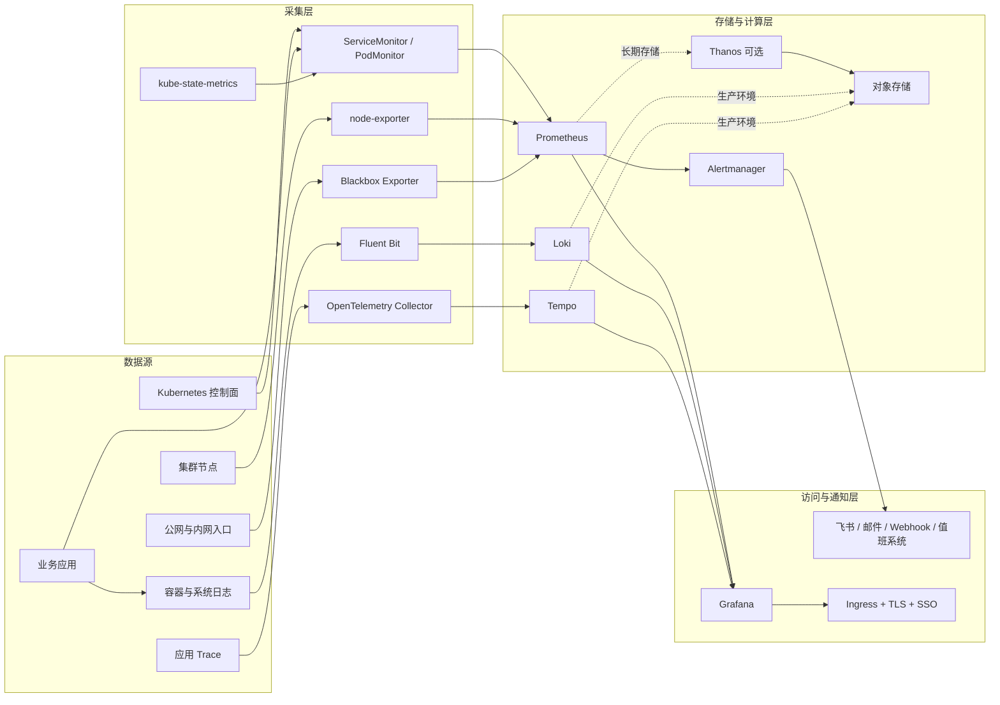

# Kubernetes + Helm 生产级监控方案

更新时间：2026-08-10  
适用范围：通用 Kubernetes 集群，不绑定具体云厂商、服务器或业务系统  
部署方式：Helm 统一安装和升级  
目标：建立覆盖指标、日志、告警、外部探测和可选链路追踪的完整可观测体系

## 1. 方案结论

推荐采用以下技术栈：

| 能力 | 组件 | 作用 |
| --- | --- | --- |
| 指标采集与告警 | `kube-prometheus-stack` | Prometheus Operator、Prometheus、Alertmanager、Grafana、node-exporter、kube-state-metrics |
| 日志采集 | Fluent Bit | 以 DaemonSet 采集容器日志，解析并补充 Kubernetes 元数据 |
| 日志存储 | Loki | 统一存储和检索日志，与 Grafana 原生集成 |
| 外部探测 | Prometheus Blackbox Exporter | HTTP、HTTPS、TCP、ICMP 和证书有效期探测 |
| 链路追踪 | OpenTelemetry Collector + Tempo | 可选，用于微服务调用链、耗时和错误定位 |
| 展示入口 | Grafana | 指标、日志、追踪、告警统一查询与关联 |
| 长期指标存储 | Thanos | 可选，用于 Prometheus 高可用、去重和长期对象存储 |

推荐分两档建设：

- **标准版**：适合开发、测试、中小规模生产集群。单副本 Prometheus、Alertmanager、Grafana；Loki 单体或简单可扩展模式；所有关键组件使用 PVC。
- **高可用版**：适合关键生产集群。双副本 Prometheus + Thanos、3 副本 Alertmanager、Loki 分布式、Grafana 外置 PostgreSQL、对象存储、多副本网关和跨节点调度。

无论采用哪一档，监控系统都不应完全依赖被监控集群自身。至少应在集群外部署一个存活探针或云监控，用于发现整个 Kubernetes 集群、节点或网络同时失效的情况。

## 2. 建设目标

### 2.1 必须具备

- Kubernetes 控制面、节点、工作负载、容器、存储和网络指标。
- 业务应用的请求量、错误率、延迟和资源饱和度指标。
- 容器标准输出日志和关键系统日志集中检索。
- 告警分级、聚合、抑制、静默、恢复通知和升级通知。
- HTTP/TCP 可用性、DNS、TLS 证书过期和关键页面探测。
- Grafana 统一入口，支持从指标跳转日志、从日志关联调用链。
- Helm values、告警规则、Dashboard 和数据源全部配置即代码。
- 持久化、备份、容量告警、升级回滚和恢复演练。

### 2.2 可选增强

- OpenTelemetry 链路追踪。
- Thanos 长期指标存储和跨集群查询。
- 多集群统一 Grafana。
- 告警值班系统、自动升级和事件工单联动。
- 基于 SLO 的错误预算和燃烧率告警。

## 3. 总体架构



## 4. 部署档位

### 4.1 标准版

适用条件：

- 3～20 个节点。
- 指标 active series 少于约 100 万。
- 日志写入量低于约 100GB/天。
- 可以接受监控组件短时间维护窗口。

建议配置：

| 组件 | 副本 | 初始资源建议 | 初始存储建议 |
| --- | ---: | --- | --- |
| Prometheus | 1 | 2～4 CPU，4～8Gi 内存 | 100～300Gi，15～30 天 |
| Alertmanager | 1 | 100m～500m CPU，256～512Mi 内存 | 2～5Gi |
| Grafana | 1 | 500m～1 CPU，512Mi～1Gi 内存 | 5～10Gi |
| Loki | 1 或 simple scalable | 2～4 CPU，4～8Gi 内存 | 依日志量计算，优先对象存储 |
| Fluent Bit | 每节点 1 个 | 100m～500m CPU，128～512Mi 内存 | 每节点 1～5Gi 磁盘缓冲 |
| Blackbox Exporter | 1～2 | 100m～500m CPU，128～256Mi 内存 | 无 |
| Tempo | 1，可选 | 1～2 CPU，2～4Gi 内存 | 优先对象存储 |

### 4.2 高可用版

适用条件：

- 关键生产业务。
- 监控中断会影响故障发现和应急处置。
- 多可用区、多集群或较长数据保留要求。

建议配置：

| 组件 | 高可用设计 |
| --- | --- |
| Prometheus | 2 副本，独立 PVC；Thanos Sidecar 上传对象存储；Thanos Query 去重 |
| Alertmanager | 3 副本组成集群，跨节点调度 |
| Grafana | 2 个及以上副本，使用外部 PostgreSQL，不使用共享 SQLite |
| Loki | distributed 或 simple scalable，多副本读写组件，对象存储保存日志块 |
| Fluent Bit | 每节点 DaemonSet，启用磁盘缓冲和重试上限告警 |
| Blackbox Exporter | 至少 2 副本，并在集群外增加独立探针 |
| Tempo | distributed 或可扩展模式，对象存储保存 Trace |
| Ingress | 至少 2 副本，TLS、SSO、访问控制和限流 |
| 存储 | 使用支持快照和跨节点挂载的 CSI；对象存储开启版本控制和生命周期策略 |

## 5. Namespace 与 Helm release 规划

推荐统一使用 `observability` Namespace：

| Helm release | Chart | 说明 |
| --- | --- | --- |
| `kube-prometheus-stack` | `prometheus-community/kube-prometheus-stack` | 指标、告警、Grafana 和 Kubernetes exporter |
| `blackbox-exporter` | `prometheus-community/prometheus-blackbox-exporter` | HTTP/TCP/DNS/ICMP 探测 |
| `loki` | `grafana/loki` | 日志存储 |
| `fluent-bit` | `fluent/fluent-bit` | 日志采集 |
| `tempo` | `grafana/tempo` 或 `grafana/tempo-distributed` | 可选链路追踪存储 |
| `opentelemetry-collector` | `open-telemetry/opentelemetry-collector` | 可选 OTLP 接收、处理和转发 |
| `thanos` | 选定并经过验证的 Thanos Chart | 可选长期指标存储与查询 |

生产环境必须锁定 Chart 版本，不能直接使用仓库最新版本。建议在 Git 中维护版本清单：

```yaml
# chart-versions.yaml
kubePrometheusStack: "<经过验证的版本>"
blackboxExporter: "<经过验证的版本>"
loki: "<经过验证的版本>"
fluentBit: "<经过验证的版本>"
tempo: "<经过验证的版本>"
otelCollector: "<经过验证的版本>"
```

## 6. 配置仓库结构

建议单独建立 Git 仓库或纳入 GitOps 仓库：

```text
observability/
├── README.md
├── chart-versions.yaml
├── environments/
│   ├── dev/
│   │   ├── kube-prometheus-stack.values.yaml
│   │   ├── loki.values.yaml
│   │   ├── fluent-bit.values.yaml
│   │   └── blackbox-exporter.values.yaml
│   └── prod/
│       ├── kube-prometheus-stack.values.yaml
│       ├── loki.values.yaml
│       ├── fluent-bit.values.yaml
│       ├── blackbox-exporter.values.yaml
│       ├── tempo.values.yaml
│       └── otel-collector.values.yaml
├── manifests/
│   ├── ingress/
│   ├── monitors/
│   ├── rules/
│   ├── dashboards/
│   └── network-policies/
├── secrets.example/
└── scripts/
    ├── lint.sh
    ├── render.sh
    ├── diff.sh
    └── verify.sh
```

仓库中只保存 Secret 名称和字段引用，不保存密码、Webhook、Cookie、Token、私钥或对象存储访问密钥。

## 7. Helm 仓库初始化

```bash
helm repo add prometheus-community https://prometheus-community.github.io/helm-charts
helm repo add grafana https://grafana.github.io/helm-charts
helm repo add fluent https://fluent.github.io/helm-charts
helm repo add open-telemetry https://open-telemetry.github.io/opentelemetry-helm-charts
helm repo update

kubectl create namespace observability
```

`kubectl create namespace` 应只在 Namespace 不存在时执行。正式环境更推荐把 Namespace 也纳入 GitOps 管理。

## 8. 指标系统设计

### 8.1 Prometheus 采集范围

默认采集：

- API Server、etcd、scheduler、controller-manager。
- kubelet、cAdvisor、CoreDNS、kube-proxy。
- Node CPU、内存、磁盘、文件系统、网络。
- Deployment、StatefulSet、DaemonSet、Job、Pod、PVC 状态。
- Prometheus、Alertmanager、Grafana、Operator 自身指标。

业务应用统一通过 `ServiceMonitor` 或 `PodMonitor` 接入，不建议依赖旧式 `prometheus.io/scrape` annotation 作为长期标准。

### 8.2 Prometheus values 基线

以下是结构示例，字段必须以实际锁定的 Chart 版本为准，并通过 `helm template` 验证：

```yaml
prometheus:
  prometheusSpec:
    replicas: 1
    retention: 30d
    retentionSize: 240GB
    scrapeInterval: 30s
    evaluationInterval: 30s
    walCompression: true
    resources:
      requests:
        cpu: "2"
        memory: 4Gi
      limits:
        cpu: "4"
        memory: 8Gi
    storageSpec:
      volumeClaimTemplate:
        spec:
          storageClassName: "<storage-class>"
          accessModes: ["ReadWriteOnce"]
          resources:
            requests:
              storage: 300Gi
    serviceMonitorSelectorNilUsesHelmValues: false
    podMonitorSelectorNilUsesHelmValues: false
    ruleSelectorNilUsesHelmValues: false

alertmanager:
  alertmanagerSpec:
    replicas: 1
    resources:
      requests:
        cpu: 100m
        memory: 256Mi
      limits:
        cpu: 500m
        memory: 512Mi
    storage:
      volumeClaimTemplate:
        spec:
          storageClassName: "<storage-class>"
          accessModes: ["ReadWriteOnce"]
          resources:
            requests:
              storage: 5Gi

grafana:
  replicas: 1
  persistence:
    enabled: true
    storageClassName: "<storage-class>"
    size: 10Gi
  admin:
    existingSecret: grafana-admin
    userKey: admin-user
    passwordKey: admin-password
  service:
    type: ClusterIP
  ingress:
    enabled: true
    ingressClassName: "<ingress-class>"
    hosts:
      - grafana.example.com
    tls:
      - secretName: grafana-tls
        hosts:
          - grafana.example.com

prometheus-node-exporter:
  resources:
    requests:
      cpu: 50m
      memory: 64Mi
    limits:
      cpu: 300m
      memory: 256Mi

kube-state-metrics:
  resources:
    requests:
      cpu: 100m
      memory: 128Mi
    limits:
      cpu: 500m
      memory: 512Mi
```

高可用版将 Prometheus `replicas` 调整为 2，并启用 Thanos Sidecar。Grafana 不应直接轮询两个 Prometheus 副本，而应查询具备副本去重能力的 Thanos Query。

### 8.3 业务 ServiceMonitor 模板

```yaml
apiVersion: monitoring.coreos.com/v1
kind: ServiceMonitor
metadata:
  name: example-api
  namespace: observability
  labels:
    release: kube-prometheus-stack
    team: example
spec:
  namespaceSelector:
    matchNames:
      - example-prod
  selector:
    matchLabels:
      app.kubernetes.io/name: example-api
  endpoints:
    - port: metrics
      path: /metrics
      interval: 30s
      scrapeTimeout: 10s
```

Prometheus 的 selector 必须与 `ServiceMonitor` 标签策略保持一致。建议统一要求：

- `release: kube-prometheus-stack`
- `team: <owner>`
- `environment: dev|test|prod`

### 8.4 指标命名和基数控制

- 指标名使用 `<系统>_<模块>_<含义>_<单位>`。
- Counter 以 `_total` 结尾；耗时优先使用 Histogram。
- 不允许把 `user_id`、订单号、URL 完整路径、请求 ID 等高基数字段作为 label。
- HTTP route 使用模板路由，如 `/users/:id`，不能使用实际 URL。
- 对高频、低价值指标通过 `metricRelabelings` 丢弃。
- 对 `scrape_samples_post_metric_relabeling`、active series 和 head memory 建立容量告警。

## 9. 日志系统设计

### 9.1 日志数据流

```text
容器 stdout/stderr
  -> Fluent Bit tail input
  -> CRI 多行合并
  -> Kubernetes metadata filter
  -> 字段清洗与敏感信息过滤
  -> 内存队列 + filesystem buffer
  -> Loki Gateway
  -> Loki 存储
  -> Grafana 查询
```

### 9.2 应用日志规范

生产应用建议输出单行 JSON：

```json
{
  "timestamp": "2026-08-10T12:00:00.000Z",
  "level": "INFO",
  "service": "example-api",
  "environment": "prod",
  "message": "request completed",
  "trace_id": "...",
  "span_id": "...",
  "http_method": "GET",
  "http_route": "/users/:id",
  "status_code": 200,
  "duration_ms": 32
}
```

不得记录密码、Token、Cookie、完整认证头、身份证号、银行卡号和其他敏感字段。确需记录用户标识时，应脱敏或哈希，并评估 label 基数。

### 9.3 Loki 部署策略

标准版：

- 小规模可使用 single binary。
- 中等规模使用 simple scalable。
- 测试环境可使用 PVC；生产环境优先 S3 兼容对象存储。

高可用版：

- 使用 distributed 或经过验证的可扩展模式。
- Gateway、read、write、backend 等关键组件至少 2～3 副本。
- 使用对象存储，配置 compactor 和 retention。
- 对 ingestion rate、discarded samples、查询延迟、对象存储错误建立告警。

建议保留期：

| 日志类型 | 建议保留 |
| --- | ---: |
| 开发测试日志 | 3～7 天 |
| 普通生产应用日志 | 15～30 天 |
| 审计和安全日志 | 90～180 天，按合规要求确定 |
| Debug 日志 | 默认关闭，临时开启后 1～3 天 |

### 9.4 Fluent Bit 关键要求

- DaemonSet 部署，容忍控制面和特殊节点污点。
- 挂载 `/var/log/containers`、`/var/log/pods` 和容器运行时日志目录。
- 启用 filesystem buffering，不只依赖内存。
- 配置 backoff、重试、队列水位和丢弃计数告警。
- 使用 multiline parser 处理 Java、Go panic、Python traceback 等多行日志。
- 默认只使用低基数字段作为 Loki labels：`cluster`、`namespace`、`app`、`container`、`level`。
- `pod` 可作为查询字段而非长期索引标签，避免滚动发布造成 label 数量增长。
- 对 Secret、Token、Authorization、Cookie 等字段在采集侧过滤或脱敏。

## 10. 外部探测

Blackbox Exporter 用于验证“用户是否真的能访问服务”，不能只看 Pod 是否 Running。

建议探测：

- 首页和关键 API 的 HTTP 状态、总耗时和 DNS/TLS/连接各阶段耗时。
- TCP 端口可达性。
- DNS 解析结果。
- TLS 证书剩余有效期。
- 集群内 Service 和公网域名分别探测。

示例 `Probe`：

```yaml
apiVersion: monitoring.coreos.com/v1
kind: Probe
metadata:
  name: example-public-api
  namespace: observability
  labels:
    release: kube-prometheus-stack
spec:
  jobName: example-public-api
  interval: 30s
  module: http_2xx
  prober:
    url: blackbox-exporter-prometheus-blackbox-exporter.observability.svc:9115
  targets:
    staticConfig:
      static:
        - https://api.example.com/healthz
      labels:
        environment: prod
        team: example
```

至少一个核心入口应由集群外部探针监控。否则整个集群宕机时，集群内 Blackbox Exporter 和 Alertmanager也会同时失效。

## 11. 链路追踪

链路追踪是可选项，适用于微服务数量较多、跨服务调用复杂或仅靠日志难以定位延迟的系统。

推荐流程：

```text
应用 OpenTelemetry SDK
  -> OTLP gRPC/HTTP
  -> OpenTelemetry Collector
  -> 采样、脱敏、资源属性补充
  -> Tempo
  -> Grafana Explore
```

统一资源属性：

- `service.name`
- `service.version`
- `deployment.environment`
- `k8s.namespace.name`
- `k8s.pod.name`
- `cloud.region`

采样建议：

- 开发测试环境可提高采样率。
- 生产环境采用 head sampling + tail sampling。
- 错误请求和高延迟请求尽量保留。
- 正常高频请求按比例采样。
- Trace 和日志都写入 `trace_id`，Grafana 中建立关联跳转。

## 12. 告警体系

### 12.1 告警等级

| 等级 | 定义 | 通知方式 | 响应目标 |
| --- | --- | --- | --- |
| `critical` | 服务不可用、数据风险、核心 SLO 快速消耗 | 电话/值班系统 + 飞书 + 邮件 | 5～15 分钟 |
| `warning` | 容量趋紧、性能下降、冗余丢失 | 飞书 + 邮件 | 30 分钟～4 小时 |
| `info` | 计划变更、非紧急异常、趋势提醒 | 看板或日报 | 工作时间处理 |

告警 label 至少包括：

- `severity`
- `team`
- `service`
- `environment`
- `cluster`
- `category`

告警 annotation 至少包括：

- `summary`
- `description`
- `runbook_url`
- `dashboard_url`

### 12.2 必备告警

集群与节点：

- Node NotReady、节点不可达。
- CPU 持续高负载、内存可用量过低、文件系统剩余空间不足。
- inode 不足、磁盘 I/O 延迟异常、网络错误增长。
- Kubernetes 证书即将过期。

工作负载：

- Deployment 副本不足。
- Pod CrashLoopBackOff、频繁重启、OOMKilled。
- Job 失败或超时。
- HPA 达到上限仍无法满足负载。
- PVC Pending、容量不足或存储错误。

业务：

- 请求错误率。
- P95/P99 延迟。
- 请求量异常下降或突增。
- 核心业务成功率。
- 队列积压、数据库连接池耗尽、依赖服务失败。

监控系统自身：

- Prometheus target down、规则计算失败、配置 reload 失败。
- Prometheus 磁盘、内存、WAL 和 active series 异常。
- Alertmanager 通知失败和集群成员异常。
- Fluent Bit 重试、错误、丢弃和缓冲区积压。
- Loki 写入失败、查询错误、对象存储错误和 compactor 异常。
- Grafana 数据源不可用。

### 12.3 PrometheusRule 示例

```yaml
apiVersion: monitoring.coreos.com/v1
kind: PrometheusRule
metadata:
  name: example-api-rules
  namespace: observability
  labels:
    release: kube-prometheus-stack
spec:
  groups:
    - name: example-api.availability
      rules:
        - alert: ExampleApiHighErrorRate
          expr: |
            sum(rate(http_requests_total{service="example-api",status=~"5.."}[5m]))
            /
            sum(rate(http_requests_total{service="example-api"}[5m]))
            > 0.05
          for: 10m
          labels:
            severity: critical
            team: example
            service: example-api
            environment: prod
            category: availability
          annotations:
            summary: example-api 5xx 错误率持续高于 5%
            description: 检查最近发布、依赖服务、数据库和应用错误日志。
            runbook_url: https://runbooks.example.com/example-api/high-error-rate
```

生产告警应处理分母为零、低流量误报和缺失数据，必要时使用 recording rule 统一计算。

### 12.4 Alertmanager 路由

推荐路由原则：

```text
critical -> 值班系统 + 飞书告警群 + 邮件
warning  -> 飞书告警群 + 邮件
info     -> 低优先级群或日报

按 cluster、environment、team、service 分组
同一故障产生的下游告警通过 inhibit_rules 抑制
Watchdog 单独发送到告警链路自检服务
```

Webhook、邮箱密码和 API Token 必须从 Kubernetes Secret 或外部 Secret 注入，不得写入 values 文件。

建议配置 Dead Man's Snitch/Watchdog：持续发送一条固定告警。如果通知平台长时间收不到，说明 Prometheus、Alertmanager 或通知通道本身发生故障。

## 13. SLO 与错误预算

关键服务不应只配置资源告警，还应围绕用户体验定义 SLO。

示例：

| SLI | SLO 示例 |
| --- | --- |
| 可用性 | 30 天内成功请求比例不低于 99.9% |
| 延迟 | 99% 请求在 500ms 内完成 |
| 正确性 | 核心业务成功率不低于 99.95% |
| 数据新鲜度 | 数据延迟不超过 5 分钟 |

建议使用多窗口、多燃烧率告警：

- 5 分钟 + 1 小时：快速燃烧，`critical`。
- 30 分钟 + 6 小时：中速燃烧，`warning`。
- 2 小时 + 24 小时：慢速燃烧，用于趋势处理。

这样比固定 CPU 阈值更接近业务真实影响，也能减少无效告警。

## 14. Grafana 设计

### 14.1 数据源

所有数据源通过 provisioning 管理：

- Prometheus 或 Thanos Query。
- Loki。
- Tempo。
- Alertmanager。

禁止只在 Grafana 页面中手工添加生产数据源。页面手工变更无法可靠审计和重建。

### 14.2 Dashboard 分层

1. **全局总览**：集群健康、告警、节点、资源使用率、业务 SLO。
2. **Kubernetes**：Namespace、Deployment、StatefulSet、Pod、PVC。
3. **节点**：CPU、内存、磁盘、文件系统、网络。
4. **业务服务**：RED 指标，即请求量、错误率、延迟。
5. **资源系统**：USE 指标，即利用率、饱和度、错误。
6. **日志**：按环境、namespace、应用、级别查询。
7. **监控自监控**：Prometheus、Alertmanager、Loki、Fluent Bit、Grafana。

Dashboard 使用 ConfigMap sidecar 或 Grafana provisioning 纳入 Git。每个业务 Dashboard 标注 owner、数据源、变量和更新时间。

## 15. 安全设计

- Grafana、Prometheus、Alertmanager、Loki、Tempo 默认使用 `ClusterIP`，不直接使用 NodePort 或 LoadBalancer 暴露管理端口。
- 仅通过 Ingress 暴露 Grafana；管理接口优先通过 VPN、堡垒机或内网访问。
- Ingress 启用 TLS、SSO/OIDC、MFA、访问日志、限流和 IP 白名单。
- Grafana 禁用匿名管理员访问，最小化组织管理员数量。
- 使用 RBAC 限制 Prometheus Operator、Fluent Bit 和 Grafana ServiceAccount 权限。
- 使用 NetworkPolicy 限制采集器、存储和展示组件之间的访问。
- Secret 使用 External Secrets、Sealed Secrets 或云密钥服务管理。
- 镜像固定 tag 和 digest，使用私有镜像仓库、漏洞扫描和签名校验。
- Pod 启用非 root、只读根文件系统、禁止权限提升，并删除不需要的 Linux capabilities。
- 日志采集前脱敏，避免凭据和个人敏感信息进入集中日志系统。

## 16. 存储与容量规划

### 16.1 Prometheus

Prometheus 容量不能只按节点数估算，应依据：

```text
每日样本数 = active_series × 86400 / scrape_interval
预计空间 = 每日样本数 × 单样本平均字节数 × 保留天数 × 安全系数
```

建议上线后观察 7～14 天：

- `prometheus_tsdb_head_series`
- `prometheus_tsdb_head_samples_appended_total`
- `prometheus_tsdb_storage_blocks_bytes`
- PVC 实际增长量

`retentionSize` 应小于 PVC 容量，至少预留 15%～20% 给 WAL、临时块和压缩过程。

### 16.2 Loki

```text
每日原始日志量 = 平均写入字节/秒 × 86400
存储需求 = 每日原始日志量 × 压缩系数 × 保留天数 × 副本/冗余系数
```

保留期必须与对象存储生命周期、Loki retention 和合规要求一致。不能只设置对象存储自动删除而不配置 Loki compactor。

### 16.3 Tempo

Trace 容量取决于请求量、平均 span 数和采样率。应先小比例采样，观察一周后再调整。错误和慢请求优先保留，避免对所有请求 100% 采样。

## 17. 备份与恢复

需要备份：

- Helm values 和 Kubernetes manifests：保存在 Git。
- Grafana Dashboard、数据源和告警配置：使用 provisioning 保存在 Git。
- Grafana 数据库：单副本 SQLite 定期快照；高可用版备份 PostgreSQL。
- Prometheus：短期数据可通过 CSI 快照恢复；长期数据交给 Thanos 对象存储。
- Loki、Tempo：对象存储开启版本控制、生命周期和跨区域备份策略。
- Alertmanager：配置在 Git，运行状态卷按需要做 CSI 快照。

恢复演练至少每季度执行一次，验证：

1. 新 Namespace 中可以从 Git 和 Secret 系统重建监控栈。
2. Grafana Dashboard 和数据源自动恢复。
3. 告警通知链路可以发送测试告警。
4. 对象存储中的历史数据可以查询。
5. PVC 恢复后组件能正常启动。

## 18. Helm 部署顺序

### 18.1 变更前检查

```bash
kubectl version
helm version
kubectl get storageclass
kubectl get ingressclass
kubectl get nodes -o wide
kubectl top nodes
```

确认：

- Kubernetes 与目标 Chart 版本兼容。
- CSI、StorageClass 和 VolumeSnapshot 可用。
- Ingress Controller、DNS 和证书签发能力可用。
- 对象存储、Secret 和通知接收端已经准备好。

### 18.2 安装顺序

```text
1. Namespace、RBAC、Secret、NetworkPolicy
2. kube-prometheus-stack
3. Blackbox Exporter
4. Loki
5. Fluent Bit
6. Tempo 与 OpenTelemetry Collector（可选）
7. ServiceMonitor、Probe、PrometheusRule
8. Grafana 数据源和 Dashboard
9. Ingress、TLS、SSO
10. 测试告警、日志、Trace 和恢复流程
```

### 18.3 标准 Helm 流程

每个 release 都执行 lint、渲染、差异审查，再升级：

```bash
helm lint <chart> -f <values-file>

helm template <release> <chart> \
  --namespace observability \
  --version <locked-version> \
  -f <values-file> > /tmp/<release>-rendered.yaml

helm upgrade --install <release> <chart> \
  --namespace observability \
  --create-namespace \
  --version <locked-version> \
  -f <values-file> \
  --atomic \
  --timeout 15m \
  --history-max 10
```

生产环境建议增加 Helm diff 插件或 GitOps 控制器，审查将被创建、修改和删除的资源。

### 18.4 回滚

```bash
helm history <release> -n observability
helm rollback <release> <revision> -n observability --wait --timeout 15m
```

涉及 CRD、PVC、数据库 schema 或对象存储格式的升级不能只依赖 Helm rollback。必须阅读对应版本升级说明并准备数据恢复方案。

## 19. 发布与升级策略

- 每次只升级一个 release。
- 先在测试集群验证，再升级生产。
- Chart 大版本升级单独安排维护窗口。
- 升级前备份 values、Grafana 数据库和关键 PVC。
- 先升级 CRD，再升级 Operator 时必须遵循 Chart 官方说明。
- 检查 PodDisruptionBudget、反亲和和滚动更新策略。
- 升级后至少观察一个完整告警评估周期和一个日志块写入周期。
- 禁止在没有 `helm template` 和 diff 的情况下直接执行 `helm upgrade`。

## 20. 验收标准

### 20.1 指标

- Kubernetes、节点和业务 target 全部 `up`。
- Prometheus 重启后历史指标仍然存在。
- Prometheus PVC 使用率、内存、WAL、规则计算无异常。
- 业务 RED 指标和核心 SLO 可在 Grafana 查询。

### 20.2 日志

- 新产生的容器日志在约定延迟内可查询。
- 多行错误日志不会被拆散。
- 可按 cluster、namespace、service、level、trace_id 查询。
- 临时中断 Loki 后，Fluent Bit 使用磁盘缓冲并在恢复后补发。
- 日志中不包含测试用密码、Token 和认证头。

### 20.3 告警

- 测试告警可以从 Prometheus 到达 Alertmanager 和实际通知端。
- 告警恢复后有恢复通知。
- 同一故障不会产生大量重复通知。
- `critical` 和 `warning` 能路由到不同接收端。
- Watchdog 告警持续被外部自检服务接收。

### 20.4 可用性和安全

- Grafana 只能通过 HTTPS 和身份认证访问。
- Prometheus、Alertmanager、Loki、Tempo 管理端口不直接暴露公网。
- 非授权 Namespace 不能访问敏感监控接口。
- Secret 不存在于 Git、Helm values、日志和 Dashboard 中。
- 集群外探针能发现整个集群或入口不可用。

### 20.5 恢复

- 删除并重建 Grafana Pod 后配置和 Dashboard 保留。
- 删除并重建 Prometheus Pod 后保留期内数据存在。
- 可以从 Git 在空 Namespace 中重建全部配置。
- 备份恢复演练有记录、有负责人、有恢复时间结果。

## 21. 运维制度

### 每日

- 查看 critical、warning 告警和未恢复告警。
- 查看监控组件自身错误、采集失败和通知失败。

### 每周

- 复盘误报、漏报和重复告警。
- 查看 Prometheus active series、Loki 写入量和 PVC 增长趋势。
- 检查证书、对象存储、备份和外部探针状态。

### 每月

- 更新容量预测。
- 清理无 owner 的 Dashboard、规则和高基数指标。
- 检查 Chart、镜像和安全漏洞，但不直接追新版本。
- 随机抽查一条告警对应的 runbook 是否有效。

### 每季度

- 执行恢复演练。
- 执行告警链路演练。
- 评审 SLO、保留期、访问权限和成本。

## 22. 实施阶段与交付物

### 阶段一：基础监控

交付：

- `kube-prometheus-stack` Helm values。
- Prometheus、Alertmanager、Grafana PVC。
- Kubernetes 和节点 Dashboard。
- 基础集群告警和一个实际通知接收端。

验收：节点、Pod、PVC、控制面指标可见；测试告警能够发送和恢复。

### 阶段二：日志和外部探测

交付：

- Loki 与 Fluent Bit Helm values。
- Fluent Bit 磁盘缓冲、日志脱敏和多行解析。
- Blackbox Exporter 和核心入口 Probe。
- Grafana 日志数据源与日志 Dashboard。

验收：日志可查询；后端短时中断不丢日志；入口故障可以告警。

### 阶段三：业务监控和 SLO

交付：

- 业务 `/metrics` 规范。
- ServiceMonitor、PrometheusRule、Dashboard。
- 业务 SLI/SLO、错误预算和燃烧率告警。
- 每条 critical 告警对应的 runbook。

验收：可以从告警定位到 Dashboard、日志和负责人。

### 阶段四：高可用和长期存储

交付：

- 双副本 Prometheus、Thanos、对象存储。
- 3 副本 Alertmanager。
- Loki 高可用部署。
- Grafana 外部 PostgreSQL。
- 跨集群查询、备份和恢复演练。

验收：单 Pod、单节点或单可用区故障不影响核心监控和告警能力。

## 23. 最终落地原则

1. 先打通告警，再扩展 Dashboard；没有通知出口的监控只是数据展示。
2. 先控制指标和日志基数，再扩大采集范围；无限采集会快速增加成本并降低稳定性。
3. 所有生产配置必须进入 Git，所有敏感信息必须进入 Secret 系统。
4. 所有管理端口默认内网访问，统一通过 Ingress、TLS 和身份认证开放。
5. 监控系统必须监控自身，并由集群外探针监控整个集群。
6. 每条 critical 告警必须有 owner、影响说明、Dashboard 和 runbook。
7. 容量以实际增长数据调整，不长期依赖初始估算。
8. Helm 升级必须经过 lint、render、diff、备份、验证和回滚准备。

