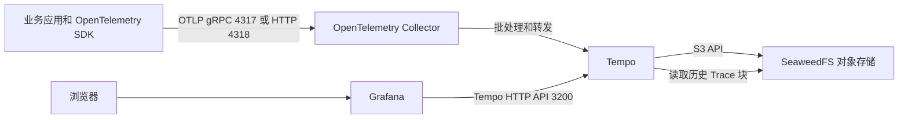

# Tempo、OpenTelemetry、SeaweedFS 与 Grafana 分布式追踪

## 1. 文档目的

本文说明一套基于 OpenTelemetry Collector、Tempo、SeaweedFS 和 Grafana 的分布式追踪系统，包括各组件职责、Trace 数据流、测试部署结构、应用接入方式，以及 Jaeger 与 Tempo 的区别。

这套系统的核心作用是：业务应用产生 Trace，OpenTelemetry Collector 负责接收和转发，Tempo 负责组织、存储和查询调用链，SeaweedFS 保存对象数据，Grafana 提供查询和展示界面。

## 2. 核心概念

### 2.1 Trace

Trace 表示一次完整请求从开始到结束的调用过程。例如：

```text
浏览器
  -> 网关
  -> 订单服务
  -> 库存服务
  -> 支付服务
  -> 数据库
```

这些步骤共享同一个 `traceId`，Tempo 根据 `traceId` 将来自不同服务的记录组合成完整调用链。

### 2.2 Span

Span 是 Trace 中的一个具体步骤。一个 Trace 通常包含多个具有父子关系的 Span：

```text
Trace：创建订单
├── Span：网关处理
├── Span：订单服务
├── Span：库存服务
├── Span：支付服务
└── Span：数据库操作
```

每个 Span 通常包含：

- `traceId`：整次请求的标识；
- `spanId`：当前步骤的标识；
- 父 Span 标识；
- 服务名称和操作名称；
- 开始时间、结束时间和持续时间；
- HTTP 状态码、数据库信息等属性；
- 成功或错误状态。

### 2.3 Trace 能解决的问题

- 一次请求经过了哪些服务；
- 哪个服务耗时最长；
- 错误从哪个服务开始；
- 数据库、HTTP、gRPC、Redis 或消息队列调用耗时；
- 不同服务之间的依赖关系。

Tempo 不负责 CPU、内存、磁盘、容器资源和普通日志监控。

## 3. 整体架构



写入路径：

```text
业务应用 -> OpenTelemetry Collector -> Tempo -> SeaweedFS
```

查询路径：

```text
浏览器 -> Grafana -> Tempo -> Live Store 或 SeaweedFS
```

## 4. 各组件职责

### 4.1 OpenTelemetry SDK 或自动探针

SDK 或 Agent 安装在业务应用中，负责产生 Span、传播 Trace 上下文，并通过 OTLP 发送数据。

它相当于每个服务中的记录设备。没有 SDK、Agent 或手动埋点，仅设置几个环境变量不会自动产生 Trace。

### 4.2 OpenTelemetry Collector

Collector 是应用与 Tempo 之间的遥测网关，当前负责：

- 接收 OTLP/gRPC 和 OTLP/HTTP；
- 使用 `memory_limiter` 限制内存压力；
- 使用 `batch` 批量发送；
- 将 Trace 通过 OTLP/gRPC 转发给 Tempo。

使用 Collector 后，应用只依赖固定的 OTLP 地址。后续增加采样、字段清洗、敏感信息过滤或多后端转发，主要修改 Collector 配置即可。

### 4.3 Tempo

Tempo 是分布式追踪后端，可以理解为“调用过程数据库”。它负责：

- 接收和组织 Span；
- 根据 `traceId` 组合调用链；
- 在 Live Store 中保存近期 Trace；
- 使用本地 WAL 做恢复缓冲；
- 将 Trace 整理成 Parquet 数据块；
- 将数据块写入对象存储；
- 执行 TraceQL 查询和 Trace ID 查询；
- 合并数据块并清理过期数据。

当前 Tempo 使用单体模式，一个进程内包含 Distributor、Live Store、Query Frontend、Querier、Backend Scheduler 和 Backend Worker 等内部组件。单体模式适合测试和小规模环境，不需要 Kafka。

### 4.4 SeaweedFS

SeaweedFS 是一个分布式存储系统，可以通过 S3 Gateway 提供兼容 Amazon S3 的对象存储接口。

当前部署使用 `weed mini`，在一个容器中启动 Master、Volume Server、Filer 和 S3 Gateway，用作 Tempo 的测试对象存储。

典型数据结构：

```text
tempo-test/
├── work.json
└── single-tenant/
    └── <block-id>/
        ├── data.parquet
        ├── index
        ├── bloom-0
        └── meta.json
```

- `data.parquet`：Trace 和 Span 数据；
- `index`：辅助索引；
- `bloom-0`：Bloom Filter 数据；
- `meta.json`：数据块元信息；
- `work.json`：Tempo 后台任务状态。

`weed mini` 是单节点测试模式，没有生产高可用能力。

### 4.5 Grafana

Grafana 是查询和展示界面，本身不采集 Trace，也不保存 Trace 数据。

Grafana 中配置 Tempo 数据源后，可以：

- 使用 TraceQL 搜索 Trace；
- 按 Trace ID 查询；
- 查看 Span 瀑布图；
- 查看服务名、持续时间、属性和错误信息。

Grafana 首页默认没有 Tempo 仪表盘。Trace 通常从 Explore 页面查询。

## 5. 当前测试部署

### 5.1 服务器和项目

```text
主机：192.168.252.5
系统：Ubuntu 22.04.5 LTS ARM64
项目目录：/opt/tempo-test
```

部署组件：

| 服务 | 镜像 | 作用 |
|---|---|---|
| Grafana | `grafana/grafana:13.1.0` | 查询和展示 |
| OTel Collector | `otel/opentelemetry-collector-contrib:0.157.0` | 接收和转发 Trace |
| Tempo | `grafana/tempo:3.0.2` | Trace 后端 |
| SeaweedFS | `chrislusf/seaweedfs:4.29` | S3 兼容对象存储 |

Docker Registry 镜像加速已配置为 DaoCloud 镜像站。

### 5.2 端口

| 宿主机端口 | 服务 | 用途 |
|---|---|---|
| `127.0.0.1:3000` | Grafana | Web 页面 |
| `127.0.0.1:3200` | Tempo | 查询和健康检查 API |
| `127.0.0.1:4317` | OTel Collector | OTLP/gRPC |
| `127.0.0.1:4318` | OTel Collector | OTLP/HTTP |
| `127.0.0.1:8333` | SeaweedFS | S3 API |
| `127.0.0.1:23646` | SeaweedFS | 管理页面 |

所有宿主机端口只绑定 `127.0.0.1`，不能从局域网或公网直接访问。

### 5.3 数据目录

```text
/opt/tempo-test/data/tempo
/opt/tempo-test/data/seaweedfs
/opt/tempo-test/data/grafana
```

当前 Trace 保留时间设置为 1 小时。

## 6. 访问和查询

### 6.1 Grafana SSH 隧道

```bash
ssh -L 3000:127.0.0.1:3000 root@192.168.252.5
```

然后访问：

```text
http://127.0.0.1:3000
```

当前测试环境允许匿名 Viewer 访问。生产环境应关闭匿名访问并配置正式身份认证。

### 6.2 Grafana Explore 查询

打开：

```text
http://127.0.0.1:3000/explore
```

选择 Tempo 数据源，将时间范围设为合适范围，然后执行 TraceQL：

```traceql
{ resource.service.name = "tempo-object-store-test" }
```

常见查询：

```traceql
{ resource.service.name = "order-service" }
```

```traceql
{ status = error }
```

```traceql
{ duration > 2s }
```

## 7. Python 应用接入

### 7.1 安装自动埋点组件

```bash
pip install opentelemetry-distro opentelemetry-exporter-otlp
opentelemetry-bootstrap -a install
```

### 7.2 自动埋点启动

```bash
OTEL_SERVICE_NAME=python-api \
OTEL_EXPORTER_OTLP_ENDPOINT=http://127.0.0.1:4318 \
OTEL_EXPORTER_OTLP_PROTOCOL=http/protobuf \
opentelemetry-instrument python app.py
```

参数说明：

- `OTEL_SERVICE_NAME=python-api`：设置 `service.name`；
- `OTEL_EXPORTER_OTLP_ENDPOINT`：设置 Collector 地址；
- `OTEL_EXPORTER_OTLP_PROTOCOL=http/protobuf`：通过 OTLP/HTTP 发送 Protobuf 数据；
- `opentelemetry-instrument`：加载已安装的自动埋点插件；
- `python app.py`：应用原本的启动命令。

`opentelemetry-instrument` 是启动包装器，会在运行应用前加载 Flask、FastAPI、Django、requests、SQLAlchemy、Redis、gRPC 等已安装且受支持的自动埋点插件。

FastAPI 使用 Uvicorn 时：

```bash
OTEL_SERVICE_NAME=python-api \
OTEL_EXPORTER_OTLP_ENDPOINT=http://127.0.0.1:4318 \
OTEL_EXPORTER_OTLP_PROTOCOL=http/protobuf \
opentelemetry-instrument uvicorn app:app --host 0.0.0.0 --port 8000
```

自动埋点主要覆盖常见框架和库。对于“计算折扣”“审核订单”等自定义业务阶段，需要手动创建 Span。

## 8. 其他服务接入方式

### 8.1 同一服务器上的普通进程

使用：

```text
http://127.0.0.1:4318
```

前提是应用已经接入 OpenTelemetry SDK 或 Agent。

### 8.2 同一服务器上的其他 Docker 容器

目标容器需要加入现有的 `tempo-test` Docker 网络：

```yaml
services:
  order-service:
    image: your-order-service:latest
    environment:
      OTEL_SERVICE_NAME: order-service
      OTEL_EXPORTER_OTLP_ENDPOINT: http://otel-collector:4318
      OTEL_EXPORTER_OTLP_PROTOCOL: http/protobuf
      OTEL_RESOURCE_ATTRIBUTES: deployment.environment=test
    networks:
      - tempo-test

networks:
  tempo-test:
    external: true
```

容器内部不能把 `127.0.0.1:4318` 当作宿主机 Collector，因为容器中的 `127.0.0.1` 指向容器自身。加入相同 Docker 网络后，应使用 `http://otel-collector:4318`。

### 8.3 其他服务器上的应用

当前 Collector 只监听 `127.0.0.1`，其他服务器不能直接连接。

推荐在每台应用服务器部署本地 Collector，再通过受保护的内网、VPN 或 TLS 将数据转发到中央 Collector。中央入口需要配置：

- 防火墙来源限制；
- TLS；
- 身份认证；
- 请求限流；
- 网络隔离。

不要把无认证的 OTLP 端口直接暴露到公网。

## 9. Jaeger 的作用

Jaeger 和 Tempo 属于同一类分布式追踪后端。Jaeger 可以接收、存储、查询和展示 Trace，并提供自己的 Jaeger UI。

| 功能 | Jaeger | Tempo |
|---|---|---|
| 分布式追踪 | 支持 | 支持 |
| Trace 接收和查询 | 支持 | 支持 |
| 自带 Web UI | Jaeger UI | 通常使用 Grafana |
| 常见存储方向 | 数据库或搜索存储后端 | S3 兼容对象存储 |
| 常见查询方式 | Jaeger 查询条件 | TraceQL |

当前部署已经使用 Tempo 作为 Trace 后端，并使用 Grafana 展示，因此不需要额外安装 Jaeger。

新应用通常推荐使用 OpenTelemetry SDK 和 OTLP：

```text
应用中的 OpenTelemetry SDK
-> OpenTelemetry Collector
-> Tempo 或 Jaeger
```

简单区分：

```text
OpenTelemetry：负责记录和运送遥测数据
Tempo/Jaeger：负责保存和查询 Trace
Grafana/Jaeger UI：负责展示
```

## 10. 完整可观测体系

当前部署只覆盖 Trace。完整服务监控通常还需要：

| 数据类型 | 常见组件 |
|---|---|
| Trace | Tempo + OpenTelemetry Collector |
| 指标 | Prometheus |
| 主机指标 | node-exporter |
| 容器指标 | cAdvisor |
| 日志 | Loki + Alloy |
| 告警 | Alertmanager |
| 展示 | Grafana |

当前 Tempo 的 metrics-generator 没有启用，因此暂时不能从 Trace 自动生成请求量、错误率和耗时指标。持续告警和服务健康面板应由 Prometheus、Alertmanager 等组件承担。

## 11. 验证结果

测试部署已验证：

- Docker Compose 配置有效；
- Tempo `/ready` 返回 `ready`；
- Grafana 健康检查正常；
- Grafana Tempo 数据源返回 `Data source is working`；
- OTLP/HTTP 写入返回 HTTP 200；
- TraceQL 搜索可以找到测试 Trace；
- SeaweedFS 中生成 Parquet、索引和元数据文件；
- Tempo 重启后仍能查询同一 Trace，确认对象存储读取有效；
- 所有容器无 OOM，宿主机端口仅绑定 `127.0.0.1`。

## 12. 常用运维命令

```bash
cd /opt/tempo-test

docker compose ps
docker compose logs -f tempo otel-collector grafana seaweedfs

curl http://127.0.0.1:3200/ready
curl http://127.0.0.1:3000/api/health
curl http://127.0.0.1:3000/api/datasources/uid/tempo/health
```

检查 Tempo 重启次数：

```bash
docker inspect tempo-test-tempo-1 \
  --format 'RestartCount={{.RestartCount}} status={{.State.Status}} oom={{.State.OOMKilled}}'
```

## 13. 测试环境限制

- SeaweedFS `mini` 为单节点测试模式；
- Grafana 当前允许匿名只读访问；
- 没有高可用和跨节点副本；
- 没有完成持续压测和故障注入；
- 没有接入生产对象存储；
- 没有配置 TLS 和正式认证；
- 当前 Trace 保留时间较短。

如需生产使用，应改用受支持的外部对象存储，配置正式认证、TLS、备份、容量规划、告警，以及多节点部署方案。
