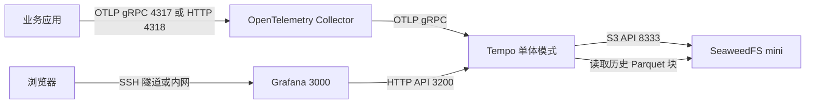

# Tempo + OpenTelemetry + SeaweedFS + Grafana 单机部署指南

## 1. 适用范围

本文用于在一台通用 Linux 服务器上部署一套分布式追踪环境：

- OpenTelemetry Collector：接收和转发 Trace；
- Tempo：组织、存储和查询 Trace；
- SeaweedFS：通过 S3 兼容接口保存 Trace 数据块；
- Grafana：查询和展示 Trace。

默认方案适合学习、开发、测试和低流量内部环境。它是单机部署，不具备节点级高可用能力，不能不经评估直接用于生产。

文中的 `<SERVER_IP>` 表示服务器实际 IP，不绑定任何具体主机。

## 2. 一句话理解各组件

```text
应用中的 OpenTelemetry SDK
        -> OpenTelemetry Collector
        -> Tempo
        -> SeaweedFS

浏览器 -> Grafana -> Tempo -> SeaweedFS
```

| 组件 | 主要职责 | 不负责的事情 |
|---|---|---|
| OpenTelemetry SDK/Agent | 在应用中产生 Span、传播 Trace 上下文 | 长期存储和展示 |
| OpenTelemetry Collector | 接收、批处理、过滤和转发遥测数据 | 业务代码埋点和长期存储 |
| Tempo | 组织、索引、查询 Trace，并将数据块写入对象存储 | CPU、内存、日志采集 |
| SeaweedFS | 提供 S3 兼容对象存储 | TraceQL 查询和调用链展示 |
| Grafana | 查询 Tempo，展示 Trace 和 Span | 产生或保存 Trace |

## 3. Trace 与 Span

Trace 表示一次完整请求，Span 表示请求中的一个步骤：

```text
Trace：创建订单
├── Span：网关接收请求
├── Span：订单服务处理
├── Span：库存服务查询
├── Span：支付服务调用
└── Span：数据库写入
```

所有 Span 共享同一个 `traceId`。每个 Span 还会记录自己的 `spanId`、父 Span、服务名称、开始时间、持续时间、属性和错误状态。

通过 Trace 可以回答：

- 一次请求经过了哪些服务；
- 哪一步耗时最长；
- 错误从哪个服务开始；
- HTTP、gRPC、数据库、Redis 或消息队列调用用了多久；
- 服务之间存在什么依赖关系。

## 4. 单机架构



Tempo 单体模式在一个进程中运行 Distributor、Live Store、Query Frontend、Querier、Backend Scheduler 和 Backend Worker 等内部组件。单体模式不需要 Kafka。

Trace 写入过程：

```text
应用产生 Span
-> Collector 接收并批量处理
-> Tempo Live Store 保存近期 Trace
-> Tempo 写入本地 WAL
-> Tempo 生成 Parquet 数据块
-> Tempo 通过 S3 API 写入 SeaweedFS
```

Trace 查询过程：

```text
用户在 Grafana 执行 TraceQL
-> Grafana 请求 Tempo
-> Tempo 查询近期 Live Store 和历史对象块
-> Tempo 返回 Trace
-> Grafana 绘制调用链和瀑布图
```

## 5. 服务器要求

### 5.1 建议配置

用于小规模测试的建议起点：

| 项目 | 建议值 |
|---|---|
| CPU | 4 核以上 |
| 内存 | 8 GiB 以上 |
| 磁盘 | 50 GiB 以上，优先使用 SSD |
| 操作系统 | 主流 64 位 Linux |
| 架构 | x86_64 或 ARM64，需确认镜像支持 |

实际资源需求取决于 Span 数量、保留时间、查询并发和属性规模。生产容量必须通过压测确定。

### 5.2 软件要求

- Docker Engine；
- Docker Compose v2；
- `curl`；
- 可访问所需镜像仓库。

验证：

```bash
docker version
docker compose version
curl --version
```

### 5.3 可选：Docker 镜像加速

网络环境无法稳定访问 Docker Hub 时，可以配置可用的 Registry Mirror。示例：

```json
{
  "registry-mirrors": [
    "https://docker.m.daocloud.io"
  ],
  "max-concurrent-downloads": 2,
  "max-download-attempts": 5
}
```

保存为 `/etc/docker/daemon.json` 后，先验证配置，再重启 Docker：

```bash
dockerd --validate --config-file=/etc/docker/daemon.json
systemctl restart docker
docker info --format '{{json .RegistryConfig.Mirrors}}'
```

镜像站属于外部依赖，应根据所在网络选择并定期检查可用性。

## 6. 目录规划

统一使用：

```text
/opt/tempo-stack
```

目录结构：

```text
/opt/tempo-stack/
├── .env
├── docker-compose.yml
├── tempo.yaml
├── otel-collector.yaml
├── grafana/
│   └── provisioning/
│       └── datasources/
│           └── tempo.yaml
└── data/
    ├── grafana/
    ├── seaweedfs/
    └── tempo/
```

创建目录：

```bash
sudo mkdir -p /opt/tempo-stack/{data/tempo,data/seaweedfs,data/grafana}
sudo mkdir -p /opt/tempo-stack/grafana/provisioning/datasources

sudo chown -R 10001:10001 /opt/tempo-stack/data/tempo
sudo chown -R 472:472 /opt/tempo-stack/data/grafana
```

Tempo 和 Grafana 镜像使用非 root 用户，数据目录权限不正确会导致容器启动失败。

## 7. 环境变量文件

在 `/opt/tempo-stack/.env` 中设置测试环境凭据：

```dotenv
TEMPO_BUCKET=tempo-traces
S3_ACCESS_KEY=请替换为随机值
S3_SECRET_KEY=请替换为高强度随机值

GRAFANA_ADMIN_USER=admin
GRAFANA_ADMIN_PASSWORD=请替换为高强度随机值
```

可以使用以下命令生成随机值：

```bash
openssl rand -hex 16
openssl rand -hex 32
```

限制文件权限：

```bash
sudo chmod 600 /opt/tempo-stack/.env
```

不要把 `.env` 提交到 Git，也不要把实际值记录在运维文档、聊天记录或日志中。

## 8. Docker Compose 配置

创建 `/opt/tempo-stack/docker-compose.yml`：

```yaml
services:
  seaweedfs:
    image: chrislusf/seaweedfs:4.29
    command: ["mini", "-dir=/data"]
    restart: unless-stopped
    security_opt:
      - no-new-privileges:true
    environment:
      AWS_ACCESS_KEY_ID: ${S3_ACCESS_KEY:?S3_ACCESS_KEY is required}
      AWS_SECRET_ACCESS_KEY: ${S3_SECRET_KEY:?S3_SECRET_KEY is required}
      S3_BUCKET: ${TEMPO_BUCKET:-tempo-traces}
    volumes:
      - ./data/seaweedfs:/data
    ports:
      - "127.0.0.1:8333:8333"
      - "127.0.0.1:23646:23646"
    networks:
      - tempo-stack

  tempo:
    image: grafana/tempo:3.0.2
    command:
      - -config.file=/etc/tempo/tempo.yaml
      - -config.expand-env=true
    restart: unless-stopped
    security_opt:
      - no-new-privileges:true
    depends_on:
      - seaweedfs
    environment:
      TEMPO_BUCKET: ${TEMPO_BUCKET:-tempo-traces}
      S3_ACCESS_KEY: ${S3_ACCESS_KEY:?S3_ACCESS_KEY is required}
      S3_SECRET_KEY: ${S3_SECRET_KEY:?S3_SECRET_KEY is required}
    volumes:
      - ./tempo.yaml:/etc/tempo/tempo.yaml:ro
      - ./data/tempo:/var/tempo
    ports:
      - "127.0.0.1:3200:3200"
    networks:
      - tempo-stack

  otel-collector:
    image: otel/opentelemetry-collector-contrib:0.157.0
    command: ["--config=/etc/otelcol-contrib/config.yaml"]
    restart: unless-stopped
    security_opt:
      - no-new-privileges:true
    depends_on:
      - tempo
    volumes:
      - ./otel-collector.yaml:/etc/otelcol-contrib/config.yaml:ro
    ports:
      - "127.0.0.1:4317:4317"
      - "127.0.0.1:4318:4318"
    networks:
      - tempo-stack

  grafana:
    image: grafana/grafana:13.1.0
    restart: unless-stopped
    security_opt:
      - no-new-privileges:true
    depends_on:
      - tempo
    environment:
      GF_SECURITY_ADMIN_USER: ${GRAFANA_ADMIN_USER:-admin}
      GF_SECURITY_ADMIN_PASSWORD: ${GRAFANA_ADMIN_PASSWORD:?GRAFANA_ADMIN_PASSWORD is required}
      GF_AUTH_ANONYMOUS_ENABLED: "false"
      GF_USERS_ALLOW_SIGN_UP: "false"
      GF_SECURITY_DISABLE_GRAVATAR: "true"
      GF_ANALYTICS_REPORTING_ENABLED: "false"
      GF_ANALYTICS_CHECK_FOR_UPDATES: "false"
      GF_ANALYTICS_CHECK_FOR_PLUGIN_UPDATES: "false"
      GF_PLUGINS_PREINSTALL_DISABLED: "true"
    volumes:
      - ./grafana/provisioning/datasources/tempo.yaml:/etc/grafana/provisioning/datasources/tempo.yaml:ro
      - ./data/grafana:/var/lib/grafana
    ports:
      - "127.0.0.1:3000:3000"
    networks:
      - tempo-stack

networks:
  tempo-stack:
    name: tempo-stack
```

镜像版本应固定，不建议在可控环境中直接使用 `latest`。升级前先阅读发行说明并在测试环境验证。

## 9. Tempo 配置

创建 `/opt/tempo-stack/tempo.yaml`：

```yaml
target: all
stream_over_http_enabled: true
multitenancy_enabled: false

server:
  http_listen_port: 3200

distributor:
  receivers:
    otlp:
      protocols:
        grpc:
          endpoint: "0.0.0.0:4317"
        http:
          endpoint: "0.0.0.0:4318"

storage:
  trace:
    backend: s3
    s3:
      endpoint: seaweedfs:8333
      bucket: "${TEMPO_BUCKET}"
      access_key: "${S3_ACCESS_KEY}"
      secret_key: "${S3_SECRET_KEY}"
      insecure: true
    wal:
      path: /var/tempo/wal

backend_scheduler:
  provider:
    compaction:
      compaction:
        block_retention: 24h

backend_worker:
  compaction:
    block_retention: 24h
    compacted_block_retention: 1h

usage_report:
  reporting_enabled: false
```

说明：

- `target: all`：Tempo 单体模式；
- `multitenancy_enabled: false`：单租户；
- `endpoint`：SeaweedFS S3 Gateway；
- `wal.path`：本地写前日志目录；
- `block_retention: 24h`：Trace 数据保留 24 小时，可按容量调整；
- `insecure: true`：容器内部使用 HTTP，仅适用于受控内部网络。

Tempo 会在启动时展开 `${...}` 变量，因为 Compose 已启用 `-config.expand-env=true`。

## 10. OpenTelemetry Collector 配置

创建 `/opt/tempo-stack/otel-collector.yaml`：

```yaml
receivers:
  otlp:
    protocols:
      grpc:
        endpoint: "0.0.0.0:4317"
      http:
        endpoint: "0.0.0.0:4318"

processors:
  memory_limiter:
    check_interval: 1s
    limit_mib: 512
    spike_limit_mib: 128
  batch:
    timeout: 5s
    send_batch_size: 1024

exporters:
  otlp_grpc/tempo:
    endpoint: tempo:4317
    tls:
      insecure: true

extensions:
  health_check:
    endpoint: "0.0.0.0:13133"

service:
  extensions:
    - health_check
  pipelines:
    traces:
      receivers:
        - otlp
      processors:
        - memory_limiter
        - batch
      exporters:
        - otlp_grpc/tempo
  telemetry:
    logs:
      level: info
```

这份配置只处理 Trace。应用发送 Metrics 或 Logs 时不会自动进入 Prometheus 或 Loki，必须另外配置相应 Pipeline 和 Exporter。

## 11. Grafana 数据源配置

创建 `/opt/tempo-stack/grafana/provisioning/datasources/tempo.yaml`：

```yaml
apiVersion: 1

datasources:
  - name: Tempo
    uid: tempo
    type: tempo
    access: proxy
    url: http://tempo:3200
    isDefault: true
    editable: false
    jsonData:
      httpMethod: GET
      nodeGraph:
        enabled: true
```

Grafana 通过 Docker 网络访问 `tempo:3200`，不需要使用宿主机 IP。

## 12. 启动顺序

进入项目目录并验证 Compose：

```bash
cd /opt/tempo-stack
docker compose config --quiet
```

先拉取镜像：

```bash
docker compose pull
```

谨慎启动时建议分阶段执行：

```bash
docker compose up -d seaweedfs
docker compose logs --tail=100 seaweedfs

docker compose up -d tempo
docker compose logs --tail=150 tempo
curl http://127.0.0.1:3200/ready

docker compose up -d otel-collector grafana
docker compose ps
```

正常结果：

```text
Tempo /ready：ready
Grafana /api/health：database 为 ok
所有容器状态：Up
```

健康检查：

```bash
curl http://127.0.0.1:3200/ready
curl http://127.0.0.1:3000/api/health
```

## 13. 安全访问 Grafana

默认只监听服务器的 `127.0.0.1:3000`。在运维电脑执行：

```bash
ssh -L 3000:127.0.0.1:3000 <SSH_USER>@<SERVER_IP>
```

浏览器访问：

```text
http://127.0.0.1:3000
```

使用 `.env` 中配置的 Grafana 管理员账号登录。

进入 Explore，选择 Tempo 数据源，并设置合适的时间范围。

常见 TraceQL：

```traceql
{ resource.service.name = "order-service" }
```

```traceql
{ status = error }
```

```traceql
{ duration > 2s }
```

Grafana 首页默认没有 Trace 仪表盘。没有应用持续上报 Trace 时，Explore 中也不会持续产生新数据。

## 14. Python 应用接入

### 14.1 安装自动埋点

```bash
pip install opentelemetry-distro opentelemetry-exporter-otlp
opentelemetry-bootstrap -a install
```

### 14.2 同机进程

```bash
OTEL_SERVICE_NAME=python-api \
OTEL_EXPORTER_OTLP_ENDPOINT=http://127.0.0.1:4318 \
OTEL_EXPORTER_OTLP_PROTOCOL=http/protobuf \
opentelemetry-instrument python app.py
```

各部分含义：

- `OTEL_SERVICE_NAME`：写入 `service.name`；
- `OTEL_EXPORTER_OTLP_ENDPOINT`：Collector 地址；
- `OTEL_EXPORTER_OTLP_PROTOCOL`：OTLP/HTTP + Protobuf；
- `opentelemetry-instrument`：加载已安装的自动埋点插件；
- `python app.py`：应用原本的启动命令。

FastAPI 使用 Uvicorn 时：

```bash
OTEL_SERVICE_NAME=python-api \
OTEL_EXPORTER_OTLP_ENDPOINT=http://127.0.0.1:4318 \
OTEL_EXPORTER_OTLP_PROTOCOL=http/protobuf \
opentelemetry-instrument uvicorn app:app --host 0.0.0.0 --port 8000
```

自动埋点可以覆盖 Flask、FastAPI、Django、requests、SQLAlchemy、Redis 和 gRPC 等受支持组件。自定义业务阶段仍需要手动创建 Span。

## 15. Java 应用接入

准备 OpenTelemetry Java Agent 后：

```bash
java \
  -javaagent:/opt/opentelemetry-javaagent.jar \
  -Dotel.service.name=order-service \
  -Dotel.exporter.otlp.endpoint=http://127.0.0.1:4318 \
  -Dotel.exporter.otlp.protocol=http/protobuf \
  -jar order-service.jar
```

Java Agent 可以自动采集常见的 Spring Boot、Servlet、JDBC、Redis、Kafka、HTTP 和 gRPC 调用。

## 16. 同机 Docker 应用接入

其他 Compose 项目中的服务可以加入 `tempo-stack` 外部网络：

```yaml
services:
  order-service:
    image: your-order-service:latest
    environment:
      OTEL_SERVICE_NAME: order-service
      OTEL_EXPORTER_OTLP_ENDPOINT: http://otel-collector:4318
      OTEL_EXPORTER_OTLP_PROTOCOL: http/protobuf
      OTEL_RESOURCE_ATTRIBUTES: deployment.environment=test
    networks:
      - tempo-stack

networks:
  tempo-stack:
    external: true
```

容器中的 `127.0.0.1` 指向容器自身，所以必须使用 Docker DNS 名称 `otel-collector`。

设置环境变量仍然不等于完成埋点。应用镜像中必须包含对应 OpenTelemetry SDK、Agent 或自动埋点组件。

## 17. 其他服务器接入

默认 Collector 端口绑定在 `127.0.0.1`，其他服务器无法直接连接，这是安全默认值。

推荐架构：

```text
应用服务器 A：应用 -> 本机 Collector ┐
应用服务器 B：应用 -> 本机 Collector ├-> 中央 Collector -> Tempo
应用服务器 C：应用 -> 本机 Collector ┘
```

如需让中央 Collector 监听内网地址，应将 Compose 中的端口绑定改为服务器私网 IP，并同时配置：

- 主机防火墙来源限制；
- TLS；
- 身份认证或受控 VPN；
- 请求大小和速率限制；
- 网络隔离。

不要把无认证的 `4317`、`4318`、`3200` 或对象存储端口直接暴露到公网。

## 18. SeaweedFS 数据结构和验证

Tempo 写入对象存储后的典型结构：

```text
tempo-traces/
├── work.json
└── single-tenant/
    └── <block-id>/
        ├── bloom-0
        ├── data.parquet
        ├── index
        └── meta.json
```

可以进入 SeaweedFS Shell 查看：

```bash
cd /opt/tempo-stack
docker compose exec seaweedfs weed shell -filer=localhost:8888
```

在 Shell 中执行：

```text
fs.ls /buckets/tempo-traces
fs.ls /buckets/tempo-traces/single-tenant
```

看到 `data.parquet`、`index` 和 `meta.json` 表示 Tempo 已经生成并写入对象块。

## 19. 使用 MinIO 替换 SeaweedFS

Tempo 支持 MinIO 这类 S3 兼容对象存储。替换时 Collector 和 Grafana 不需要修改，只需要：

1. 部署 MinIO；
2. 创建 `tempo-traces` Bucket；
3. 为 Tempo 创建专用 Access Key 和 Secret Key；
4. 将 Tempo S3 Endpoint 改为 `minio:9000`；
5. 将 Compose 中的 `depends_on` 从 `seaweedfs` 改为 `minio`；
6. 重启 Tempo 并验证已知 Trace。

MinIO 服务示例：

```yaml
services:
  minio:
    image: minio/minio:<经过验证的固定版本>
    command: server /data --console-address ":9001"
    restart: unless-stopped
    environment:
      MINIO_ROOT_USER: ${MINIO_ROOT_USER:?MINIO_ROOT_USER is required}
      MINIO_ROOT_PASSWORD: ${MINIO_ROOT_PASSWORD:?MINIO_ROOT_PASSWORD is required}
    volumes:
      - ./data/minio:/data
    ports:
      - "127.0.0.1:9000:9000"
      - "127.0.0.1:9001:9001"
    networks:
      - tempo-stack
```

Tempo 对应配置：

```yaml
storage:
  trace:
    backend: s3
    s3:
      endpoint: minio:9000
      bucket: "${TEMPO_BUCKET}"
      access_key: "${S3_ACCESS_KEY}"
      secret_key: "${S3_SECRET_KEY}"
      insecure: true
```

切换 Endpoint 不会自动迁移历史 Trace。需要保留数据时，应先并行运行两套对象存储，复制完整 S3 对象并核对，再修改 Tempo：

```text
部署 MinIO
-> 创建 Bucket
-> 复制 SeaweedFS 历史对象
-> 核对目录和对象数量
-> 修改 Tempo Endpoint
-> 重启 Tempo
-> 查询已知 Trace ID
-> 验证新 Trace 写入
-> 最后再停止 SeaweedFS
```

不要在没有备份和回退方案的情况下直接删除 SeaweedFS 数据目录。

## 20. Jaeger 与 Tempo

Jaeger 和 Tempo 都属于分布式追踪后端：

| 功能 | Jaeger | Tempo |
|---|---|---|
| Trace 接收和查询 | 支持 | 支持 |
| 自带 Web UI | Jaeger UI | 通常使用 Grafana |
| 常见存储方向 | 数据库或搜索存储 | S3 兼容对象存储 |
| 常见查询方式 | Jaeger 查询条件 | TraceQL |

已经使用 Tempo 和 Grafana 时，通常不需要额外安装 Jaeger。

简单区分：

```text
OpenTelemetry：记录和运送遥测数据
Tempo 或 Jaeger：保存和查询 Trace
Grafana 或 Jaeger UI：展示 Trace
```

## 21. 验证清单

### 21.1 服务状态

```bash
cd /opt/tempo-stack
docker compose ps
```

确认所有服务为 `Up`。

### 21.2 Tempo 和 Grafana

```bash
curl -fsS http://127.0.0.1:3200/ready
curl -fsS http://127.0.0.1:3000/api/health
```

### 21.3 端口绑定

```bash
ss -lntp | grep -E ':(3000|3200|4317|4318|8333|23646)[[:space:]]'
```

确认端口只监听 `127.0.0.1`，除非已经有明确的内网开放设计。

### 21.4 容器状态和资源

```bash
docker compose stats --no-stream

docker inspect tempo-stack-tempo-1 \
  --format 'restart={{.RestartCount}} status={{.State.Status}} oom={{.State.OOMKilled}}'
```

不同 Compose 版本生成的容器名可能不同，应先用 `docker compose ps` 确认实际名称。

### 21.5 端到端验证

1. 启动一个已经接入 OpenTelemetry 的测试应用；
2. 对应用发送几次 HTTP 请求；
3. 在 Grafana Explore 中查询对应 `service.name`；
4. 等待 Tempo 生成对象块；
5. 确认 SeaweedFS 中出现 Parquet 文件；
6. 重启 Tempo；
7. 再次查询同一 Trace ID。

重启后仍能查询，说明对象存储读取链路正常，而不是只查询到进程内数据。

## 22. 常用运维命令

```bash
cd /opt/tempo-stack

# 查看状态
docker compose ps

# 查看日志
docker compose logs --tail=200 tempo
docker compose logs --tail=200 otel-collector
docker compose logs --tail=200 grafana
docker compose logs --tail=200 seaweedfs

# 持续查看日志
docker compose logs -f tempo otel-collector grafana seaweedfs

# 重启单个服务
docker compose restart tempo

# 停止服务但保留容器和数据
docker compose stop

# 再次启动
docker compose start
```

`docker compose down` 会删除容器和网络，但绑定挂载的数据目录仍会保留。任何涉及 `down -v`、删除数据目录或对象存储 Bucket 的操作，都必须先确认备份和目标范围。

## 23. 常见问题

### 23.1 Grafana 打开后没有内容

Grafana 首页默认没有 Trace 仪表盘。进入 Explore，选择 Tempo 数据源，并确保：

- 时间范围包含应用请求发生时间；
- 应用确实产生了请求；
- `service.name` 查询条件正确；
- Collector 和 Tempo 没有导出错误。

### 23.2 Tempo 启动卡住

检查 S3 Endpoint、Bucket 和凭据。某些 S3 客户端在没有显式凭据时会尝试访问云平台元数据服务，造成启动等待。即使是测试对象存储，也应显式配置匹配的 Access Key 和 Secret Key。

### 23.3 Collector 接收不到数据

检查应用运行位置：

- 同机普通进程使用 `127.0.0.1:4317/4318`；
- 同一 Docker 网络使用 `otel-collector:4317/4318`；
- 其他服务器默认无法访问仅绑定 `127.0.0.1` 的端口。

同时确认应用已经安装 SDK、Agent 或自动埋点组件。

### 23.4 Tempo 日志出现 `no jobs found`

空闲 Backend Worker 可能周期性报告没有后台任务。如果健康检查、写入、对象存储和查询均正常，可以先按空闲状态观察；如果伴随查询失败或对象存储错误，再继续排查。

## 24. 这套系统没有覆盖什么

当前方案只覆盖 Trace：

| 数据类型 | 建议组件 |
|---|---|
| Trace | Tempo + OpenTelemetry Collector |
| 主机指标 | Prometheus + node-exporter |
| 容器指标 | Prometheus + cAdvisor |
| 日志 | Loki + Alloy |
| 告警 | Alertmanager |
| 展示 | Grafana |

当前配置没有启用 Tempo metrics-generator，因此不会从 Trace 自动生成请求量、错误率和耗时指标。持续告警应由 Prometheus 和 Alertmanager 等指标系统承担。

## 25. 生产化改造建议

从单机测试迁移到生产前，至少需要考虑：

- 使用经过评估的外部对象存储；
- Tempo、Collector、Grafana 和对象存储认证；
- TLS 和证书轮换；
- 关闭匿名访问；
- 容量、保留时间和成本测算；
- 对象存储备份与恢复演练；
- Collector 队列、重试、限流和采样；
- 多节点或微服务部署；
- 监控 Tempo 自身指标；
- 配置 Prometheus 和 Alertmanager 告警；
- 版本升级和回滚流程；
- 长时间压测及故障注入。

单机方案的边界是：配置简单、便于验证，但服务器故障会同时影响采集、查询和存储。

## 26. 参考资料

- Tempo S3 兼容存储：<https://grafana.com/docs/tempo/latest/configuration/hosted-storage/s3/>
- Tempo 部署模式：<https://grafana.com/docs/tempo/latest/reference-tempo-architecture/deployment-modes/>
- Tempo 配置参考：<https://grafana.com/docs/tempo/latest/configuration/>
- OpenTelemetry Python：<https://opentelemetry.io/docs/languages/python/>
- OpenTelemetry Java 自动探针：<https://opentelemetry.io/docs/zero-code/java/agent/>
- Grafana Tempo 数据源：<https://grafana.com/docs/grafana/latest/datasources/tempo/>
- SeaweedFS：<https://github.com/seaweedfs/seaweedfs>
- MinIO Container 文档：<https://min.io/docs/minio/container/index.html>
