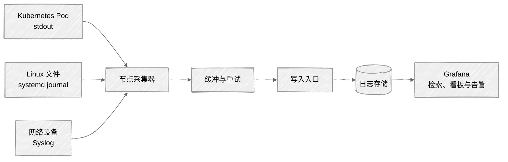
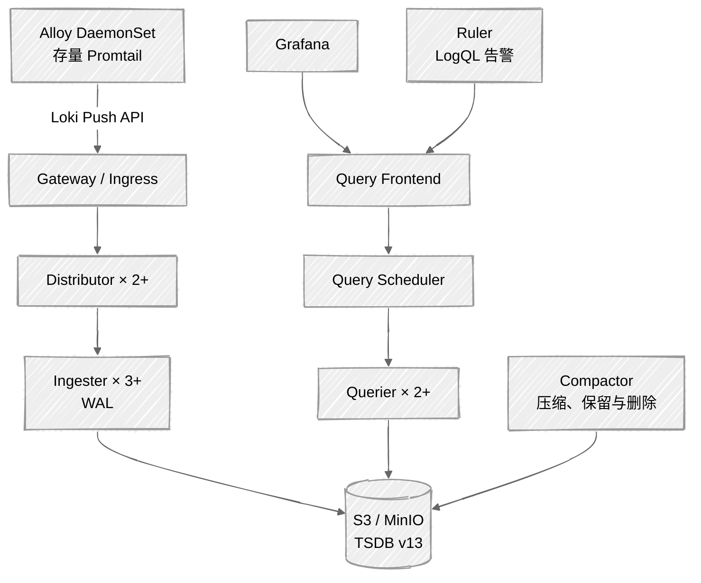
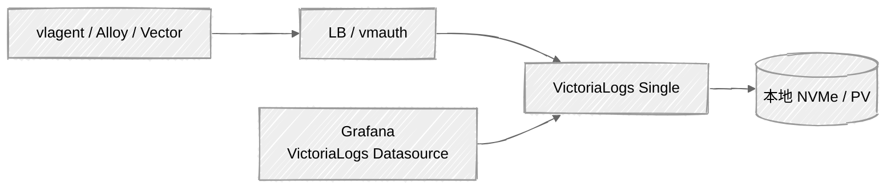
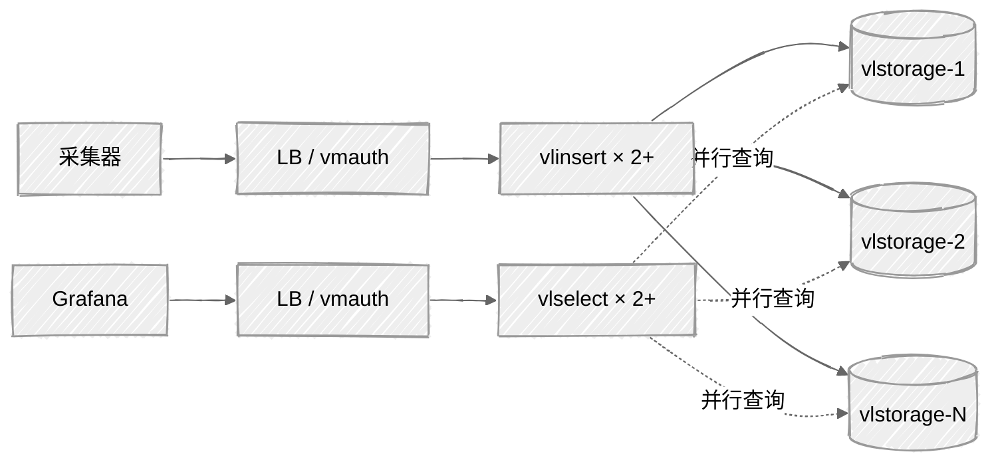

# 日志平台双方案设计：Loki + Promtail + Grafana 与 VictoriaLogs

> 文档版本：1.0  
> 更新日期：2026-08-04  
> 适用读者：平台工程师、运维工程师、SRE、架构师  
> 适用环境：Kubernetes、Linux 主机、容器平台  
> 文档目标：给出两套可落地、可对比、可演进的集中式日志平台方案

## 1. 执行摘要

本文规划两套日志收集与检索方案：

1. **方案 A：Grafana Loki + Grafana Alloy（兼容存量 Promtail）+ Grafana**
   - 适合已经使用 Grafana/Prometheus、偏好 LogQL、主要按 Kubernetes 标签定位日志的团队。
   - 新建生产环境使用 Loki TSDB v13 和 S3 兼容对象存储。
   - 题目中的 Promtail 可继续用于存量环境，但不应作为 2026 年的新增长期组件：Promtail 已从 Loki 3.7.3 移除，其能力已合并到 Grafana Alloy。
2. **方案 B：VictoriaLogs + vlagent/Vector/Grafana Alloy + Grafana**
   - 适合希望组件更少、字段检索能力强、单机纵向扩展简单，或希望降低存储与运维成本的团队。
   - 中小规模优先使用 VictoriaLogs single；单机资源或吞吐达到瓶颈后，再升级为 `vlinsert + vlstorage + vlselect` 集群。

建议先用 7～14 天真实流量双写进行 PoC。若团队已经深度使用 LogQL、Loki 告警和 Grafana 生态，首选方案 A；若更关注简洁运维、结构化字段检索和高压缩比，首选方案 B。不要只依据厂商基准测试决策，应以本公司的日志结构、查询模型和保留周期实测。

## 2. 需求边界与设计假设

### 2.1 目标

- 统一收集 Kubernetes 容器日志、Linux 文件日志和 systemd journal。
- 支持按环境、集群、命名空间、工作负载、应用和日志等级检索。
- 支持 JSON 结构化日志、普通文本日志和多行异常堆栈。
- 支持日志看板、检索、告警、权限隔离、保留和删除策略。
- 采集端发生短时网络故障时具备缓冲与重试能力。
- 平台自身具备指标、日志、告警和容量监控。
- 能够通过统一字段规范在两套后端之间迁移或短期双写。

### 2.2 非目标

- 本文不替代安全审计系统、SIEM 或合规归档系统。
- 不承诺仅凭日志后端实现不可抵赖存证；此类需求应额外使用 WORM/对象锁和独立审计链路。
- 不建议默认采集所有 DEBUG 日志，也不建议无限期保存高基数字段。

### 2.3 PoC 基准假设

以下数字仅用于展示算法，上线前必须替换为 7 天以上实测值：

| 参数 | 示例值 |
| --- | ---: |
| 平均写入速率 | 20 MiB/s（原始日志） |
| 峰值系数 | 3 |
| 平均日志行长度 | 800 Byte |
| 日均原始数据量 | 1.69 TiB |
| 热查询窗口 | 7 天 |
| 总保留期 | 30 天 |
| 可用性目标 | 月度 99.9% |
| 单次查询默认范围 | 15 分钟 |

## 3. 统一日志与标签规范

两套方案应首先统一数据模型。采集端只做稳定、低成本的解析和脱敏；复杂、变化频繁的分析尽量放在查询阶段。

### 3.1 推荐字段

| 字段 | 说明 | 是否作为流标签/Stream Field |
| --- | --- | --- |
| `env` | prod/staging/dev | 是 |
| `cluster` | 集群标识 | 是 |
| `namespace` | Kubernetes Namespace | 是 |
| `app` | 稳定的应用名 | 是 |
| `level` | debug/info/warn/error | 可选，值域稳定时使用 |
| `pod` | Pod 名 | 通常否 |
| `container` | 容器名 | 视规模决定 |
| `node` | 节点名 | 通常否 |
| `trace_id` | 链路 ID | 否，作为普通字段 |
| `request_id` | 请求 ID | 否，作为普通字段 |
| `user_id` | 用户标识 | 否，并应脱敏 |
| `message` / `_msg` | 日志正文 | 否 |

严禁把 `trace_id`、`request_id`、订单号、完整 URL、用户 ID、时间戳等无界值作为 Loki Label 或 VictoriaLogs Stream Field，否则会产生高基数流、增加内存与索引开销。

### 3.2 应用日志格式

业务应用优先输出单行 JSON 到 stdout：

```json
{"timestamp":"2026-08-04T10:30:00.123Z","level":"error","service":"order-api","trace_id":"4fd0...","message":"payment timeout","duration_ms":3001}
```

- 时间使用 RFC 3339/ISO 8601 UTC，并带毫秒或微秒。
- 日志等级使用固定小写值。
- 异常堆栈放入一个 JSON 字段，或由采集器完成多行合并。
- 禁止输出密码、Token、Cookie、身份证、银行卡完整号码等敏感数据。
- `service` 名称应稳定，不随 Pod、版本或节点变化。

## 4. 通用采集架构



采集器按节点部署：Kubernetes 使用 DaemonSet，传统主机使用 systemd。跨网络域时在每个集群或机房部署本地采集层，避免远程挂载日志目录。所有外部写入入口启用 TLS；多租户环境通过网关完成认证、限流和租户注入。

## 5. 方案 A：Loki + Alloy/Promtail + Grafana

### 5.1 生命周期说明

截至本文日期，Promtail 已弃用并在 Loki 3.7.3 中移除，代码并入 Grafana Alloy。因此：

- **存量环境**：可短期维持 Promtail，冻结功能变更并制定 Alloy 迁移计划。
- **新建生产环境**：使用 Grafana Alloy 的日志采集组件，后端仍为 Loki。
- **实验环境**：若必须复现旧系统，可使用与 Promtail 兼容的固定旧版本，但不可使用浮动 `latest` 标签。

### 5.2 逻辑拓扑



### 5.3 部署分级

| 场景 | 部署模式 | 存储 | 建议 |
| --- | --- | --- | --- |
| 本地开发/功能验证 | Loki 单体 | 本地盘 | 仅用于测试 |
| 小型生产（几十 GiB/日以内） | Loki Monolithic | S3 对象存储 | 1～3 实例；需要 HA 时共享对象存储和 Ring |
| 中大型生产 | Loki Distributed | S3 对象存储 | 新建生产首选；组件独立伸缩，跨可用区部署 |
| 存量过渡 | Loki Simple Scalable | S3 对象存储 | 已弃用，Loki 4.0 将移除，不用于新建长期环境 |

生产环境必须使用对象存储。Loki 仅索引标签元数据，日志块和 TSDB 索引存入对象存储。新安装采用 `store: tsdb`、`schema: v13`、24 小时索引周期。

### 5.4 Loki 核心配置基线

以下为结构示例，字段应根据所选 Helm Chart 版本核对：

```yaml
auth_enabled: true

common:
  path_prefix: /var/loki
  replication_factor: 3

schema_config:
  configs:
    - from: "2026-08-01"
      store: tsdb
      object_store: s3
      schema: v13
      index:
        prefix: loki_index_
        period: 24h

storage_config:
  aws:
    endpoint: https://s3.example.com
    bucketnames: logs-prod
    s3forcepathstyle: true
  tsdb_shipper:
    active_index_directory: /var/loki/tsdb-index
    cache_location: /var/loki/tsdb-cache

limits_config:
  retention_period: 720h
  ingestion_rate_mb: 40
  ingestion_burst_size_mb: 80
  max_query_length: 744h
  max_query_parallelism: 16
  reject_old_samples: true
  reject_old_samples_max_age: 168h

compactor:
  working_directory: /var/loki/compactor
  retention_enabled: true
  delete_request_store: s3
```

注意事项：

- `from` 对新集群必须是已经过去的日期；修改既有 Schema 时，新条目必须使用未来 UTC 日期。
- 保留删除由 Compactor 执行；对象存储生命周期规则作为兜底，时间应长于 Loki 保留期。
- 凭据使用 Secret 和工作负载身份，不写入 ConfigMap 或 Git。
- 写入限流应按租户配置，不应直接照抄示例值。

### 5.5 存量 Promtail 配置示例

此配置仅用于存量迁移参考：

```yaml
server:
  http_listen_port: 9080

positions:
  filename: /run/promtail/positions.yaml

clients:
  - url: https://logs.example.com/loki/api/v1/push
    tenant_id: platform-prod
    backoff_config:
      min_period: 500ms
      max_period: 5m
      max_retries: 10

scrape_configs:
  - job_name: kubernetes-pods
    kubernetes_sd_configs:
      - role: pod
    pipeline_stages:
      - cri: {}
      - json:
          expressions:
            level: level
            service: service
            trace_id: trace_id
      - labels:
          level:
          service:
      - drop:
          expression: '(?i)(password|authorization)='
    relabel_configs:
      - source_labels: [__meta_kubernetes_namespace]
        target_label: namespace
      - source_labels: [__meta_kubernetes_pod_label_app_kubernetes_io_name]
        target_label: app
      - source_labels: [__meta_kubernetes_pod_node_name]
        target_label: node
      - source_labels: [__meta_kubernetes_pod_uid, __meta_kubernetes_pod_container_name]
        separator: /
        replacement: /var/log/pods/*$1/*.log
        target_label: __path__
```

脱敏不能只依靠示例中的整行丢弃规则。生产上应在应用输出端和采集 pipeline 中对具体字段做替换，并用测试日志验证不会误删正常数据。

### 5.6 查询与告警

```logql
{env="prod", namespace="payment", app="order-api"} |= "timeout"
```

```logql
sum by (app) (
  count_over_time({env="prod"} | json | level="error" [5m])
) > 20
```

告警建议分两类：

- **业务日志告警**：错误突增、关键错误码、审计事件。
- **平台健康告警**：写入拒绝、丢弃行数、WAL 异常、对象存储错误、查询超时、Compactor 失败、采集器积压。

### 5.7 高可用与容灾

- Distributor、Querier、Query Frontend、Ruler 至少 2 副本并做反亲和。
- Ingester 推荐 3 副本和跨故障域部署，启用 WAL，并为 WAL 使用持久卷。
- 对象存储启用版本控制、跨区域复制或供应商级冗余。
- Grafana 配置、Dashboard、数据源和告警规则全部 GitOps 化。
- 定期执行恢复演练；对象存储有数据不等于查询链路已可恢复。

### 5.8 优缺点

优点：Grafana 生态整合成熟；LogQL 学习资料丰富；标签过滤效率高；对象存储成本可控；组件可独立扩展。

缺点：分布式模式组件多；标签设计错误容易造成高基数；任意字段全文/字段检索需扫描日志块；生产调优和版本升级复杂度较高；Promtail 已不能作为新系统长期选择。

## 6. 方案 B：VictoriaLogs + 采集器 + Grafana

### 6.1 组件选择

| 组件 | 作用 | 建议 |
| --- | --- | --- |
| VictoriaLogs single | 写入、存储、查询一体 | 中小规模首选 |
| `vlinsert` | 集群写入入口和分片 | 超过单机容量后使用 |
| `vlstorage` | 日志存储 | 使用本地 SSD/NVMe 持久卷 |
| `vlselect` | 分布式查询和结果合并 | 与写入层独立扩容 |
| vlagent | 日志采集、缓冲、转发 | 新部署可选 |
| Alloy/Vector/Fluent Bit | 通用采集 | 已有采集体系可复用 |
| VictoriaLogs Grafana datasource | LogsQL 查询与展示 | Grafana 安装插件并配置数据源 |

VictoriaLogs 官方建议：只要单机仍可通过增加 CPU、内存、磁盘和 IOPS 满足需求，就优先使用 single；集群模式用于突破单机纵向扩展上限。

### 6.2 逻辑拓扑

中小规模：



大规模集群：



### 6.3 Single 部署基线

容器参数示例：

```yaml
services:
  victorialogs:
    image: victoriametrics/victoria-logs:<固定版本>
    command:
      - -storageDataPath=/victoria-logs-data
      - -retentionPeriod=30d
      - -httpListenAddr=:9428
    volumes:
      - victorialogs-data:/victoria-logs-data
    ports:
      - "127.0.0.1:9428:9428"
```

该示例只用于本机验证。生产环境还应增加反向代理认证、TLS、资源限制、持久盘监控、备份策略和平台指标采集；不得直接把 9428 裸露到公网。

### 6.4 通过 Loki Push API 接入

VictoriaLogs 接受 Loki 协议，因此 Alloy 或存量 Promtail 可以直接改写入地址，实现低成本双写或迁移：

```yaml
clients:
  - url: "https://vl.example.com/insert/loki/api/v1/push?_stream_fields=env,cluster,namespace,app"
    tenant_id: "12:34"
```

- 租户 ID 格式为 `AccountID:ProjectID`。
- VictoriaLogs 默认会在写入时解析 JSON 正文为字段，通常保留此行为可减少查询时解析成本。
- `_stream_fields` 应只放稳定、低基数字段。
- 双写时必须观察采集器 CPU、内存、发送队列和出口带宽，不能假设成本为零。

### 6.5 Grafana 数据源

安装 VictoriaLogs datasource 插件后，示意配置如下：

```yaml
apiVersion: 1
datasources:
  - name: VictoriaLogs
    type: victoriametrics-logs-datasource
    access: proxy
    url: http://victorialogs:9428
    isDefault: false
```

插件标识和 URL 路径可能随插件版本或多租户部署方式变化，部署时以对应版本的官方文档和插件清单为准。

### 6.6 LogsQL 查询示例

```text
{env="prod",namespace="payment",app="order-api"} AND "timeout"
```

```text
{env="prod"} level:error | stats count() by (app)
```

应在 PoC 中验证团队常用的 20～30 条查询：关键词、字段过滤、正则、时间聚合、Top N、上下文查看、Trace 跳转和告警表达式，而不只测试写入吞吐。

### 6.7 高可用与容灾

- Single 模式本质上存在单实例故障窗口；通过快速重建、持久盘快照和明确 RTO/RPO 管理风险。
- 高可用要求较高时使用 cluster：至少 2 个 `vlinsert`、2 个 `vlselect`，`vlstorage` 数量和复制策略按目标设计。
- 入口使用 vmauth、Ingress 或 API Gateway 进行 TLS、认证、租户路由和限流。
- 本地盘性能决定写入与查询体验，应持续监控磁盘空间、延迟、IOPS、吞吐和 inode。
- 扩容 `vlstorage` 后，新增数据会重新分片，但历史数据不会自动均衡；容量规划必须留余量并按照官方 Rebalancing 流程执行。

### 6.8 优缺点

优点：单机组件少、部署和排障简单；结构化字段与全文检索友好；支持多种写入协议；可复用 Loki 协议采集器；从 single 到 cluster 有明确演进路径。

缺点：团队需要学习 LogsQL；Grafana 集成依赖专用插件；生态和社区规模与 Loki 不同；Single 不能满足严格的无单点目标；集群扩容和历史数据再平衡仍需运维设计。

## 7. 容量估算

### 7.1 通用公式

```text
日原始量 = 平均原始写入 MiB/s × 86400 / 1024
峰值写入 = 平均写入 × 峰值系数
保留原始量 = 日原始量 × 保留天数
后端物理量 = 保留原始量 × 实测压缩系数 × 副本系数 × (1 + 安全余量)
采集出口带宽 = 峰值写入 × 协议膨胀系数 × 双写份数
```

其中“压缩系数”定义为压缩后/原始大小，必须用本公司数据实测。安全余量建议至少 20%～30%，本地盘系统还要预留后台合并和故障恢复空间。

### 7.2 示例

平均 20 MiB/s、保留 30 天时：

- 日原始量约 `20 × 86400 / 1024 = 1687.5 GiB`。
- 30 天原始量约 49.4 TiB。
- 假设 PoC 测得物理/原始为 0.15，副本系数为 1，安全余量 30%，则约需 9.6 TiB。
- 若存储层保存 2 个副本，则约需 19.3 TiB。

该数字不包含对象存储版本、快照、跨区域复制、WAL、缓存、索引工作目录和临时合并空间。Loki 和 VictoriaLogs 的物理占用不可直接套用同一个压缩系数，应分别实测。

### 7.3 PoC 必测指标

- 原始字节/秒、日志行/秒、峰值持续时长。
- 写入成功率、端到端可见延迟、采集器丢弃和重试。
- 物理字节/原始字节，按日志类型分别统计。
- P50/P95/P99 查询延迟与扫描字节。
- 7 天宽查询、关键词查询、字段聚合对 CPU/IO 的影响。
- 节点故障、网络中断、后端限流期间的数据完整性。

## 8. 安全、权限与合规

- 采集器到入口、Grafana 到查询后端全部使用 TLS；跨信任域使用 mTLS。
- 使用 OIDC/SSO 登录 Grafana，以团队、租户和 Folder 进行授权。
- Loki 的 `X-Scope-OrgID` 或 VictoriaLogs 租户 ID 必须由可信网关注入，不能信任公网客户端自报。
- 日志后端部署在私网，安全组只允许采集网关和 Grafana 访问。
- 敏感字段采用“应用端不输出 + 采集端脱敏 + 定期扫描”三层控制。
- 对查询、导出、删除、权限变更保留审计记录。
- 建立按日志类别的保留策略：应用日志、访问日志、安全审计日志不应一刀切。
- 删除请求、备份副本和对象存储生命周期应共同满足数据删除合规要求。

## 9. 可观测性与 SLO

建议定义以下 SLI/SLO：

| SLI | 建议目标示例 |
| --- | --- |
| 写入成功率 | 月度 ≥ 99.9% |
| 端到端可见延迟 | P95 < 30 秒 |
| 15 分钟范围交互查询 | P95 < 5 秒 |
| 采集端非策略性丢失 | 0；任何丢弃均告警 |
| 保留执行偏差 | 不超过策略 + 24 小时 |

平台告警至少覆盖：采集器不可达、缓冲区持续增长、丢弃日志、4xx/5xx、限流、写入延迟、查询错误、磁盘空间、对象存储错误、WAL/Compactor/存储合并异常、证书到期和租户用量异常。

## 10. 两套方案对比

| 维度 | Loki + Alloy/存量 Promtail | VictoriaLogs |
| --- | --- | --- |
| 查询语言 | LogQL | LogsQL |
| 主要检索模型 | 标签筛选后扫描日志块 | Stream Field + 字段/全文检索 |
| 生产存储 | 推荐 S3 兼容对象存储 | Single/Cluster 通常使用本地持久盘 |
| 小规模复杂度 | 单体较简单 | Single 很简单 |
| 大规模复杂度 | 组件较多、独立伸缩成熟 | 三类集群组件，模型清晰 |
| Grafana 集成 | 原生 Loki 数据源 | VictoriaLogs 插件 |
| 采集器 | 新系统用 Alloy；Promtail 已移除 | vlagent、Alloy、Vector、Fluent Bit 等 |
| 多租户 | 原生租户头，需可信网关 | AccountID/ProjectID，需可信网关 |
| 适合团队 | 已有 Grafana/Loki/LogQL 能力 | 重视简洁运维与字段检索 |
| 主要风险 | 高基数、分布式调优、Promtail 迁移 | 插件/语言学习、Single 单点、扩容再平衡 |

### 10.1 决策规则

选择 Loki，当满足多数条件：

- 已有大量 LogQL、Loki Dashboard、告警和运维经验。
- 日志定位主要依赖稳定的 Kubernetes/应用标签。
- 已有成熟、低成本、高可用的对象存储。
- 需要与 Grafana 原生日志工作流保持一致。

选择 VictoriaLogs，当满足多数条件：

- 希望中小规模使用更少组件完成生产落地。
- 日志是结构化 JSON，常按任意字段检索和聚合。
- 有高性能本地盘/PV，并能管理其备份和容量。
- 愿意通过 PoC 验证 LogsQL、插件和告警工作流。

## 11. 详细部署方案

### 11.1 部署前决策表

部署前必须把下列变量写入环境配置库，不能在执行 Helm 时临时决定：

| 项目 | 示例 | 说明 |
| --- | --- | --- |
| Kubernetes 集群 | `prod-observability` | 建议与业务集群隔离；小规模可共用集群、独立节点池 |
| Namespace | `logging` | 后端、Grafana、网关可再拆分 Namespace |
| 日志域名 | `logs.example.com` | 写入和查询可使用不同域名 |
| StorageClass | `nvme-retain` | VictoriaLogs/WAL 使用；回收策略必须为 Retain |
| 对象存储 | `s3://prod-loki` | Loki Distributed 必需，生产不使用内置 MinIO |
| 保留期 | 30 天 | 按日志类别和租户确认，不默认一刀切 |
| 租户映射 | `team -> tenant ID` | 在网关维护并纳入代码评审 |
| RPO/RTO | 5 分钟/60 分钟 | 决定复制、备份、跨区和恢复方式 |
| Chart 版本 | 明确版本号 | 禁止生产安装时省略 `--version` |
| 镜像仓库 | 企业镜像仓库 | 镜像需扫描、签名和固定 digest |

### 11.2 Kubernetes 基础设施准备

建议为日志后端创建独立节点池，避免查询高峰或存储 IO 抢占业务 Pod：

| 节点池 | 工作负载 | 建议特性 |
| --- | --- | --- |
| `logging-stateless` | Distributor、Querier、Gateway、Grafana | 通用计算型，跨 3 个可用区 |
| `logging-stateful` | Ingester WAL、VictoriaLogs、缓存 | 本地 NVMe 或高 IOPS 云盘，禁止随意缩容 |
| `logging-ops`（可选） | Compactor、Ruler、运维任务 | 通用型，可与 stateless 合并 |

基础配置要求：

- Kubernetes 生产集群至少 3 个 Worker 节点，并具有可用区标签。
- 安装 Metrics Server、Ingress/Gateway API、证书控制器和监控组件。
- 为日志 Namespace 设置 ResourceQuota 和 LimitRange，但不要给存储组件设置过紧的内存限制。
- StatefulSet 使用 `podAntiAffinity` 或 `topologySpreadConstraints` 跨节点、跨可用区分布。
- 创建 PodDisruptionBudget，确保自愿中断时仍保留法定副本数。
- 为关键组件设置 PriorityClass；采集器优先级应高于普通业务 Pod，但低于集群核心系统。
- NetworkPolicy 默认拒绝，只开放采集器到写入口、Grafana到查询入口、后端到对象存储和监控抓取流量。
- NTP/Chrony 必须正常；日志时间错误会直接影响接收、保留和查询。

部署准备命令：

```bash
kubectl create namespace logging
kubectl label namespace logging app.kubernetes.io/part-of=central-logging

helm repo add grafana-community https://grafana-community.github.io/helm-charts
helm repo add grafana https://grafana.github.io/helm-charts
helm repo add vm https://victoriametrics.github.io/helm-charts/
helm repo update

helm search repo grafana-community/loki --versions
helm search repo grafana/alloy --versions
helm search repo vm/victoria-logs-single --versions
helm search repo vm/victoria-logs-cluster --versions
```

把最终选择的版本写入 Git 管理的环境变量文件，例如：

```bash
LOKI_CHART_VERSION="<已验证版本>"
ALLOY_CHART_VERSION="<已验证版本>"
VLS_CHART_VERSION="<已验证版本>"
VLC_CHART_VERSION="<已验证版本>"
```

### 11.3 方案 A：Loki 生产部署步骤

#### 11.3.1 推荐模式

- 日志量约 20 GiB/日以内、允许短时查询中断：Monolithic。
- 需要组件级扩缩容、跨可用区高可用或日志量较大：Distributed。
- Simple Scalable 只用于存量过渡；其已弃用并将在 Loki 4.0 移除。

本文生产基线采用 `deploymentMode: Distributed`。官方 Chart 现由 Grafana Community 仓库维护，升级前必须阅读 Chart 与 Loki 两份变更记录。

#### 11.3.2 对象存储准备

至少创建以下逻辑 Bucket，具体能否合并取决于云厂商和 Chart 版本：

- Chunks：日志块。
- Ruler：规则与状态。
- Admin/Deletion：删除请求或管理数据。

Bucket 要求：

- 禁止公网访问，启用服务端加密和访问日志。
- Loki 使用工作负载身份访问，权限限定到指定 Bucket/Prefix。
- 启用版本控制时，必须同时为非当前版本设置生命周期，否则删除后仍持续计费。
- 生命周期兜底时间晚于 Loki retention，例如 Loki 30 天、对象存储 37～45 天。
- 在非生产 Bucket 先验证列举、写入、读取和删除权限。

#### 11.3.3 Loki Helm Values 基线

以下是设计基线，不是所有 Chart 版本通用的完整 Values。部署前先执行 `helm show values`，并在 CI 中运行 `helm template` 与服务器端 Dry Run。

```yaml
deploymentMode: Distributed

loki:
  auth_enabled: true
  commonConfig:
    replication_factor: 3
  schemaConfig:
    configs:
      - from: "2026-08-01"
        store: tsdb
        object_store: s3
        schema: v13
        index:
          prefix: loki_index_
          period: 24h
  storage:
    type: s3
    bucketNames:
      chunks: prod-loki-chunks
      ruler: prod-loki-ruler
      admin: prod-loki-admin
    s3:
      region: cn-region-1
      endpoint: https://s3.example.com
      s3ForcePathStyle: true
      insecure: false
  limits_config:
    retention_period: 720h
    ingestion_rate_mb: 40
    ingestion_burst_size_mb: 80
    reject_old_samples: true
    reject_old_samples_max_age: 168h
    max_query_length: 744h
    max_query_parallelism: 16
  compactor:
    retention_enabled: true
    delete_request_store: s3

distributor:
  replicas: 3
  shutdownDelay: 90s
  terminationGracePeriodSeconds: 120

ingester:
  replicas: 3
  zoneAwareReplication:
    enabled: true
  persistence:
    enabled: true
    storageClass: nvme-retain
    size: 50Gi

querier:
  replicas: 3
  maxUnavailable: 1

queryFrontend:
  replicas: 2
queryScheduler:
  replicas: 2
indexGateway:
  replicas: 2
compactor:
  replicas: 1
ruler:
  replicas: 2

rollout_operator:
  enabled: true

gateway:
  enabled: true
  replicas: 2

lokiCanary:
  enabled: true

minio:
  enabled: false
```

CPU 和内存不要从示例臆测。首轮根据 PoC 设置 requests，limits 至少保留峰值空间；Ingester/Querier 内存使用 P95 加 30% 余量。生产 Values 还应补齐反亲和、拓扑分散、PDB、ServiceMonitor、ServiceAccount 工作负载身份和 NetworkPolicy。

#### 11.3.4 渲染、安装与验证

```bash
helm show values grafana-community/loki \
  --version "${LOKI_CHART_VERSION}" > /tmp/loki-default-values.yaml

helm lint grafana-community/loki \
  --version "${LOKI_CHART_VERSION}" \
  -f deploy/loki/values-prod.yaml

helm template loki grafana-community/loki \
  --namespace logging \
  --version "${LOKI_CHART_VERSION}" \
  -f deploy/loki/values-prod.yaml > /tmp/loki-rendered.yaml

kubectl apply --dry-run=server -f /tmp/loki-rendered.yaml

helm upgrade --install loki grafana-community/loki \
  --namespace logging \
  --version "${LOKI_CHART_VERSION}" \
  -f deploy/loki/values-prod.yaml \
  --atomic --timeout 15m
```

部署后验证：

```bash
kubectl get pods,pvc,pdb -n logging
kubectl get events -n logging --sort-by=.lastTimestamp
kubectl rollout status deployment/loki-distributor -n logging --timeout=10m
kubectl port-forward -n logging svc/loki-gateway 3100:80
curl -fsS http://127.0.0.1:3100/ready
```

实际资源名称由 release 名和 Chart 版本决定，应先通过 `kubectl get deploy,sts,svc -n logging` 确认，不要盲目复制命令。

#### 11.3.5 Alloy DaemonSet

Alloy 每个节点一份，挂载 `/var/log/pods` 和状态目录。示例展示核心链路：

```alloy
discovery.kubernetes "pods" {
  role = "pod"
}

discovery.relabel "pod_logs" {
  targets = discovery.kubernetes.pods.targets

  rule {
    source_labels = ["__meta_kubernetes_namespace"]
    target_label  = "namespace"
  }
  rule {
    source_labels = ["__meta_kubernetes_pod_label_app_kubernetes_io_name"]
    target_label  = "app"
  }
}

loki.source.kubernetes "pods" {
  targets    = discovery.relabel.pod_logs.output
  forward_to = [loki.process.pods.receiver]
}

loki.process "pods" {
  stage.cri {}
  forward_to = [loki.write.primary.receiver]
}

loki.write "primary" {
  endpoint {
    url       = "https://logs.example.com/loki/api/v1/push"
    tenant_id = "platform-prod"
  }
  external_labels = {
    env     = "prod",
    cluster = "prod-k8s-01",
  }
}
```

部署时从当前 Chart 导出默认 Values，再把上述 Alloy 配置放入 Chart 对应的配置字段：

```bash
helm show values grafana/alloy --version "${ALLOY_CHART_VERSION}" \
  > /tmp/alloy-default-values.yaml

helm upgrade --install alloy grafana/alloy \
  --namespace logging \
  --version "${ALLOY_CHART_VERSION}" \
  -f deploy/alloy/values-prod.yaml \
  --atomic --timeout 10m
```

Alloy 上线初期按节点灰度，验证重复采集、positions/offset 持久化、容器日志轮转、多行堆栈和节点重启后的重复量。不要让 Alloy 和 Promtail 同时采集同一文件后写入同一租户。

### 11.4 方案 B：VictoriaLogs 部署步骤

#### 11.4.1 Single 生产试点

Single 适合先上线和纵向扩展，官方 Chart 使用 StatefulSet。推荐独占高 IOPS 持久卷，PVC 回收策略为 Retain。示例 Values：

```yaml
server:
  retentionPeriod: 30d
  persistentVolume:
    enabled: true
    storageClassName: nvme-retain
    size: 2Ti
  resources:
    requests:
      cpu: "4"
      memory: 16Gi
    limits:
      cpu: "8"
      memory: 32Gi
  service:
    type: ClusterIP
```

资源只是试点起点，必须按真实写入量、压缩比和查询并发修正。PVC 至少保留 30% 空闲空间；如果同时设置时间和磁盘容量保留，必须确认触发任一限制时的数据删除行为符合预期。

安装与验证：

```bash
helm show values vm/victoria-logs-single \
  --version "${VLS_CHART_VERSION}" > /tmp/vls-default-values.yaml

helm upgrade --install vls vm/victoria-logs-single \
  --namespace logging \
  --version "${VLS_CHART_VERSION}" \
  -f deploy/victorialogs-single/values-prod.yaml \
  --atomic --timeout 15m

kubectl get pod,pvc,svc -n logging -l app.kubernetes.io/instance=vls
kubectl port-forward -n logging svc/vls-victoria-logs-single-server 9428:9428
curl -fsS http://127.0.0.1:9428/health
```

若对应版本没有 `/health` 或资源名称不同，以根页面列出的 API 和 `kubectl get svc` 结果为准。

使用官方 Collector Chart 的最小接入方式：

```bash
helm upgrade --install vl-collector vm/victoria-logs-collector \
  --namespace logging \
  --set 'remoteWrite[0].url=http://vls-victoria-logs-single-server:9428' \
  --atomic --timeout 10m
```

生产环境应把 Collector Values 落入 Git，明确 Namespace 过滤、字段解析、脱敏、缓冲和资源限制，不应长期依赖 `--set`。

#### 11.4.2 Cluster 生产方案

当 Single 已通过纵向扩容仍无法满足峰值写入、磁盘容量或查询 SLO，才迁移 Cluster：

| 组件 | 起始副本 | 扩容依据 |
| --- | ---: | --- |
| `vlinsert` | 2～3 | 写入 CPU、请求延迟、拒绝率 |
| `vlselect` | 2～3 | 查询并发、CPU、P95/P99 延迟 |
| `vlstorage` | 3 | 磁盘容量、IOPS、后台合并压力 |
| `vmauth` | 2 | 连接数、认证和代理延迟 |

部署流程：

```bash
helm show values vm/victoria-logs-cluster \
  --version "${VLC_CHART_VERSION}" > /tmp/vlc-default-values.yaml

helm lint vm/victoria-logs-cluster \
  --version "${VLC_CHART_VERSION}" \
  -f deploy/victorialogs-cluster/values-prod.yaml

helm upgrade --install vlc vm/victoria-logs-cluster \
  --namespace logging \
  --version "${VLC_CHART_VERSION}" \
  -f deploy/victorialogs-cluster/values-prod.yaml \
  --atomic --timeout 20m
```

Cluster Chart 建议设置短 `nameOverride`（例如 `vlc`），避免 Kubernetes 资源名超过 63 字符。采集器写入 `vmauth:8427/insert/*`，Grafana 查询也经过 vmauth；具体租户路径按选用协议配置。

从 Single 迁移时：

1. 部署空 Cluster 并完成健康检查。
2. 让采集器双写 Single 和 Cluster，观察 24～72 小时。
3. 比较按小时的行数、原始字节、关键错误事件和查询结果。
4. 将 Grafana 非核心 Dashboard 切到 Cluster。
5. 停止向 Single 写入，但保留其只读服务直至保留期结束。
6. 如需历史数据立即可查，必须单独设计官方支持的数据迁移流程；不能直接复制底层目录到 Cluster。

扩容 `vlstorage` 后历史数据不会自动均匀重分布。扩容前评估旧节点剩余空间，并按官方 Rebalancing 流程迁移，禁止直接删除旧 PVC。

### 11.5 Grafana、网关与租户接入

Grafana 建议独立部署并使用外部 PostgreSQL 保存状态；副本数至少 2，Session 存储和插件版本保持一致。数据源、Dashboard、Alerting Contact Point 和规则使用 provisioning/GitOps 管理。

入口分离：

| 入口 | 客户端 | 权限 |
| --- | --- | --- |
| `logs-write.example.com` | Alloy、Collector、应用 | 只允许写入 API |
| `logs-query.example.com` | Grafana、运维工具 | 只允许查询 API |
| Admin/Delete | 平台管理员 | 不暴露公网，强认证和审计 |

网关必须完成：TLS 终止、客户端认证、租户 ID 注入、请求体大小限制、写入速率限制、查询超时、审计日志。禁止客户端任意提交 Loki `X-Scope-OrgID` 或 VictoriaLogs AccountID/ProjectID。

### 11.6 Git 目录与发布流水线

推荐将部署文件组织为：

```text
deploy/
├── alloy/
│   ├── values-prod.yaml
│   └── config.alloy
├── loki/
│   ├── values-prod.yaml
│   └── dashboards/
├── victorialogs-single/
│   └── values-prod.yaml
├── victorialogs-cluster/
│   └── values-prod.yaml
├── grafana/
│   ├── values-prod.yaml
│   └── provisioning/
└── tests/
    ├── smoke.sh
    └── synthetic-log-generator.yaml
```

CI 流程：YAML/Alloy 语法检查 → `helm lint` → `helm template` → Policy 扫描 → 非生产安装 → 合成日志验证 → 人工审批 → 生产 `helm upgrade --install --atomic`。Secret 使用 External Secrets、SOPS 或同类方案，明文凭据禁止进入 Git。

### 11.7 上线检查与冒烟测试

发送一条带唯一标识的 JSON 日志：

```bash
TEST_ID="logging-smoke-$(date +%s)"
printf '{"level":"info","service":"logging-smoke","test_id":"%s","message":"deployment verification"}\n' "${TEST_ID}"
```

应通过实际采集路径输出，而不是只用 curl 绕过采集器。验收时同时检查：

- 60 秒内可检索到 `TEST_ID`，时间戳和字段正确。
- Pod 重启、日志轮转、节点迁移后无明显重复和缺口。
- 禁止 Namespace、敏感字段和超长行按策略被处理，并有丢弃计数。
- Grafana 数据源健康、Explore 查询、Dashboard 和告警均正常。
- Canary/合成日志持续成功；写入失败会触发告警。

### 11.8 升级、回滚与灾难恢复

升级顺序通常为：监控与告警就绪 → 非生产验证 → 采集器兼容性验证 → 查询无状态组件 → 写入/存储组件 → Grafana 插件。每次只跨一个受支持版本区间。

```bash
helm diff upgrade <release> <chart> -n logging \
  --version "<目标版本>" -f <values-file>

helm upgrade <release> <chart> -n logging \
  --version "<目标版本>" -f <values-file> \
  --atomic --timeout 20m

helm history <release> -n logging
```

回滚边界：

- Helm 回滚只恢复 Kubernetes 资源，不能自动回滚存储格式和 Schema。
- Loki Schema 变更不可简单撤销，必须按官方规则增加新的未来 Schema 条目。
- VictoriaLogs 跨版本回滚前必须核对数据格式兼容性。
- PVC、Bucket 和底层数据不随 `helm uninstall` 自动视为可安全删除。

灾难恢复演练至少每季度执行一次：在隔离 Namespace/集群恢复配置、身份权限、对象存储/PV 快照，运行真实查询并记录 RTO/RPO。仅验证“快照存在”不算恢复成功。

### 11.9 Docker Compose 部署方案

Docker 方案适合开发、PoC、边缘节点，以及日志量较小且允许单机故障的环境。单台 Docker 主机无法消除主机、磁盘和 Docker Daemon 单点；要求跨主机高可用时，应使用前文 Kubernetes 方案。

#### 11.9.1 主机和目录规划

| 场景 | CPU | 内存 | 磁盘 |
| --- | ---: | ---: | --- |
| 本地体验 | 2 核 | 4 GiB | 20 GiB |
| 小型 PoC | 4 核 | 8 GiB | 100 GiB SSD |
| 小型单机生产 | 8 核起 | 16～32 GiB | 独立 SSD/NVMe，按容量公式规划 |

建议使用 Docker Engine 24+、Compose v2，并保证时间同步。数据目录应位于独立数据盘，而不是容器可写层。

```text
docker-logging/
├── .env
├── compose.yaml
├── alloy/config.alloy
├── loki/loki.yaml
├── grafana/provisioning/datasources/datasource.yaml
├── secrets/grafana_admin_password.txt
└── data/
    ├── alloy/
    ├── grafana/
    ├── loki/
    └── victorialogs/
```

`.env` 使用经过测试的固定版本，禁止生产使用 `latest`：

```dotenv
LOKI_IMAGE=grafana/loki:<固定版本>
ALLOY_IMAGE=grafana/alloy:<固定版本>
GRAFANA_IMAGE=grafana/grafana:<固定版本>
VICTORIALOGS_IMAGE=victoriametrics/victoria-logs:<固定版本>
```

#### 11.9.2 Loki + Alloy + Grafana

`compose.yaml`：

```yaml
name: loki-logging

services:
  loki:
    image: ${LOKI_IMAGE}
    command: ["-config.file=/etc/loki/loki.yaml"]
    restart: unless-stopped
    volumes:
      - ./loki/loki.yaml:/etc/loki/loki.yaml:ro
      - ./data/loki:/loki
    ports:
      - "127.0.0.1:3100:3100"
    networks: [logging]
    logging: &local-logging
      driver: local
      options:
        max-size: "20m"
        max-file: "3"

  alloy:
    image: ${ALLOY_IMAGE}
    command:
      - run
      - --server.http.listen-addr=0.0.0.0:12345
      - --storage.path=/var/lib/alloy/data
      - /etc/alloy/config.alloy
    restart: unless-stopped
    user: "0:0"
    volumes:
      - ./alloy/config.alloy:/etc/alloy/config.alloy:ro
      - ./data/alloy:/var/lib/alloy/data
      - /var/lib/docker/containers:/var/lib/docker/containers:ro
    ports:
      - "127.0.0.1:12345:12345"
    depends_on: [loki]
    networks: [logging]
    logging: *local-logging

  grafana:
    image: ${GRAFANA_IMAGE}
    restart: unless-stopped
    environment:
      GF_SECURITY_ADMIN_USER: admin
      GF_SECURITY_ADMIN_PASSWORD__FILE: /run/secrets/grafana_admin_password
      GF_USERS_ALLOW_SIGN_UP: "false"
    secrets: [grafana_admin_password]
    volumes:
      - ./data/grafana:/var/lib/grafana
      - ./grafana/provisioning:/etc/grafana/provisioning:ro
    ports:
      - "127.0.0.1:3000:3000"
    depends_on: [loki]
    networks: [logging]
    logging: *local-logging

networks:
  logging:
    driver: bridge

secrets:
  grafana_admin_password:
    file: ./secrets/grafana_admin_password.txt
```

`loki/loki.yaml` 使用 Monolithic、TSDB v13 和本地文件系统：

```yaml
auth_enabled: false

server:
  http_listen_port: 3100

common:
  path_prefix: /loki
  replication_factor: 1
  ring:
    kvstore:
      store: inmemory

schema_config:
  configs:
    - from: "2026-08-01"
      store: tsdb
      object_store: filesystem
      schema: v13
      index:
        prefix: index_
        period: 24h

storage_config:
  filesystem:
    directory: /loki/chunks
  tsdb_shipper:
    active_index_directory: /loki/tsdb-index
    cache_location: /loki/tsdb-cache

compactor:
  working_directory: /loki/compactor
  retention_enabled: true
  delete_request_store: filesystem

limits_config:
  retention_period: 720h
  reject_old_samples: true
  reject_old_samples_max_age: 168h
  ingestion_rate_mb: 8
  ingestion_burst_size_mb: 16
```

`alloy/config.alloy` 采集 Docker 默认 `json-file` 日志：

```alloy
logging {
  level  = "info"
  format = "logfmt"
}

local.file_match "docker" {
  path_targets = [{
    __path__ = "/var/lib/docker/containers/*/*-json.log",
    job      = "docker",
    env      = "prod",
    host     = constants.hostname,
  }]
}

loki.source.file "docker" {
  targets       = local.file_match.docker.targets
  forward_to    = [loki.process.docker.receiver]
  tail_from_end = true
}

loki.process "docker" {
  stage.docker {}
  forward_to = [loki.write.loki.receiver]
}

loki.write "loki" {
  endpoint {
    url = "http://loki:3100/loki/api/v1/push"
  }
}
```

Grafana 数据源 `grafana/provisioning/datasources/datasource.yaml`：

```yaml
apiVersion: 1
datasources:
  - name: Loki
    uid: loki
    type: loki
    access: proxy
    url: http://loki:3100
    isDefault: true
    editable: false
```

启动和检查：

```bash
mkdir -p secrets data/alloy data/grafana data/loki
printf '%s' '<替换为高强度密码>' > secrets/grafana_admin_password.txt
chmod 600 secrets/grafana_admin_password.txt

docker compose config --quiet
docker compose pull
docker compose up -d
docker compose ps
docker compose logs --tail=100 loki alloy grafana

curl -fsS http://127.0.0.1:3100/ready
curl -fsS http://127.0.0.1:3000/api/health
```

Linux 上的 Bind Mount 必须预先赋予容器实际运行 UID 写权限。若 Loki 或 Grafana报 `permission denied`，应通过 `docker image inspect` 或镜像文档确认 UID 后调整目录所有权，或者改用命名卷；不要使用 `chmod 777`。SELinux 主机还需按平台规范添加正确的 Volume Label。

如果 Docker Root Dir 不是 `/var/lib/docker`，或容器使用 `local`/journald 日志驱动，上述文件采集不适用。先检查：

```bash
docker info --format '{{.DockerRootDir}}'
docker inspect <容器名> --format '{{.HostConfig.LogConfig.Type}}'
```

然后选择 Alloy 的 journal、Docker API 或正确的文件路径采集方式。

#### 11.9.3 VictoriaLogs + Alloy + Grafana

VictoriaLogs Single 的 Compose 组件更少：

```yaml
name: victorialogs-logging

services:
  victorialogs:
    image: ${VICTORIALOGS_IMAGE}
    command:
      - -storageDataPath=/victoria-logs-data
      - -retentionPeriod=30d
      - -httpListenAddr=:9428
    restart: unless-stopped
    volumes:
      - ./data/victorialogs:/victoria-logs-data
    ports:
      - "127.0.0.1:9428:9428"
    networks: [logging]
    logging: &local-logging
      driver: local
      options:
        max-size: "20m"
        max-file: "3"

  alloy:
    image: ${ALLOY_IMAGE}
    command:
      - run
      - --server.http.listen-addr=0.0.0.0:12345
      - --storage.path=/var/lib/alloy/data
      - /etc/alloy/config.alloy
    restart: unless-stopped
    user: "0:0"
    volumes:
      - ./alloy/config.alloy:/etc/alloy/config.alloy:ro
      - ./data/alloy:/var/lib/alloy/data
      - /var/lib/docker/containers:/var/lib/docker/containers:ro
    ports:
      - "127.0.0.1:12345:12345"
    depends_on: [victorialogs]
    networks: [logging]
    logging: *local-logging

  grafana:
    image: ${GRAFANA_IMAGE}
    restart: unless-stopped
    environment:
      GF_SECURITY_ADMIN_USER: admin
      GF_SECURITY_ADMIN_PASSWORD__FILE: /run/secrets/grafana_admin_password
      GF_USERS_ALLOW_SIGN_UP: "false"
      GF_INSTALL_PLUGINS: victoriametrics-logs-datasource
    secrets: [grafana_admin_password]
    volumes:
      - ./data/grafana:/var/lib/grafana
      - ./grafana/provisioning:/etc/grafana/provisioning:ro
    ports:
      - "127.0.0.1:3000:3000"
    depends_on: [victorialogs]
    networks: [logging]
    logging: *local-logging

networks:
  logging:
    driver: bridge

secrets:
  grafana_admin_password:
    file: ./secrets/grafana_admin_password.txt
```

复用上一节 Alloy 文件采集部分，把写入端改为：

```alloy
loki.write "victorialogs" {
  endpoint {
    url = "http://victorialogs:9428/insert/loki/api/v1/push?_stream_fields=env,host,job"
  }
}
```

并把 `loki.process "docker"` 中的输出改为：

```alloy
forward_to = [loki.write.victorialogs.receiver]
```

Grafana 数据源：

```yaml
apiVersion: 1
datasources:
  - name: VictoriaLogs
    uid: victorialogs
    type: victoriametrics-logs-datasource
    access: proxy
    url: http://victorialogs:9428
    isDefault: true
    editable: false
```

启动验证：

```bash
docker compose config --quiet
docker compose pull
docker compose up -d
docker compose ps
docker compose logs --tail=100 victorialogs alloy grafana

curl -fsS http://127.0.0.1:9428/
curl -fsS http://127.0.0.1:3000/api/health
curl -fsS http://127.0.0.1:9428/select/logsql/query \
  -d 'query={job="docker"}'
```

Grafana 插件 ID和数据源类型应按锁定版本核对。生产环境建议将插件预装进固定版本的 Grafana 自定义镜像，避免启动时下载失败或版本漂移。

#### 11.9.4 远程主机接入

不要把远程主机 `/var/log` 通过 NFS 集中挂载给一个采集容器。应在每台主机运行 Alloy，就近读取并通过 HTTPS 写入中心服务：

```bash
docker run -d \
  --name alloy \
  --restart unless-stopped \
  -v /etc/alloy/config.alloy:/etc/alloy/config.alloy:ro \
  -v /var/log:/var/log:ro \
  -v alloy-data:/var/lib/alloy/data \
  -p 127.0.0.1:12345:12345 \
  grafana/alloy:<固定版本> \
  run --server.http.listen-addr=0.0.0.0:12345 \
  --storage.path=/var/lib/alloy/data /etc/alloy/config.alloy
```

状态目录必须持久化，否则容器重建后可能从头读取文件，造成重复数据。写入口需要 Basic Auth、Bearer Token 或 mTLS，并由可信网关注入租户。

#### 11.9.5 单机生产加固

- 后端和 Grafana 端口只绑定 `127.0.0.1`，通过 Nginx/Caddy/Traefik 提供 TLS 和认证。
- 禁止 `privileged: true`；日志目录只读，Alloy 状态目录单独可写。
- 为服务设置 CPU/内存限制，并启用 Docker 自身日志轮转。
- 数据盘使用 XFS/ext4，监控空间、IO 延迟、inode、SMART 和只读文件系统事件。
- 固定镜像版本或 digest；凭据使用 Compose Secret，不进入 `.env` 和 Git。
- 宿主机防火墙只允许反向代理、监控和管理网段访问。
- 单机生产必须有主机快照、异机备份和完整恢复演练。

#### 11.9.6 备份、升级和回滚

配置可在线备份；数据目录优先使用文件系统或云盘一致性快照。没有快照能力时，在维护窗口停止采集和后端后再复制，避免获得不一致备份：

```bash
docker compose config > /tmp/compose-rendered.yaml
docker compose images
docker compose stop alloy
docker compose stop loki
# 在此执行数据盘快照；VictoriaLogs 方案把 loki 替换为 victorialogs
docker compose start loki
docker compose start alloy
```

升级按“备份 → 测试副本验证 → 修改一个镜像版本 → `docker compose pull <服务>` → `docker compose up -d <服务>` → 冒烟测试”执行。若新版本改变磁盘格式或 Loki Schema，回退镜像未必能读取新数据；必须遵循对应版本的兼容说明，禁止删除数据目录来处理启动失败。

#### 11.9.7 选择建议

| 条件 | 推荐方案 |
| --- | --- |
| 本地学习和 LogQL 验证 | Loki Monolithic Compose |
| 单机、结构化字段检索、简化运维 | VictoriaLogs Single Compose |
| 多台主机集中采集 | 每台主机 Alloy + 中心后端 |
| 跨主机 HA、自动调度和水平扩展 | Kubernetes，不使用单机 Compose |
| 多租户或公网接入 | 增加可信网关，禁止直接暴露后端 |

## 12. 实施计划

### 阶段 0：需求与基线（2～3 天）

- 统计日志源、平均/峰值流量、行长、格式、保留期、查询模式。
- 盘点敏感字段、租户边界、RTO/RPO 和审计要求。
- 选取 5～10 个代表性应用及 20～30 条真实查询。

### 阶段 1：双方案 PoC（7～14 天）

- 使用同一批日志双写 Loki 与 VictoriaLogs。
- 应用统一字段和 Stream/Label 规范。
- 运行查询压测、写入突发、节点故障、网络中断和恢复测试。
- 记录资源、存储、延迟、数据完整性和运维工时。

### 阶段 2：生产试点（1～2 周）

- 先接入非核心命名空间，随后接入一个核心业务域。
- 建立 Dashboard、平台告警、值班手册和租户配额。
- 验证 30 天保留删除、备份恢复和权限隔离。
- 完成安全评审和成本评审。

### 阶段 3：全量与收敛（2～4 周）

- 分批迁移日志源，并在每批次核对日志条数/字节和关键事件。
- 双写观察至少 7 天，确认目标系统稳定后停止旧链路。
- 下线前导出配置、告警、Dashboard 和必要历史数据。
- 存量 Promtail 转换为 Alloy，并逐节点灰度。

## 13. 验收清单

- [ ] Kubernetes、主机、journal 和多行异常日志均可查询。
- [ ] JSON 字段解析正确，时间戳和时区无偏差。
- [ ] 标签/Stream Field 不包含无界高基数字段。
- [ ] 敏感数据脱敏测试通过。
- [ ] 峰值写入时无非预期丢弃，端到端延迟满足 SLO。
- [ ] 常用查询的 P95/P99 满足目标。
- [ ] 单节点/单 Pod 故障期间平台行为符合 RTO/RPO。
- [ ] 限流、磁盘不足、对象存储异常和证书到期均有告警。
- [ ] 保留删除、备份恢复、租户隔离通过演练。
- [ ] 配置、Dashboard、告警规则和操作手册已进入 Git。
- [ ] Promtail 存量环境具有明确的 Alloy 迁移日期和回滚方案。

## 14. 最终推荐

在没有现网约束数据时，建议采用以下落地策略：

1. **统一采用 Grafana Alloy 或团队现有 Vector 作为新采集层**，不要新增 Promtail 技术债。
2. **Loki 作为生态优先候选**：团队已用 Grafana/Prometheus、对象存储成熟时，小规模使用 Monolithic，高可用或大规模使用 Distributed + TSDB v13；不为新环境引入已弃用的 Simple Scalable。
3. **VictoriaLogs 作为成本和简洁性候选**：先以 single 验证真实负载，确认单机余量和恢复目标；超过单机边界后再部署 cluster。
4. 使用同一采集端进行限期双写，通过真实数据计算单位 TiB 成本、查询性能、平台资源和月度运维工时，最终用评分表决策。

建议决策权重：可靠性 30%、查询体验 25%、总成本 20%、运维复杂度 15%、生态与人才 10%。若日志属于强审计场景，应提高可靠性与合规权重。

## 15. 官方参考资料

- [Grafana Loki：Promtail 生命周期与迁移](https://grafana.com/docs/loki/latest/send-data/promtail/)
- [Grafana Loki 3.7 Release Notes：Promtail 移除说明](https://grafana.com/docs/loki/latest/release-notes/v3-7/)
- [Grafana Loki：Storage](https://grafana.com/docs/loki/latest/configure/storage/)
- [Grafana Loki：Storage Schema](https://grafana.com/docs/loki/latest/operations/storage/schema/)
- [Grafana Loki：Helm 安装与部署模式](https://grafana.com/docs/loki/latest/setup/install/helm/)
- [Grafana Loki：Distributed Helm 部署](https://grafana.com/docs/loki/latest/setup/install/helm/install-microservices/)
- [Grafana Alloy：采集 Kubernetes 日志](https://grafana.com/docs/grafana-cloud/send-data/alloy/collect/logs-in-kubernetes/)
- [Grafana Loki：Docker Compose Quick Start](https://grafana.com/docs/loki/latest/get-started/quick-start/quick-start/)
- [Grafana Alloy：Docker 安装](https://grafana.com/docs/grafana-cloud/send-data/alloy/set-up/install/docker/)
- [VictoriaLogs：Cluster 架构与容量规划](https://docs.victoriametrics.com/victorialogs/cluster/)
- [VictoriaLogs：Single Helm Chart](https://docs.victoriametrics.com/helm/victoria-logs-single/)
- [VictoriaLogs：Cluster Helm Chart](https://docs.victoriametrics.com/helm/victorialogs-cluster/)
- [VictoriaLogs：数据接入](https://docs.victoriametrics.com/victorialogs/data-ingestion/)
- [VictoriaLogs：通过 Promtail/Alloy 接入](https://docs.victoriametrics.com/victorialogs/data-ingestion/promtail/)
- [VictoriaLogs：Grafana Datasource](https://docs.victoriametrics.com/victorialogs/victorialogs-datasource/)
- [VictoriaLogs：Docker Quick Start](https://docs.victoriametrics.com/victorialogs/quickstart/)
