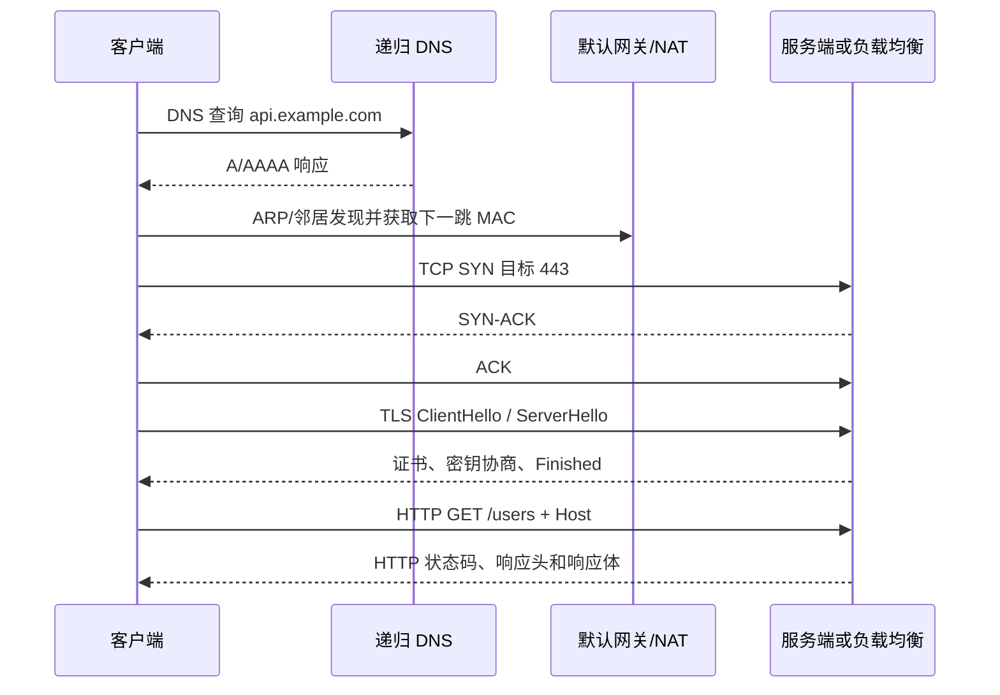

# 网络基础与进阶：从数据包到生产排障

> 本文是一份网络知识主线文档，面向“已经知道 IP、端口、TCP 这些词，但还不能把一次请求完整讲清楚”的读者。
> 阅读顺序从数据包、局域网和 IP 开始，逐步进入 TCP、DNS、HTTP、TLS、代理、容器网络和生产排障。

## 1. 先建立一张全局地图

当浏览器访问 `https://api.example.com/users` 时，可以把过程拆成以下问题：

1. **名字解析**：`api.example.com` 对应哪个 IP？这由 DNS 完成。
2. **路径选择**：本机应该把包发给目标主机，还是发给默认网关？这由路由表决定。
3. **二层投递**：下一跳的 MAC 地址是什么？本地网段通过 ARP（IPv4）或邻居发现（IPv6）获得它。
4. **可靠传输**：目标端口是否监听？TCP 是否完成握手？是否出现重传、RST 或超时？
5. **加密与协议**：TLS 是否验证成功？HTTP 方法、Host、路径和响应状态是否正确？
6. **服务转发**：请求是否经过 NAT、负载均衡、反向代理、Ingress 或 Service？后端是否有可用实例？

网络排障的核心不是背命令，而是沿着这条路径逐层确认。某一层没有证据时，不要直接跳到“应用有问题”或“防火墙拦了”。

### 1.1 网络的四个观察角度

| 角度 | 主要问题 | 常用证据 |
|------|----------|----------|
| 拓扑 | 谁和谁相连，中间经过哪些设备 | 架构图、路由表、VLAN、隧道、Service |
| 协议 | 每一层如何封装、寻址、交付和重试 | 报文、握手、状态机、RFC |
| 配置 | 设备和进程被要求做什么 | `ip route`、DNS 区域、Nginx 配置、NetworkPolicy |
| 运行时 | 实际发生了什么 | `ss`、抓包、日志、指标、连接跟踪 |

### 1.2 读完本文应该能做到什么

- 从一台主机出发，解释一个请求如何经过 DNS、路由、ARP、TCP、TLS 和 HTTP。
- 看懂 IPv4/CIDR、网关、路由优先级、端口、NAT、VLAN 和 MTU 的基本关系。
- 用 `ip`、`ss`、`dig`、`curl`、`nc`、`tcpdump` 等工具把“访问不通”拆成可验证的层次。
- 理解 Docker/Kubernetes 的 veth、bridge、CNI、Service、Ingress 和 NetworkPolicy 位于哪一层。
- 区分“端口可连”“HTTP 返回 200”“业务请求成功”这三个不同结论。

## 2. 数据包是怎样被送到另一台机器的

### 2.1 三个基本对象：帧、包、段

网络数据会在不同层使用不同名称。实际实现可能有例外，但下面的模型足够支撑日常排障：

```text
应用数据
  └─ HTTP 请求
      └─ TCP 段（源端口、目标端口、序号、标志位）
          └─ IP 包（源 IP、目标 IP、TTL、协议号）
              └─ 以太网帧（源 MAC、目标 MAC、EtherType、FCS）
```

- **帧（frame）**：局域网链路上的投递单位，包含 MAC 地址。
- **包（packet）**：网络层的投递单位，包含 IP 地址。
- **段（segment）**：TCP 传输层的投递单位；UDP 更常称为数据报（datagram）。

发送方逐层添加头部，称为封装；接收方逐层移除头部，称为解封装。一个交换机通常只关心帧，一个路由器通常会重新封装二层帧，但会继续转发三层 IP 包。

### 2.2 OSI 与 TCP/IP 模型

OSI 七层适合学习，TCP/IP 四层更贴近实现。不要把层模型理解成严格隔离的七个进程；它是定位责任边界的工具。

| TCP/IP 层 | 常见协议或设备 | 主要职责 |
|-----------|----------------|----------|
| 应用层 | DNS、HTTP、TLS、SSH、gRPC | 业务语义、名称解析、加密会话 |
| 传输层 | TCP、UDP、QUIC | 端口、多路复用、可靠性或低延迟 |
| 网际层 | IPv4、IPv6、ICMP、路由器 | 跨网段寻址和转发 |
| 链路/接入层 | Ethernet、Wi-Fi、ARP、VLAN、交换机 | 同一链路上的帧传输 |

常见的排障映射是：

- “没有网卡地址、网关错误”偏向链路或 IP 配置。
- “能 ping，端口拒绝”说明 IP 路径大概率存在，继续看监听和防火墙。
- “TCP 已建立，HTTP 返回 404/502”进入应用、代理或后端路由层。
- “偶发卡顿、重传、连接被复位”需要看 TCP 状态、MTU、丢包和中间设备。

### 2.3 一次请求的时序

下面以客户端已经知道 DNS 服务器为前提，展示典型 HTTPS 请求。实际环境可能命中缓存、使用代理、走 HTTP/3 或通过 CDN，因此这是基线模型，不是每次请求的完整抓包模板。



## 3. 链路层：MAC、交换机、ARP 和 VLAN

### 3.1 MAC 地址与交换机

网卡有一个链路层地址，通常写成 `aa:bb:cc:dd:ee:ff`。交换机根据收到的帧学习“源 MAC 在哪个端口”，再查询 MAC 地址表转发目标帧：

- 目标 MAC 已知：只从对应端口转发。
- 目标 MAC 未知：在 VLAN 内泛洪，等待目标或其他交换机回复。
- 广播帧：在同一广播域内泛洪。

交换机转发的是帧，不负责决定跨网段的下一跳。跨网段通信必须交给路由器或三层交换机。

### 3.2 ARP：从 IPv4 到 MAC

主机知道目标 IP，却不知道同一网段中该 IP 的 MAC 时，会发送 ARP 请求：

```text
谁拥有 192.168.1.1？请告诉 192.168.1.10
```

收到 ARP 应答后，结果暂存在邻居缓存中。查看和清理缓存：

```bash
ip neigh show
ip neigh get 192.168.1.1 dev eth0
sudo ip neigh flush dev eth0
```

如果目标 IP 不在本地网段，主机不会寻找目标主机的 MAC，而是寻找默认网关的 MAC，然后把 IP 包交给网关转发。这是“目标 IP”和“下一跳 MAC”经常被混淆的原因。

### 3.3 广播域、冲突域和 VLAN

- **广播域**：广播帧可以到达的范围。路由器通常隔离广播域。
- **冲突域**：共享介质上可能发生冲突的范围；现代全双工交换网络中已很少作为日常故障点。
- **VLAN**：在一套物理交换网络上划分多个逻辑二层网络。不同 VLAN 之间需要三层路由。

常见端口模式：

| 模式 | 帧形态 | 常见用途 |
|------|--------|----------|
| Access | 接入端口收发一个 VLAN 的无标签帧 | 普通服务器、终端 |
| Trunk | 在帧中携带 VLAN 标签 | 交换机互联、虚拟化宿主机、网关 |

排查 VLAN 问题时，至少要确认端口所属 VLAN、Trunk 允许的 VLAN 列表、网关子接口和 MTU；只看主机 IP 往往不够。

## 4. 网络层：IP、子网和路由

### 4.1 IPv4 地址与 CIDR

IPv4 是 32 位地址，例如 `192.168.10.23`。CIDR 的 `/24` 表示前 24 位是网络部分，后 8 位是主机部分：

```text
192.168.10.0/24
网络地址：192.168.10.0
常见主机范围：192.168.10.1 - 192.168.10.254
广播地址：192.168.10.255
```

常用前缀速查：

| 前缀 | 地址总数 | 典型用途 |
|------|----------|----------|
| `/32` | 1 | 单个主机、路由或白名单 |
| `/30` | 4 | 点到点链路（传统做法） |
| `/24` | 256 | 小型网段 |
| `/16` | 65,536 | 大型私网或集群地址池 |
| `/8` | 16,777,216 | 大范围地址规划 |

严格计算可用主机数时，要考虑网络地址、广播地址、云厂商保留地址和 IPv6 的不同规则。不要仅凭“/24 有 254 个可用地址”规划云 VPC 或 Kubernetes Pod CIDR。

私有 IPv4 地址主要包括：

- `10.0.0.0/8`
- `172.16.0.0/12`
- `192.168.0.0/16`

私有地址不能直接在公网路由，通常需要 NAT、VPN、专线或专用互联访问其他网络。

### 4.2 主机地址、网关和路由表

查看本机地址与路由：

```bash
ip -br addr
ip route show
ip route get 1.1.1.1
```

典型输出：

```text
default via 192.168.1.1 dev eth0
192.168.1.0/24 dev eth0 proto kernel scope link src 192.168.1.10
```

含义是：

- `192.168.1.0/24` 是直连网段，目标在其中时直接通过 `eth0` 发送。
- 其他没有更具体路由的目标走 `192.168.1.1`。
- `src 192.168.1.10` 是该路径通常选用的源地址。

Linux 选择路由时遵循“最长前缀优先”，然后结合 metric、策略路由、接口状态和路由协议结果。`default` 只是兜底路由，并不一定是所有流量的实际路径。

### 4.3 ICMP、TTL 和 traceroute

ICMP 不是只用于 `ping`，还承载不可达、超时、路径 MTU 等控制信息。`ping` 成功只能说明 ICMP Echo 往返成功，不能证明 TCP 443 或应用请求可用。

`traceroute` 通过逐步降低 TTL，让中间路由器返回 ICMP Time Exceeded，从而推测路径。某一跳显示 `*` 可能表示限速或禁回，不一定代表转发失败；应关注最终目标和多次结果。

```bash
ping -c 4 -W 2 192.168.1.1
traceroute -n 1.1.1.1
# Linux 也可使用 TCP/ICMP 模式，绕过部分 UDP 过滤
sudo traceroute -T -p 443 -n example.com
```

### 4.4 IPv6 基本认识

IPv6 使用 128 位地址，常见写法如 `2001:db8::10/64`。它没有 IPv4 的广播，使用多播和邻居发现；地址规划、默认路由、DNS 的 `AAAA` 记录和防火墙规则都需要单独确认。

```bash
ip -6 addr
ip -6 route
ping -6 -c 4 2001:db8::1
```

双栈服务可能优先尝试 IPv6，导致“IPv4 正常、域名访问失败”或延迟变长。测试时分别固定 `curl -4` 和 `curl -6`。

## 5. 传输层：端口、TCP、UDP 和 QUIC

### 5.1 端口与 socket

IP 标识主机，端口标识主机上的传输端点。一个 TCP 连接通常由四元组唯一确定：

```text
源 IP:源端口 -> 目标 IP:目标端口
```

服务端监听固定端口，客户端通常从临时端口发起连接。监听状态、已建立连接和 TIME_WAIT 的含义不同：

```bash
ss -lntup                 # 监听端口和进程
ss -tan state established # 已建立 TCP 连接
ss -tan state time-wait  # 等待旧连接报文消失
```

`Connection refused` 通常意味着目标主机主动返回 RST，常见原因是端口没有监听或防火墙明确拒绝；`timeout` 更像是包被丢弃、路径不通或对端没有回包，仍需抓包确认。

### 5.2 TCP 三次握手与四次挥手

建立连接的目的不是“打招呼”这么简单，而是让双方同步初始序号并确认双向收发能力：

```text
客户端                         服务端
  SYN, seq=x  ---------------->
              <----------------  SYN-ACK, seq=y, ack=x+1
  ACK, ack=y+1 --------------->
```

关闭连接通常需要双方分别关闭自己的发送方向，因此常见四次挥手。RST 是立即复位连接的控制信号，可能由应用主动关闭、内核发现异常或中间设备注入。

常见状态：

| 状态 | 含义 |
|------|------|
| `LISTEN` | 服务端等待连接 |
| `SYN-SENT` | 客户端已发 SYN，等待应答 |
| `SYN-RECV` | 服务端收到 SYN，等待最终 ACK |
| `ESTAB` | 连接已建立 |
| `FIN-WAIT-*` | 本端正在关闭 |
| `CLOSE-WAIT` | 对端已关闭，本端应用尚未 close |
| `TIME-WAIT` | 主动关闭方等待旧报文过期 |

大量 `CLOSE-WAIT` 常提示应用没有及时关闭 socket；大量 `TIME-WAIT` 不等于故障，应结合端口耗尽、连接创建速率和内核参数判断。

### 5.3 TCP 可靠性、流量控制和拥塞控制

TCP 通过序号、确认、重传和校验保证有序字节流。接收端通告窗口（rwnd）控制“我还能收多少”；发送端拥塞窗口（cwnd）控制“网络可能承受多少”。实际发送窗口近似取两者较小值。

- **丢包**：可能触发快速重传或超时重传。
- **延迟变大**：会降低吞吐，尤其是窗口较小或应用频繁往返时。
- **重传增多**：可能来自链路丢包、拥塞、MTU、网卡错误或中间设备策略。
- **零窗口**：接收端处理不过来，发送端暂时停止发送。

`tcpdump` 能证明 SYN、ACK、重传、RST 是否出现；应用日志和指标才能说明为什么后端处理慢。两类证据要结合使用。

### 5.4 UDP 与 QUIC

UDP 提供无连接的数据报，不负责可靠、有序和拥塞控制。DNS、实时音视频、监控上报、服务发现等场景常使用 UDP，但应用必须自行决定重试、去重和超时策略。

QUIC 在 UDP 之上实现可靠传输、多路复用和 TLS 1.3，HTTP/3 使用 QUIC。它能减少队头阻塞并支持连接迁移，但防火墙、负载均衡、抓包分析和监控系统需要确认是否支持 UDP 443。

## 6. 应用层：DNS、HTTP、TLS 和代理

### 6.1 DNS 查询链路

DNS 把名称映射为记录。常见记录类型：

| 类型 | 作用 | 示例 |
|------|------|------|
| `A` | 名称到 IPv4 | `api.example.com -> 203.0.113.10` |
| `AAAA` | 名称到 IPv6 | `api.example.com -> 2001:db8::10` |
| `CNAME` | 别名指向规范名 | CDN、托管服务常见 |
| `NS` | 区域权威服务器 | 委派子域 |
| `MX` | 邮件服务器 | 邮件投递 |
| `TXT` | 文本声明 | SPF、域名验证 |
| `SRV` | 服务与端口发现 | 部分内部服务 |

查询时要区分递归服务器和权威服务器：

```bash
dig example.com A
dig example.com AAAA
dig @1.1.1.1 example.com A
dig +trace example.com
```

DNS 排障应记录服务器、响应码、答案、TTL 和是否命中缓存。`NXDOMAIN` 表示名称不存在，`SERVFAIL` 表示解析过程失败；两者与“网络不通”不是同一个问题。

详细的 DNS 区域、递归、缓存和生产配置见 [DNS-详解](DNS-详解.md)。

### 6.2 HTTP 请求要看完整四元组

HTTP/1.1 请求至少包含方法、路径、Host 和头部；HTTPS 中 Host 还会影响 TLS SNI 和证书选择。一个最小测试应明确协议、地址、端口、Host、超时和响应头：

```bash
curl -iS --connect-timeout 3 --max-time 10 https://example.com/healthz
curl -iS --resolve api.example.com:443:203.0.113.10 https://api.example.com/healthz
curl -v --http1.1 https://example.com/
```

`--resolve` 可以在不修改系统 DNS 的情况下测试指定 IP，同时保留目标 Host 和 SNI。它适合区分 DNS、负载均衡和后端路由问题。

常见状态码的排查方向：

| 状态 | 一般含义 | 下一步 |
|------|----------|--------|
| `200` | 当前 HTTP 请求被处理 | 继续检查响应体和业务语义 |
| `301/302` | 重定向 | 查看 `Location`、协议和 Host |
| `400/404` | 请求格式或路由不存在 | 查 Host、Path、方法和应用路由 |
| `401/403` | 身份或权限失败 | 查认证头、策略和用户权限 |
| `408/504` | 请求或上游超时 | 查代理超时、后端耗时和 TCP 重传 |
| `502/503` | 上游不可用或服务暂无实例 | 查代理日志、Service、EndpointSlice、Pod |

“HTTP 200”只证明某个 HTTP 请求得到了 200，不能自动证明登录、写入、异步任务或数据落库成功。

### 6.3 TLS：加密不等于业务成功

TLS 主要完成身份验证、密钥协商和加密传输。排查 HTTPS 时要分开看：

1. TCP 443 是否建立。
2. TLS ClientHello 的 SNI 是否正确。
3. 服务端证书的域名、有效期和信任链是否正确。
4. 双方是否有兼容的协议版本和密码套件。
5. TLS 成功后，HTTP Host、路径和认证是否正确。

```bash
openssl s_client -connect example.com:443 -servername example.com -showcerts
curl -vk https://example.com/
```

`curl -k` 只适合临时观察握手，不能作为生产修复方案。证书验证失败时应修复证书链、域名或信任库，而不是长期关闭校验。

### 6.4 正向代理、反向代理和负载均衡

- **正向代理**代表客户端访问外部资源，客户端通常需要显式配置代理。
- **反向代理**代表服务端接收请求，再转给后端；客户端看到的是代理地址。
- **负载均衡**根据算法和健康状态把请求分发到多个后端。

代理层会引入新的连接和超时：客户端到代理是一条连接，代理到后端是另一条连接。看到客户端 TCP 成功，不代表代理到后端也成功；应分别查两段连接和两套日志。

Nginx 的安装、反向代理、负载均衡、TLS 和 WebSocket 配置见 [Nginx-完全指南](Nginx-完全指南.md)；L4 与 L7 代理的选择见 [l4-vs-l7-proxy-guide](l4-vs-l7-proxy-guide.md)。

## 7. NAT、端口映射和连接跟踪

### 7.1 NAT 改变什么

NAT 在转发时改写地址或端口，并维护连接跟踪表。最常见的是私网主机通过 SNAT/MASQUERADE 访问公网：

```text
内网 192.168.1.10:51514
        -- SNAT -->
公网 198.51.100.20:40001
```

DNAT/端口转发则把到达公网地址的连接转给内网服务。NAT 不是防火墙的同义词：它可能带来一定的隐藏效果，但访问控制仍应由安全组、防火墙或策略明确完成。

### 7.2 排查端口映射

从外部访问容器或服务时，至少检查四个端口：

```text
客户端目标端口 -> 主机/负载均衡监听端口 -> 容器或 Pod 端口 -> 进程监听端口
```

```bash
ss -lntup
sudo iptables -t nat -S
sudo nft list ruleset
docker ps
docker port <container>
```

云安全组、主机防火墙、Docker 规则、Kubernetes Service 和应用监听可能同时存在。看到某一处规则，不代表整条路径已经打通。

## 8. Linux 网络工具箱

### 8.1 建议的只读预检

```bash
hostname
ip -br link
ip -br addr
ip route
ip rule
ip neigh
ss -lntup
cat /etc/resolv.conf
```

这些命令回答“接口是否启用、地址是什么、路由如何选、邻居是否可达、哪个进程监听、DNS 指向哪里”。在远程服务器上先保存输出，避免在证据不完整时改配置。

### 8.2 按问题选择命令

| 问题 | 命令 | 能证明什么 |
|------|------|------------|
| 网卡和地址 | `ip addr`、`ip link` | 接口状态、地址、MTU |
| 路由选择 | `ip route get <目标>` | 内核将选用的接口、下一跳和源地址 |
| 端口监听 | `ss -lntup` | 本机是否有进程监听 |
| DNS | `dig`、`resolvectl` | 指定 DNS 服务器的解析结果 |
| TCP 连通 | `nc -vz -w 3 host port` | TCP 建连是否成功 |
| HTTP | `curl -iS -v` | HTTP、TLS、响应头和响应体 |
| 路径 | `traceroute`、`tracepath` | 推测路由和路径 MTU |
| 报文 | `tcpdump` | 包是否到达、握手、重传、RST |
| 网卡统计 | `ip -s link`、`ethtool -S` | 丢包、错误、丢弃计数 |

`nc -vz` 只证明 TCP 连接结果，不会验证 HTTP、认证或业务逻辑；`ping` 只证明 ICMP 路径的一部分。

### 8.3 tcpdump 的最小用法

```bash
# 先列出接口
sudo tcpdump -D

# 观察某个主机和端口
sudo tcpdump -ni eth0 -nn -c 50 'host 203.0.113.10 and port 443'

# 只看 TCP 握手和复位的大致现象
sudo tcpdump -ni any -nn 'tcp[tcpflags] & (tcp-syn|tcp-rst) != 0'

# 保存为文件，交给 Wireshark 离线分析
sudo tcpdump -ni eth0 -nn -s 0 -w /tmp/https.pcap 'host 203.0.113.10 and port 443'
```

抓包前确认接口、时间范围、过滤条件和文件容量；生产环境不要无界限全量抓包。HTTPS 载荷通常不可直接读取，抓包重点是 DNS、TCP/TLS 握手、延迟、重传和复位。

更完整的 BPF 过滤、权限、环形文件和 Wireshark 分析见 [tcpdump-guide](tcpdump-guide.md)。

## 9. 一套可复用的网络排障方法

### 9.1 先把“访问不通”分类

```text
名称不对？       -> DNS
没有路由？       -> IP/路由/网关
包没到？         -> VLAN/交换机/安全组/防火墙/隧道
TCP 不成？       -> 监听、策略、NAT、SYN/SYN-ACK/RST
TLS 不成？       -> SNI、证书、协议版本、信任链
HTTP 有响应？    -> Host、Path、认证、代理、后端
请求成功但业务错？ -> 响应体、日志、数据库、异步队列
```

### 9.2 推荐顺序

1. 记录客户端、服务端、目标域名/IP、端口、协议、发生时间和请求 ID。
2. 在客户端执行 `dig`、`ip route get`、`nc`、`curl -v`，确定失败在哪一步。
3. 在服务端执行 `ss -lntup`，确认进程监听地址是否包含预期接口。
4. 双端或关键中间点抓包，比较 SYN、SYN-ACK、ACK、TLS 和应用数据。
5. 检查云安全组、主机防火墙、NAT、负载均衡、代理和容器规则。
6. 若请求已到达应用，转向应用日志、上游连接池、数据库和业务响应体。
7. 修复后从客户端、服务端和必要的外部网络分别复测，并保存对比证据。

### 9.3 证据与结论要分层

| 观察到的现象 | 可以得出的结论 | 不能直接得出的结论 |
|--------------|----------------|--------------------|
| `ping` 成功 | ICMP Echo 有往返 | TCP/HTTP 一定正常 |
| `nc` 成功 | TCP 端口能建立连接 | TLS、认证和业务正常 |
| `curl` 返回 200 | 这个 HTTP 请求收到 200 | 数据一定写入或任务完成 |
| Pod `Running` | 容器进程未退出 | Service 有 Endpoint、请求可达 |
| Ingress 有地址 | Controller 暴露了某个入口 | Host/Path/TLS 已正确路由 |
| 抓包看到 SYN | 某端发起了连接 | 对端收到并允许了连接 |

### 9.4 常见症状速查

| 症状 | 优先检查 | 常见但未必正确的猜测 |
|------|----------|----------------------|
| `Could not resolve host` | DNS 配置、记录、搜索域、代理 | 直接重启网络 |
| `No route to host` | 地址、路由、网关、策略路由、ICMP | 只改防火墙 |
| `Connection refused` | 服务监听地址/端口、RST 抓包 | 目标机器宕机 |
| `Connection timed out` | 双端抓包、安全组、丢包、NAT | 一定是服务进程挂了 |
| TLS 证书错误 | SNI、证书 SAN、链、客户端时间 | 关闭证书校验 |
| HTTP 502 | 代理到后端的连接、Endpoint、超时 | 客户端网络差 |
| 只有大响应失败 | MTU/MSS、分片、代理缓冲、PMTUD | 端口没有放行 |
| 偶发连接失败 | 丢包、连接数、端口耗尽、负载均衡健康检查 | DNS 一定不稳定 |

## 10. 安全边界：防火墙、VPN、WAF 和最小暴露

### 10.1 不同控制点负责不同事情

```text
公网/云边界：安全组、网络 ACL、DDoS 防护
主机边界：   nftables/iptables、UFW、firewalld
应用入口：   负载均衡、WAF、反向代理、认证
集群内部：   NetworkPolicy、ServiceAccount、mTLS
应用自身：   参数校验、权限、审计、速率限制
```

云安全组通常是有状态的虚拟防火墙，主机防火墙则位于实例内部；两者都允许不代表应用一定监听。修改远程防火墙前备份规则、保留管理连接、放行回滚路径，并确认到底由 UFW、firewalld、Docker、Kubernetes 还是手工规则管理。

iptables 规则、NAT、连接跟踪和生产变更方法见 [iptables-从入门到生产实践](../安全/iptables-从入门到生产实践.md)。

### 10.2 VPN 与隧道

VPN 在公共网络上建立加密隧道，关键决策包括：

- 是点到点、站点到站点，还是客户端到站点。
- 哪些网段走隧道，是否需要全隧道（`0.0.0.0/0`）。
- 对端是否有回程路由，NAT 是否掩盖了源地址。
- 密钥、路由、MTU、DNS 和断线重连如何管理。

WireGuard、OpenVPN、IPsec 和配置示例见 [VPN-详解与配置](VPN-详解与配置.md)。

### 10.3 网络安全的基本习惯

- 只暴露必须的端口，管理面优先通过 VPN、堡垒机或零信任访问。
- 使用 TLS，证书和私钥分开管理，不把 Token、密码写入抓包文件或日志。
- 对公网入口设置认证、限速、请求体大小和超时。
- 对内部东西向流量使用最小权限策略，默认拒绝后按服务关系放行。
- 发生安全事件时保留时间、源 IP、目的 IP、端口、请求 ID 和相关日志，避免只保存截图。

## 11. 容器与 Kubernetes 网络

### 11.1 Linux 容器网络的基本组件

容器常通过 network namespace 获得独立的接口和路由，再使用 veth pair 连接到宿主机 bridge 或 CNI 创建的虚拟设备：

```text
容器 eth0 <-> veth pair <-> 宿主机 bridge/CNI <-> 宿主机网卡
```

查看宿主机和容器网络：

```bash
ip link
ip addr
ip route
bridge link
docker network ls
docker network inspect <network>
```

容器内的 `127.0.0.1` 只代表该容器自己的 loopback；容器访问另一个容器时应使用服务名、容器网络地址或编排系统提供的 Service，而不是想当然地使用 `localhost`。

### 11.2 Kubernetes 的几层地址

Kubernetes 中至少要区分：

| 地址对象 | 生命周期和用途 |
|----------|----------------|
| Pod IP | Pod 的实际网络地址，通常会随重建变化 |
| Service ClusterIP | 稳定的虚拟服务地址，由 kube-proxy/eBPF 等实现转发 |
| Node IP | 节点地址，承载节点和部分入口流量 |
| NodePort/LoadBalancer | 从集群外进入 Service 的方式 |
| Ingress/Gateway 地址 | HTTP/HTTPS 路由入口，取决于 Controller 和暴露方式 |

验证一条 Kubernetes 请求路径时，至少检查：

```text
Ingress/Gateway -> Service -> EndpointSlice -> Pod -> 容器监听端口
```

```bash
kubectl get svc,endpointslice -n <namespace> <service-name> -o wide
kubectl get pods -n <namespace> -o wide
kubectl describe ingress -n <namespace> <ingress-name>
kubectl exec -n <namespace> <debug-pod> -- sh -c 'getent hosts <service>; wget -S -O- http://<service>:<port>/healthz'
```

Ingress 是路由声明，Ingress Controller 才是真正监听入口并配置数据面的组件；新的平台也应评估 Gateway API。详细说明见 [Kubernetes-Ingress-部署与使用详解](../容器编排/Kubernetes-Ingress-部署与使用详解.md)。

### 11.3 NetworkPolicy 的边界

NetworkPolicy 描述 Pod 入站/出站允许关系，但是否生效依赖 CNI 是否支持并正确实现。它不能替代云安全组、WAF、主机防火墙或应用认证。

排查策略时依次确认：

1. CNI 类型和版本是否支持 NetworkPolicy。
2. 策略选择器是否匹配 Namespace、Pod label 和端口。
3. 入站和出站方向是否都被允许。
4. DNS、镜像仓库、监控和必要的控制面地址是否被误封。
5. 使用一个可控的测试 Pod 做真实 TCP/HTTP 验证。

## 12. 进阶主题：性能、可靠性和规模

### 12.1 带宽、延迟、抖动和丢包

- **带宽**是单位时间的最大传输能力，常见单位为 bit/s。
- **吞吐**是实际传输量，受窗口、协议开销、对端处理和丢包影响。
- **延迟**是往返或单向耗时；排障时要说明测量口径。
- **抖动**是延迟的变化，实时音视频对它更敏感。
- **丢包**会触发重传、降低吞吐或直接导致超时。

只看平均延迟会掩盖尾延迟。生产监控应同时关注 P50、P95/P99、重传率、连接失败率和应用耗时。

### 12.2 MTU、分片和 MSS

MTU 是链路允许的最大帧载荷。隧道、VPN、云网络和容器 overlay 会增加封装头，导致有效 MTU 变小。路径 MTU 发现被阻断时，可能表现为“小请求成功，大响应卡住”。

```bash
ip link show dev eth0
tracepath -n example.com
ping -M do -s 1472 -c 3 1.1.1.1   # IPv4 典型 1500 MTU 的探测示例
```

`1472 + 20 字节 IP 头 + 8 字节 ICMP 头 = 1500` 只是探测例子，目标链路不一定使用 1500。调整 MTU/MSS 前要确认所有隧道、节点、负载均衡和对端的配置。

### 12.3 负载均衡与高可用

负载均衡可能工作在：

- **L4**：按 IP、端口和连接转发，性能高，应用语义少。
- **L7**：按 Host、Path、Cookie、Header 或业务规则转发，可以做 TLS 终止、限流和灰度。

高可用设计不仅是“部署两个实例”，还要确认健康检查路径、会话保持、连接排空、跨可用区路由、DNS TTL、故障切换时间和回程路径。健康检查成功也不一定代表业务请求成功，应选择能反映依赖状态的检查方式。

### 12.4 Overlay、VXLAN、BGP 和 ECMP

大规模云和集群常在底层三层网络之上构建 overlay。VXLAN 使用 VNI 把二层网络封装进 UDP，CNI 可能用它连接不同节点的 Pod。另一类方案使用 BGP 宣告 Pod/Service 路由，减少封装开销。

当出现跨节点 Pod 不通时，除了 Pod 和 Service，还要检查：

- 节点间底层 IP、UDP/VXLAN 或 BGP 会话。
- 隧道接口和路由表。
- MTU 是否扣除了封装头。
- rp_filter、conntrack、节点防火墙和云安全组。
- eBPF/iptables 规则是否与预期一致。

## 13. 动手实验：用最小环境验证概念

### 实验 A：观察本机到公网的完整请求

```bash
dig example.com A
ip route get 1.1.1.1
nc -vz -w 3 example.com 443
curl -4 -iS -v --max-time 10 https://example.com/
```

记录每一步的输出，标记 DNS 答案、出口接口、TCP 连接耗时、TLS 证书和 HTTP 状态。再执行 `curl -6`，比较双栈路径是否不同。

### 实验 B：本地启动一个服务并区分监听地址

```bash
python3 -m http.server 8080 --bind 127.0.0.1
ss -lntup | grep 8080
curl -i http://127.0.0.1:8080/
curl -i http://$(hostname -I | awk '{print $1}'):8080/
```

绑定 `127.0.0.1` 时，服务只接受本机 loopback；绑定 `0.0.0.0` 才会监听所有 IPv4 接口。测试前应确认命令仅用于自己的开发环境，避免把临时服务暴露到不该暴露的网络。

### 实验 C：观察 TCP 握手

终端一抓包，终端二发起请求：

```bash
sudo tcpdump -ni lo -nn 'tcp port 8080'
curl -i http://127.0.0.1:8080/
```

在输出中寻找 SYN、SYN-ACK、ACK 和应用数据。随后停止服务，再执行 `nc -vz 127.0.0.1 8080`，观察“拒绝连接”和“超时”在本地环境中的差异。

### 实验 D：容器内外的地址边界

```bash
docker run --rm -d --name net-demo -p 18080:80 nginx:alpine
docker port net-demo
curl -i http://127.0.0.1:18080/
docker exec net-demo ip addr
docker exec net-demo ip route
docker rm -f net-demo
```

这个实验只验证本机端口映射和容器内地址，不代表生产 Ingress、TLS 或跨节点网络已经可用。

## 14. 生产变更前后的检查清单

### 变更前

- 明确变更对象：网卡、路由、DNS、ACL、防火墙、NAT、负载均衡、代理、CNI 或应用。
- 记录当前配置、版本、依赖关系和回滚命令。
- 确认管理入口的 IP、端口、协议和回程路径。
- 评估连接是否有状态、是否需要排空、是否会改变源 IP 或证书。
- 准备从本机、同网段、跨网段和外部网络执行的验证命令。

### 变更后

- 检查接口、路由、邻居、监听和规则计数器。
- 验证 DNS A/AAAA、TCP、TLS、HTTP 状态和响应体。
- 检查代理、负载均衡、Service、EndpointSlice、Pod 和应用日志。
- 对关键请求保留时间、请求 ID、源/目的地址、状态码和延迟。
- 观察一段时间的错误率、重传、连接数、P95/P99 和资源使用。

### 复盘时问自己

1. 我证明的是哪一层？是否把“局部成功”误当成“端到端成功”？
2. 是否在正确的网络位置观察了流量？客户端、服务端、代理和容器看到的包可能不同。
3. 是否区分了配置意图和运行时事实？配置文件存在不等于已经加载。
4. 是否记录了可复现的输入、时间窗口和验证结果？

## 15. 推荐学习路径与专题索引

建议按以下顺序学习，每一阶段都配合 `ip`、`ss`、`curl` 和 `tcpdump` 做小实验：

1. **基础阶段**：帧/包/段、MAC、ARP、IP、CIDR、网关和路由。
2. **传输阶段**：端口、socket、TCP 状态、UDP、超时、重传和 MTU。
3. **应用阶段**：DNS、HTTP、TLS、代理、负载均衡和 WebSocket。
4. **运维阶段**：Linux 防火墙、NAT、VPN、抓包、日志和监控。
5. **云原生阶段**：容器 namespace、veth、bridge、CNI、Service、Ingress、Gateway API 和 NetworkPolicy。
6. **进阶阶段**：BGP/OSPF、overlay、ECMP、CDN、Anycast、流量治理和容量规划。

本目录中的专题文档：

- [DNS-详解](DNS-详解.md)：DNS 记录、递归、权威、缓存与解析排障。
- [VPN-详解与配置](VPN-详解与配置.md)：WireGuard、OpenVPN、IPsec 与隧道配置。
- [Nginx-完全指南](Nginx-完全指南.md)：静态服务、反向代理、负载均衡、TLS 和 WebSocket。
- [l4-vs-l7-proxy-guide](l4-vs-l7-proxy-guide.md)：L4/L7 代理、入口和选型。
- [domain-name-guide](domain-name-guide.md)：域名、解析、证书和上线检查。
- [tcpdump-guide](tcpdump-guide.md)：抓包过滤、文件分析和排障方法。
- [SSH-反向隧道配置](SSH-反向隧道配置.md)：SSH 隧道和反向端口转发。
- [iptables-从入门到生产实践](../安全/iptables-从入门到生产实践.md)：Netfilter、过滤、NAT 和安全变更。
- [Kubernetes-Ingress-部署与使用详解](../容器编排/Kubernetes-Ingress-部署与使用详解.md)：Ingress、Controller、入口暴露和真实请求验证。

## 16. 术语速查

| 术语 | 含义 |
|------|------|
| MAC | 链路层地址，交换机据此转发帧 |
| ARP | IPv4 地址到 MAC 的邻居解析协议 |
| IP/CIDR | 网络层地址及其前缀表示法 |
| 路由 | 到某个目标网络的转发规则 |
| 网关 | 跨网段转发的下一跳设备 |
| 端口 | 传输层区分进程或服务的编号 |
| socket | 应用使用的网络通信端点 |
| NAT | 地址或端口转换，并维护映射状态 |
| MTU | 链路可承载的最大报文大小 |
| SNI | TLS 握手中客户端声明的目标域名 |
| CNI | Kubernetes 为 Pod 配置网络的接口规范和实现 |
| EndpointSlice | Kubernetes Service 后端端点的分片对象 |
| Ingress | Kubernetes 的 HTTP/HTTPS 路由声明 |
| NetworkPolicy | Kubernetes 中描述 Pod 流量允许关系的策略 |

> 记忆这条主线：**名称由 DNS 解析，路径由路由选择，下一跳由 ARP/邻居发现找到，连接由 TCP/UDP 承载，业务由 HTTP/TLS 表达，策略由防火墙、代理和应用共同决定。**
